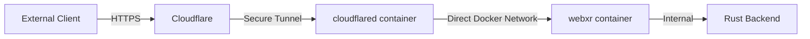

# Network Architecture and Configuration

## Overview

This document details the network architecture and configuration for the LogseqXR system, specifically focusing on the WebSocket connection chain and service communication. The system uses Cloudflare's tunnel for secure external access while leveraging Docker's internal networking for efficient container-to-container communication.

## Network Chain



## Docker Network Architecture

### docker_ragflow Network (172.19.0.0/16)
- Primary network for all service communication
- Enables direct container-to-container communication
- Connected containers:
  - cloudflared-tunnel
  - logseq-xr-webxr
  - Other supporting services (redis, mysql, etc.)

## Access Patterns

### 1. External Access (Production)
- URL: https://www.visionflow.info
- Flow: Client → Cloudflare → cloudflared tunnel → webxr
- Features:
  - SSL/TLS encryption
  - DDoS protection
  - Proper WebSocket protocol handling
  - Security headers

### 2. Direct Local Access (Development Only)
- URL: http://192.168.0.51:4000
- Not recommended for production use
- Will show WebSocket connection errors due to:
  - Missing Cloudflare security layer
  - No SSL/TLS
  - Incomplete protocol upgrades

## Critical Configurations

### 1. config.yml (cloudflared)
```yaml
tunnel: 9a59e21c-7e0d-4cac-8502-59bc66436e0f
ingress:
  - hostname: www.visionflow.info
    service: http://logseq-xr-webxr:4000
    originRequest:
      noTLSVerify: true
      connectTimeout: 30s
      tcpKeepAlive: 30s
      keepAliveTimeout: 2m
      keepAliveConnections: 100
      httpHostHeader: www.visionflow.info
      idleTimeout: 3600s
      streamTimeout: 3600s
```

### 2. docker-compose.yml Network Configuration
```yaml
services:
  webxr:
    networks:
      docker_ragflow:
        aliases:
          - logseq-xr-webxr
          - webxr-client
    ports:
      - "4000:3000"

  cloudflared:
    networks:
      docker_ragflow:
        aliases:
          - cloudflared
```

## WebSocket Communication

The system uses a streamlined approach for WebSocket connections:

1. External Client:
   - Connects via wss:// (secure WebSocket)
   - Handled by Cloudflare's infrastructure
   - Full SSL/TLS encryption

2. Internal Communication:
   - Direct container-to-container through docker_ragflow network
   - No additional proxy layers needed
   - Efficient and low-latency

## Security Considerations

1. Network Security:
   - All external traffic must pass through Cloudflare
   - Internal communication isolated within docker_ragflow
   - No direct external access to internal services

2. Protocol Security:
   - Forced HTTPS for all external connections
   - Secure WebSocket (wss://) for real-time communication
   - Cloudflare provides additional security layers

## Troubleshooting

1. Connection Issues:
   ```bash
   # Check docker network
   docker network inspect docker_ragflow
   
   # Verify container communication
   docker exec -it cloudflared-tunnel ping logseq-xr-webxr
   
   # Check logs
   docker logs cloudflared-tunnel
   docker logs logseq-xr-webxr
   ```

2. WebSocket Issues:
   - Ensure accessing via https://www.visionflow.info
   - Check browser console for connection errors
   - Verify Cloudflare tunnel status

## Maintenance Notes

1. Network Changes:
   - Always test through Cloudflare tunnel
   - Don't rely on direct local access for testing
   - Maintain container aliases in docker-compose.yml

2. Security Updates:
   - Keep cloudflared container updated
   - Monitor Cloudflare tunnel status
   - Review security headers and policies regularly
