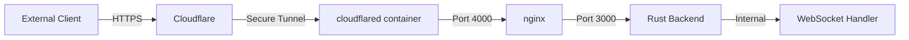
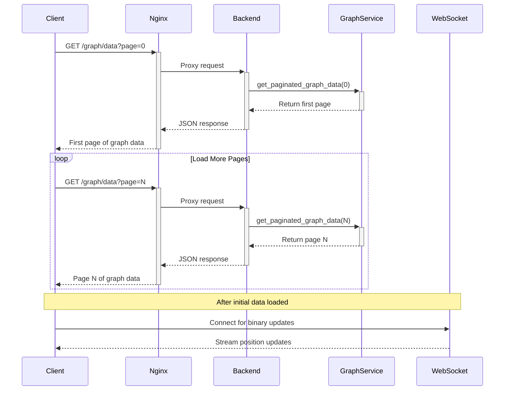

# Network Architecture and Configuration

## Overview

This document details the network architecture and configuration for the LogseqXR system, specifically focusing on the WebSocket connection chain and service communication. The system uses Cloudflare's tunnel for secure external access while leveraging Docker's internal networking for efficient container-to-container communication.

## Network Chain



## Docker Network Architecture

### docker_ragflow Network (172.19.0.0/16)
- Primary network for all service communication
- Enables direct container-to-container communication
- Connected containers:
  - cloudflared-tunnel
  - logseq-xr-webxr (nginx + Rust backend)
  - Other supporting services (redis, mysql, etc.)

## Port Configuration

### Service Ports
1. Rust Backend:
   - Internal port: 3000
   - Service entry point for WebSocket and HTTP requests

2. Nginx:
   - External port: 4000
   - Proxies requests to Rust backend on port 3000
   - Handles WebSocket protocol upgrades and routing

3. Container Mapping:
   - Host port 4000 -> Container port 3000
   - Defined in docker-compose.yml: `"4000:3000"`

## Access Patterns

### 1. External Access (Production)
- URL: https://www.visionflow.info
- Flow: Client → Cloudflare → cloudflared tunnel → nginx (4000) → Rust backend (3000)
- Features:
  - SSL/TLS encryption
  - DDoS protection
  - Proper WebSocket protocol handling
  - Security headers

### 2. Direct Local Access (Development Only)
- URL: http://192.168.0.51:4000
- Flow: Client → nginx (4000) → Rust backend (3000)
- Not recommended for production use
- Will show WebSocket connection errors due to:
  - Missing Cloudflare security layer
  - No SSL/TLS
  - Incomplete protocol upgrades

## Critical Configurations

### 1. config.yml (cloudflared)
```yaml
tunnel: 9a59e21c-7e0d-4cac-8502-59bc66436e0f
ingress:
  - hostname: www.visionflow.info
    service: http://logseq-xr-webxr:4000  # Points to nginx port
    originRequest:
      noTLSVerify: true
      connectTimeout: 30s
      tcpKeepAlive: 30s
      keepAliveTimeout: 2m
      keepAliveConnections: 100
      httpHostHeader: www.visionflow.info
      idleTimeout: 3600s
      streamTimeout: 3600s
```

### 2. nginx.conf WebSocket Configuration
```nginx
upstream backend {
    server logseq-xr-webxr:4000;  # Points to the mapped container port
    keepalive 32;
}

location /wss {
    proxy_pass http://backend;
    proxy_http_version 1.1;
    proxy_set_header Upgrade $http_upgrade;
    proxy_set_header Connection "upgrade";
    proxy_set_header Host $host;
    proxy_read_timeout 3600s;
    proxy_send_timeout 3600s;
    proxy_connect_timeout 30s;
}
```

### 3. docker-compose.yml Network Configuration
```yaml
services:
  webxr:
    networks:
      docker_ragflow:
        aliases:
          - logseq-xr-webxr
          - webxr-client
    ports:
      - "4000:3000"  # Maps container port 3000 to host port 4000

  cloudflared:
    networks:
      docker_ragflow:
        aliases:
          - cloudflared
```

## Protocol Details

### REST API
- Settings Management:
  - GET/PUT `/api/visualization/{category}/{setting}`
  - Used for infrequent updates and configuration
  - JSON format for settings data

- Graph Structure:
  - Paginated loading of graph data
  - Endpoints for node/edge queries
  - Metadata and relationship loading

### WebSocket Protocol
- Real-time Updates:
  - Binary format for position/velocity data
  - Efficient updates for physics simulation
  - Support for AR mode synchronization

- Message Types:
  1. Binary Position Updates:
     - Compact binary format for node positions
     - Optimized for frequent updates
     - Includes position, velocity, mass, flags
  
  2. Settings Broadcasts:
     - JSON format for settings changes
     - Broadcast to all connected clients
     - Ensures synchronization across devices

  3. Simulation Control:
     - Mode changes (physics, layout, AR)
     - Simulation parameters
     - Real-time control messages

### Data Flow Patterns

1. Initial Load:
   - REST: Load settings and graph structure
   - WebSocket: Enable binary updates
   - Client receives initial graph state

2. Runtime Updates:
   - Binary position updates via WebSocket
   - Settings changes via REST + WebSocket broadcast
   - Simulation control via WebSocket

3. AR Mode:
   - Bidirectional position updates
   - Low-latency binary messages
   - Synchronized state across devices

## Data Flow

### Graph Data Loading


## WebSocket Communication

The system uses a multi-layered approach for WebSocket connections:

1. External Client:
   - Connects via wss:// (secure WebSocket)
   - Handled by Cloudflare's infrastructure
   - Full SSL/TLS encryption

2. Internal Communication Chain:
   - Cloudflared → nginx (port 4000)
   - nginx → Rust backend (port 3000)
   - All through docker_ragflow network
   - Efficient and low-latency

## Security Considerations

1. Network Security:
   - All external traffic must pass through Cloudflare
   - Internal communication isolated within docker_ragflow
   - No direct external access to internal services
   - nginx provides additional security layer

2. Protocol Security:
   - Forced HTTPS for all external connections
   - Secure WebSocket (wss://) for real-time communication
   - Cloudflare provides additional security layers
   - nginx handles WebSocket protocol upgrades securely

## Troubleshooting

1. Connection Issues:
   ```bash
   # Check docker network
   docker network inspect docker_ragflow
   
   # Verify container communication
   docker exec -it cloudflared-tunnel ping logseq-xr-webxr
   
   # Check logs
   docker logs cloudflared-tunnel
   docker logs logseq-xr-webxr
   
   # Check nginx logs
   docker exec logseq-xr-webxr tail -f /var/log/nginx/error.log
   ```

2. WebSocket Issues:
   - Ensure accessing via https://www.visionflow.info
   - Check browser console for connection errors
   - Verify Cloudflare tunnel status
   - Check nginx error logs for WebSocket upgrade issues
   - Verify port mappings in docker-compose.yml and nginx.conf match

## Maintenance Notes

1. Network Changes:
   - Always test through Cloudflare tunnel
   - Don't rely on direct local access for testing
   - Maintain container aliases in docker-compose.yml
   - Ensure port mappings are consistent across all configurations

2. Security Updates:
   - Keep cloudflared container updated
   - Monitor Cloudflare tunnel status
   - Review security headers and policies regularly
   - Update nginx configuration when changing ports or protocols

3. Port Configuration:
   - Any changes to port mappings must be updated in:
     - docker-compose.yml
     - nginx.conf
     - cloudflared config.yml
   - Restart all services after port changes
