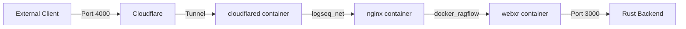

# Network Architecture and Configuration

## Overview

This document details the network architecture and configuration for the LogseqXR system, specifically focusing on the WebSocket connection chain and service communication.

## Network Chain



## Docker Networks

### 1. logseq_net Network (172.18.0.0/16)
- Primary network for external communication
- Connected containers:
  - cloudflared-tunnel (172.18.0.2)
  - logseq-xr-webxr (172.18.0.3)
- Handles tunnel traffic and initial request routing

### 2. docker_ragflow Network (172.19.0.0/16)
- Internal service network
- Connected containers:
  - logseq-xr-webxr (172.19.0.7)
  - ragflow-server and other backend services
- Handles internal service communication

## Port Forwarding Chain

1. External Access:
   - Client connects to port 4000
   - Cloudflare tunnels this through cloudflared

2. Internal Routing:
   - cloudflared → nginx (port 4000)
   - nginx → webxr service (port 3000)
   - webxr internal Rust service listens on port 3000

## Critical Configurations

### 1. config.yml (cloudflared)
```yaml
ingress:
  - hostname: www.visionflow.info
    service: http://logseq-xr-webxr:4000  # Points to nginx
    originRequest:
      noTLSVerify: true
      connectTimeout: 30s
      tcpKeepAlive: 30s
      keepAliveTimeout: 2m
      keepAliveConnections: 100
      idleTimeout: 3600s        # Matches nginx timeout
      streamTimeout: 3600s      # Matches nginx timeout
      httpHostHeader: www.visionflow.info
```

### 2. nginx.conf
```nginx
upstream backend {
    server logseq-xr-webxr:3000;  # Points to Rust service
    keepalive 32;
}

server {
    listen 4000 default_server;  # External port

    # WebSocket Configuration
    location /ws {
        proxy_pass http://backend;
        proxy_http_version 1.1;
        proxy_set_header Upgrade $http_upgrade;
        proxy_set_header Connection "upgrade";
        proxy_read_timeout 3600s;
        proxy_send_timeout 3600s;
    }
}
```

### 3. docker-compose.yml Network Configuration
```yaml
services:
  webxr:
    networks:
      logseq_net:
        aliases:
          - logseq-xr-webxr
      docker_ragflow:
        aliases:
          - webxr-client
    ports:
      - "4000:3000"

  cloudflared:
    networks:
      logseq_net:
        aliases:
          - cloudflared
```

## WebSocket Handling

The system uses a multi-layer approach for WebSocket connections:

1. Cloudflared Layer:
   - Handles tunnel connection
   - Maintains long-lived connections
   - Manages connection timeouts

2. Nginx Layer:
   - Upgrades HTTP to WebSocket
   - Manages WebSocket headers
   - Handles proxy settings
   - Controls timeouts and keepalive

3. Application Layer:
   - Rust backend handles WebSocket logic
   - Manages application-level protocols
   - Handles data streaming

## Timeout Synchronization

All timeout values should be aligned across the stack:
- Cloudflared: idleTimeout and streamTimeout set to 3600s
- Nginx: proxy_read_timeout and proxy_send_timeout set to 3600s
- Application: Should handle timeouts accordingly

## Security Considerations

1. Network Isolation:
   - cloudflared only on logseq_net
   - webxr service bridges networks
   - Backend services isolated on docker_ragflow

2. Port Exposure:
   - Only port 4000 exposed externally
   - Internal communication uses Docker networks
   - No direct external access to port 3000

## Troubleshooting

1. Connection Issues:
   ```bash
   # Check network connectivity
   docker network inspect docker_ragflow logseq_net
   
   # Verify container communication
   docker exec -it cloudflared-tunnel ping logseq-xr-webxr
   
   # Check logs
   docker logs cloudflared-tunnel
   docker logs logseq-xr-webxr
   ```

2. WebSocket Issues:
   - Check nginx error logs for connection problems
   - Verify WebSocket upgrade headers in nginx access logs
   - Confirm timeouts are properly synchronized

## Maintenance Notes

When making changes:
1. Always maintain timeout synchronization across services
2. Test WebSocket connectivity after configuration changes
3. Verify network isolation is maintained
4. Check logs across all services for any connection issues
