# LogseqXR: Immersive WebXR Visualisation for Logseq Knowledge Graphs


**Inspired by the innovative work of Prof. Rob Aspin:** [https://github.com/trebornipsa](https://github.com/trebornipsa)


## About LogseqXR

LogseqXR transforms your Logseq knowledge base into an immersive 3D visualisation that you can explore in VR/AR. Experience your ideas as tangible objects in space, discover new connections, and interact with your knowledge in ways never before possible.

## Quick Links

- [Project Overview](docs/index.md)
- [Development Setup](docs/development/setup.md)
- [API Documentation](docs/api/index.md)
- [Contributing Guidelines](docs/contributing.md)

## Documentation

Our documentation is organised into several key sections:

### Client Documentation
- [Architecture](docs/client/architecture.md)
- [Components](docs/client/components.md)
- [Core Utilities](docs/client/core.md)
- [Rendering System](docs/client/rendering.md)
- [State Management](docs/client/state.md)
- [Type Definitions](docs/client/types.md)
- [Visualisation](docs/client/visualisation.md)
- [WebSocket Communication](docs/client/websocket.md)
- [WebXR Integration](docs/client/xr.md)

### Server Documentation
- [Architecture](docs/server/architecture.md)
- [Configuration](docs/server/config.md)
- [Request Handlers](docs/server/handlers.md)
- [Data Models](docs/server/models.md)
- [Services](docs/server/services.md)
- [Type Definitions](docs/server/types.md)
- [Utilities](docs/server/utils.md)

### API Documentation
- [REST API](docs/api/rest.md)
- [WebSocket API](docs/api/websocket.md)

### Development and Deployment
- [Development Setup](docs/development/setup.md)
- [Debugging Guide](docs/development/debugging.md)
- [Docker Deployment](docs/deployment/docker.md)
- [Contributing Guidelines](docs/contributing.md)

### System Architecture Diagram

```mermaid
graph TB
    %% Frontend Components
    subgraph Frontend
        UI[User Interface Layer]
        R3FRenderer[React Three Fiber Renderer]
        XR[WebXR Integration]
        WSClient[WebSocket Client]
        GraphDisplay[Graph Display Manager]
        ControlPanel["Modular Control Panel (Nostr Auth)"]
        XRControls[XR Control System]
        WSService[WebSocket Service]
        GraphDataManager[Graph Data Manager]
        PlatformManager[Platform Manager]
        XRSessionManager[XR Session Manager]
        XRInitializer[XR Initializer]
        HologramRenderer[Hologram Renderer]
        TextRenderer[Text Renderer]
        SettingsStore[Settings Store]
        NostrAuthClient[Nostr Auth Client UI]
    end

    %% Backend Components
    subgraph Backend
        ActixServer[Actix Web Server]
        FileHandler[File Handler]
        GraphHandler[Graph Handler]
        WebSocketHandler[WebSocket Handler]
        PerplexityHandler[Perplexity Handler]
        RagFlowHandler[RagFlow Handler]
        VisualisationHandler[Visualisation Handler]
        NostrAuthHandler[Nostr Auth Handler]
        HealthHandler[Health Handler]
        PagesHandler[Pages Handler]
        SettingsHandler[Settings Handler]
        FileService[File Service]
        GraphService[Graph Service]
        GPUComputeService[GPU Compute Service]
        PerplexityService[Perplexity Service]
        RagFlowService[RagFlow Service]
        SpeechService[Speech Service]
        NostrAuthService[Nostr Auth Service Backend]
        ClientManager[WebSocket Client Manager]
        PhysicsEngine[Continuous Physics Engine]
        AudioProcessor[Audio Processor]
        MetadataStoreModel[Metadata Store Model]
        ProtectedSettingsModel[Protected Settings Model]
    end

    %% External Components
    subgraph External
        GitHubAPI[GitHub API]
        PerplexityAI[Perplexity AI]
        RagFlowAPI[RagFlow API]
        OpenAI_API[OpenAI API]
        NostrPlatformAPI[Nostr Platform API]
    end

    %% Connections between Frontend Components
    UI --> GraphDisplay
    UI --> ControlPanel
    UI --> NostrAuthClient
    UI --> XRControls

    XR --> R3FRenderer
    WSClient --> WSService
    WSService --> ActixServer

    %% Connections between Backend Components
    ActixServer --> FileHandler
    ActixServer --> GraphHandler
    ActixServer --> WebSocketHandler
    ActixServer --> PerplexityHandler
    ActixServer --> RagFlowHandler
    ActixServer --> VisualisationHandler
    ActixServer --> NostrAuthHandler
    ActixServer --> HealthHandler
    ActixServer --> PagesHandler
    ActixServer --> SettingsHandler

    FileHandler --> FileService
    GraphHandler --> GraphService
    WebSocketHandler --> ClientManager
    PerplexityHandler --> PerplexityService
    RagFlowHandler --> RagFlowService
    NostrAuthHandler --> NostrAuthService

    GraphService --> PhysicsEngine
    PhysicsEngine --> GPUComputeService
    PhysicsEngine --> ClientManager

    %% Connections to External Components
    FileService --> GitHubAPI
    PerplexityService --> PerplexityAI
    RagFlowService --> RagFlowAPI
    SpeechService --> OpenAI_API
    NostrAuthService --> NostrPlatformAPI

    %% Styling for clarity
    style Frontend fill:#f9f,stroke:#333,stroke-width:2px
    style Backend fill:#bbf,stroke:#333,stroke-width:2px
    style External fill:#bfb,stroke:#333,stroke-width:2px
```



### Class Diagram


### Sequence Diagram

```mermaid
sequenceDiagram
    participant ClientUI as Client UI (React)
    participant GraphMgrClient as GraphDataManager (Client)
    participant WSClient as WebSocketService (Client)
    participant SettingsClient as SettingsStore (Client)
    participant NostrAuthClient as NostrAuthService (Client)
    participant PlatformMgrClient as PlatformManager (Client)
    participant R3FRenderer as ReactThreeFiber (Client)

    participant ActixServer as Actix Web Server (Backend)
    participant AppStateSrv as AppState (Backend)
    participant GraphSrv as GraphService (Backend)
    participant GPUComputeSrv as GPUCompute (Backend)
    participant ClientMgrSrv as ClientManager (Backend)
    participant FileSrv as FileService (Backend)
    participant NostrSrv as NostrService (Backend)
    participant SpeechSrv as SpeechService (Backend)
    participant SettingsHandlerSrv as SettingsHandler (Backend)
    participant NostrHandlerSrv as NostrHandler (Backend)
    participant FileHandlerSrv as FileHandler (Backend)
    participant GraphHandlerSrv as GraphHandler (Backend)
    participant WSHandlerSrv as WebSocketHandler (Backend)
    
    participant GitHubAPI as GitHub API (External)
    participant PerplexityAPI as Perplexity AI (External)
    participant RagFlowAPI as RagFlow API (External)
    participant OpenAI_API as OpenAI API (External)
    participant NostrPlatform as Nostr Platform (External)

    %% === Server Initialisation ===
    activate ActixServer
    ActixServer->>ActixServer: Load AppFullSettings (settings.yaml, env)
    alt Settings Load Error
        ActixServer-->>ClientUI: HTTP 500 (Conceptual)
    else Settings Loaded
        ActixServer->>AppStateSrv: new(AppFullSettings, GitHubClient, ContentAPI, SpeechService, GPUCompute, ClientManager)
        activate AppStateSrv
            Note over AppStateSrv: Initialises services like GitHubClient, ContentAPI
            AppStateSrv->>SpeechSrv: new(AppFullSettings)
            activate SpeechSrv; deactivate SpeechSrv
            AppStateSrv->>NostrSrv: new() (via init_nostr_service)
            activate NostrSrv; deactivate NostrSrv
            AppStateSrv->>FileSrv: load_or_create_metadata()
            activate FileSrv; deactivate FileSrv
            AppStateSrv->>GraphSrv: build_graph_from_metadata()
            activate GraphSrv
                GraphSrv->>GraphSrv: Initialise random positions
            deactivate GraphSrv
            AppStateSrv->>GPUComputeSrv: new(GraphData) (or test_gpu)
            activate GPUComputeSrv; deactivate GPUComputeSrv
            AppStateSrv->>GraphSrv: new(AppFullSettings, GPUCompute, ClientManager)
            activate GraphSrv
                GraphSrv->>GraphSrv: Start physics simulation loop (async)
                GraphSrv->>GraphSrv: Start broadcast loop (async)
            deactivate GraphSrv
        AppStateSrv-->>ActixServer: Initialised AppState
        deactivate AppStateSrv
    end
    deactivate ActixServer

    %% === Client Initialisation ===
    activate ClientUI
    ClientUI->>PlatformMgrClient: initialise()
    activate PlatformMgrClient; deactivate PlatformMgrClient
    ClientUI->>SettingsClient: initialise()
    activate SettingsClient
        SettingsClient->>SettingsClient: Load from localStorage
        SettingsClient->>ActixServer: GET /api/user-settings (fetchSettings)
        activate ActixServer
            ActixServer->>SettingsHandlerSrv: get_public_settings(AppState)
            SettingsHandlerSrv-->>ActixServer: UISettings (JSON)
        deactivate ActixServer
        ActixServer-->>SettingsClient: Settings JSON
        SettingsClient->>SettingsClient: Merge and store settings
    deactivate SettingsClient
    
    ClientUI->>NostrAuthClient: initialise()
    activate NostrAuthClient
        NostrAuthClient->>NostrAuthClient: Check localStorage for session
        alt Stored Session Found
            NostrAuthClient->>ActixServer: POST /api/auth/nostr/verify (token)
            activate ActixServer
                ActixServer->>NostrHandlerSrv: verify(AppState, token_payload)
                NostrHandlerSrv->>NostrSrv: validate_session(pubkey, token)
                NostrSrv-->>NostrHandlerSrv: Validation Result
            deactivate ActixServer
            ActixServer-->>NostrAuthClient: VerificationResponse
            NostrAuthClient->>SettingsClient: Update auth state
        end
    deactivate NostrAuthClient

    ClientUI->>WSClient: connect()
    activate WSClient
        WSClient->>ActixServer: WebSocket Handshake (/wss)
        activate ActixServer
            ActixServer->>WSHandlerSrv: handle_connection(AppState, ClientManager)
            activate WSHandlerSrv
                WSHandlerSrv->>ClientMgrSrv: register(client_addr)
                activate ClientMgrSrv; deactivate ClientMgrSrv
            deactivate WSHandlerSrv
        deactivate ActixServer
        ActixServer-->>WSClient: WebSocket Opened
        WSClient->>WSClient: isConnected = true
        WSClient-->>ActixServer: {"type":"requestInitialData"} (on connection_established from server)
        activate ActixServer
            ActixServer->>WSHandlerSrv: Handle requestInitialData
            WSHandlerSrv->>GraphSrv: get_node_positions()
            GraphSrv-->>WSHandlerSrv: Vec<Node_Model>
            WSHandlerSrv->>WSHandlerSrv: Encode to binary
            WSHandlerSrv-->>WSClient: Binary Position Data (Initial Graph)
        deactivate ActixServer
        WSClient->>GraphMgrClient: updateNodePositions(binary_data)
        activate GraphMgrClient
            GraphMgrClient->>GraphMgrClient: Parse binary, update internal graph
            GraphMgrClient->>R3FRenderer: Trigger re-render
        deactivate GraphMgrClient
    deactivate WSClient
    
    ClientUI->>GraphMgrClient: fetchInitialData() (if WebSocket initial data is not primary)
    activate GraphMgrClient
        GraphMgrClient->>ActixServer: GET /api/graph/data
        activate ActixServer
            ActixServer->>GraphHandlerSrv: get_graph_data(AppState)
            GraphHandlerSrv->>GraphSrv: get_graph_data_mut()
            GraphSrv-->>GraphHandlerSrv: GraphData_Model
        deactivate ActixServer
        ActixServer-->>GraphMgrClient: GraphData JSON
        GraphMgrClient->>GraphMgrClient: Set graph data
        GraphMgrClient->>R3FRenderer: Trigger re-render
    deactivate GraphMgrClient
    deactivate ClientUI

    %% === Continuous Graph Updates (Server to Client) ===
    loop Physics Simulation & Broadcast (Backend)
        GraphSrv->>GPUComputeSrv: compute_forces()
        GPUComputeSrv-->>GraphSrv: Updated Node Data
        GraphSrv->>ClientMgrSrv: broadcast_node_positions(updated_nodes)
        activate ClientMgrSrv
            ClientMgrSrv->>WSHandlerSrv: Send binary to all clients
            WSHandlerSrv-->>WSClient: Binary Position Data
        deactivate ClientMgrSrv
        WSClient->>GraphMgrClient: updateNodePositions(binary_data)
        activate GraphMgrClient
            GraphMgrClient->>GraphMgrClient: Parse binary, update internal graph
            GraphMgrClient->>R3FRenderer: Trigger re-render
        deactivate GraphMgrClient
    end

    %% === User Drags Node (Client to Server) ===
    ClientUI->>R3FRenderer: User interacts with node
    R3FRenderer->>GraphMgrClient: Node position changed by user
    activate GraphMgrClient
        GraphMgrClient->>GraphMgrClient: Update local node position
        GraphMgrClient->>WSClient: sendNodePositions() (sends binary update)
        activate WSClient
            WSClient->>ActixServer: Binary Position Data (Client Update)
            activate ActixServer
                ActixServer->>WSHandlerSrv: Handle binary message
                WSHandlerSrv->>GraphSrv: update_node_positions(client_updates)
                activate GraphSrv
                    GraphSrv->>GraphSrv: Update internal graph, resolve conflicts
                    GraphSrv->>GPUComputeSrv: compute_forces() (recalculate layout)
                    GPUComputeSrv-->>GraphSrv: Updated Node Data
                deactivate GraphSrv
                Note over ActixServer: Server now has authoritative positions.
                Note over ActixServer: Broadcast loop will send these out.
            deactivate ActixServer
        deactivate WSClient
    deactivate GraphMgrClient

    %% === Settings Update Flow ===
    ClientUI->>SettingsClient: User changes a setting
    activate SettingsClient
        SettingsClient->>SettingsClient: Update local settings state
        SettingsClient->>ActixServer: POST /api/user-settings/sync (settings JSON)
        activate ActixServer
            ActixServer->>SettingsHandlerSrv: update_user_settings(AppState, settings_payload)
            activate SettingsHandlerSrv
                SettingsHandlerSrv->>AppStateSrv: settings.write().await (AppFullSettings)
                AppStateSrv->>AppStateSrv: Merge client settings into AppFullSettings
                AppStateSrv->>AppStateSrv: AppFullSettings.save() to settings.yaml
                SettingsHandlerSrv->>ClientMgrSrv: Broadcast settings_updated JSON
                activate ClientMgrSrv
                    ClientMgrSrv->>WSHandlerSrv: Send JSON to all clients
                    WSHandlerSrv-->>WSClient: {"type":"settings_updated", "payload":...}
                deactivate ClientMgrSrv
            deactivate SettingsHandlerSrv
            SettingsHandlerSrv-->>ActixServer: Updated UISettings (JSON)
        deactivate ActixServer
        ActixServer-->>SettingsClient: Confirmation
    deactivate SettingsClient
    WSClient->>SettingsClient: Receive settings_updated message
    activate SettingsClient
        SettingsClient->>SettingsClient: Update local settings store
        SettingsClient->>ClientUI: Notify UI components of change
    deactivate SettingsClient

    %% === Nostr Authentication Flow ===
    ClientUI->>NostrAuthClient: User clicks Login
    activate NostrAuthClient
        NostrAuthClient->>NostrAuthClient: Interact with NIP-07 Provider (e.g., window.nostr)
        NostrAuthClient->>NostrAuthClient: Get pubkey, sign auth event
        NostrAuthClient->>ActixServer: POST /api/auth/nostr (signed_event_payload)
        activate ActixServer
            ActixServer->>NostrHandlerSrv: login(AppState, event_payload)
            activate NostrHandlerSrv
                NostrHandlerSrv->>NostrSrv: verify_auth_event(event)
                activate NostrSrv
                    NostrSrv->>NostrSrv: Verify signature, manage user session
                    NostrSrv-->>NostrHandlerSrv: NostrUser_Model with session_token
                deactivate NostrSrv
            deactivate NostrHandlerSrv
            NostrHandlerSrv-->>ActixServer: AuthResponse (user_dto, token, expires_at, features)
        deactivate ActixServer
        ActixServer-->>NostrAuthClient: AuthResponse JSON
        NostrAuthClient->>NostrAuthClient: Store token, update user state
        NostrAuthClient->>SettingsClient: Update auth state in store
        NostrAuthClient-->>ClientUI: Login successful / UI update
    deactivate NostrAuthClient
```



### AR Features Implementation Status

#### Hand Tracking (Meta Quest 3)
- XR Interaction is primarily managed by `client/src/features/xr/systems/HandInteractionSystem.tsx` and related hooks/providers like `useSafeXRHooks.tsx`.
- Session management is in `client/src/features/xr/managers/xrSessionManager.ts`.
- Initialisation logic is in `client/src/features/xr/managers/xrInitializer.ts`.
- Currently addressing:
  - Performance optimisation for AR passthrough mode.
  - Virtual desktop cleanup during AR activation (conceptual, not explicitly in code).
  - Type compatibility for WebXR hand input APIs (e.g., `XRHand`, `XRJointSpace` as seen in `webxr-extensions.d.ts`).
  - Joint position extraction methods for gesture recognition.

##### Current Challenges
- Ensuring robust type definitions for WebXR extensions across different browsers/devices (see `client/src/features/xr/types/webxr-extensions.d.ts`).
- Extracting and interpreting joint positions from `XRJointSpace` for reliable gesture recognition (conceptual, `HandInteractionSystem.tsx` has stubs).
- Performance optimisation in AR passthrough mode, especially with complex scenes.

##### Next Steps
- Refine `webxr-extensions.d.ts` for better type safety with hand tracking APIs.
- Implement more sophisticated gesture recognition in `HandInteractionSystem.tsx`.
- Optimise AR mode transitions and rendering performance.
- Enhance Meta Quest 3 specific features if possible (e.g., passthrough quality).

### Authentication and Settings Inheritance

#### Unauthenticated Users
- Use browser's localStorage for settings persistence (via Zustand `persist` middleware in `client/src/store/settingsStore.ts`).
- Settings are stored locally and not synced to a user-specific backend store.
- Default to basic settings visibility.
- Limited to local visualisation features; AI and GitHub features requiring API keys will not be available unless default keys are configured on the server.

#### Authenticated Users (Nostr)
- **Regular Users**:
    - Settings are loaded from and saved to user-specific files on the server (e.g., `/app/user_settings/<pubkey>.yaml`), managed by `src/handlers/settings_handler.rs` using `UserSettings` model.
    - These user-specific settings are a subset of the global settings (typically UI/visualisation preferences defined in `UISettings`).
    - Can access features based on their `feature_access.rs` configuration (e.g., RAGFlow, OpenAI by default for new users).
    - Can manage their own API keys for these services via `/api/auth/nostr/api-keys` endpoint, stored in their `NostrUser` profile on the server.
- **Power Users**:
    - Directly load and modify the global server settings from `settings.yaml` (represented by `AppFullSettings` in Rust).
    - Have full access to all settings and advanced API features (Perplexity, RAGFlow, GitHub, OpenAI TTS) which use API keys configured in `settings.yaml` or environment variables.
    - Settings modifications made by power users are persisted to the main `settings.yaml` and broadcast to all connected clients.

### Settings Inheritance Flow

```mermaid
graph TD
    A[Start] --> B{Authenticated?}
    B -->|No| C[Load LocalSettings (localStorage via Zustand)]
    B -->|Yes| D{Is Power User? (feature_access.rs)}
    D -->|No| E[Load UserSpecificSettings (user_settings/pubkey.yaml via API)]
    D -->|Yes| F[Load GlobalServerSettings (settings.yaml via API)]
    C --> X[Apply Settings to UI]
    E --> X
    F --> X
```

### Settings Sync Flow

```mermaid
graph TD
    A[Setting Changed in UI] --> B{Authenticated?}
    B -->|No| C[Save Locally (localStorage via Zustand)]
    B -->|Yes| D{Is Power User?}
    D -->|No| E[Save to UserSpecificSettings (user_settings/pubkey.yaml via API)]
    D -->|Yes| F[Save to GlobalServerSettings (settings.yaml via API)]
    F --> G[Server Broadcasts GlobalSettingsUpdate to All Clients]
    G --> H[Other Clients Update Local Store]
    E --> I[User's Local Store Updated]
    C --> I
```

### Modular Control Panel Architecture

The client's user interface for settings and controls is primarily managed by the `LowerControlPanel.tsx` component. This panel uses a tabbed interface to organise different categories of settings and tools. Some sections, like those within `SettingsSection.tsx`, support being "detached" into floating draggable windows.

#### Component Structure

The main UI is structured as follows:
- **`LowerControlPanel.tsx`**: A two-pane layout.
    - **Left Pane**: Contains tabs for core settings:
        - Nostr Authentication (`NostrAuthSection.tsx`)
        - System Settings (`SystemPanel.tsx`)
        - Visualisation Settings (`VisualisationPanel.tsx`)
        - XR Settings (`XRPanel.tsx`)
        - AI Services Settings (`AIPanel.tsx`)
    - **Right Pane**: Contains tabs for features/tools:
        - Embedded "Narrative Gold Mine" iframe.
        - Markdown Renderer (`MarkdownRenderer.tsx`) for displaying content.
        - LLM Query interface (basic textarea and button).
- **`SettingsSection.tsx`**: Used within panels (e.g., `VisualisationPanel.tsx`) to group related settings. Supports:
    - Collapsible sections.
    - Detaching into a draggable, floating window using `react-draggable`.
- **`SettingControlComponent.tsx`**: Renders individual UI controls (sliders, toggles, inputs) for each setting, including dynamic tooltips using `Tooltip.tsx`.

The conceptual interfaces for settings provided in the original README are useful for understanding the data structure but are not direct props to a single "ModularControlPanel" component. Instead, settings are managed by `zustand` (`SettingsStore.ts`) and individual panel components consume and update this store.

```typescript
// Conceptual structure of a setting item (managed by SettingsStore)
interface UISetting { // From client/src/features/settings/types/uiSetting.ts
  type: 'slider' | 'toggle' | 'colour' | 'select' | 'number' | 'text'; // Simplified
  id?: string;
  label?: string;
  value?: any;
  min?: number;
  max?: number;
  step?: number;
  options?: Array<{ value: string; label: string }>;
  // ... other properties like description, help, advanced
}

// Conceptual structure for how settings are organised in the store (e.g., settings.visualisation.nodes)
interface SettingsCategory {
  [settingId: string]: UISetting | SettingsCategory;
}
```

#### Layout Management
The overall layout is a fixed two-pane structure within `LowerControlPanel.tsx`.
Individual `SettingsSection` components can be detached, and their position is managed by `react-draggable` locally. There isn't a global `LayoutConfig` prop managing all detachable panel positions in the way the conceptual interface suggested. User preferences for advanced settings visibility are handled by `ControlPanelProvider` and `useControlPanelContext`.

#### Performance Optimisations
- **Debounced Updates**: `SettingControlComponent.tsx` uses `onBlur` or Enter key for text/number inputs, which acts as a form of debouncing for settings changes that might trigger expensive re-renders or API calls.
- **CSS Transforms**: Used by `react-draggable` for smooth movement of detached panels.
- **Memoisation**: `useMemo` is used in components like `GraphManager.tsx` to stabilise expensive calculations or object references.
- **Targeted Re-renders**: Zustand store selectors for primitive values are used in some places (e.g., `App.tsx`) to avoid unnecessary re-renders.

The goal is to maintain responsiveness, especially during interactions with the 3D visualisation and real-time updates.

## License

This project is licensed under the MIT License. See the [LICENSE](LICENSE) file for details.

## Acknowledgements

- Prof Rob Aspin: For inspiring the project's vision and providing valuable resources.
- OpenAI: For their advanced AI models powering the question-answering features.
- Perplexity AI and RAGFlow: For their AI services enhancing content processing and interaction.
- Three.js: For the robust 3D rendering capabilities utilised in the frontend.
- Actix: For the high-performance web framework powering the backend server.

