# LogseqXR: Immersive WebXR Visualization for Logseq Knowledge Graphs

**Inspired by the innovative work of Prof. Rob Aspin:** [https://github.com/trebornipsa](https://github.com/trebornipsa)

## Quick Links

- [Project Overview](docs/overview/introduction.md)
- [Technical Architecture](docs/overview/architecture.md)
- [Development Setup](docs/development/setup.md)
- [API Documentation](docs/api/rest.md)
- [Contributing Guidelines](docs/contributing/guidelines.md)

## Documentation Structure

### Overview
- [Introduction & Features](docs/overview/introduction.md)
- [System Architecture](docs/overview/architecture.md)

### Technical Documentation
- [Binary Protocol](docs/technical/binary-protocol.md)
- [WebGPU Pipeline](docs/technical/webgpu.md)
- [Performance Optimizations](docs/technical/performance.md)
- [Class Diagrams](docs/technical/class-diagrams.md)

### Development
- [Setup Guide](docs/development/setup.md)

### API Documentation
- [REST API](docs/api/rest.md)
- [WebSocket API](docs/api/websocket.md)

### Deployment
- [Docker Deployment](docs/deployment/docker.md)

### Contributing
- [Contributing Guidelines](docs/contributing/guidelines.md)

### Diagrams

```mermaid
graph TB
    subgraph Frontend
        UI[User Interface Layer]
        VR[WebXR Controller]
        WS[WebSocket Client]
        GPU[GPU Compute Layer]
        ThreeJS[Three.js Renderer]
        ChatUI[Chat Interface]
        GraphUI[Graph Interface]
        ControlPanel[Control Panel]
        VRControls[VR Control System]
        WSService[WebSocket Service]
        DataManager[Graph Data Manager]
        LayoutEngine[Layout Engine]
        SpaceMouse[SpaceMouse Controller]
        PlatformManager[Platform Manager]
        XRSession[XR Session Manager]
        XRInit[XR Initializer]
        SceneManager[Scene Manager]
        NodeManager[Enhanced Node Manager]
        EdgeManager[Edge Manager]
        HologramManager[Hologram Manager]
        TextRenderer[Text Renderer]
        SettingsStore[Settings Store]
    end

    subgraph Backend
        Server[Actix Web Server]
        FileH[File Handler]
        GraphH[Graph Handler]
        WSH[WebSocket Handler]
        PerplexityH[Perplexity Handler]
        RagFlowH[RagFlow Handler]
        VisualizationH[Visualization Handler]
        NostrH[Nostr Handler]
        HealthH[Health Handler]
        PagesH[Pages Handler]
        SettingsH[Settings Handler]
        FileS[File Service]
        GraphS[Graph Service]
        GPUS[GPU Compute Service]
        PerplexityS[Perplexity Service]
        RagFlowS[RagFlow Service]
        SpeechS[Speech Service]
        NostrS[Nostr Service]
        WSManager[WebSocket Manager]
        GPUCompute[GPU Compute]
        Compression[Compression Utils]
        AudioProc[Audio Processor]
        MetadataStore[Metadata Store]
        ProtectedSettings[Protected Settings]
    end

    subgraph External
        GitHub[GitHub API]
        Perplexity[Perplexity AI]
        RagFlow[RagFlow API]
        OpenAI[OpenAI API]
        NostrAPI[Nostr API]
    end

    UI --> ChatUI
    UI --> GraphUI
    UI --> ControlPanel
    UI --> VRControls

    VR --> ThreeJS
    WS --> WSService
    WSService --> Server

    Server --> FileH
    Server --> GraphH
    Server --> WSH
    Server --> PerplexityH
    Server --> RagFlowH
    Server --> VisualizationH
    Server --> NostrH
    Server --> HealthH
    Server --> PagesH
    Server --> SettingsH

    FileH --> FileS
    GraphH --> GraphS
    WSH --> WSManager
    PerplexityH --> PerplexityS
    RagFlowH --> RagFlowS
    NostrH --> NostrS

    FileS --> GitHub
    PerplexityS --> Perplexity
    RagFlowS --> RagFlow
    SpeechS --> OpenAI
    NostrS --> NostrAPI

    style Frontend fill:#f9f,stroke:#333,stroke-width:2px
    style Backend fill:#bbf,stroke:#333,stroke-width:2px
    style External fill:#bfb,stroke:#333,stroke-width:2px
```

### Class Diagram

```mermaid
classDiagram
    class App {
        +sceneManager: SceneManager
        +nodeManager: EnhancedNodeManager
        +edgeManager: EdgeManager
        +hologramManager: HologramManager
        +textRenderer: TextRenderer
        +websocketService: WebSocketService
        +settingsStore: SettingsStore
        +platformManager: PlatformManager
        +xrSessionManager: XRSessionManager
        +start()
        +initializeEventListeners()
        +handleSettingsUpdate(settings: Settings)
        +dispose()
    }

    class SceneManager {
        -static instance: SceneManager
        +scene: Scene
        +camera: Camera
        +renderer: Renderer
        +controls: Controls
        +composer: Composer
        +getInstance(canvas: HTMLCanvasElement): SceneManager
        +getScene(): Scene
        +getRenderer(): Renderer
        +getCamera(): Camera
        +start()
        +handleSettingsUpdate(settings: Settings)
        +cleanup()
    }

    class WebsocketService {
        -static instance: WebsocketService
        +socket: WebSocket
        +listeners: Object
        +reconnectAttempts: number
        +maxReconnectAttempts: number
        +reconnectInterval: number
        +getInstance(): WebsocketService
        +connect()
        +onBinaryMessage(callback: function)
        +onSettingsUpdate(callback: function)
        +onConnectionStatusChange(callback: function)
        +sendMessage(data: object)
        +close()
    }

    class AppState {
        +graph_service: GraphService
        +gpu_compute: Option<Arc<RwLock<GPUCompute>>>
        +settings: Arc<RwLock<Settings>>
        +protected_settings: Arc<RwLock<ProtectedSettings>>
        +metadata: Arc<RwLock<MetadataStore>>
        +github_client: Arc<GitHubClient>
        +content_api: Arc<ContentAPI>
        +perplexity_service: Option<Arc<PerplexityService>>
        +ragflow_service: Option<Arc<RAGFlowService>>
        +nostr_service: Option<web::Data<NostrService>>
        +ragflow_conversation_id: String
        +active_connections: Arc<AtomicUsize>
        +new()
        +increment_connections(): usize
        +decrement_connections(): usize
        +get_api_keys(pubkey: str): ApiKeys
        +get_nostr_user(pubkey: str): Option<NostrUser>
        +validate_nostr_session(pubkey: str, token: str): bool
        +update_nostr_user_api_keys(pubkey: str, api_keys: ApiKeys): Result<NostrUser>
    }

    class GraphService {
        +build_graph(app_state: AppState): Result<GraphData>
        +calculate_layout(gpu_compute: GPUCompute, graph: GraphData, params: SimulationParams): Result<void>
        +initialize_random_positions(graph: GraphData)
    }

    class EnhancedNodeManager {
        +scene: Scene
        +settings: Settings
        +nodeMeshes: Map<string, Mesh>
        +updateNodes(nodes: Node[])
        +updateNodePositions(nodes: NodeData[])
        +handleSettingsUpdate(settings: Settings)
        +dispose()
    }

    class SpeechService {
        +websocketManager: WebSocketManager
        +settings: Settings
        +start(receiver: Receiver<SpeechCommand>)
        +initialize(): Result<void>
        +send_message(message: string): Result<void>
        +close(): Result<void>
        +set_tts_provider(use_openai: boolean): Result<void>
    }

    class NostrService {
        +settings: Settings
        +validate_session(pubkey: str, token: str): bool
        +get_user(pubkey: str): Option<NostrUser>
        +update_user_api_keys(pubkey: str, api_keys: ApiKeys): Result<NostrUser>
    }

    App --> SceneManager
    App --> WebsocketService
    App --> EnhancedNodeManager
    SceneManager --> WebXRVisualization
    WebsocketService --> GraphDataManager
    AppState --> GraphService
    AppState --> NostrService
    AppState --> SpeechService
```

## License

This project is licensed under the MIT License. See the [LICENSE](LICENSE) file for details.

## Acknowledgements

- Prof Rob Aspin: For inspiring the project's vision and providing valuable resources.
- OpenAI: For their advanced AI models powering the question-answering features.
- Perplexity AI and RAGFlow: For their AI services enhancing content processing and interaction.
- Three.js: For the robust 3D rendering capabilities utilized in the frontend.
- Actix: For the high-performance web framework powering the backend server.