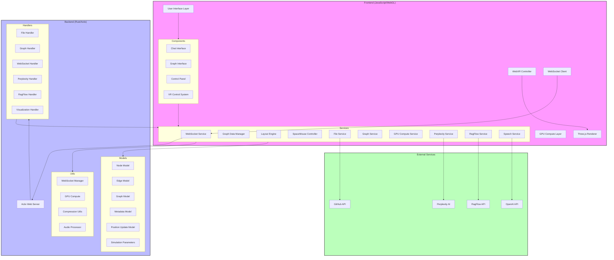
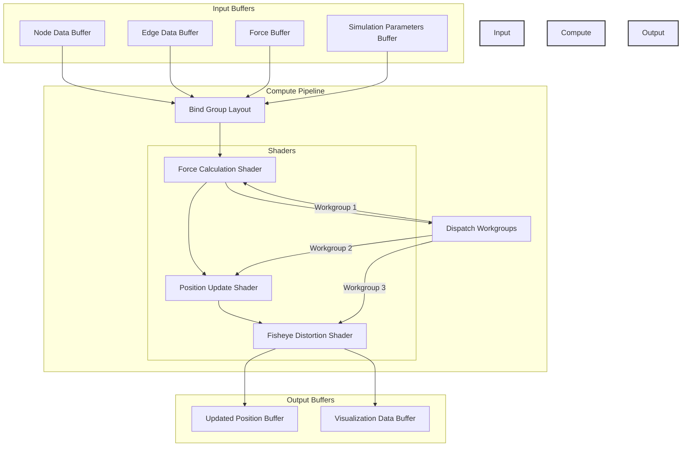

# WebXR Graph Visualization of Logseq Knowledge Graphs with RAGFlow Integration


Inspired by Prof Rob Aspin's work:  
https://github.com/trebornipsa


## Project Overview

This project visualizes a Logseq knowledge graph in 3D using WebXR, enhancing it with Perplexity AI and RAGFlow for AI-powered question answering. Changes are automatically submitted back to the source GitHub repository as pull requests. This allows for a dynamic and interactive exploration of your Logseq knowledge base in an immersive environment, leveraging the power of AI to provide context and insights.

## Key Features

- **WebXR 3D Visualization:** Immersive exploration of the knowledge graph in AR/VR environments with support for:
  - **Node Interaction and Manipulation:** Click, drag, and reposition nodes within the 3D space.
  - **Dynamic Force-Directed Layout:** Real-time recalculation of graph layout based on interactions and data updates.
  - **Custom Shaders for Visual Effects:** Enhancements like holographic displays and lighting effects.
  - **Fisheye Distortion for Focus + Context Visualization:** Provides a focus on specific areas while maintaining context.

- **Real-time Updates:**
  - **WebSocket-Based Communication:** Ensures instant synchronization between the server and client.
  - **Binary Position Updates:** Efficient data transfer for node positions, minimizing latency.
  - **Automatic Graph Layout Recalculation:** Maintains an optimal layout as the graph evolves.
  - **Live Preview of Changes:** Immediate reflection of updates from the knowledge base.

- **GPU Acceleration:**
  - **WebGPU Compute Shaders for Layout Calculation:** Utilizes GPU for high-performance graph computations.
  - **Efficient Force-Directed Algorithms:** Enhances the responsiveness of the graph layout.
  - **Fallback to CPU Computation:** Ensures compatibility with devices lacking WebGPU support.
  - **Custom WGSL Shaders for Visual Effects:** Enables advanced rendering techniques.

- **RAGFlow Integration:**
  - **Context-Aware Question Answering:** Provides intelligent responses based on the knowledge graph.
  - **Dynamic Document Retrieval:** Fetches relevant documents to support AI responses.
  - **Conversation History Management:** Maintains context for ongoing interactions.
  - **Real-Time Response Streaming:** Delivers responses as they are generated by the AI.

- **Perplexity AI Enhancement:**
  - **Markdown Content Analysis:** Parses and understands the structure of markdown files.
  - **Topic Extraction and Linking:** Identifies and connects related topics within the knowledge base.
  - **Automatic Summarization:** Generates concise summaries for long-form content.
  - **Content Relationship Mapping:** Visualizes how different pieces of content interrelate.

- **Spacemouse Support:**
  - **6-DOF Navigation in VR:** Allows for intuitive movement within the 3D environment.
  - **Customizable Control Mapping:** Adapts to various input devices.
  - **Smooth Camera Transitions:** Ensures fluid user experience during navigation.
  - **Integration with WebXR Controls:** Combines hardware input with web-based controls for enhanced interaction.

- **Automatic GitHub PRs:**
  - **Automated Branch Creation:** Manages branches for updates seamlessly.
  - **File Content Updates:** Applies changes directly to relevant files.
  - **Pull Request Generation:** Facilitates the review and merging process.
  - **Metadata Synchronization:** Keeps metadata in sync with file updates.

- **Audio Features:**
  - **OpenAI Text-to-Speech:** Converts text responses into audible speech.
  - **Local Speech Synthesis Fallback:** Ensures functionality without external dependencies.
  - **WebSocket Streaming:** Delivers audio streams efficiently.
  - **Dynamic Provider Switching:** Allows for flexible configuration of audio sources.

## Technical Architecture

### Core System Architecture



### Class Diagram

```mermaid
classDiagram
class App {
    websocketService: WebsocketService
    graphDataManager: GraphDataManager
    visualization: WebXRVisualization
    chatManager: ChatManager
    interface: Interface
    ragflowService: RAGFlowService
    start()
    initializeEventListeners()
    toggleFullscreen()
}
class WebsocketService {
    socket: WebSocket
    listeners: Object
    reconnectAttempts: number
    maxReconnectAttempts: number
    reconnectInterval: number
    connect()
    on(event: string, callback: function)
    emit(event: string, data: any)
    send(data: object)
    reconnect()
}
class GraphDataManager {
    websocketService: WebsocketService
    graphData: GraphData
    requestInitialData()
    updateGraphData(newData: GraphData)
    getGraphData(): GraphData
    recalculateLayout()
    updateForceDirectedParams(name: string, value: any)
}
class WebXRVisualization {
    graphDataManager: GraphDataManager
    scene: THREE.Scene
    camera: THREE.PerspectiveCamera
    renderer: THREE.WebGLRenderer
    controls: OrbitControls
    composer: EffectComposer
    gpu: GPUUtilities (optional)
    nodeMeshes: Map<string, THREE.Mesh>
    edgeMeshes: Map<string, THREE.Line>
    hologramGroup: THREE.Group
    initialize()
    updateVisualization()
    initThreeJS()
    setupGPU()
    initPostProcessing()
    addLights()
    createHologramStructure()
    handleSpacemouseInput(x: number, y: number, z: number)
    handleBinaryPositionUpdate(buffer: ArrayBuffer)
    animate()
    updateVisualFeatures(control: string, value: any)
    onWindowResize()
    handleNodeDrag(nodeId: string, position: Vector3)
    getNodePositions(): PositionUpdate[]
    showError(message: string)
}
class ChatManager {
    websocketService: WebsocketService
    ragflowService: RAGFlowService
    sendMessage(message: string)
    receiveMessage()
    handleIncomingMessage(message: string)
}
class Interface {
    chatManager: ChatManager
    visualization: WebXRVisualization
    handleUserInput(input: string)
    displayChatMessage(message: string)
    setupEventListeners()
    renderUI()
    updateNodeInfoPanel(node: object)
    displayErrorMessage(message: string)
}
class RAGFlowService {
    settings: Settings
    apiClient: ApiClient
    createConversation(userId: string): Promise<string>
    sendMessage(conversationId: string, message: string, quote: boolean, docIds: string[], stream: boolean): Promise<Stream<Result<string, RAGFlowError>>>
    getConversationHistory(conversationId: string): Promise<object>
}
class GraphService {
    build_graph(app_state: AppState): Result<GraphData, Box<dyn std::error::Error + Send + Sync>>
    calculate_layout(gpu_compute: &Option<Arc<RwLock<GPUCompute>>>, graph: &mut GraphData, params: &SimulationParams): Result<(), Box<dyn std::error::Error + Send + Sync>>
    initialize_random_positions(graph: &mut GraphData)
}
class PerplexityService {
    process_file(file: ProcessedFile, settings: &Settings, api_client: &dyn ApiClient): Result<ProcessedFile, PerplexityError>
}
class FileService {
    fetch_and_process_files(github_service: &dyn GitHubService, settings: Arc<RwLock<Settings>>, metadata_map: &mut HashMap<String, Metadata>): Result<Vec<ProcessedFile>, Box<dyn std::error::Error + Send + Sync>>
    load_or_create_metadata(): Result<HashMap<String, Metadata>, Box<dyn std::error::Error + Send + Sync>>
    save_metadata(metadata: &HashMap<String, Metadata>): Result<(), Box<dyn std::error::Error + Send + Sync>>
    calculate_node_size(file_size: usize): f64
    extract_references(content: &str, valid_nodes: &[String]): HashMap<String, ReferenceInfo>
    convert_references_to_topic_counts(references: HashMap<String, ReferenceInfo>): HashMap<String, usize>
    initialize_local_storage(github_service: &dyn GitHubService, settings: Arc<RwLock<Settings>>): Result<(), Box<dyn std::error::Error + Send + Sync>>
    count_hyperlinks(content: &str): usize
}
class GitHubService {
    fetch_file_metadata(): Result<Vec<GithubFileMetadata>, Box<dyn std::error::Error + Send + Sync>>
    get_download_url(file_name: &str): Result<Option<String>, Box<dyn std::error::Error + Send + Sync>>
    fetch_file_content(download_url: &str): Result<String, Box<dyn std::error::Error + Send + Sync>>
    get_file_last_modified(file_path: &str): Result<DateTime<Utc>, Box<dyn std::error::Error + Send + Sync>>
}
class GitHubPRService {
    create_pull_request(file_name: &str, content: &str, original_sha: &str): Result<String, Box<dyn Error + Send + Sync>>
}
class ApiClient {
    post_json(url: &str, body: &PerplexityRequest, perplexity_api_key: &str): Result<String, PerplexityError>
}
class SpeechService {
    websocketManager: Arc<WebSocketManager>
    settings: Arc<RwLock<Settings>>
    start(receiver: mpsc::Receiver<SpeechCommand>)
    initialize(): Result<(), Box<dyn Error>>
    send_message(message: string): Result<(), Box<dyn Error>>
    close(): Result<(), Box<dyn Error>>
    set_tts_provider(use_openai: bool): Result<(), Box<dyn Error>>
}
class SpeechWs {
    websocketManager: Arc<WebSocketManager>
    settings: Arc<RwLock<Settings>>
    hb(ctx: &mut ws::WebsocketContext<Self>)
    check_heartbeat(ctx: &mut ws::WebsocketContext<Self>)
    started(ctx: &mut Self::Context)
    handle(msg: Result<ws::Message, ws::ProtocolError>, ctx: &mut Self::Context)
}

App --> WebsocketService
App --> GraphDataManager
App --> WebXRVisualization
App --> ChatManager
App --> Interface
App --> RAGFlowService
App --> GraphService
App --> PerplexityService
App --> FileService
App --> GitHubService
App --> GitHubPRService
App --> SpeechService
WebsocketService --> GraphDataManager
GraphDataManager --> WebXRVisualization
ChatManager --> RAGFlowService
Interface --> ChatManager
Interface --> WebXRVisualization
GraphService --> GPUCompute
PerplexityService --> ApiClient
FileService --> GitHubService
GitHubPRService --> GitHubService
SpeechService --> WebSocketManager
```



### Sequence Diagram

```mermaid
sequenceDiagram
    participant Server
    participant FileService
    participant GitHub
    participant GraphService
    participant GPUCompute
    participant WebSocketManager
    participant Client
    participant WebXRVisualization
    participant GraphDataManager
    participant Interface
    participant ChatManager
    participant RAGFlowService
    participant PerplexityAPI
    participant WebsocketService
    participant SpeechService
    participant SpeechWs

    rect rgba(200, 255, 200, 0.1)
        activate Server
        Server->>Server: Load env vars & settings (config.rs)
        alt Settings Load Error
            note right of Server: Error handling in main.rs
            Server-->>Client: Error Response (500)
            deactivate Server
        else Settings Loaded
            Server->>Server: Initialize AppState (app_state.rs)
            Server->>Server: Initialize GPUCompute (utils/gpu_compute.rs)
            alt GPU Initialization Error
                note right of Server: Fallback to CPU calculation
            end
            Server->>Server: initialize_graph_data (main.rs)
            Server->>FileService: fetch_and_process_files (services/file_service.rs)
            activate FileService
                FileService->>GitHub: fetch_files("RealGitHubService::fetch_files")
                activate GitHub
                    GitHub-->>FileService: Files or Error
                deactivate GitHub
                alt GitHub Error
                    FileService-->>Server: Error
                else Files Fetched
                    loop For each file
                        FileService->>FileService: should_process_file
                        alt File needs processing
                            FileService->>PerplexityAPI: process_file (services/perplexity_service.rs)
                            activate PerplexityAPI
                                PerplexityAPI->>PerplexityAPI: process_markdown (splits into blocks, calls API)
                                PerplexityAPI->>PerplexityAPI: call_perplexity_api (multiple times)
                                PerplexityAPI-->>FileService: Processed content or Error
                            deactivate PerplexityAPI
                            alt Perplexity Error
                                FileService-->>Server: Error
                            else Content Processed
                                FileService->>FileService: save_file_metadata (writes to /app/data/markdown)
                            end
                        end
                    end
                    FileService-->>Server: Processed files or Error
                end
            deactivate FileService
            alt File Processing Error
                Server-->>Server: Error
            else Files Processed Successfully
                Server->>GraphService: build_graph (services/graph_service.rs)
                activate GraphService
                    GraphService->>GraphService: Create nodes and edges
                    GraphService->>GPUCompute: calculate_layout (or CPU fallback)
                    activate GPUCompute
                        GPUCompute->>GPUCompute: set_graph_data
                        GPUCompute->>GPUCompute: compute_forces
                        GPUCompute->>GPUCompute: get_updated_positions
                        GPUCompute-->>GraphService: Updated node positions
                    deactivate GPUCompute
                    GraphService-->>Server: GraphData
                deactivate GraphService
                Server->>WebSocketManager: broadcast_graph_update (utils/websocket_manager.rs)
                activate WebSocketManager
                    WebSocketManager-->>Client: graph_update_message
                deactivate WebSocketManager
                Server-->>Client: Success Response
            end
        end
    end

    note right of Client: Initial load

    Client->>WebXRVisualization: initialize()
    activate WebXRVisualization
        WebXRVisualization->>GraphDataManager: requestInitialData()
        activate GraphDataManager
            GraphDataManager->>WebsocketService: subscribe()
            WebsocketService-->>GraphDataManager: Initial GraphData
            GraphDataManager-->>WebXRVisualization: Provide GraphData
        deactivate GraphDataManager
        WebXRVisualization->>WebXRVisualization: setupThreeJS()
        WebXRVisualization->>WebXRVisualization: renderScene()
    deactivate WebXRVisualization
    WebXRVisualization-->>Client: Render 3D Graph

    note right of Client: User interactions

    Client->>Interface: handleUserInput(input)
    Interface->>ChatManager: sendMessage(input)
    ChatManager->>RAGFlowService: sendQuery(input)
    RAGFlowService-->>ChatManager: AI Response
    ChatManager-->>Interface: Display AI Response
    Interface->>WebXRVisualization: updateGraphData(newData)
    WebXRVisualization-->>Client: Update Visualization

    note right of Client: User requests layout recalculation

    Client->>GraphDataManager: requestRecalculateLayout()
    activate GraphDataManager
        GraphDataManager->>WebsocketService: send("recalculateLayout", params)
    deactivate GraphDataManager
    WebsocketService->>Server: emit("recalculateLayout", params)
    activate Server
        Server->>GraphService: calculate_layout (services/graph_service.rs)
        activate GraphService
            GraphService->>GPUCompute: calculate_layout (utils/gpu_compute.rs)
            activate GPUCompute
                GPUCompute->>GPUCompute: set_graph_data
                GPUCompute->>GPUCompute: compute_forces
                GPUCompute->>GPUCompute: get_updated_positions
                GPUCompute-->>GraphService: Updated node positions
            deactivate GPUCompute
            GraphService-->>Server: GraphData
        deactivate GraphService
        Server->>WebSocketManager: broadcast_graph_update (utils/websocket_manager.rs)
        activate WebSocketManager
            WebSocketManager-->>Client: graph_update_message
        deactivate WebSocketManager
    deactivate Server
    Client->>WebXRVisualization: updateVisualization()
    WebXRVisualization-->>Client: Render Updated 3D Graph

    note right of Client: User clicks "Refresh Graph"

    Client->>Server: POST /api/files/fetch (handlers/file_handler.rs)
    activate Server
        Server->>FileService: fetch_and_process_files (services/file_service.rs)
        activate FileService
            FileService->>GitHub: fetch_files("RealGitHubService::fetch_files")
            activate GitHub
                GitHub-->>FileService: Files or Error
            deactivate GitHub
            alt GitHub Error
                FileService-->>Server: Error
            else Files Fetched
                loop For each file
                    FileService->>FileService: should_process_file
                    alt File needs processing
                        FileService->>PerplexityAPI: process_file (services/perplexity_service.rs)
                        activate PerplexityAPI
                            PerplexityAPI->>PerplexityAPI: process_markdown (splits into blocks, calls API)
                            PerplexityAPI->>PerplexityAPI: call_perplexity_api (multiple times)
                            PerplexityAPI-->>FileService: Processed content or Error
                        deactivate PerplexityAPI
                        alt Perplexity Error
                            FileService-->>Server: Error
                        else Content Processed
                            FileService->>FileService: save_file_metadata (writes to /app/data/markdown)
                        end
                    end
                end
                FileService-->>Server: Processed files or Error
            end
        deactivate FileService
        alt File Processing Error
            Server->>WebSocketManager: broadcast_error_message (utils/websocket_manager.rs)
            activate WebSocketManager
                WebSocketManager-->>Client: error_message
            deactivate WebSocketManager
            Server-->>Client: Error Response
        else Files Processed Successfully
            Server->>GraphService: build_graph (services/graph_service.rs)
            activate GraphService
                GraphService->>GraphService: Create nodes and edges
                GraphService->>GPUCompute: calculate_layout (or CPU fallback)
                activate GPUCompute
                    GPUCompute->>GPUCompute: set_graph_data
                    GPUCompute->>GPUCompute: compute_forces
                    GPUCompute->>GPUCompute: get_updated_positions
                    GPUCompute-->>GraphService: Updated node positions
                deactivate GPUCompute
                GraphService-->>Server: GraphData
            deactivate GraphService
            Server->>WebSocketManager: broadcast_graph_update (utils/websocket_manager.rs)
            activate WebSocketManager
                WebSocketManager-->>Client: graph_update_message
            deactivate WebSocketManager
            Server-->>Client: Success Response
        end
    deactivate Server

    ```

### Detailed Data Flow Architecture

```mermaid
sequenceDiagram
    participant Client as WebXR Client
    participant WSClient as WebSocket Client
    participant Server as Actix Server
    participant WSManager as WebSocket Manager
    participant FileService as File Service
    participant GraphService as Graph Service
    participant GPUCompute as GPU Compute
    participant GitHub as GitHub API
    participant Perplexity as Perplexity AI
    participant RagFlow as RagFlow API
    participant OpenAI as OpenAI API
    participant SpeechService as Speech Service
    participant SpeechWs as Speech WebSocket

    Note over Client,OpenAI: System Initialization
    Client->>WSClient: Initialize WebXR Connection
    WSClient->>Server: Establish WebSocket Connection
    Server->>WSManager: Register New Client Session
    WSManager-->>Client: Confirm Connection Established

    Note over Client,OpenAI: File Processing Flow
    Server->>FileService: Request Fetch Repository Files
    FileService->>GitHub: API Call to Retrieve Files
    GitHub-->>FileService: Return File Contents or Error
    FileService->>Perplexity: Send Files for Markdown Processing
    Perplexity-->>FileService: Return Enhanced Content or Error
    FileService->>GraphService: Pass Processed Files for Graph Construction

    Note over Client,OpenAI: Graph Computation
    GraphService->>GPUCompute: Initialize GPU Compute Pipeline
    GPUCompute->>GPUCompute: Load Node and Edge Data into Buffers
    GPUCompute->>GPUCompute: Execute Force-Directed Layout Calculation
    GPUCompute-->>GraphService: Return Updated Node Positions
    GraphService-->>WSManager: Send Updated Graph Data to Clients
    WSManager-->>Client: Broadcast Updated Graph Positions

    Note over Client,OpenAI: Real-time Interaction
    Client->>WSClient: Perform Node Drag Operation
    WSClient->>Server: Transmit Node Position Update
    Server->>GraphService: Trigger Layout Recalculation
    GraphService->>GPUCompute: Re-execute Layout Calculation with New Data
    GPUCompute-->>GraphService: Provide New Node Positions
    GraphService-->>WSManager: Dispatch Updated Positions to All Clients
    WSManager-->>Client: Receive and Render Updated Network Layout

    Note over Client,OpenAI: AI Integration Flow
    Client->>WSClient: Submit User Query
    WSClient->>Server: Forward Query to Backend
    Server->>RagFlow: Forward Query for Context-Aware Answering
    RagFlow-->>Server: Return AI-Generated Response
    Server->>OpenAI: Send Text for Speech Synthesis
    OpenAI-->>Server: Return Audio Stream
    Server->>SpeechService: Send Audio Stream
    SpeechService->>SpeechWs: Stream Audio to Client
    SpeechWs-->>Client: Play Audio and Display Text Answer

    Note over Client,OpenAI: File Update Flow
    Client->>WSClient: Submit Content Update
    WSClient->>Server: Transmit Update Request
    Server->>FileService: Process Content Update
    FileService->>GitHub: Create New Branch for Update
    GitHub-->>FileService: Confirm Branch Creation
    FileService->>GitHub: Update File Content in New Branch
    GitHub-->>FileService: Confirm File Update
    FileService->>GitHub: Create Pull Request for Updated Content
    GitHub-->>FileService: Confirm PR Creation
    FileService-->>WSManager: Notify Update Success
    WSManager-->>Client: Confirm Update to User
```

### WebGPU Compute Pipeline



### File Structure

```mermaid
sequenceDiagram
    participant Server
    participant FileService
    participant GitHub
    participant GraphService
    participant GPUCompute
    participant WebSocketManager
    participant Client
    participant WebXRVisualization
    participant GraphDataManager
    participant Interface
    participant ChatManager
    participant RAGFlowService
    participant PerplexityAPI
    participant WebsocketService

    rect rgba(200, 255, 200, 0.1)
        activate Server
        Server->>Server: Load env vars & settings (config.rs)
        alt Settings Load Error
            note right of Server: Error handling in main.rs
            Server-->>Client: Error Response (500)
            deactivate Server
        else Settings Loaded
            Server->>Server: Initialize AppState (app_state.rs)
            Server->>Server: Initialize GPUCompute (utils/gpu_compute.rs)
            alt GPU Initialization Error
                note right of Server: Fallback to CPU calculation
            end
            Server->>Server: initialize_graph_data (main.rs)
            Server->>FileService: fetch_and_process_files (services/file_service.rs)
            activate FileService
                FileService->>GitHub: fetch_files("RealGitHubService::fetch_files")
                activate GitHub
                    GitHub-->>FileService: Files or Error
                deactivate GitHub
                alt GitHub Error
                    FileService-->>Server: Error
                else Files Fetched
                    loop For each file
                        FileService->>FileService: should_process_file
                        alt File needs processing
                            FileService->>PerplexityAPI: process_file (services/perplexity_service.rs)
                            activate PerplexityAPI
                                PerplexityAPI->>PerplexityAPI: process_markdown (splits into blocks, calls API)
                                PerplexityAPI->>PerplexityAPI: call_perplexity_api (multiple times)
                                PerplexityAPI-->>FileService: Processed content or Error
                            deactivate PerplexityAPI
                            alt Perplexity Error
                                FileService-->>Server: Error
                            else Content Processed
                                FileService->>FileService: save_file_metadata (writes to /app/data/markdown)
                            end
                        end
                    end
                    FileService-->>Server: Processed files or Error
                end
            deactivate FileService
            alt File Processing Error
                Server-->>Server: Error
            else Files Processed Successfully
                Server->>GraphService: build_graph (services/graph_service.rs)
                activate GraphService
                    GraphService->>GraphService: Create nodes and edges
                    GraphService->>GPUCompute: calculate_layout (or CPU fallback)
                    activate GPUCompute
                        GPUCompute->>GPUCompute: set_graph_data
                        GPUCompute->>GPUCompute: compute_forces
                        GPUCompute->>GPUCompute: get_updated_positions
                        GPUCompute-->>GraphService: Updated node positions
                    deactivate GPUCompute
                    GraphService-->>Server: GraphData
                deactivate GraphService
                Server->>WebSocketManager: broadcast_graph_update (utils/websocket_manager.rs)
                activate WebSocketManager
                    WebSocketManager-->>Client: graph_update_message
                deactivate WebSocketManager
                Server-->>Client: Success Response
            end
        end
    end

    note right of Client: Initial load

    Client->>WebXRVisualization: initialize()
    activate WebXRVisualization
        WebXRVisualization->>GraphDataManager: requestInitialData()
        activate GraphDataManager
            GraphDataManager->>WebsocketService: subscribe()
            WebsocketService-->>GraphDataManager: Initial GraphData
            GraphDataManager-->>WebXRVisualization: Provide GraphData
        deactivate GraphDataManager
        WebXRVisualization->>WebXRVisualization: setupThreeJS()
        WebXRVisualization->>WebXRVisualization: renderScene()
    deactivate WebXRVisualization
    WebXRVisualization-->>Client: Render 3D Graph

    note right of Client: User interactions

    Client->>Interface: handleUserInput(input)
    Interface->>ChatManager: sendMessage(input)
    ChatManager->>RAGFlowService: sendQuery(input)
    RAGFlowService-->>ChatManager: AI Response
    ChatManager-->>Interface: Display AI Response
    Interface->>WebXRVisualization: updateGraphData(newData)
    WebXRVisualization-->>Client: Update Visualization

    note right of Client: User requests layout recalculation

    Client->>GraphDataManager: requestRecalculateLayout()
    activate GraphDataManager
        GraphDataManager->>WebsocketService: send("recalculateLayout", params)
    deactivate GraphDataManager
    WebsocketService->>Server: emit("recalculateLayout", params)
    activate Server
        Server->>GraphService: calculate_layout (services/graph_service.rs)
        activate GraphService
            GraphService->>GPUCompute: calculate_layout (utils/gpu_compute.rs)
            activate GPUCompute
                GPUCompute->>GPUCompute: set_graph_data
                GPUCompute->>GPUCompute: compute_forces
                GPUCompute->>GPUCompute: get_updated_positions
                GPUCompute-->>GraphService: Updated node positions
            deactivate GPUCompute
            GraphService-->>Server: GraphData
        deactivate GraphService
        Server->>WebSocketManager: broadcast_graph_update (utils/websocket_manager.rs)
        activate WebSocketManager
            WebSocketManager-->>Client: graph_update_message
        deactivate WebSocketManager
    deactivate Server
    Client->>WebXRVisualization: updateVisualization()
    WebXRVisualization-->>Client: Render Updated 3D Graph

    note right of Client: User clicks "Refresh Graph"

    Client->>Server: POST /api/files/fetch (handlers/file_handler.rs)
    activate Server
        Server->>FileService: fetch_and_process_files (services/file_service.rs)
        activate FileService
            FileService->>GitHub: fetch_files("RealGitHubService::fetch_files")
            activate GitHub
                GitHub-->>FileService: Files or Error
            deactivate GitHub
            alt GitHub Error
                FileService-->>Server: Error
            else Files Fetched
                loop For each file
                    FileService->>FileService: should_process_file
                    alt File needs processing
                        FileService->>PerplexityAPI: process_file (services/perplexity_service.rs)
                        activate PerplexityAPI
                            PerplexityAPI->>PerplexityAPI: process_markdown (splits into blocks, calls API)
                            PerplexityAPI->>PerplexityAPI: call_perplexity_api (multiple times)
                            PerplexityAPI-->>FileService: Processed content or Error
                        deactivate PerplexityAPI
                        alt Perplexity Error
                            FileService-->>Server: Error
                        else Content Processed
                            FileService->>FileService: save_file_metadata (writes to /app/data/markdown)
                        end
                    end
                end
                FileService-->>Server: Processed files or Error
            end
        deactivate FileService
        alt File Processing Error
            Server->>WebSocketManager: broadcast_error_message (utils/websocket_manager.rs)
            activate WebSocketManager
                WebSocketManager-->>Client: error_message
            deactivate WebSocketManager
            Server-->>Client: Error Response
        else Files Processed Successfully
            Server->>GraphService: build_graph (services/graph_service.rs)
            activate GraphService
                GraphService->>GraphService: Create nodes and edges
                GraphService->>GPUCompute: calculate_layout (or CPU fallback)
                activate GPUCompute
                    GPUCompute->>GPUCompute: set_graph_data
                    GPUCompute->>GPUCompute: compute_forces
                    GPUCompute->>GPUCompute: get_updated_positions
                    GPUCompute-->>GraphService: Updated node positions
                deactivate GPUCompute
                GraphService-->>Server: GraphData
            deactivate GraphService
            Server->>WebSocketManager: broadcast_graph_update (utils/websocket_manager.rs)
            activate WebSocketManager
                WebSocketManager-->>Client: graph_update_message
            deactivate WebSocketManager
            Server-->>Client: Success Response
        end
    deactivate Server
- **github:** Configuration for GitHub repository integration.
- **visualization:** Parameters controlling the graph's visual properties.
- **ragflow:** Settings for the RAGFlow AI model.
- **perplexity:** Configuration for Perplexity AI content processing.
- **speech:** Settings for text-to-speech features.

## Security

### Authentication & Authorization

- **JWT-Based Authentication:** Ensures secure user sessions and data access.
- **Role-Based Access Control:** Manages permissions based on user roles.
- **API Key Validation:** Validates incoming API requests to authorized sources.
- **Rate Limiting Implementation:** Prevents abuse by limiting the number of requests.

### Data Protection

- **Environment Variable Management:** Securely handles sensitive information without hardcoding.
- **Input Sanitization:** Cleans user inputs to prevent injection attacks and data corruption.
- **HTTPS Enforcement:** Secures data transmission between client and server.
- **Secure WebSocket Connections:** Protects real-time data streams from interception.

### Container Security

1. **Docker Security:**
    ```bash
    # Run security scan
    docker scan webxr-graph

    # Inspect container for vulnerabilities
    docker inspect webxr-graph
    ```

2. **Network Security:**
    ```bash
    # Configure firewall to allow necessary ports
    sudo ufw allow 8080/tcp
    sudo ufw allow 443/tcp

    # Setup Cloudflare tunnel for secure exposure
    cloudflared tunnel run
    ```

### Data Encryption

- **In-Transit:** All communications are encrypted using TLS.
- **At-Rest:** Sensitive data stored in databases and files are encrypted.

### Regular Audits

- **Dependency Audits:**
    ```bash
    # For JavaScript dependencies
    pnpm audit

    # For Rust dependencies
    cargo audit
    ```

- **Code Reviews:** Regular code reviews to identify and fix security vulnerabilities.

### Monitoring and Incident Response

```bash
# View application logs
tail -f /var/log/webxr-graph.log

# Monitor Docker container metrics
docker stats webxr-graph

# Check service health
systemctl status webxr-graph
```

- **Logging:** Comprehensive logging of all critical operations.
- **Alerts:** Setup alerts for unusual activities or potential breaches.
- **Incident Response Plan:** Procedures in place to respond to security incidents promptly.

## Contributing

Contributions are welcome! Please follow the guidelines below to contribute effectively.

### How to Contribute

1. **Fork the Repository:**
    Click the "Fork" button at the top-right corner of the repository page.

2. **Clone Your Fork:**
    ```bash
    git clone https://github.com/yourusername/webxr-graph.git
    cd webxr-graph
    ```

3. **Create a Feature Branch:**
    ```bash
    git checkout -b feature/YourFeatureName
    ```

4. **Commit Your Changes:**
    ```bash
    git add .
    git commit -m "Add detailed README sections and diagrams"
    ```

5. **Push to Your Fork:**
    ```bash
    git push origin feature/YourFeatureName
    ```

6. **Open a Pull Request:**
    Navigate to your fork on GitHub and click "Compare & pull request".

### Development Guidelines

- **Follow Best Practices:**
  - Adhere to Rust and JavaScript coding standards.
  - Write clean, readable, and maintainable code.
  - Ensure consistent code formatting using tools like `rustfmt` and `eslint`.

- **Maintain Test Coverage:**
  - Write unit and integration tests for new features.
  - Ensure existing tests pass before submitting changes.

- **Document New Features:**
  - Update relevant sections in the README.md.
  - Add or update API documentation as needed.

- **Update API Documentation:**
  - Ensure all new endpoints and functionalities are well-documented.
  - Use tools like Swagger for API documentation if applicable.

### Testing

Ensure all tests pass before submitting a pull request.

```bash
# Run Rust tests
cargo test

# Run JavaScript tests
npm test

# Run End-to-End Tests
npm run test:e2e
```

- **Continuous Integration:**
  - Automated tests run on every pull request.
  - Ensure no breaking changes are introduced.

- **Code Reviews:**
  - All pull requests should be reviewed by at least one maintainer.
  - Address all review comments before merging.

### Issue Reporting

If you encounter any bugs or have feature requests, please open an issue in the repository with detailed information.

## Additional Resources

- **Documentation:**
  - Comprehensive documentation is available in the `docs/` directory.
  - API references and usage guides are provided.

- **Support:**
  - Join the project's Slack channel for real-time support.
  - Reach out via GitHub Issues for any assistance.

- **Updates:**
  - Follow the repository to stay updated with the latest changes and releases.

## Acknowledgements

- **Prof Rob Aspin:** For inspiring the project's vision and providing valuable resources.
- **OpenAI:** For their advanced AI models powering the question-answering features.
- **Perplexity AI and RAGFlow:** For their AI services enhancing content processing and interaction.
- **Three.js:** For the robust 3D rendering capabilities utilized in the frontend.
- **Actix:** For the high-performance web framework powering the backend server.

## License

This project is licensed under the MIT License. See the [LICENSE](LICENSE) file for details.
