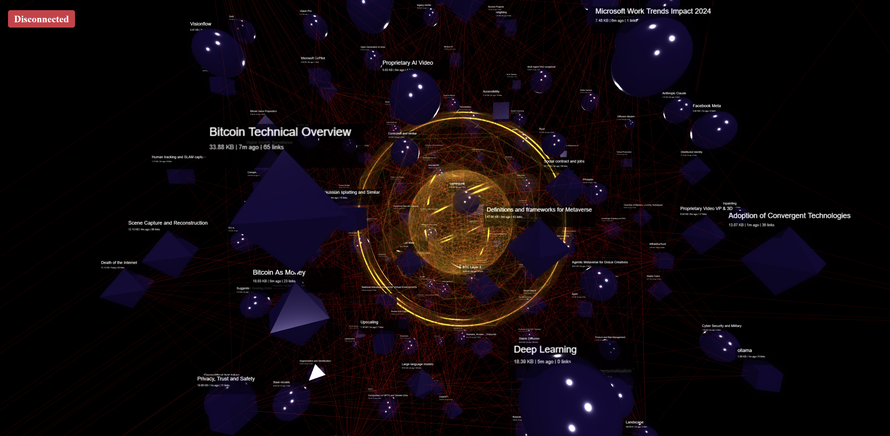
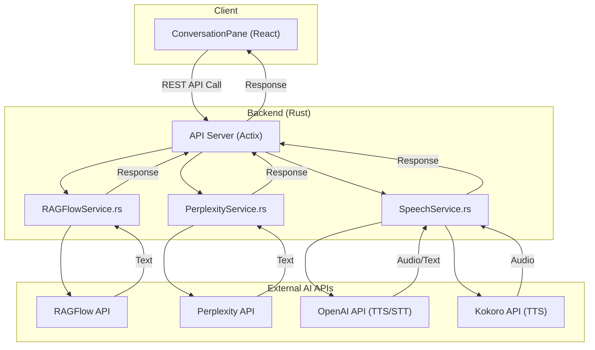
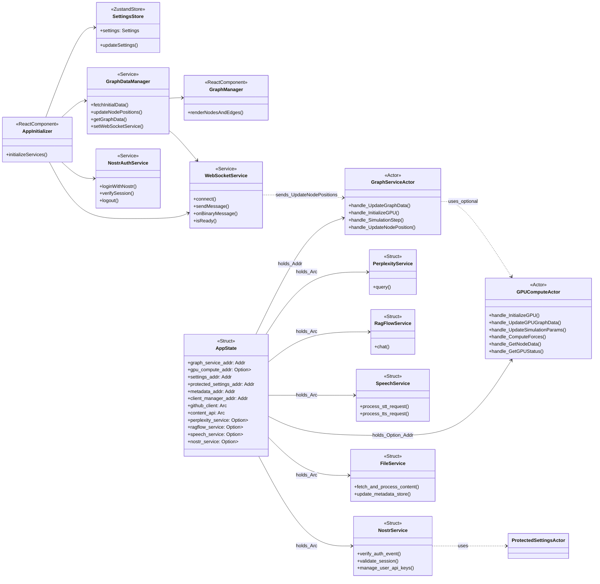
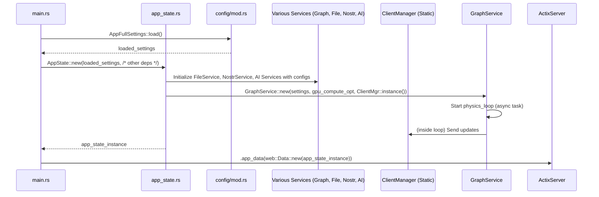
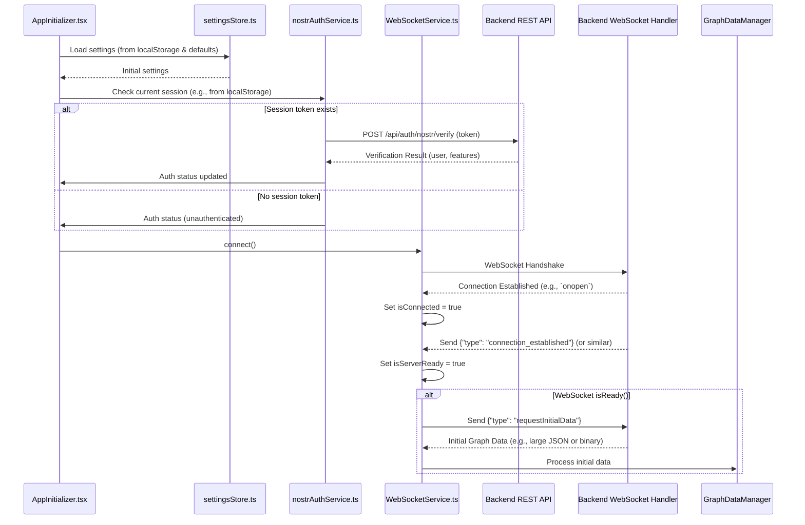
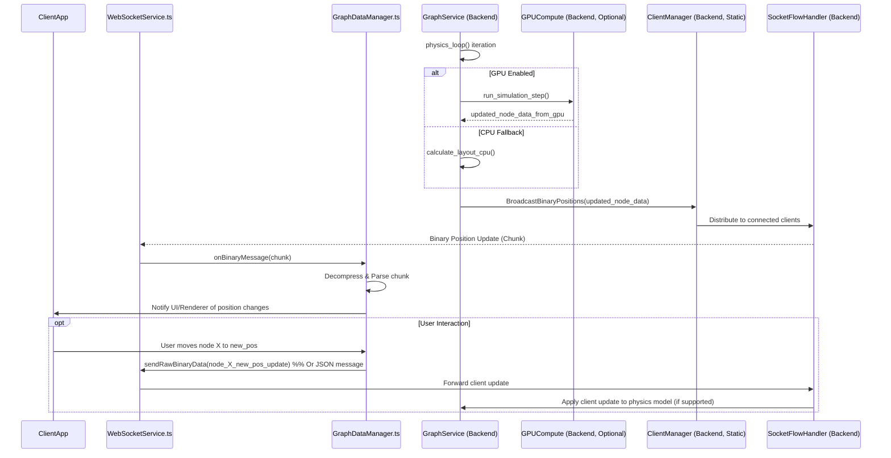
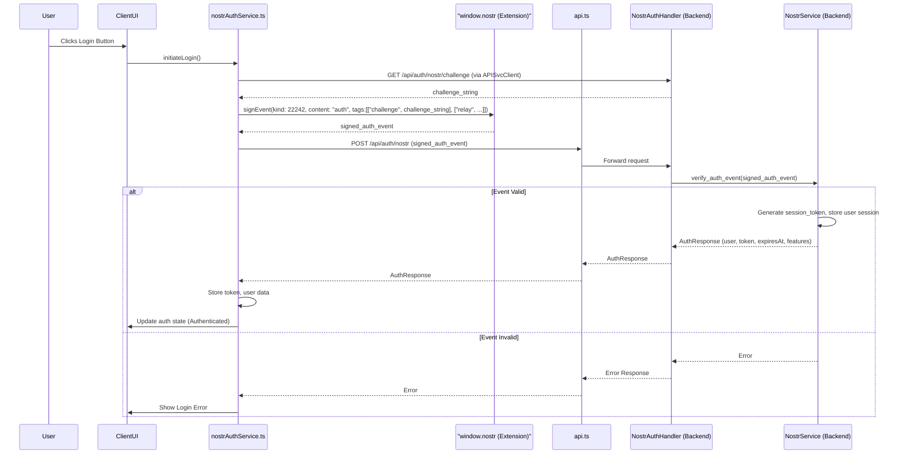
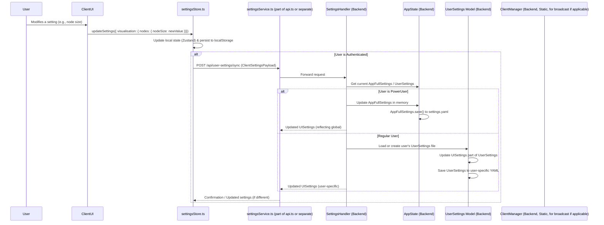
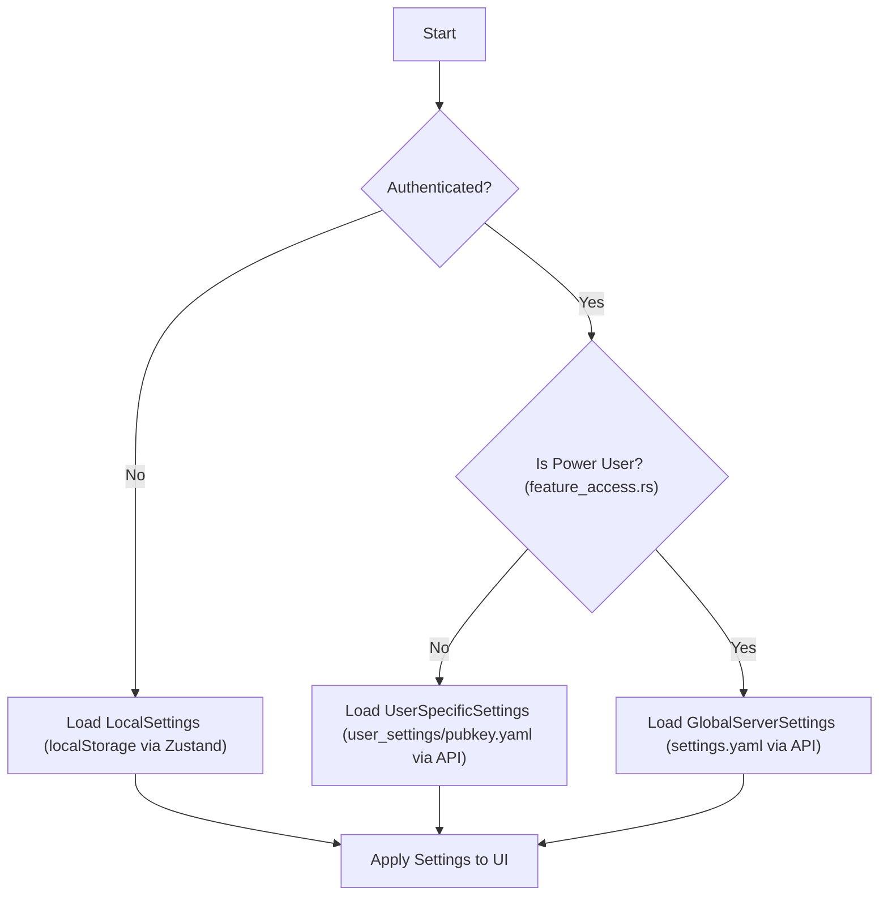
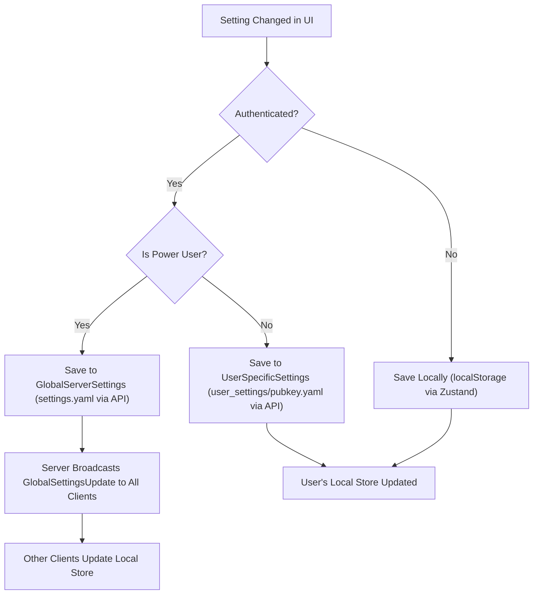

# LogseqXR: Immersive WebXR Visualisation for Logseq Knowledge Graphs




**Inspired by the innovative work of Prof. Rob Aspin:** [https://github.com/trebornipsa](https://github.com/trebornipsa)


## A Note on AI-Driven Development

This project was built over several months by a non-programmer, using AI agents as the primary tool for coding, debugging, and architectural design. This AI-first approach has shaped not only how the project was built but also the docs and diagrams you see here.

### AI in the Development Process

The entire codebase, from the Rust backend with Actix to the TypeScript frontend with React and Three.js, was generated through an iterative, conversational process with AI agents. This workflow allowed for rapid prototyping, complex feature implementation, and exploration of technologies that would typically be beyond the reach of a solo, non-technical founder.

### Integrated AI Features

Beyond its creation, LogseqXR integrates several cutting-edge AI services to enhance the user's interaction with their knowledge graph. These services are orchestrated by the Rust backend and made accessible through a dedicated conversational UI on the client.



-   **Conversational Q&A:** The [`ConversationPane.tsx`](client/src/app/components/ConversationPane.tsx) allows users to chat with their knowledge graph. Backend services like [`RAGFlowService.rs`](src/services/ragflow_service.rs) and [`PerplexityService.rs`](src/services/perplexity_service.rs) process these queries to provide context-aware answers.
-   **Voice Interaction:** The [`SpeechService.rs`](src/services/speech_service.rs) integrates with OpenAI and Kokoro for high-quality Text-to-Speech (TTS) and Speech-to-Text (STT), enabling users to speak to their graph and hear responses.

## Quick Links

- [Project Overview](docs/index.md)
- [Repository Map](docs/repo-map.md)
- [Development Setup](docs/development/setup.md)
- [API Documentation](docs/api/index.md)
- [Contributing Guidelines](docs/contributing.md)

## Documentation

### Client Documentation
- [Architecture](docs/client/architecture.md)
- [Components](docs/client/components.md)
- [Core Utilities](docs/client/core.md)
- [Rendering System](docs/client/rendering.md)
- [State Management](docs/client/state.md)
- [Type Definitions](docs/client/types.md)
- [Visualisation](docs/client/rendering.md) (Technical Rendering Details)
- [WebSocket Communication](docs/client/websocket.md)
- [WebXR Integration](docs/client/xr.md)

### Server Documentation
- [Architecture](docs/server/architecture.md)
- [Configuration](docs/server/config.md)
- [Request Handlers](docs/server/handlers.md)
- [Data Models](docs/server/models.md)
- [Services](docs/server/services.md)
- [Type Definitions](docs/server/types.md)
- [Utilities](docs/server/utils.md)

### API Documentation
- [REST API](docs/api/rest.md)
- [WebSocket API](docs/api/websocket.md)

### Development and Deployment
- [Development Setup](docs/development/setup.md)
- [Debugging Guide](docs/development/debugging.md)
- [Docker Deployment](docs/deployment/docker.md)
- [Contributing Guidelines](docs/contributing.md)

### System Architecture Diagram

```mermaid
graph TD
    subgraph ClientApp ["Frontend"]
        direction LR
        AppInit[AppInitializer]
        TwoPane[TwoPaneLayout]
        GraphView[GraphViewport (Container for 3D Scene)]
        GraphCanvas[GraphCanvas (Three.js Canvas)]
        RightCtlPanel[RightPaneControlPanel]
        SettingsUI[SettingsPanelRedesignOptimized]
        ConvoPane[ConversationPane]
        NarrativePane[NarrativeGoldminePanel]
        SettingsMgr[settingsStore]
        GraphDataMgr[GraphDataManager]
        RenderEngine[GraphCanvas & GraphManager]
        WebSocketSvc[WebSocketService]
        APISvc[api]
        NostrAuthSvcClient[nostrAuthService]
        XRController[XRController]

        AppInit --> TwoPane
        AppInit --> SettingsMgr
        AppInit --> NostrAuthSvcClient
        AppInit --> WebSocketSvc
        AppInit --> GraphDataMgr

        TwoPane --> GraphView
        TwoPane --> RightCtlPanel
        TwoPane --> ConvoPane
        TwoPane --> NarrativePane
        RightCtlPanel --> SettingsUI

        SettingsUI --> SettingsMgr
        GraphView --> RenderEngine
        RenderEngine <--> GraphDataMgr
        GraphDataMgr <--> WebSocketSvc
        GraphDataMgr <--> APISvc
        NostrAuthSvcClient <--> APISvc
        XRController <--> RenderEngine
        XRController <--> SettingsMgr
    end

    subgraph ServerApp ["Backend"]
        direction LR
        Actix[ActixWebServer]

        subgraph Handlers_Srv ["API_WebSocket_Handlers"]
            direction TB
            SettingsH[SettingsHandler]
            NostrAuthH[NostrAuthHandler]
            GraphAPI_H[GraphAPIHandler]
            FilesAPI_H[FilesAPIHandler]
            RAGFlowH_Srv[RAGFlowHandler]
            SocketFlowH[SocketFlowHandler]
            SpeechSocketH[SpeechSocketHandler]
            HealthH[HealthHandler]
        end

        subgraph Services_Srv ["Core_Services"]
            direction TB
            GraphSvc_Srv[GraphService]
            FileSvc_Srv[FileService]
            NostrSvc_Srv[NostrService]
            SpeechSvc_Srv[SpeechService]
            RAGFlowSvc_Srv[RAGFlowService]
            PerplexitySvc_Srv[PerplexityService]
        end

        subgraph Actors_Srv ["Actor_System"]
            direction TB
            GraphServiceActor[GraphServiceActor]
            SettingsActor[SettingsActor]
            MetadataActor[MetadataActor]
            ClientManagerActor[ClientManagerActor]
            GPUComputeActor[GPUComputeActor]
            ProtectedSettingsActor[ProtectedSettingsActor]
        end
        AppState_Srv[AppState holds Addr<...>]

        Actix --> Handlers_Srv

        Handlers_Srv --> AppState_Srv
        SocketFlowH --> ClientManagerActor
        GraphAPI_H --> GraphServiceActor
        SettingsH --> SettingsActor
        NostrAuthH --> ProtectedSettingsActor

        GraphServiceActor --> ClientManagerActor
        GraphServiceActor --> MetadataActor
        GraphServiceActor --> GPUComputeActor
        GraphServiceActor --> SettingsActor

        FileSvc_Srv --> MetadataActor
        NostrSvc_Srv --> ProtectedSettingsActor
        SpeechSvc_Srv --> SettingsActor
        RAGFlowSvc_Srv --> SettingsActor
        PerplexitySvc_Srv --> SettingsActor
    end

    subgraph External_Srv ["External_Services"]
        direction LR
        GitHub[GitHubAPI]
        NostrRelays_Ext[NostrRelays]
        OpenAI[OpenAIAPI]
        PerplexityAI_Ext[PerplexityAIAPI]
        RAGFlow_Ext[RAGFlowAPI]
        Kokoro_Ext[KokoroAPI]
    end

    WebSocketSvc <--> SocketFlowH
    APISvc <--> Actix

    FileSvc_Srv --> GitHub
    NostrSvc_Srv --> NostrRelays_Ext
    SpeechSvc_Srv --> OpenAI
    SpeechSvc_Srv --> Kokoro_Ext
    PerplexitySvc_Srv --> PerplexityAI_Ext
    RAGFlowSvc_Srv --> RAGFlow_Ext

    style ClientApp fill:#282C34,stroke:#61DAFB,stroke-width:2px,color:#FFFFFF
    style ServerApp fill:#282C34,stroke:#A2AAAD,stroke-width:2px,color:#FFFFFF
    style External_Srv fill:#282C34,stroke:#F7DF1E,stroke-width:2px,color:#FFFFFF
    style AppInit fill:#3A3F47,stroke:#61DAFB,color:#FFFFFF
    style TwoPane fill:#3A3F47,stroke:#61DAFB,color:#FFFFFF
    style GraphView fill:#3A3F47,stroke:#61DAFB,color:#FFFFFF
    style GraphCanvas fill:#3A3F47,stroke:#61DAFB,color:#FFFFFF
    style RightCtlPanel fill:#3A3F47,stroke:#61DAFB,color:#FFFFFF
    style SettingsUI fill:#3A3F47,stroke:#61DAFB,color:#FFFFFF
    style ConvoPane fill:#3A3F47,stroke:#61DAFB,color:#FFFFFF
    style NarrativePane fill:#3A3F47,stroke:#61DAFB,color:#FFFFFF
    style SettingsMgr fill:#3A3F47,stroke:#61DAFB,color:#FFFFFF
    style GraphDataMgr fill:#3A3F47,stroke:#61DAFB,color:#FFFFFF
    style RenderEngine fill:#3A3F47,stroke:#61DAFB,color:#FFFFFF
    style WebSocketSvc fill:#3A3F47,stroke:#61DAFB,color:#FFFFFF
    style APISvc fill:#3A3F47,stroke:#61DAFB,color:#FFFFFF
    style NostrAuthSvcClient fill:#3A3F47,stroke:#61DAFB,color:#FFFFFF
    style XRController fill:#3A3F47,stroke:#61DAFB,color:#FFFFFF

    style Actix fill:#3A3F47,stroke:#A2AAAD,color:#FFFFFF
    style Handlers_Srv fill:#3A3F47,stroke:#A2AAAD,color:#FFFFFF
    style SettingsH fill:#3A3F47,stroke:#A2AAAD,color:#FFFFFF
    style NostrAuthH fill:#3A3F47,stroke:#A2AAAD,color:#FFFFFF
    style GraphAPI_H fill:#3A3F47,stroke:#A2AAAD,color:#FFFFFF
    style FilesAPI_H fill:#3A3F47,stroke:#A2AAAD,color:#FFFFFF
    style RAGFlowH_Srv fill:#3A3F47,stroke:#A2AAAD,color:#FFFFFF
    style SocketFlowH fill:#3A3F47,stroke:#A2AAAD,color:#FFFFFF
    style SpeechSocketH fill:#3A3F47,stroke:#A2AAAD,color:#FFFFFF
    style HealthH fill:#3A3F47,stroke:#A2AAAD,color:#FFFFFF
    style Services_Srv fill:#3A3F47,stroke:#A2AAAD,color:#FFFFFF
    style GraphSvc_Srv fill:#3A3F47,stroke:#A2AAAD,color:#FFFFFF
    style FileSvc_Srv fill:#3A3F47,stroke:#A2AAAD,color:#FFFFFF
    style NostrSvc_Srv fill:#3A3F47,stroke:#A2AAAD,color:#FFFFFF
    style SpeechSvc_Srv fill:#3A3F47,stroke:#A2AAAD,color:#FFFFFF
    style RAGFlowSvc_Srv fill:#3A3F47,stroke:#A2AAAD,color:#FFFFFF
    style PerplexitySvc_Srv fill:#3A3F47,stroke:#A2AAAD,color:#FFFFFF
    style Actors_Srv fill:#3A3F47,stroke:#A2AAAD,color:#FFFFFF
    style GraphServiceActor fill:#3A3F47,stroke:#A2AAAD,color:#FFFFFF
    style SettingsActor fill:#3A3F47,stroke:#A2AAAD,color:#FFFFFF
    style MetadataActor fill:#3A3F47,stroke:#A2AAAD,color:#FFFFFF
    style ClientManagerActor fill:#3A3F47,stroke:#A2AAAD,color:#FFFFFF
    style GPUComputeActor fill:#3A3F47,stroke:#A2AAAD,color:#FFFFFF
    style ProtectedSettingsActor fill:#3A3F47,stroke:#A2AAAD,color:#FFFFFF
    style AppState_Srv fill:#3A3F47,stroke:#A2AAAD,color:#FFFFFF

    style GitHub fill:#3A3F47,stroke:#F7DF1E,color:#FFFFFF
    style NostrRelays_Ext fill:#3A3F47,stroke:#F7DF1E,color:#FFFFFF
    style OpenAI fill:#3A3F47,stroke:#F7DF1E,color:#FFFFFF
    style PerplexityAI_Ext fill:#3A3F47,stroke:#F7DF1E,color:#FFFFFF
    style RAGFlow_Ext fill:#3A3F47,stroke:#F7DF1E,color:#FFFFFF
    style Kokoro_Ext fill:#3A3F47,stroke:#F7DF1E,color:#FFFFFF
```

### Class Diagram



### Sequence Diagrams

#### Server Initialization Sequence



#### Client Initialization Sequence



#### Real-time Graph Updates Sequence



#### Authentication Flow Sequence



#### Settings Synchronization Sequence



### AR Features Implementation Status

#### Hand Tracking (Meta Quest 3)
- XR Interaction is primarily managed by [`client/src/features/xr/systems/HandInteractionSystem.tsx`](client/src/features/xr/systems/HandInteractionSystem.tsx:1) and related hooks/providers like [`useSafeXRHooks.tsx`](client/src/features/xr/hooks/useSafeXRHooks.tsx:1).
- Session management is in [`client/src/features/xr/managers/xrSessionManager.ts`](client/src/features/xr/managers/xrSessionManager.ts:1).
- Initialisation logic is in [`client/src/features/xr/managers/xrInitializer.ts`](client/src/features/xr/managers/xrInitializer.ts:1).
- The main XR entry point and controller is [`client/src/features/xr/components/XRController.tsx`](client/src/features/xr/components/XRController.tsx:1).
- Type definitions for WebXR, including hand tracking, are in [`client/src/features/xr/types/xr.ts`](client/src/features/xr/types/xr.ts:1) and potentially augmented by [`client/src/features/xr/types/webxr-extensions.d.ts`](client/src/features/xr/types/webxr-extensions.d.ts:1) (though this file is noted as mostly commented out).

##### Current Challenges
- The `webxr-extensions.d.ts` file is largely commented out, indicating potential gaps or reliance on default browser types for hand tracking APIs, which might vary.
- Robust gesture recognition based on joint positions requires significant implementation in `HandInteractionSystem.tsx`.

##### Next Steps
- Review and complete necessary type definitions in `webxr-extensions.d.ts` if standard types are insufficient.
- Implement gesture recognition logic.
- Optimize performance for AR/passthrough modes.

### Authentication and Settings Inheritance

#### Unauthenticated Users
- Use browser's localStorage for settings persistence (via Zustand `persist` middleware in [`client/src/store/settingsStore.ts`](client/src/store/settingsStore.ts:1)).
- Settings are stored locally and not synced to a user-specific backend store.
- Default to basic settings visibility.
- Limited to local visualisation features; AI and GitHub features requiring API keys will not be available unless default API keys are configured in the server's `ProtectedSettings`.

#### Authenticated Users (Nostr)
- **Regular Users**:
    - Settings are loaded from and saved to user-specific files on the server (e.g., `/app/user_settings/<pubkey>.yaml`), managed by [`src/handlers/settings_handler.rs`](src/handlers/settings_handler.rs:1) using the `UserSettings` model (which contains `UISettings`).
    - These user-specific settings are primarily UI/visualisation preferences defined in `UISettings`.
    - Can access features based on their configuration in [`src/config/feature_access.rs`](src/config/feature_access.rs:1).
    - Can manage their own API keys for AI services via the `/api/auth/nostr/api-keys` endpoint. These keys are stored in their `NostrUser` profile within the server's `ProtectedSettings`.
- **Power Users**:
    - Directly load and modify the global server settings from `settings.yaml` (represented by `AppFullSettings` in Rust, which is then used to derive `UISettings`).
    - Have full access to all settings and advanced API features. API keys for these might come from `AppFullSettings` (if globally configured for all power users) or their own `NostrUser` profile in `ProtectedSettings`.
    - Settings modifications made by power users to `AppFullSettings` are persisted to the main `settings.yaml` and potentially broadcast to other clients (if implemented).

### Settings Inheritance Flow



### Settings Sync Flow



### Modular Control Panel Architecture

The client's user interface for settings and controls is structured as follows:
-   **Main Layout**: [`client/src/app/TwoPaneLayout.tsx`](client/src/app/TwoPaneLayout.tsx:1) divides the screen.
-   **Right Pane Host**: [`client/src/app/components/RightPaneControlPanel.tsx`](client/src/app/components/RightPaneControlPanel.tsx:1) hosts various panels within the right-hand side.
-   **Settings UI Core**: [`client/src/features/settings/components/panels/SettingsPanelRedesignOptimized.tsx`](client/src/features/settings/components/panels/SettingsPanelRedesignOptimized.tsx:1) provides the tabbed interface for different setting categories (Visualisation, System, AI, XR).
    -   **Tabs Component**: Uses a generic [`client/src/ui/Tabs.tsx`](client/src/ui/Tabs.tsx:1) component for tab navigation.
    -   **Settings Sections**: Each tab within `SettingsPanelRedesign.tsx` renders one or more [`SettingsSection.tsx`](client/src/features/settings/components/SettingsSection.tsx:1) components to group related settings. These sections can be collapsible.
    -   **Individual Controls**: Each [`SettingsSection.tsx`](client/src/features/settings/components/SettingsSection.tsx:1) uses multiple [`SettingControlComponent.tsx`](client/src/features/settings/components/SettingControlComponent.tsx:1) instances to render the actual UI controls (sliders, toggles, inputs, etc.) for each setting.
-   **State Management**:
    -   Settings values are primarily managed by the Zustand store defined in [`client/src/store/settingsStore.ts`](client/src/store/settingsStore.ts:1).
    -   Context for control panel specific state (like detached panel states or advanced view toggles) is managed by [`client/src/features/settings/components/control-panel-context.tsx`](client/src/features/settings/components/control-panel-context.tsx:1).

The `client/src/components/layout/ControlPanel.tsx` mentioned in the original README seems to be superseded or refactored into the `SettingsPanelRedesign.tsx` and its constituent parts. Detachable sections are a feature of `SettingsSection.tsx`.

#### Performance Optimisations
- **Debounced Updates**: `SettingControlComponent.tsx` uses `onBlur` or Enter key for text/number inputs, which acts as a form of debouncing for settings changes that might trigger expensive re-renders or API calls.
- **CSS Transforms**: Used by `react-draggable` for smooth movement of detached panels.
- **Memoisation**: `useMemo` is used in components like `GraphManager.tsx` to stabilise expensive calculations or object references.
- **Targeted Re-renders**: Zustand store selectors for primitive values are used in some places (e.g., `App.tsx`) to avoid unnecessary re-renders.

The goal is to maintain responsiveness, especially during interactions with the 3D visualisation and real-time updates.

## License

This project is licensed under the MIT License. See the [LICENSE](LICENSE) file for details.

## Acknowledgements

- Prof Rob Aspin: For inspiring the project's vision and providing valuable resources.
- OpenAI: For their advanced AI models powering the question-answering features.
- Perplexity AI and RAGFlow: For their AI services enhancing content processing and interaction.
- Three.js: For the robust 3D rendering capabilities utilised in the frontend.
- Actix: For the high-performance web framework powering the backend server.
```