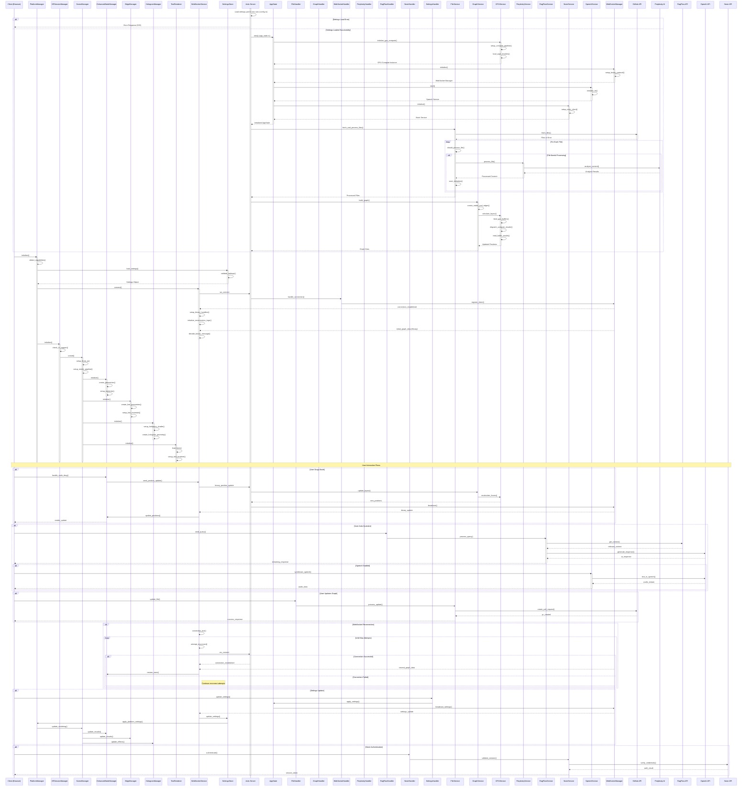
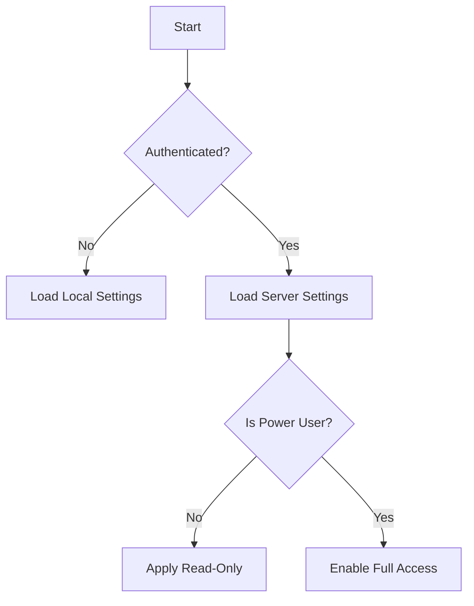
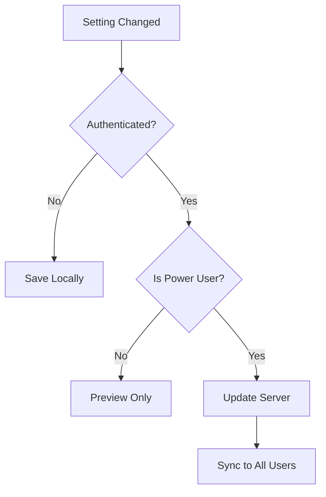

# LogseqXR: Immersive WebXR Visualization for Logseq Knowledge Graphs


**Inspired by the innovative work of Prof. Rob Aspin:** [https://github.com/trebornipsa](https://github.com/trebornipsa)


## About LogseqXR

LogseqXR transforms your Logseq knowledge base into an immersive 3D visualization that you can explore in VR/AR. Experience your ideas as tangible objects in space, discover new connections, and interact with your knowledge in ways never before possible.

## Quick Links

- [Project Overview](docs/overview/introduction.md)
- [Technical Architecture](docs/overview/architecture.md)
- [Development Setup](docs/development/setup.md)
- [API Documentation](docs/api/index.md)
- [Contributing Guidelines](docs/contributing/guidelines.md)

## Documentation Structure

### Overview
- [Introduction & Features](docs/overview/introduction.md)
- [System Architecture](docs/overview/architecture.md)

### Technical Documentation
- [WebSocket Communication](docs/technical/websockets.md)
- [Binary Protocol](docs/technical/binary-protocol.md)
- [Performance Optimizations](docs/technical/performance.md)
- [Class Diagrams](docs/technical/class-diagrams.md)

### Development
- [Setup Guide](docs/development/setup.md)
- [Debugging Guide](docs/development/debugging.md)

### API Documentation
- [API Overview](docs/api/index.md)
- [REST API](docs/api/rest.md)
- [WebSocket API](docs/api/websocket.md)

### Deployment
- [Docker Deployment](docs/deployment/docker.md)

### Contributing
- [Contributing Guidelines](docs/contributing/guidelines.md)

### Diagrams

```mermaid
graph TB
    %% Frontend Components
    subgraph Frontend
        UI[User Interface Layer]
        VR[WebXR Controller]
        WS[WebSocket Client]
        GPU[GPU Compute Layer]
        ThreeJS[Three.js Renderer]
        ChatUI[Chat Interface]
        GraphUI[Graph Interface]
        ControlPanel["Modular Control Panel (with Nostr Auth)"]
        VRControls[VR Control System]
        WSService[WebSocket Service]
        DataManager[Graph Data Manager]
        LayoutEngine[Layout Engine]
        SpaceMouse[SpaceMouse Controller]
        PlatformManager[Platform Manager]
        XRSession[XR Session Manager]
        XRInit[XR Initializer]
        SceneManager[Scene Manager]
        NodeManager[Enhanced Node Manager]
        EdgeManager[Edge Manager]
        HologramManager[Hologram Manager]
        TextRenderer[Text Renderer]
        SettingsStore[Settings Store]
    end

    %% Backend Components
    subgraph Backend
        Server[Actix Web Server]
        FileH[File Handler]
        GraphH[Graph Handler]
        WSH[WebSocket Handler]
        PerplexityH[Perplexity Handler]
        RagFlowH[RagFlow Handler]
        VisualizationH[Visualization Handler]
        NostrH[Nostr Handler]
        HealthH[Health Handler]
        PagesH[Pages Handler]
        SettingsH[Settings Handler]
        FileS[File Service]
        GraphS[Graph Service]
        GPUS[GPU Compute Service]
        PerplexityS[Perplexity Service]
        RagFlowS[RagFlow Service]
        SpeechS[Speech Service]
        NostrS[Nostr Service]
        WSManager[WebSocket Manager]
        GPUCompute[GPU Compute]
        Compression[Compression Utils]
        AudioProc[Audio Processor]
        MetadataStore[Metadata Store]
        ProtectedSettings[Protected Settings]
    end

    %% External Components
    subgraph External
        GitHub[GitHub API]
        Perplexity[Perplexity AI]
        RagFlow[RagFlow API]
        OpenAI[OpenAI API]
        NostrAPI[Nostr API]
    end

    %% Connections between Frontend Components
    UI --> ChatUI
    UI --> GraphUI
    UI --> ControlPanel
    UI --> VRControls

    VR --> ThreeJS
    WS --> WSService
    WSService --> Server

    %% Connections between Backend Components
    Server --> FileH
    Server --> GraphH
    Server --> WSH
    Server --> PerplexityH
    Server --> RagFlowH
    Server --> VisualizationH
    Server --> NostrH
    Server --> HealthH
    Server --> PagesH
    Server --> SettingsH

    FileH --> FileS
    GraphH --> GraphS
    WSH --> WSManager
    PerplexityH --> PerplexityS
    RagFlowH --> RagFlowS
    NostrH --> NostrS

    %% Connections to External Components
    FileS --> GitHub
    PerplexityS --> Perplexity
    RagFlowS --> RagFlow
    SpeechS --> OpenAI
    NostrS --> NostrAPI

    %% Styling for clarity
    style Frontend fill:#f9f,stroke:#333,stroke-width:2px
    style Backend fill:#bbf,stroke:#333,stroke-width:2px
    style External fill:#bfb,stroke:#333,stroke-width:2px
```



### Class Diagram


### Sequence Diagram



### AR Features Implementation Status

#### Hand Tracking (Meta Quest 3)
- Implementation in `client/xr/xrSessionManager.ts`
- Currently addressing:
  - Performance optimization for AR passthrough mode
  - Virtual desktop cleanup during AR activation
  - Type compatibility between `XRHand` and custom `XRHandWithHaptics`
  - Joint position extraction methods

##### Current Challenges
- Type mismatches between standard `XRHand` and custom `XRHandWithHaptics`
- Joint position extraction from `XRJointSpace`
- Performance optimization in AR passthrough mode

##### Next Steps
- Implement adapter for `XRHand` to `XRHandWithHaptics` conversion
- Refactor VisualizationController for native XRHand compatibility
- Optimize AR mode transitions
- Enhance Meta Quest 3 performance

## License

This project is licensed under the MIT License. See the [LICENSE](LICENSE) file for details.

## Acknowledgements

- Prof Rob Aspin: For inspiring the project's vision and providing valuable resources.
- OpenAI: For their advanced AI models powering the question-answering features.
- Perplexity AI and RAGFlow: For their AI services enhancing content processing and interaction.
- Three.js: For the robust 3D rendering capabilities utilized in the frontend.
- Actix: For the high-performance web framework powering the backend server.

### Authentication and Settings Inheritance

#### Unauthenticated Users
- Use browser's localStorage for settings persistence
- Settings are stored locally and not synced
- Default to basic settings visibility
- Limited to local visualization features

#### Authenticated Users (Nostr)
- Inherit settings from server's settings.yaml
- Settings are synced across all authenticated users
- Access to advanced settings based on role

#### Power Users
- Full access to all settings
- Can modify server's settings.yaml
- Access to advanced API features:
  - Perplexity API for AI assistance
  - RagFlow for document processing
  - GitHub integration for PR management
  - OpenAI voice synthesis
- Settings modifications are persisted to settings.yaml

### Settings Inheritance Flow



### Settings Sync Flow



### Modular Control Panel Architecture

The control panel is built with a modular architecture that supports:
- Detachable sections
- Real-time preview integration
- Drag and drop functionality
- Dynamic tooltips
- Performance optimizations

#### Component Structure

```typescript
interface ModularControlPanelProps {
  sections: ControlSection[];
  layout: LayoutConfig;
  onLayoutChange: (newLayout: LayoutConfig) => void;
}

interface ControlSection {
  id: string;
  title: string;
  settings: Setting[];
  isDetached: boolean;
  position?: { x: number, y: number };
  size?: { width: number, height: number };
}

interface Setting {
  id: string;
  type: 'slider' | 'toggle' | 'color' | 'select';
  value: any;
  metadata: SettingMetadata;
}
```

#### Layout Management

```typescript
interface LayoutConfig {
  sections: {
    [sectionId: string]: {
      position: { x: number, y: number };
      size: { width: number, height: number };
      isDetached: boolean;
      isCollapsed: boolean;
    };
  };
  userPreferences: {
    showAdvanced: boolean;
    activeFilters: string[];
    customOrder: string[];
  };
}
```

#### Performance Optimizations

- ResizeObserver for efficient size tracking
- Virtual scrolling for large setting lists
- Debounced real-time preview updates
- CSS transforms for smooth animations
- Lazy loading for visual aids
- Efficient memory management with WeakMap
- Real-time preview integration with ~60fps target