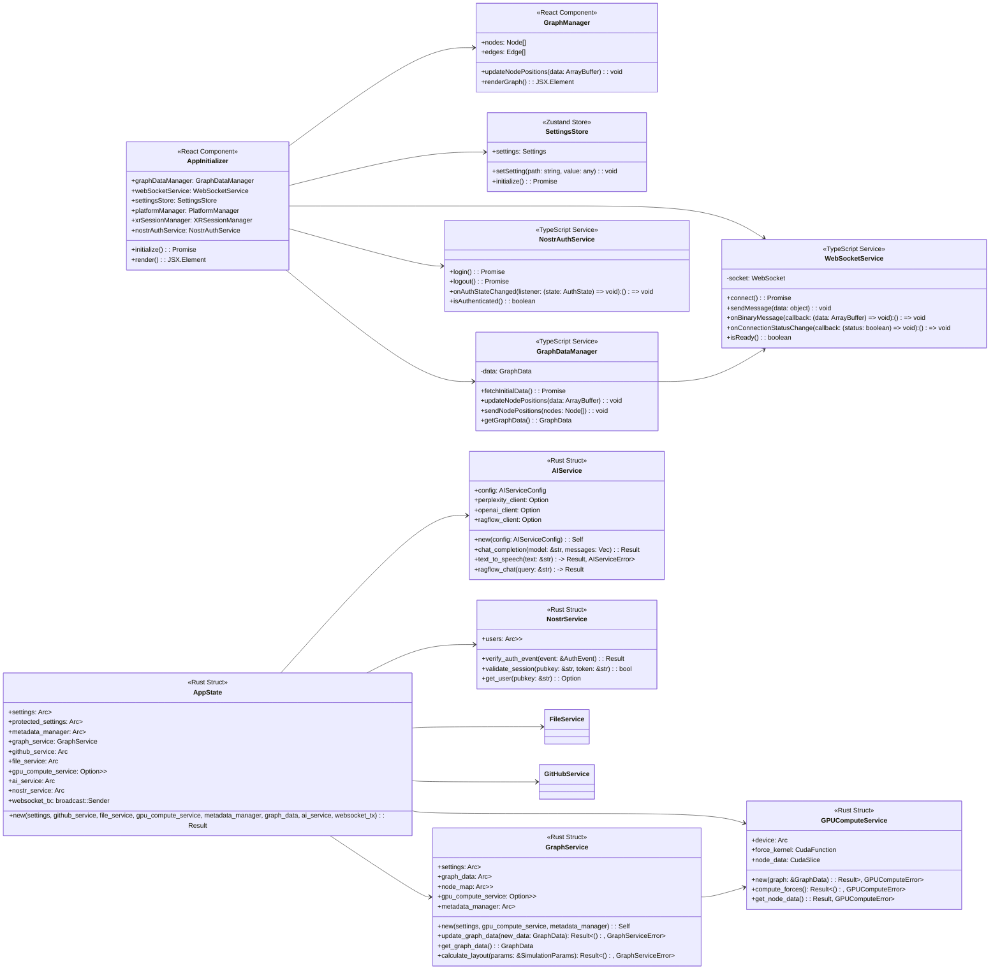
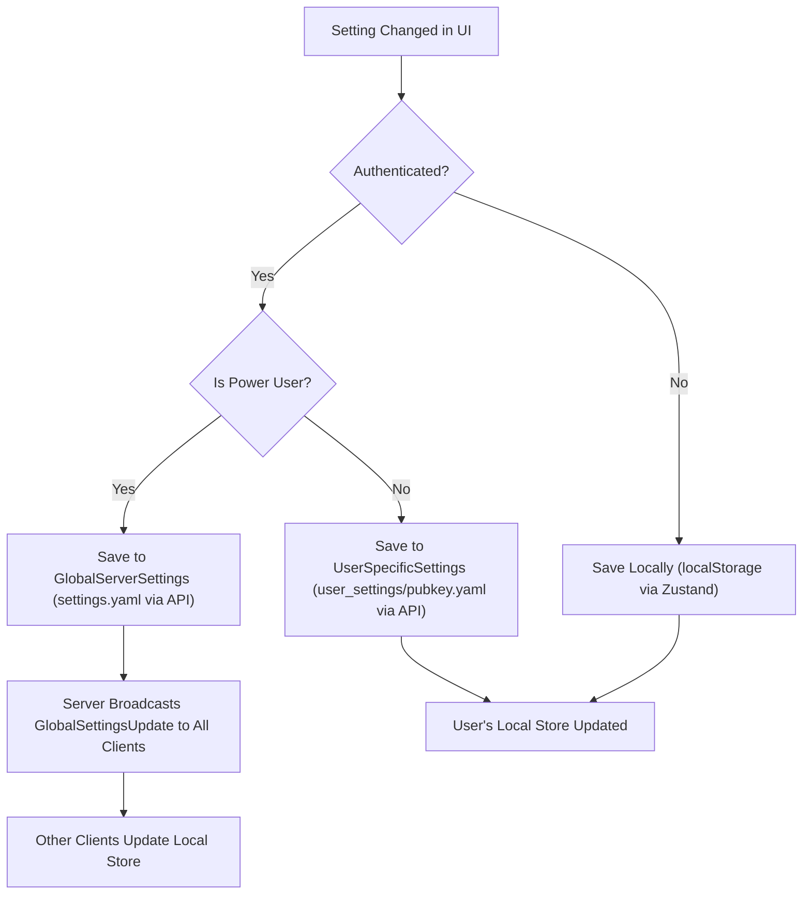

# LogseqXR: Immersive WebXR Visualisation for Logseq Knowledge Graphs


**Inspired by the innovative work of Prof. Rob Aspin:** [https://github.com/trebornipsa](https://github.com/trebornipsa)


## About LogseqXR

LogseqXR transforms your Logseq knowledge base into an immersive 3D visualisation that you can explore in VR/AR. Experience your ideas as tangible objects in space, discover new connections, and interact with your knowledge in ways never before possible.

## Quick Links

- [Project Overview](docs/index.md)
- [Development Setup](docs/development/setup.md)
- [API Documentation](docs/api/index.md)
- [Contributing Guidelines](docs/contributing.md)

## Documentation

Our documentation is organised into several key sections:

### Client Documentation
- [Architecture](docs/client/architecture.md)
- [Components](docs/client/components.md)
- [Core Utilities](docs/client/core.md)
- [Rendering System](docs/client/rendering.md)
- [State Management](docs/client/state.md)
- [Type Definitions](docs/client/types.md)
- [Visualisation](docs/client/visualisation.md)
- [WebSocket Communication](docs/client/websocket.md)
- [WebXR Integration](docs/client/xr.md)

### Server Documentation
- [Architecture](docs/server/architecture.md)
- [Configuration](docs/server/config.md)
- [Request Handlers](docs/server/handlers.md)
- [Data Models](docs/server/models.md)
- [Services](docs/server/services.md)
- [Type Definitions](docs/server/types.md)
- [Utilities](docs/server/utils.md)

### API Documentation
- [REST API](docs/api/rest.md)
- [WebSocket API](docs/api/websocket.md)

### Development and Deployment
- [Development Setup](docs/development/setup.md)
- [Debugging Guide](docs/development/debugging.md)
- [Docker Deployment](docs/deployment/docker.md)
- [Contributing Guidelines](docs/contributing.md)

### System Architecture Diagram

```mermaid
graph TB
    %% Frontend Components
    subgraph Frontend
        AppInitializer[App Initializer]
        R3FRenderer[React Three Fiber Renderer]
        XR[WebXR Integration]
        WSClient[WebSocket Client]
        GraphManager[Graph Manager]
        RightPaneControlPanel[Right Pane Control Panel]
        ControlPanelLayout[Control Panel Layout]
        XRControlPanel[XR Control Panel]
        WSService[WebSocket Service]
        GraphDataManager[Graph Data Manager]
        PlatformManager[Platform Manager]
        XRSessionManager[XR Session Manager]
        XRInitializer[XR Initializer]
        HologramManager[Hologram Manager]
        TextRenderer[Text Renderer]
        SettingsStore[Settings Store]
        NostrAuthClient[Nostr Auth Client UI]
        GraphCanvas[Graph Canvas]
    end

    %% Backend Components
    subgraph Backend
        ActixServer[Actix Web Server]
        FileHandler[File Handler]
        GraphHandler[Graph Handler]
        SocketFlowHandler[Socket Flow Handler]
        PerplexityHandler[Perplexity Handler]
        RagFlowHandler[RagFlow Handler]
        VisualisationHandler[Visualisation Handler]
        NostrAuthHandler[Nostr Auth Handler]
        HealthHandler[Health Handler]
        PagesHandler[Pages Handler]
        SettingsHandler[Settings Handler]
        FileService[File Service]
        GraphService[Graph Service]
        GPUComputeService[GPU Compute Service]
        PerplexityService[Perplexity Service]
        RagFlowService[RagFlow Service]
        SpeechService[Speech Service]
        NostrService[Nostr Service]
        PhysicsEngine[Physics Engine]
        AudioProcessor[Audio Processor]
        MetadataManager[Metadata Manager]
        ProtectedSettings[Protected Settings]
        AIService[AI Service]
    end

    %% External Components
    subgraph External
        GitHubAPI[GitHub API]
        PerplexityAI[Perplexity AI]
        RagFlowAPI[RagFlow API]
        OpenAI_API[OpenAI API]
        NostrPlatformAPI[Nostr Platform API]
    end

    %% Connections between Frontend Components
    AppInitializer --> GraphCanvas
    AppInitializer --> RightPaneControlPanel
    AppInitializer --> ControlPanelLayout
    AppInitializer --> NostrAuthClient
    AppInitializer --> XRControlPanel
    GraphCanvas --> R3FRenderer
    WSClient --> WSService
    WSService --> ActixServer

    %% Connections between Backend Components
    ActixServer --> FileHandler
    ActixServer --> GraphHandler
    ActixServer --> SocketFlowHandler
    ActixServer --> PerplexityHandler
    ActixServer --> RagFlowHandler
    ActixServer --> VisualisationHandler
    ActixServer --> NostrAuthHandler
    ActixServer --> HealthHandler
    ActixServer --> PagesHandler
    ActixServer --> SettingsHandler

    FileHandler --> FileService
    GraphHandler --> GraphService
    SocketFlowHandler --> SocketFlowHandler %% Handles client connections directly
    PerplexityHandler --> PerplexityService
    RagFlowHandler --> RagFlowService
    NostrAuthHandler --> NostrService

    GraphService --> PhysicsEngine
    PhysicsEngine --> GPUComputeService

    %% Connections to External Components
    FileService --> GitHubAPI
    PerplexityService --> PerplexityAI
    RagFlowService --> RagFlowAPI
    SpeechService --> OpenAI_API
    NostrService --> NostrPlatformAPI
    AIService --> PerplexityAI
    AIService --> RagFlowAPI
    AIService --> OpenAI_API

    %% Styling for clarity
    style Frontend fill:#f9f,stroke:#333,stroke-width:2px
    style Backend fill:#bbf,stroke:#333,stroke-width:2px
    style External fill:#bfb,stroke:#333,stroke-width:2px
```

### Class Diagram



### Sequence Diagram

```mermaid
sequenceDiagram
    participant AppInitializer as App Initializer (Client)
    participant GraphDataManager as GraphDataManager (Client)
    participant WebSocketService as WebSocketService (Client)
    participant SettingsStore as SettingsStore (Client)
    participant NostrAuthService as NostrAuthService (Client)
    participant PlatformManager as PlatformManager (Client)
    participant GraphCanvas as Graph Canvas (Client)

    participant ActixServer as Actix Web Server (Backend)
    participant AppState as AppState (Backend)
    participant GraphService as GraphService (Backend)
    participant GPUComputeService as GPU Compute Service (Backend)
    participant FileService as File Service (Backend)
    participant NostrService as Nostr Service (Backend)
    participant AIService as AI Service (Backend)
    participant SettingsHandler as Settings Handler (Backend)
    participant NostrHandler as Nostr Handler (Backend)
    participant FileHandler as File Handler (Backend)
    participant GraphHandler as Graph Handler (Backend)
    participant SocketFlowHandler as Socket Flow Handler (Backend)
    
    participant GitHubAPI as GitHub API (External)
    participant PerplexityAI as Perplexity AI (External)
    participant RagFlowAPI as RagFlow API (External)
    participant OpenAI_API as OpenAI API (External)
    participant NostrPlatform as Nostr Platform (External)

    %% === Server Initialisation ===
    activate ActixServer
    ActixServer->>ActixServer: Load AppFullSettings (settings.yaml, env)
    alt Settings Load Error
        ActixServer-->>AppInitializer: HTTP 500 (Conceptual)
    else Settings Loaded
        ActixServer->>AppState: new(AppFullSettings, GitHubService, FileService, GPUComputeService, MetadataManager, GraphData, AIService, WebSocketTx)
        activate AppState
            Note over AppState: Initialises services like GitHubService, FileService
            AppState->>AIService: new(AppFullSettings)
            activate AIService; deactivate AIService
            AppState->>NostrService: new()
            activate NostrService; deactivate NostrService
            AppState->>MetadataManager: load_or_create_metadata()
            activate MetadataManager; deactivate MetadataManager
            AppState->>GraphService: update_graph_data()
            activate GraphService
                GraphService->>GraphService: Initialise random positions
            deactivate GraphService
            AppState->>GPUComputeService: new(GraphData) (or test_gpu)
            activate GPUComputeService; deactivate GPUComputeService
            AppState->>GraphService: new(AppFullSettings, GPUComputeService, MetadataManager)
            activate GraphService
                GraphService->>GraphService: Start physics simulation loop (async)
            deactivate GraphService
        AppState-->>ActixServer: Initialised AppState
        deactivate AppState
    end
    deactivate ActixServer

    %% === Client Initialisation ===
    activate AppInitializer
    AppInitializer->>PlatformManager: initialise()
    activate PlatformManager; deactivate PlatformManager
    AppInitializer->>SettingsStore: initialise()
    activate SettingsStore
        SettingsStore->>SettingsStore: Load from localStorage
        SettingsStore->>ActixServer: GET /api/user-settings (fetchSettings)
        activate ActixServer
            ActixServer->>SettingsHandler: get_public_settings(AppState)
            SettingsHandler-->>ActixServer: UserSettings (JSON)
        deactivate ActixServer
        ActixServer-->>SettingsStore: Settings JSON
        SettingsStore->>SettingsStore: Merge and store settings
    deactivate SettingsStore
    
    AppInitializer->>NostrAuthService: initialise()
    activate NostrAuthService
        NostrAuthService->>NostrAuthService: Check localStorage for session
        alt Stored Session Found
            NostrAuthService->>ActixServer: POST /api/auth/nostr/verify (token)
            activate ActixServer
                ActixServer->>NostrHandler: verify(AppState, token_payload)
                NostrHandler->>NostrService: validate_session(pubkey, token)
                NostrService-->>NostrHandler: Validation Result
            deactivate ActixServer
            ActixServer-->>NostrAuthService: VerificationResponse
            NostrAuthService->>SettingsStore: Update auth state
        end
    deactivate NostrAuthService

    AppInitializer->>WebSocketService: connect()
    activate WebSocketService
        WebSocketService->>ActixServer: WebSocket Handshake (/wss)
        activate ActixServer
            ActixServer->>SocketFlowHandler: handle_connection(AppState)
            activate SocketFlowHandler
                SocketFlowHandler->>SocketFlowHandler: Register client
            deactivate SocketFlowHandler
        deactivate ActixServer
        ActixServer-->>WebSocketService: WebSocket Opened
        WebSocketService->>WebSocketService: isConnected = true
        WebSocketService->>ActixServer: {"type":"requestInitialData"} (after connection_established from server)
        activate ActixServer
            ActixServer->>SocketFlowHandler: Handle requestInitialData
            SocketFlowHandler->>GraphService: get_graph_data()
            GraphService-->>SocketFlowHandler: GraphData
            SocketFlowHandler->>SocketFlowHandler: Encode to binary
            SocketFlowHandler-->>WebSocketService: Binary Position Data (Initial Graph)
        deactivate ActixServer
        WebSocketService->>GraphDataManager: updateNodePositions(binary_data)
        activate GraphDataManager
            GraphDataManager->>GraphDataManager: Parse binary, update internal graph
            GraphDataManager->>GraphCanvas: Trigger re-render
        deactivate GraphDataManager
    deactivate WebSocketService
    
    AppInitializer->>GraphDataManager: fetchInitialData() (if WebSocket initial data is not primary)
    activate GraphDataManager
        GraphDataManager->>ActixServer: GET /api/graph/data
        activate ActixServer
            ActixServer->>GraphHandler: get_graph_data(AppState)
            GraphHandler->>GraphService: get_graph_data()
            GraphService-->>GraphHandler: GraphData
        deactivate ActixServer
        ActixServer-->>GraphDataManager: GraphData JSON
        GraphDataManager->>GraphDataManager: Set graph data
        GraphDataManager->>GraphCanvas: Trigger re-render
    deactivate GraphDataManager
    deactivate AppInitializer

    %% === Continuous Graph Updates (Server to Client) ===
    loop Physics Simulation & Broadcast (Backend)
        GraphService->>GPUComputeService: compute_forces()
        GPUComputeService-->>GraphService: Updated Node Data
        GraphService->>SocketFlowHandler: Broadcast node positions (via AppState.websocket_tx)
        activate SocketFlowHandler
            SocketFlowHandler-->>WebSocketService: Binary Position Data
        deactivate SocketFlowHandler
        WebSocketService->>GraphDataManager: updateNodePositions(binary_data)
        activate GraphDataManager
            GraphDataManager->>GraphDataManager: Parse binary, update internal graph
            GraphDataManager->>GraphCanvas: Trigger re-render
        deactivate GraphDataManager
    end

    %% === User Drags Node (Client to Server) ===
    AppInitializer->>GraphCanvas: User interacts with node
    GraphCanvas->>GraphDataManager: Node position changed by user
    activate GraphDataManager
        GraphDataManager->>GraphDataManager: Update local node position
        GraphDataManager->>WebSocketService: sendNodePositions(updated_nodes) (sends binary update)
        activate WebSocketService
            WebSocketService->>ActixServer: Binary Position Data (Client Update)
            activate ActixServer
                ActixServer->>SocketFlowHandler: Handle binary message
                SocketFlowHandler->>GraphService: update_node_positions(client_updates)
                activate GraphService
                    GraphService->>GraphService: Update internal graph, resolve conflicts
                    GraphService->>GPUComputeService: compute_forces() (recalculate layout)
                    GPUComputeService-->>GraphService: Updated Node Data
                deactivate GraphService
                Note over ActixServer: Server now has authoritative positions.
                Note over ActixServer: Broadcast loop will send these out.
            deactivate ActixServer
        deactivate WebSocketService
    deactivate GraphDataManager

    %% === Settings Update Flow ===
    AppInitializer->>SettingsStore: User changes a setting
    activate SettingsStore
        SettingsStore->>SettingsStore: Update local settings state
        SettingsStore->>ActixServer: POST /api/user-settings/sync (settings JSON)
        activate ActixServer
            ActixServer->>SettingsHandler: update_user_settings(AppState, settings_payload)
            activate SettingsHandler
                SettingsHandler->>AppState: settings.write().await (AppFullSettings)
                AppState->>AppState: Merge client settings into AppFullSettings
                AppState->>AppState: AppFullSettings.save() to settings.yaml
                SettingsHandler->>AppState: Broadcast settings_updated JSON (via websocket_tx)
                activate AppState
                    AppState->>SocketFlowHandler: Send JSON to all clients
                    SocketFlowHandler-->>WebSocketService: {"type":"settings_updated", "payload":...}
                deactivate AppState
            deactivate SettingsHandler
            SettingsHandler-->>ActixServer: Updated UserSettings (JSON)
        deactivate ActixServer
        ActixServer-->>SettingsStore: Confirmation
    deactivate SettingsStore
    WebSocketService->>SettingsStore: Receive settings_updated message
    activate SettingsStore
        SettingsStore->>SettingsStore: Update local settings store
        SettingsStore->>AppInitializer: Notify UI components of change
    deactivate SettingsStore

    %% === Nostr Authentication Flow ===
    AppInitializer->>NostrAuthService: User clicks Login
    activate NostrAuthService
        NostrAuthService->>NostrAuthService: Interact with NIP-07 Provider (e.g., window.nostr)
        NostrAuthService->>NostrAuthService: Get pubkey, sign auth event
        NostrAuthService->>ActixServer: POST /api/auth/nostr (signed_event_payload)
        activate ActixServer
            ActixServer->>NostrHandler: login(AppState, event_payload)
            activate NostrHandler
                NostrHandler->>NostrService: verify_auth_event(event)
                activate NostrService
                    NostrService->>NostrService: Verify signature, manage user session
                    NostrService-->>NostrHandler: NostrUser with session_token
                deactivate NostrService
            deactivate NostrHandler
            NostrHandler-->>ActixServer: AuthResponse (user_dto, token, expires_at, features)
        deactivate ActixServer
        ActixServer-->>NostrAuthService: AuthResponse JSON
        NostrAuthService->>NostrAuthService: Store token, update user state
        NostrAuthService->>SettingsStore: Update auth state in store
        NostrAuthService-->>AppInitializer: Login successful / UI update
    deactivate NostrAuthService

### AR Features Implementation Status

#### Hand Tracking (Meta Quest 3)
- XR Interaction is primarily managed by `client/src/features/xr/systems/HandInteractionSystem.tsx` and related hooks/providers like `useSafeXRHooks.tsx`.
- Session management is in `client/src/features/xr/managers/xrSessionManager.ts`.
- Initialisation logic is in `client/src/features/xr/managers/xrInitializer.ts`.
- Currently addressing:
  - Performance optimisation for AR passthrough mode.
  - Virtual desktop cleanup during AR activation (conceptual, not explicitly in code).
  - Type compatibility for WebXR hand input APIs (e.g., `XRHand`, `XRJointSpace` as seen in `webxr-extensions.d.ts`).
  - Joint position extraction methods for gesture recognition.

##### Current Challenges
- Ensuring robust type definitions for WebXR extensions across different browsers/devices (see `client/src/features/xr/types/webxr-extensions.d.ts`).
- Extracting and interpreting joint positions from `XRJointSpace` for reliable gesture recognition (conceptual, `HandInteractionSystem.tsx` has stubs).
- Performance optimisation in AR passthrough mode, especially with complex scenes.

##### Next Steps
- Refine `webxr-extensions.d.ts` for better type safety with hand tracking APIs.
- Implement more sophisticated gesture recognition in `HandInteractionSystem.tsx`.
- Optimise AR mode transitions and rendering performance.
- Enhance Meta Quest 3 specific features if possible (e.g., passthrough quality).

### Authentication and Settings Inheritance

#### Unauthenticated Users
- Use browser's localStorage for settings persistence (via Zustand `persist` middleware in `client/src/store/settingsStore.ts`).
- Settings are stored locally and not synced to a user-specific backend store.
- Default to basic settings visibility.
- Limited to local visualisation features; AI and GitHub features requiring API keys will not be available unless default keys are configured on the server.

#### Authenticated Users (Nostr)
- **Regular Users**:
    - Settings are loaded from and saved to user-specific files on the server (e.g., `/app/user_settings/<pubkey>.yaml`), managed by `src/handlers/settings_handler.rs` using `UserSettings` model.
    - These user-specific settings are a subset of the global settings (typically UI/visualisation preferences defined in `UISettings`).
    - Can access features based on their `feature_access.rs` configuration (e.g., RAGFlow, OpenAI by default for new users).
    - Can manage their own API keys for these services via `/api/auth/nostr/api-keys` endpoint, stored in their `NostrUser` profile on the server.
- **Power Users**:
    - Directly load and modify the global server settings from `settings.yaml` (represented by `AppFullSettings` in Rust).
    - Have full access to all settings and advanced API features (Perplexity, RAGFlow, GitHub, OpenAI TTS) which use API keys configured in `settings.yaml` or environment variables.
    - Settings modifications made by power users are persisted to the main `settings.yaml` and broadcast to all connected clients.

### Settings Inheritance Flow

```mermaid
graph TD
    A[Start] --> B{"Authenticated?"}
    B -->|No| C["Load LocalSettings (localStorage via Zustand)"]
    B -->|Yes| D{"Is Power User? (feature_access.rs)"}
    D -->|No| E["Load UserSpecificSettings (user_settings/pubkey.yaml via API)"]
    D -->|Yes| F["Load GlobalServerSettings (settings.yaml via API)"]
    C --> X["Apply Settings to UI"]
    E --> X
    F --> X
```

### Settings Sync Flow



### Modular Control Panel Architecture

The client's user interface for settings and controls is primarily managed by the `client/src/app/TwoPaneLayout.tsx` component, which uses `client/src/app/components/RightPaneControlPanel.tsx` for the right-hand side. The `client/src/components/layout/ControlPanel.tsx` component provides the tabbed interface for organizing different categories of settings and tools within the right pane. Some sections, like those within `SettingsSection.tsx`, support being "detached" into floating draggable windows.

#### Component Structure

The main UI is structured as follows:
- **`RightPaneControlPanel.tsx`**: This component manages the content of the right pane, which includes:
    - Tabs for core settings:
        - Nostr Authentication (`NostrAuthSection.tsx`)
        - System Settings (`SystemPanel.tsx`)
        - Visualisation Settings (`VisualisationPanel.tsx`)
        - XR Settings (`XRPanel.tsx`)
        - AI Services Settings (`AIPanel.tsx`)
    - Tabs for features/tools:
        - Embedded "Narrative Gold Mine" iframe.
        - Markdown Renderer (`MarkdownRenderer.tsx`) for displaying content.
        - LLM Query interface (basic textarea and button).
- **`ControlPanel.tsx`**: This component provides the tabbed layout and manages the active tab within the `RightPaneControlPanel.tsx`.
- **`SettingsSection.tsx`**: Used within panels (e.g., `VisualisationPanel.tsx`) to group related settings. Supports:
    - Collapsible sections.
    - Detaching into a draggable, floating window using `react-draggable`.
- **`SettingControlComponent.tsx`**: Renders individual UI controls (sliders, toggles, inputs) for each setting, including dynamic tooltips using `Tooltip.tsx`.

The conceptual interfaces for settings provided in the original README are useful for understanding the data structure but are not direct props to a single "ModularControlPanel" component. Instead, settings are managed by `zustand` (`SettingsStore.ts`) and individual panel components consume and update this store.

#### Layout Management
The overall layout is a fixed two-pane structure managed by `TwoPaneLayout.tsx`.
Individual `SettingsSection` components can be detached, and their position is managed by `react-draggable` locally. There isn't a global `LayoutConfig` prop managing all detachable panel positions in the way the conceptual interface suggested. User preferences for advanced settings visibility are handled by `control-panel-context.tsx` and `useControlPanelContext`.

#### Performance Optimisations
- **Debounced Updates**: `SettingControlComponent.tsx` uses `onBlur` or Enter key for text/number inputs, which acts as a form of debouncing for settings changes that might trigger expensive re-renders or API calls.
- **CSS Transforms**: Used by `react-draggable` for smooth movement of detached panels.
- **Memoisation**: `useMemo` is used in components like `GraphManager.tsx` to stabilise expensive calculations or object references.
- **Targeted Re-renders**: Zustand store selectors for primitive values are used in some places (e.g., `App.tsx`) to avoid unnecessary re-renders.

The goal is to maintain responsiveness, especially during interactions with the 3D visualisation and real-time updates.

## License

This project is licensed under the MIT License. See the [LICENSE](LICENSE) file for details.

## Acknowledgements

- Prof Rob Aspin: For inspiring the project's vision and providing valuable resources.
- OpenAI: For their advanced AI models powering the question-answering features.
- Perplexity AI and RAGFlow: For their AI services enhancing content processing and interaction.
- Three.js: For the robust 3D rendering capabilities utilised in the frontend.
- Actix: For the high-performance web framework powering the backend server.
