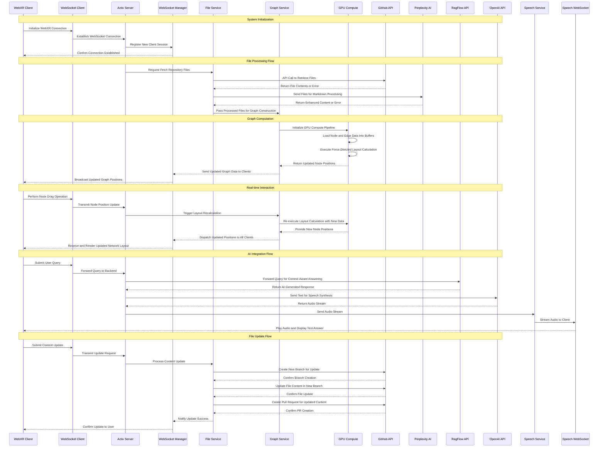

# WebXR Graph Visualization of Logseq Knowledge Graphs with RAGFlow Integration


Inspired by Prof Rob Aspin's work:  
https://github.com/trebornipsa


## Project Overview

This project visualizes a Logseq knowledge graph in 3D using WebXR, enhancing it with Perplexity AI and RAGFlow for AI-powered question answering. Changes are automatically submitted back to the source GitHub repository as pull requests. This allows for a dynamic and interactive exploration of your Logseq knowledge base in an immersive environment, leveraging the power of AI to provide context and insights.

## Key Features

- **WebXR 3D Visualization:** Immersive exploration of the knowledge graph in AR/VR environments with support for:
  - **Node Interaction and Manipulation:** Click, drag, and reposition nodes within the 3D space.
  - **Dynamic Force-Directed Layout:** Real-time recalculation of graph layout based on interactions and data updates.
  - **Custom Shaders for Visual Effects:** Enhancements like holographic displays and lighting effects.
  - **Fisheye Distortion for Focus + Context Visualization:** Provides a focus on specific areas while maintaining context.

- **Real-time Updates:**
  - **WebSocket-Based Communication:** Ensures instant synchronization between the server and client.
  - **Binary Position Updates:** Efficient data transfer for node positions, minimizing latency.
  - **Automatic Graph Layout Recalculation:** Maintains an optimal layout as the graph evolves.
  - **Live Preview of Changes:** Immediate reflection of updates from the knowledge base.

- **GPU Acceleration:**
  - **WebGPU Compute Shaders for Layout Calculation:** Utilizes GPU for high-performance graph computations.
  - **Efficient Force-Directed Algorithms:** Enhances the responsiveness of the graph layout.
  - **Fallback to CPU Computation:** Ensures compatibility with devices lacking WebGPU support.
  - **Custom WGSL Shaders for Visual Effects:** Enables advanced rendering techniques.

- **RAGFlow Integration:**
  - **Context-Aware Question Answering:** Provides intelligent responses based on the knowledge graph.
  - **Dynamic Document Retrieval:** Fetches relevant documents to support AI responses.
  - **Conversation History Management:** Maintains context for ongoing interactions.
  - **Real-Time Response Streaming:** Delivers responses as they are generated by the AI.

- **Perplexity AI Enhancement:**
  - **Markdown Content Analysis:** Parses and understands the structure of markdown files.
  - **Topic Extraction and Linking:** Identifies and connects related topics within the knowledge base.
  - **Automatic Summarization:** Generates concise summaries for long-form content.
  - **Content Relationship Mapping:** Visualizes how different pieces of content interrelate.

- **Spacemouse Support:**
  - **6-DOF Navigation in VR:** Allows for intuitive movement within the 3D environment.
  - **Customizable Control Mapping:** Adapts to various input devices.
  - **Smooth Camera Transitions:** Ensures fluid user experience during navigation.
  - **Integration with WebXR Controls:** Combines hardware input with web-based controls for enhanced interaction.

- **Automatic GitHub PRs:**
  - **Automated Branch Creation:** Manages branches for updates seamlessly.
  - **File Content Updates:** Applies changes directly to relevant files.
  - **Pull Request Generation:** Facilitates the review and merging process.
  - **Metadata Synchronization:** Keeps metadata in sync with file updates.

- **Audio Features:**
  - **OpenAI Text-to-Speech:** Converts text responses into audible speech.
  - **Local Speech Synthesis Fallback:** Ensures functionality without external dependencies.
  - **WebSocket Streaming:** Delivers audio streams efficiently.
  - **Dynamic Provider Switching:** Allows for flexible configuration of audio sources.

## Technical Architecture

### Core System Architecture

```mermaid
graph TB
    subgraph Frontend
        UI[User Interface Layer]
        VR[WebXR Controller]
        WS[WebSocket Client]
        GPU[GPU Compute Layer]
        ThreeJS[Three.js Renderer]
        ChatUI[Chat Interface]
        GraphUI[Graph Interface]
        ControlPanel[Control Panel]
        VRControls[VR Control System]
        WSService[WebSocket Service]
        DataManager[Graph Data Manager]
        LayoutEngine[Layout Engine]
        SpaceMouse[SpaceMouse Controller]
    end

    subgraph Backend
        Server[Actix Web Server]
        FileH[File Handler]
        GraphH[Graph Handler]
        WSH[WebSocket Handler]
        PerplexityH[Perplexity Handler]
        RagFlowH[RagFlow Handler]
        VisualizationH[Visualization Handler]
        FileS[File Service]
        GraphS[Graph Service]
        GPUS[GPU Compute Service]
        PerplexityS[Perplexity Service]
        RagFlowS[RagFlow Service]
        SpeechS[Speech Service]
        WSManager[WebSocket Manager]
        GPUCompute[GPU Compute]
        Compression[Compression Utils]
        AudioProc[Audio Processor]
        Node[Node Model]
        Edge[Edge Model]
        Graph[Graph Model]
        Metadata[Metadata Model]
        Position[Position Update Model]
        SimParams[Simulation Parameters]
    end

    subgraph External
        GitHub[GitHub API]
        Perplexity[Perplexity AI]
        RagFlow[RagFlow API]
        OpenAI[OpenAI API]
    end

    UI --> ChatUI
    UI --> GraphUI
    UI --> ControlPanel
    UI --> VRControls

    VR --> ThreeJS
    WS --> WSService
    WSService --> Server

    Server --> FileH
    Server --> GraphH
    Server --> WSH
    Server --> PerplexityH
    Server --> RagFlowH
    Server --> VisualizationH

    FileH --> FileS
    GraphH --> GraphS
    WSH --> WSManager
    PerplexityH --> PerplexityS
    RagFlowH --> RagFlowS

    FileS --> GitHub
    PerplexityS --> Perplexity
    RagFlowS --> RagFlow
    SpeechS --> OpenAI

    style Frontend fill:#f9f,stroke:#333,stroke-width:2px
    style Backend fill:#bbf,stroke:#333,stroke-width:2px
    style External fill:#bfb,stroke:#333,stroke-width:2px
```



### Class Diagram

```mermaid
classDiagram
class App {
    +websocketService: WebsocketService
    +graphDataManager: GraphDataManager
    +visualization: WebXRVisualization
    +chatManager: ChatManager
    +interface: Interface
    +ragflowService: RAGFlowService
    +start()
    +initializeEventListeners()
    +toggleFullscreen()
}
class WebsocketService {
    +socket: WebSocket
    +listeners: Object
    +reconnectAttempts: number
    +maxReconnectAttempts: number
    +reconnectInterval: number
    +connect()
    +on(event: string, callback: function)
    +emit(event: string, data: any)
    +send(data: object)
    +reconnect()
}
class GraphDataManager {
    +websocketService: WebsocketService
    +graphData: GraphData
    +requestInitialData()
    +updateGraphData(newData: GraphData)
    +getGraphData(): GraphData
    +recalculateLayout()
    +updateForceDirectedParams(name: string, value: any)
}
class WebXRVisualization {
    +graphDataManager: GraphDataManager
    +scene: Scene
    +camera: Camera
    +renderer: Renderer
    +controls: Controls
    +composer: Composer
    +gpu: GPUUtilities
    +nodeMeshes: Map<string, Mesh>
    +edgeMeshes: Map<string, Line>
    +hologramGroup: Group
    +initialize()
    +updateVisualization()
    +initThreeJS()
    +setupGPU()
    +initPostProcessing()
    +addLights()
    +createHologramStructure()
    +handleSpacemouseInput(x: number, y: number, z: number)
    +handleBinaryPositionUpdate(buffer: ArrayBuffer)
    +animate()
    +updateVisualFeatures(control: string, value: any)
    +onWindowResize()
    +handleNodeDrag(nodeId: string, position: Vector3)
    +getNodePositions(): PositionUpdate[]
    +showError(message: string)
}
class ChatManager {
    +websocketService: WebsocketService
    +ragflowService: RAGFlowService
    +sendMessage(message: string)
    +receiveMessage()
    +handleIncomingMessage(message: string)
}
class Interface {
    +chatManager: ChatManager
    +visualization: WebXRVisualization
    +handleUserInput(input: string)
    +displayChatMessage(message: string)
    +setupEventListeners()
    +renderUI()
    +updateNodeInfoPanel(node: object)
    +displayErrorMessage(message: string)
}
class RAGFlowService {
    +settings: Settings
    +apiClient: ApiClient
    +createConversation(userId: string): Promise<string>
    +sendMessage(conversationId: string, message: string): Promise<string>
    +getConversationHistory(conversationId: string): Promise<object>
}
class GraphService {
    +build_graph(app_state: AppState): Result<GraphData, Error>
    +calculate_layout(gpu_compute: GPUCompute, graph: GraphData, params: SimulationParams): Result<void, Error>
    +initialize_random_positions(graph: GraphData)
}
class PerplexityService {
    +process_file(file: ProcessedFile, settings: Settings, api_client: ApiClient): Result<ProcessedFile, Error>
}
class FileService {
    +fetch_and_process_files(github_service: GitHubService, settings: Settings, metadata_map: Map<String, Metadata>): Result<Vec<ProcessedFile>, Error>
    +load_or_create_metadata(): Result<Map<String, Metadata>, Error>
    +save_metadata(metadata: Map<String, Metadata>): Result<void, Error>
    +calculate_node_size(file_size: number): number
    +extract_references(content: string, valid_nodes: String[]): Map<String, ReferenceInfo>
    +convert_references_to_topic_counts(references: Map<String, ReferenceInfo>): Map<String, number>
    +initialize_local_storage(github_service: GitHubService, settings: Settings): Result<void, Error>
    +count_hyperlinks(content: string): number
}
class GitHubService {
    +fetch_file_metadata(): Result<Vec<GithubFileMetadata>, Error>
    +get_download_url(file_name: string): Result<string, Error>
    +fetch_file_content(download_url: string): Result<string, Error>
    +get_file_last_modified(file_path: string): Result<Date, Error>
}
class GitHubPRService {
    +create_pull_request(file_name: string, content: string, original_sha: string): Result<string, Error>
}
class ApiClient {
    +post_json(url: string, body: PerplexityRequest, perplexity_api_key: string): Result<string, Error>
}
class SpeechService {
    +websocketManager: WebSocketManager
    +settings: Settings
    +start(receiver: Receiver<SpeechCommand>)
    +initialize(): Result<void, Error>
    +send_message(message: string): Result<void, Error>
    +close(): Result<void, Error>
    +set_tts_provider(use_openai: boolean): Result<void, Error>
}
class SpeechWs {
    +websocketManager: WebSocketManager
    +settings: Settings
    +hb(ctx: Context)
    +check_heartbeat(ctx: Context)
    +started(ctx: Context)
    +handle(msg: Message, ctx: Context)
}

App --> WebsocketService
App --> GraphDataManager
App --> WebXRVisualization
App --> ChatManager
App --> Interface
App --> RAGFlowService
App --> GraphService
App --> PerplexityService
App --> FileService
App --> GitHubService
App --> GitHubPRService
App --> SpeechService
WebsocketService --> GraphDataManager
GraphDataManager --> WebXRVisualization
ChatManager --> RAGFlowService
Interface --> ChatManager
Interface --> WebXRVisualization
GraphService --> GPUCompute
PerplexityService --> ApiClient
FileService --> GitHubService
GitHubPRService --> GitHubService
SpeechService --> WebSocketManager
```



### Sequence Diagram


### Detailed Data Flow Architecture
```



```mermaid
sequenceDiagram
    participant Client as WebXR Client
    participant WSClient as WebSocket Client
    participant Server as Actix Server
    participant WSManager as WebSocket Manager
    participant FileService as File Service
    participant GraphService as Graph Service
    participant GPUCompute as GPU Compute
    participant GitHub as GitHub API
    participant Perplexity as Perplexity AI
    participant RagFlow as RagFlow API
    participant OpenAI as OpenAI API
    participant SpeechService as Speech Service
    participant SpeechWs as Speech WebSocket

    Note over Client,OpenAI: System Initialization
    Client->>WSClient: Initialize WebXR Connection
    WSClient->>Server: Establish WebSocket Connection
    Server->>WSManager: Register New Client Session
    WSManager-->>Client: Confirm Connection Established

    Note over Client,OpenAI: File Processing Flow
    Server->>FileService: Request Fetch Repository Files
    FileService->>GitHub: API Call to Retrieve Files
    GitHub-->>FileService: Return File Contents or Error
    FileService->>Perplexity: Send Files for Markdown Processing
    Perplexity-->>FileService: Return Enhanced Content or Error
    FileService->>GraphService: Pass Processed Files for Graph Construction

    Note over Client,OpenAI: Graph Computation
    GraphService->>GPUCompute: Initialize GPU Compute Pipeline
    GPUCompute->>GPUCompute: Load Node and Edge Data into Buffers
    GPUCompute->>GPUCompute: Execute Force-Directed Layout Calculation
    GPUCompute-->>GraphService: Return Updated Node Positions
    GraphService-->>WSManager: Send Updated Graph Data to Clients
    WSManager-->>Client: Broadcast Updated Graph Positions

    Note over Client,OpenAI: Real-time Interaction
    Client->>WSClient: Perform Node Drag Operation
    WSClient->>Server: Transmit Node Position Update
    Server->>GraphService: Trigger Layout Recalculation
    GraphService->>GPUCompute: Re-execute Layout Calculation with New Data
    GPUCompute-->>GraphService: Provide New Node Positions
    GraphService-->>WSManager: Dispatch Updated Positions to All Clients
    WSManager-->>Client: Receive and Render Updated Network Layout

    Note over Client,OpenAI: AI Integration Flow
    Client->>WSClient: Submit User Query
    WSClient->>Server: Forward Query to Backend
    Server->>RagFlow: Forward Query for Context-Aware Answering
    RagFlow-->>Server: Return AI-Generated Response
    Server->>OpenAI: Send Text for Speech Synthesis
    OpenAI-->>Server: Return Audio Stream
    Server->>SpeechService: Send Audio Stream
    SpeechService->>SpeechWs: Stream Audio to Client
    SpeechWs-->>Client: Play Audio and Display Text Answer

    Note over Client,OpenAI: File Update Flow
    Client->>WSClient: Submit Content Update
    WSClient->>Server: Transmit Update Request
    Server->>FileService: Process Content Update
    FileService->>GitHub: Create New Branch for Update
    GitHub-->>FileService: Confirm Branch Creation
    FileService->>GitHub: Update File Content in New Branch
    GitHub-->>FileService: Confirm File Update
    FileService->>GitHub: Create Pull Request for Updated Content
    GitHub-->>FileService: Confirm PR Creation
    FileService-->>WSManager: Notify Update Success
    WSManager-->>Client: Confirm Update to User
```

### WebGPU Compute Pipeline

```mermaid
graph TB
    subgraph "Input Buffers"
        NodesData[Node Data Buffer]
        EdgesData[Edge Data Buffer]
        ForcesData[Force Buffer]
        ParamsData[Simulation Parameters Buffer]
    end

    subgraph "Compute Pipeline"
        BindGroupLayout[Bind Group Layout]

        subgraph "Shaders"
            ForceCalculation[Force Calculation Shader]
            PositionUpdate[Position Update Shader]
            FisheyeEffect[Fisheye Distortion Shader]
        end

        DispatchBlock[Dispatch Workgroups]
    end

    subgraph "Output Buffers"
        NewPositions[Updated Position Buffer]
        VisualizationData[Visualization Data Buffer]
    end

    NodesData --> BindGroupLayout
    EdgesData --> BindGroupLayout
    ForcesData --> BindGroupLayout
    ParamsData --> BindGroupLayout

    BindGroupLayout --> ForceCalculation
    ForceCalculation --> PositionUpdate
    PositionUpdate --> FisheyeEffect

    DispatchBlock -->|Workgroup 1| ForceCalculation
    DispatchBlock -->|Workgroup 2| PositionUpdate
    DispatchBlock -->|Workgroup 3| FisheyeEffect

    FisheyeEffect --> NewPositions
    FisheyeEffect --> VisualizationData

    style "Input Buffers" fill:#f9f,stroke:#333,stroke-width:2px
    style "Compute Pipeline" fill:#bbf,stroke:#333,stroke-width:2px
    style "Output Buffers" fill:#bfb,stroke:#333,stroke-width:2px
```

### File Structure

```mermaid

```

- **Logging:** Comprehensive logging of all critical operations.
- **Alerts:** Setup alerts for unusual activities or potential breaches.
- **Incident Response Plan:** Procedures in place to respond to security incidents promptly.

## Contributing

Contributions are welcome! Please follow the guidelines below to contribute effectively.

### How to Contribute

1. **Fork the Repository:**
    Click the "Fork" button at the top-right corner of the repository page.

2. **Clone Your Fork:**
    ```bash
    git clone https://github.com/yourusername/webxr-graph.git
    cd webxr-graph
    ```

3. **Create a Feature Branch:**
    ```bash
    git checkout -b feature/YourFeatureName
    ```

4. **Commit Your Changes:**
    ```bash
    git add .
    git commit -m "Add detailed README sections and diagrams"
    ```

5. **Push to Your Fork:**
    ```bash
    git push origin feature/YourFeatureName
    ```

6. **Open a Pull Request:**
    Navigate to your fork on GitHub and click "Compare & pull request".

### Development Guidelines

- **Follow Best Practices:**
  - Adhere to Rust and JavaScript coding standards.
  - Write clean, readable, and maintainable code.
  - Ensure consistent code formatting using tools like `rustfmt` and `eslint`.

- **Maintain Test Coverage:**
  - Write unit and integration tests for new features.
  - Ensure existing tests pass before submitting changes.

- **Document New Features:**
  - Update relevant sections in the README.md.
  - Add or update API documentation as needed.

- **Update API Documentation:**
  - Ensure all new endpoints and functionalities are well-documented.
  - Use tools like Swagger for API documentation if applicable.

### Testing

Ensure all tests pass before submitting a pull request.

```bash
# Run Rust tests
cargo test

# Run JavaScript tests
npm test

# Run End-to-End Tests
npm run test:e2e
```

- **Continuous Integration:**
  - Automated tests run on every pull request.
  - Ensure no breaking changes are introduced.

- **Code Reviews:**
  - All pull requests should be reviewed by at least one maintainer.
  - Address all review comments before merging.

### Issue Reporting

If you encounter any bugs or have feature requests, please open an issue in the repository with detailed information.

## Additional Resources

- **Documentation:**
  - Comprehensive documentation is available in the `docs/` directory.
  - API references and usage guides are provided.

- **Support:**
  - Join the project's Slack channel for real-time support.
  - Reach out via GitHub Issues for any assistance.

- **Updates:**
  - Follow the repository to stay updated with the latest changes and releases.

## Acknowledgements

- **Prof Rob Aspin:** For inspiring the project's vision and providing valuable resources.
- **OpenAI:** For their advanced AI models powering the question-answering features.
- **Perplexity AI and RAGFlow:** For their AI services enhancing content processing and interaction.
- **Three.js:** For the robust 3D rendering capabilities utilized in the frontend.
- **Actix:** For the high-performance web framework powering the backend server.

## License

This project is licensed under the MIT License. See the [LICENSE](LICENSE) file for details.
