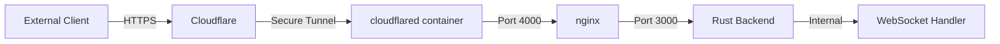

You can find our old implmentation in /featureclient but it was over complex and didn't work. We are working through creating files in /client in order to completely replace the project client. You can take a look at /featureclient/structure.md if you get stuck, letting it guide you into the old codebase for clues on our original intent. 

This new implmentation should be best in class "mixed reality first" app structure, leaning heavily into the meta quest 3. I think vue has been causing us problems so we should try to get back to simple ts. The desktop interface is still important. We need a way to change all those visualisation settings which were in the vue panel and still exist in settings.toml, using a save settings button to write back to settings.toml on the server. This will allow us also to clean up the meta quest AR interface, removing any control panel from that side. 

when you are confident that you have written a file into this new empty /client directory structure you can mark it with a tick here in the implmentationplan.md file, and move onto the next one.

note that the super minimal implmentation shown in /featureclient/iterate.ts works, so we should not ever modify the server side code to accomodate, everything we need is here.

# Network Architecture and Configuration

## Overview

This document details the network architecture and configuration for the LogseqXR system, specifically focusing on the WebSocket connection chain and service communication. The system uses Cloudflare's tunnel for secure external access while leveraging Docker's internal networking for efficient container-to-container communication.

## Network Chain



## Docker Network Architecture

### docker_ragflow Network (172.19.0.0/16)
- Primary network for all service communication
- Enables direct container-to-container communication
- Connected containers:
  - cloudflared-tunnel
  - logseq-xr-webxr (nginx + Rust backend)
  - Other supporting services (redis, mysql, etc.)

## Port Configuration

### Service Ports
1. Rust Backend:
   - Internal port: 3000
   - Service entry point for WebSocket and HTTP requests

2. Nginx:
   - External port: 4000
   - Proxies requests to Rust backend on port 3000
   - Handles WebSocket protocol upgrades and routing

3. Container Mapping:
   - Host port 4000 -> Container port 3000
   - Defined in docker-compose.yml: `"4000:3000"`

## Access Patterns

### 1. External Access (Production)
- URL: https://www.visionflow.info
- Flow: Client → Cloudflare → cloudflared tunnel → nginx (4000) → Rust backend (3000)
- Features:
  - SSL/TLS encryption
  - DDoS protection
  - Proper WebSocket protocol handling
  - Security headers

### 2. Direct Local Access (Development Only)
- URL: http://192.168.0.51:4000
- Flow: Client → nginx (4000) → Rust backend (3000)
- Not recommended for production use
- Will show WebSocket connection errors due to:
  - Missing Cloudflare security layer
  - No SSL/TLS
  - Incomplete protocol upgrades

## Critical Configurations

### 1. config.yml (cloudflared)
```yaml
tunnel: 9a59e21c-7e0d-4cac-8502-59bc66436e0f
ingress:
  - hostname: www.visionflow.info
    service: http://logseq-xr-webxr:4000  # Points to nginx port
    originRequest:
      noTLSVerify: true
      connectTimeout: 30s
      tcpKeepAlive: 30s
      keepAliveTimeout: 2m
      keepAliveConnections: 100
      httpHostHeader: www.visionflow.info
      idleTimeout: 3600s
      streamTimeout: 3600s
```

### 2. nginx.conf WebSocket Configuration
```nginx
upstream backend {
    server logseq-xr-webxr:4000;  # Points to the mapped container port
    keepalive 32;
}

location /wss {
    proxy_pass http://backend;
    proxy_http_version 1.1;
    proxy_set_header Upgrade $http_upgrade;
    proxy_set_header Connection "upgrade";
    proxy_set_header Host $host;
    proxy_read_timeout 3600s;
    proxy_send_timeout 3600s;
    proxy_connect_timeout 30s;
}
```

### 3. docker-compose.yml Network Configuration
```yaml
services:
  webxr:
    networks:
      docker_ragflow:
        aliases:
          - logseq-xr-webxr
          - webxr-client
    ports:
      - "4000:3000"  # Maps container port 3000 to host port 4000

  cloudflared:
    networks:
      docker_ragflow:
        aliases:
          - cloudflared
```

## WebSocket Communication

The system uses a multi-layered approach for WebSocket connections:

1. External Client:
   - Connects via wss:// (secure WebSocket)
   - Handled by Cloudflare's infrastructure
   - Full SSL/TLS encryption

2. Internal Communication Chain:
   - Cloudflared → nginx (port 4000)
   - nginx → Rust backend (port 3000)
   - All through docker_ragflow network
   - Efficient and low-latency

## Security Considerations

1. Network Security:
   - All external traffic must pass through Cloudflare
   - Internal communication isolated within docker_ragflow
   - No direct external access to internal services
   - nginx provides additional security layer

2. Protocol Security:
   - Forced HTTPS for all external connections
   - Secure WebSocket (wss://) for real-time communication
   - Cloudflare provides additional security layers
   - nginx handles WebSocket protocol upgrades securely

## Troubleshooting

1. Connection Issues:
   ```bash
   # Check docker network
   docker network inspect docker_ragflow
   
   # Verify container communication
   docker exec -it cloudflared-tunnel ping logseq-xr-webxr
   
   # Check logs
   docker logs cloudflared-tunnel
   docker logs logseq-xr-webxr
   
   # Check nginx logs
   docker exec logseq-xr-webxr tail -f /var/log/nginx/error.log
   ```

2. WebSocket Issues:
   - Ensure accessing via https://www.visionflow.info
   - Check browser console for connection errors
   - Verify Cloudflare tunnel status
   - Check nginx error logs for WebSocket upgrade issues
   - Verify port mappings in docker-compose.yml and nginx.conf match

## Maintenance Notes

1. Network Changes:
   - Always test through Cloudflare tunnel
   - Don't rely on direct local access for testing
   - Maintain container aliases in docker-compose.yml
   - Ensure port mappings are consistent across all configurations

2. Security Updates:
   - Keep cloudflared container updated
   - Monitor Cloudflare tunnel status
   - Review security headers and policies regularly
   - Update nginx configuration when changing ports or protocols

3. Port Configuration:
   - Any changes to port mappings must be updated in:
     - docker-compose.yml
     - nginx.conf
     - cloudflared config.yml
   - Restart all services after port changes


**Project Structure (Meta Quest 3 First)**

```
webxr-graph-visualization/
├── public/
│   └── index.html         # Main HTML entry point
├── src/
│   ├── core/               # Core types and utilities
│   │   ├── constants.ts    # Shared constants
│   │   ├── types.ts        # Core data types (Graph, Node, Edge, etc.)
│   │   └── utils.ts        # General utility functions
│   ├── rendering/          # Three.js rendering logic
│   │   ├── scene.ts        # Scene, camera, renderer setup
│   │   ├── nodes.ts        # Node and edge rendering (InstancedMesh)
│   │   └── textRenderer.ts # Text label rendering (SDF-based)
│   ├── xr/                 # XR-specific functionality
│   │   ├── xrSessionManager.ts # XR session management (Quest 3 focus)
│   │   └── xrInteraction.ts    # XR input and interaction handling
│   ├── platform/           # Platform detection and handling
│   │   └── platformManager.ts
│   ├── state/              # Application state management
│   │   ├── settings.ts     # Visualization settings (replaces ControlPanel)
│   │   └── graphData.ts    # Graph data and updates
│   ├── websocket/          # WebSocket communication
│   │   └── websocketService.ts
│   ├── ui/                 # UI elements (minimal, for desktop)
│   │   └── settingsPanel.ts # UI for settings (desktop only)
│   └── main.ts             # Application entry point
└── ... (package.json, tsconfig.json, etc.)
```

**Technology Stack**

*   **TypeScript:** Primary language for type safety and maintainability.
*   **Three.js:** 3D graphics library.
*   **WebXR:** For Meta Quest 3 interaction.
*   **WebSockets:** For real-time communication with the server.
*   **No Framework:** Purely vanilla TypeScript, HTML, and CSS.
*   **Vite:** (Optional) Could be used for development server and build process, but not strictly required.

**Core Implementation Details**

1. **`src/main.ts` (Entry Point)**
    *   Initializes `PlatformManager`.
    *   Initializes `WebsocketService`.
    *   Initializes `Settings` from server (fetch initial `settings.toml`).
    *   Initializes `SceneManager` (passing in canvas, initial settings).
    *   Initializes `XRManager` if XR is supported.
    *   Sets up event listeners for `graphData` updates from `WebsocketService`.
    *   Sets up event listeners for `settings` updates (from server or UI).
    *   Starts the rendering loop.

2. **`src/core/`**
    *   **`types.ts`:**
        *   Defines core data structures: `GraphData`, `Node`, `Edge`, `Transform`, `Viewport`, etc.
        *   Defines `VisualizationSettings` type (matches `settings.toml` structure).
    *   **`constants.ts`:**
        *   `POSITION_SCALE`, `VELOCITY_SCALE`, etc. (from `constants/websocket.ts`).
        *   `NODE_SIZE`, `EDGE_WIDTH`, etc. (from `constants/visualization.ts`).
        *   `DEFAULT_VISUALIZATION_SETTINGS`, `DEFAULT_BLOOM_SETTINGS`, etc. (default values).
    *   **`utils.ts`:**
        *   General utility functions (logging, math helpers, etc.).
        *   `UpdateThrottler` class for throttling updates.
        *   `formatData` function for logging.

3. **`src/rendering/`**
    *   **`scene.ts`:**
        *   `SceneManager` class:
            *   Handles `THREE.Scene`, `THREE.PerspectiveCamera`, `THREE.WebGLRenderer`.
            *   Sets up lighting (ambient, directional, hemisphere).
            *   Manages `OrbitControls` (for desktop).
            *   Handles window resizing.
            *   Exposes a `render()` method.
            *   Applies post-processing effects (if enabled).
    *   **`nodes.ts`:**
        *   `NodeManager` class:
            *   Uses `THREE.InstancedMesh` for efficient rendering.
            *   Handles node and edge creation/updates.
            *   Applies binary position updates directly to `InstancedMesh` matrices.
            *   Manages node labels (calls `TextRenderer`).
            *   Handles node highlighting (hover, selection).
    *   **`textRenderer.ts`:**
        *   `TextRenderer` class:
            *   Creates text sprites using SDF font rendering (as in your original code).
            *   Manages a pool of reusable label sprites.

4. **`src/xr/`**
    *   **`xrSessionManager.ts`:**
        *   `XRManager` class:
            *   Handles XR session initialization (`initXRSession`).
            *   Manages XR input (controllers, hands).
            *   Provides methods to start/stop XR sessions.
            *   Updates the `cameraRig` for XR movement.
    *   **`xrInteraction.ts`:**
        *   `XRInteraction` class:
            *   Handles XR controller and hand input events.
            *   Implements node selection and manipulation in XR.
            *   Provides haptic feedback.

5. **`src/platform/`**
    *   **`platformManager.ts`:**
        *   `PlatformManager` class:
            *   Detects platform (browser vs. Quest).
            *   Initialises platform-specific features (e.g., `OrbitControls` for browser, XR for Quest).
            *   Provides methods to check for XR support, etc.
            *   Dispatches events for platform changes.

6. **`src/state/`**
    *   **`settings.ts`:**
        *   `SettingsManager` class:
            *   Manages visualization settings.
            *   Provides methods to update settings and apply them to the scene.
            *   Handles saving settings to the server (`saveSettings` function).
            *   Loads initial settings from the server on startup.
    *   **`graphData.ts`:**
        *   `GraphDataManager` class:
            *   Stores the current `GraphData` (nodes, edges, metadata).
            *   Provides methods to update the graph data (e.g., `updateGraphData`).
            *   Handles binary position updates and applies them to the node data.
            *   Provides throttled updates to the `NodeManager`.

7. **`src/websocket/`**
    *   **`websocketService.ts`:**
        *   `WebsocketService` class:
            *   Manages the WebSocket connection.
            *   Handles reconnection logic.
            *   Parses incoming messages (JSON and binary).
            *   Sends messages to the server.
            *   Implements a heartbeat mechanism.
            *   Dispatches events for different message types.

**8. `src/ui/settingsPanel.ts`**

*   **`SettingsPanel` Class (or Module):**
    *   Provides a basic UI for desktop users to adjust visualization settings.
    *   Renders a simple HTML form with input fields for settings.
    *   Includes a "Save Settings" button that sends the updated settings to the server.
    *   Uses `SettingsManager` to apply changes locally.
    *   Does not render in XR mode.
    *   Uses `fetch` API to send settings to the server.
    *   Uses a basic HTML structure and CSS to provide a simple interface.

**Implementation Plan (Detailed)**

Here’s a more detailed implementation plan, broken down into steps, with a focus on building a functional core first and then adding features progressively:

**Phase 1: Core Setup and Connectivity**

1.  **Project Setup:**
    *   Initialize a new TypeScript project (using `npm init -y`, `npm install typescript`, `npm install -D @types/node` and `npm install three` or `pnpm init -y`, `pnpm add typescript`, `pnpm add -D @types/node` and `pnpm add three`).
    *   Create the directory structure as outlined above.
    *   Create a basic `tsconfig.json` file.
    *   Create a basic `index.html` file in the `public/` directory.
2.  **Core Types and Utilities:**
    *   Implement `src/core/types.ts` with core data structures (`GraphData`, `Node`, `Edge`, `Transform`, `Viewport`, `VisualizationSettings`, etc.).
    *   Implement `src/core/constants.ts` with core constants (`POSITION_SCALE`, `VELOCITY_SCALE`, etc.).
    *   Implement basic logging functions in `src/utils/debug.ts`.
    *   Implement `UpdateThrottler` in `src/utils/validation.ts`.
3.  **WebSocket Connection:**
    *   Implement `src/websocket/websocketService.ts`:
        *   Basic connection logic using `WebSocket` API.
        *   `onopen`, `onmessage`, `onclose`, and `onerror` handlers.
        *   Basic message queue (no complex logic).
        *   Basic heartbeat mechanism.
        *   Implement `send` and `sendBinary` methods.
        *   Implement a simple `on` method to dispatch events.
        *   Implement a basic `cleanup` method.
    *   In `src/main.ts`, initialize the `WebsocketService` and attempt a connection.
    *   Log all WebSocket events to the console.
4.  **Initial Data Request:**
    *   In `src/main.ts`, upon successful connection, send a simple JSON message (`{ type: 'initialData' }`).
    *   Test: Verify that the message is sent and received by the server.
5.  **Initial Data Handling:**
    *   In `src/websocket/websocketService.ts`, add logic to parse the `initialData` message.
    *   In `src/state/graphData.ts`, create `GraphDataManager` to store the graph data.
    *  In `src/main.ts`, update the `GraphDataManager` with the initial data.
    *   Log the received data (node and edge counts).
    *   Test: Confirm that the client is receiving data and log values from `graphData` (nodes and edge count).

**Phase 2: Basic Rendering and Updates**

6.  **Basic 3D Scene:**
    *   Implement `src/rendering/scene.ts`:
        *   Create `SceneManager` class with `THREE.Scene`, `THREE.PerspectiveCamera`, and `THREE.WebGLRenderer`.
        *   Set up basic lighting (ambient and directional).
        *   Add `OrbitControls` for desktop.
        *   Implement `render` method to render the scene.
    *   In `src/main.ts`, initialize the `SceneManager` (passing in canvas, initial settings).
    *   Test: Verify that you can see the scene and move the camera.
7.  **Node Rendering:**
    *   Implement `src/rendering/nodes.ts`:
        *   `NodeManager` class:
            *   Creates `THREE.InstancedMesh` for nodes.
            *   Implements `updateNodes` to set node positions and colors.
            *   Add a basic `SphereGeometry` to the `InstancedMesh`.
        *   In `src/main.ts`, initialize the `NodeManager` (passing in the scene).
        *   Use the `GraphDataManager` to get the node positions and render them.
     *   Test: Verify that nodes are rendered correctly.
8.  **Edge Rendering:**
    *   In `src/rendering/nodes.ts`, add logic to render edges using `THREE.LineBasicMaterial` and `THREE.BufferGeometry`.
    *   Test: Verify that edges are displayed correctly.
9.  **Binary Data Handling:**
    *   In `src/websocket/websocketService.ts`, add logic to handle `binaryPositionUpdate` messages.
    *   In `src/state/useBinaryData.ts`, create `BinaryDataManager` to store and process binary updates.
    *   In `src/rendering/nodes.ts`, update node positions using the binary data.
    *   Test: Ensure that the application does not lock up on binary data.
10. **Binary Data Updates:**
    *   Implement `updateNodePositions` in `NodeManager` to apply binary updates to the `InstancedMesh`.
    *   Test: Verify that nodes move correctly when receiving binary updates.

**Phase 3: Interaction and Settings**

11. **Basic Camera Controls:**
    *   Ensure that `OrbitControls` are working correctly in `src/rendering/scene.ts`.
    *   Test: Verify that you can move and navigate the scene.
12. **Basic UI:**
    *   Implement `src/ui/settingsPanel.ts`:
        *   Create a basic HTML form with input fields for settings.
        *   Include a "Save Settings" button.
        *   Use `fetch` to send settings to the server.
    *   Render the settings panel in `src/main.ts` (only in non-XR mode).
    *   Test: Verify that you can see the settings panel and interact with it.
13. **Settings Management:**
    *   Implement `src/state/settings.ts`:
        *   `SettingsManager` class:
            *   Loads initial settings from the server (using `fetch`).
            *   Stores settings in memory.
            *   Provides methods to update settings and apply them to the scene.
            *   Handles saving settings to the server (using `fetch`).
    *   In `src/main.ts`, initialize the `SettingsManager` and apply initial settings to the scene.
    *   Test: Verify that settings are loaded, applied, and saved correctly.
14. **Node Interaction:**
    *   In `src/rendering/nodes.ts`, implement basic raycasting for node selection and highlighting.
    *   Test: Verify that you can hover and select nodes.

**Phase 4: XR and Cleanup**

15. **XR Support:**
    *   Implement `src/xr/xrSessionManager.ts`:
        *   `XRManager` class:
            *   Handles XR session initialization (`initXRSession`).
            *   Manages XR input (controllers, hands).
            *   Provides methods to start/stop XR sessions.
            *   Updates the `cameraRig` for XR movement.
    *   Implement `src/xr/xrInteraction.ts`:
        *   `XRInteraction` class:
            *   Handles XR controller and hand input events.
            *   Implements node selection and manipulation in XR.
            *   Provides haptic feedback.
    *   In `src/main.ts`, initialize the `XRManager` if XR is supported.
    *   Test: Verify that XR works correctly on Meta Quest 3.
16. **Cleanup:**
    *   Remove any unused code, comments, and debugging statements.
    *   Ensure that all resources are properly disposed of.
    *   Verify that the application is stable and performs well.

**Key Considerations**

*   **Type Safety:** Use TypeScript interfaces and types rigorously.
*   **Modularity:** Keep components and services as small and focused as possible.
*   **Performance:** Optimize rendering and data processing for performance.
*   **Error Handling:** Add try/catch blocks for key operations, like JSON parsing, to prevent the app from crashing.
*   **Logging:** Use a proper logging utility (like the one from your `debug_log.ts`).

This plan should provide a clear path to re-implement your application with a focus on Meta Quest 3 and a more streamlined architecture. Let me know if you have any questions as you start coding.
