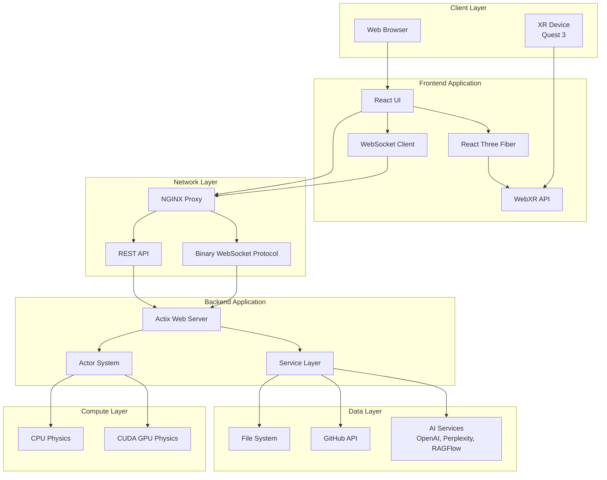

# System Architecture Overview

## Introduction

LogseqSpringThing is a distributed 3D knowledge graph visualization system built with a decoupled architecture. It combines a high-performance Rust backend with a React/TypeScript frontend to deliver real-time, interactive graph visualizations with XR capabilities.

## Architecture Principles

### 1. Decoupled Architecture
- **Backend Independence**: The server maintains and processes graph data independently of client connections
- **Pre-computed State**: Graph physics and layout are calculated server-side before clients connect
- **Scalable Design**: Multiple clients can connect without duplicating computation

### 2. Actor-Based Concurrency
- **Message-Passing**: Uses Actix actors for safe concurrent state management
- **Isolation**: Each actor manages its own state domain
- **Async Communication**: Non-blocking message passing between components

### 3. Real-time Synchronization
- **WebSocket Protocol**: Binary protocol for efficient position updates
- **Bidirectional Updates**: Clients can modify graph state with server-side authority
- **Optimized Streaming**: Only significant changes are transmitted

### 4. Performance Optimization
- **GPU Acceleration**: Optional CUDA support for physics calculations
- **Instanced Rendering**: Efficient rendering of thousands of nodes
- **Progressive Loading**: Metadata loads immediately while data fetches in background

## High-Level System Architecture



## Core Components

### Frontend Components
- **React Application**: Component-based UI with TypeScript
- **React Three Fiber**: Declarative 3D scene management
- **WebXR Integration**: VR/AR support for Quest 3 and other devices
- **State Management**: Zustand for application state
- **WebSocket Service**: Real-time communication with backend

### Backend Components
- **Actix Web Server**: High-performance async HTTP/WebSocket server
- **Actor System**: Concurrent state management with message passing
- **Service Layer**: Business logic and external integrations
- **GPU Compute**: Optional CUDA acceleration for physics
- **File Service**: Local and GitHub content management

### Data Flow
1. **Initialization**: Server loads metadata and builds initial graph
2. **Client Connection**: WebSocket handshake and initial state transfer
3. **Real-time Updates**: Continuous position streaming via binary protocol
4. **User Interactions**: Client updates sent to server and broadcast
5. **Persistence**: Metadata and settings saved to disk

## Technology Stack

### Frontend
- **Language**: TypeScript 5.5+
- **Framework**: React 18 with Concurrent Features
- **3D Rendering**: Three.js + React Three Fiber
- **XR Support**: WebXR API
- **State**: Zustand
- **Styling**: Tailwind CSS
- **Build Tool**: Vite

### Backend
- **Language**: Rust (2021 Edition)
- **Framework**: Actix Web 4
- **Concurrency**: Actix Actor System
- **GPU**: CUDA (optional)
- **Serialization**: Serde + Binary Protocol
- **Async Runtime**: Tokio

### Infrastructure
- **Containerization**: Docker + Docker Compose
- **Reverse Proxy**: NGINX
- **Development**: Hot reload with cargo-watch

## Key Design Decisions

### 1. Actor-Based State Management
Instead of traditional shared memory with locks, the system uses actors for:
- **Safety**: No data races or deadlocks
- **Scalability**: Natural parallelism
- **Clarity**: Clear ownership and message flow

### 2. Binary WebSocket Protocol
Custom binary protocol for position updates provides:
- **Efficiency**: ~10x smaller than JSON
- **Performance**: Minimal parsing overhead
- **Flexibility**: Extensible message types

### 3. Hybrid Physics Processing
Supports both CPU and GPU physics:
- **Fallback**: CPU physics always available
- **Acceleration**: GPU for large graphs
- **Flexibility**: Runtime switching

### 4. Progressive Enhancement
System works at multiple capability levels:
- **Basic**: 2D visualization fallback
- **Standard**: Full 3D with interactions
- **Enhanced**: XR support with hand tracking

## System Boundaries

### External Dependencies
- **GitHub API**: For repository content
- **OpenAI API**: Speech and chat services
- **Perplexity API**: Advanced search
- **RAGFlow**: Document analysis
- **Nostr Network**: Decentralized authentication

### Security Boundaries
- **Authentication**: Nostr-based decentralized auth
- **API Keys**: Protected settings with user isolation
- **Network**: HTTPS/WSS in production
- **CORS**: Configured for client access

## Deployment Architecture

### Development
```
┌─────────────┐     ┌─────────────┐     ┌─────────────┐
│   Browser   │────▶│    NGINX    │────▶│  Rust Dev   │
│  localhost  │     │   :80/:443  │     │    :8080    │
└─────────────┘     └─────────────┘     └─────────────┘
                            │                    │
                            ▼                    ▼
                    ┌─────────────┐     ┌─────────────┐
                    │  Vite Dev   │     │    Data     │
                    │    :5173    │     │   Volume    │
                    └─────────────┘     └─────────────┘
```

### Production
```
┌─────────────┐     ┌─────────────┐     ┌─────────────┐
│   Internet  │────▶│  CloudFlare │────▶│    NGINX    │
│   HTTPS     │     │     CDN     │     │  Container  │
└─────────────┘     └─────────────┘     └─────────────┘
                                                │
                                                ▼
                                        ┌─────────────┐
                                        │ Rust Server │
                                        │  Container  │
                                        └─────────────┘
```

## Performance Characteristics

### Scalability Metrics
- **Concurrent Clients**: 100+ simultaneous connections
- **Graph Size**: 10,000+ nodes with GPU acceleration
- **Update Rate**: 60 FPS position streaming
- **Latency**: <16ms for local updates

### Resource Usage
- **Memory**: ~500MB base + 100KB per node
- **CPU**: 1-2 cores for physics simulation
- **GPU**: Optional, 50-100x speedup for large graphs
- **Network**: 10-50 KB/s per active client

## Next Steps

For detailed component documentation, see:
- [Component Architecture](./component-architecture.md)
- [Data Flow Diagrams](./data-flow.md)
- [Actor System Design](./actor-system.md)
- [WebSocket Protocol](./websocket-protocol.md)
- [XR Architecture](./xr-architecture.md)