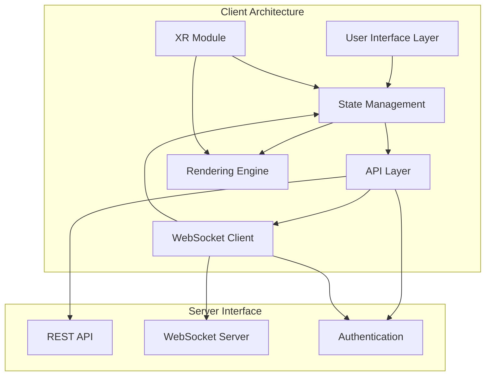
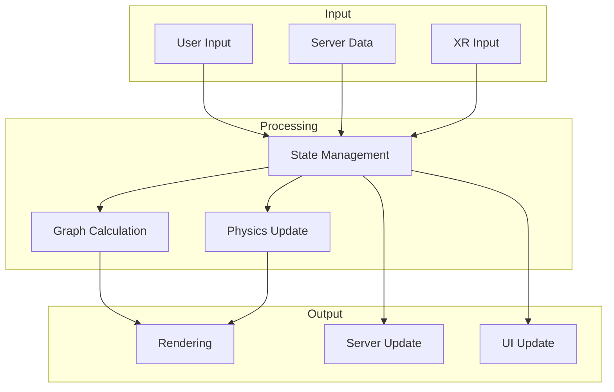
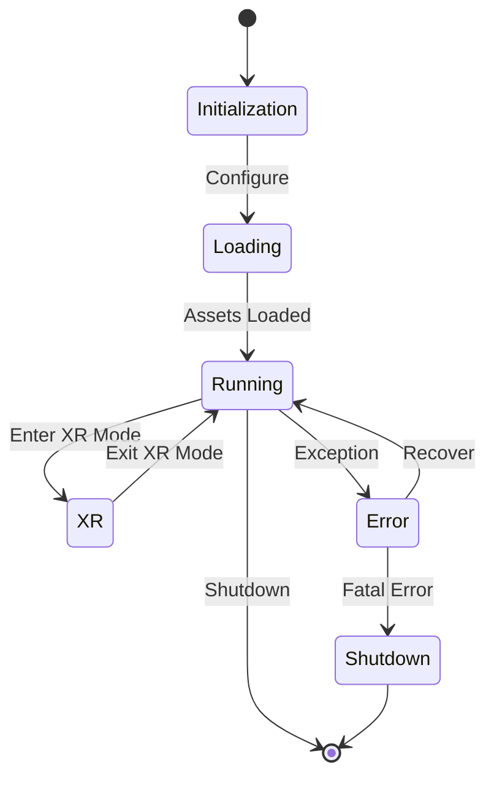

# Client Architecture Overview

This document provides a high-level overview of the LogseqSpringThing client architecture, its major components, and their interactions.

## System Architecture

The client is built as a modern TypeScript application that follows a component-based architecture. It integrates with Three.js for 3D rendering, WebXR for VR/AR capabilities, and communicates with the Rust backend server through REST APIs and WebSocket connections.

## Key Components

### User Interface Layer
The UI layer consists of modular components for controlling the application, configuring settings, and interacting with the 3D visualization. It includes the Modular Control Panel, settings interfaces, and visualization controls.

### State Management
State management is handled through a combination of state stores, event emitters, and observers. The primary state components include:
- `SettingsStore` - Manages application settings with validation
- `GraphData` - Manages the graph data structure
- Various observers for state changes

### API Layer
The API layer handles communication with the server through REST endpoints, providing abstracted access to server functionality:
- Authentication and authorization
- Graph data retrieval and updates
- File and settings management

### Rendering Engine
The rendering engine is built on Three.js and provides high-performance visualization of graph data:
- Node and edge rendering with instancing for performance
- Text rendering with SDF fonts
- Metadata visualization
- Camera controls and scene management

### WebSocket Client
The WebSocket client provides real-time communication with the server for:
- Live position updates using binary protocol
- Graph data synchronization
- Event notifications

### XR Module
The XR module integrates WebXR capabilities for VR/AR experiences:
- Hand tracking and interaction
- XR session management
- Spatial UI elements
- XR-specific rendering optimizations

## High-Level Data Flow

## Core Technology Stack

- **TypeScript** - Primary development language
- **Three.js** - 3D rendering engine
- **WebGL** - Hardware-accelerated graphics
- **WebXR** - VR/AR integration
- **WebSockets** - Real-time communication
- **Custom Shaders** - GLSL shaders for specialized rendering effects

## Key Architectural Patterns

1. **Singleton Pattern** - Used for manager classes to ensure single instance
2. **Observer Pattern** - Used for state change notifications
3. **Facade Pattern** - Used to simplify complex subsystems (e.g., NodeManagerFacade)
4. **Factory Pattern** - Used for creating complex objects
5. **Composition** - Used to build complex behaviors from simpler components

## Cross-Cutting Concerns

- **Logging** - Centralized logging system with multiple levels
- **Error Handling** - Comprehensive error capture and recovery
- **Performance Monitoring** - Resource and performance monitoring
- **Caching** - Strategic caching of data and assets

## Application Lifecycle

## Communication with Server

The client communicates with the server through two primary channels:

1. **REST API** - For configuration, authentication, and data operations
2. **WebSocket** - For real-time updates and streaming data

This dual-channel approach allows for efficient communication patterns based on the nature of the data being exchanged.

## Related Documentation

- [Components](components.md) - Detailed component relationships
- [State Management](state.md) - State management approach
- [WebSocket Communication](websocket.md) - WebSocket protocol details
- [XR Integration](xr.md) - WebXR implementation details