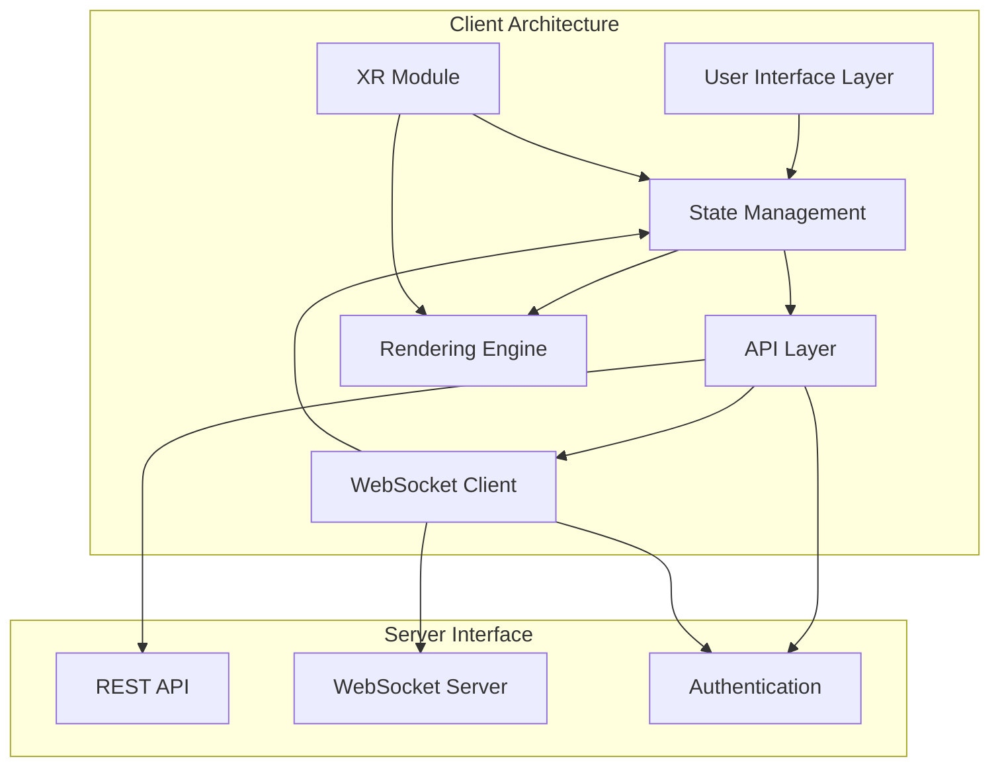
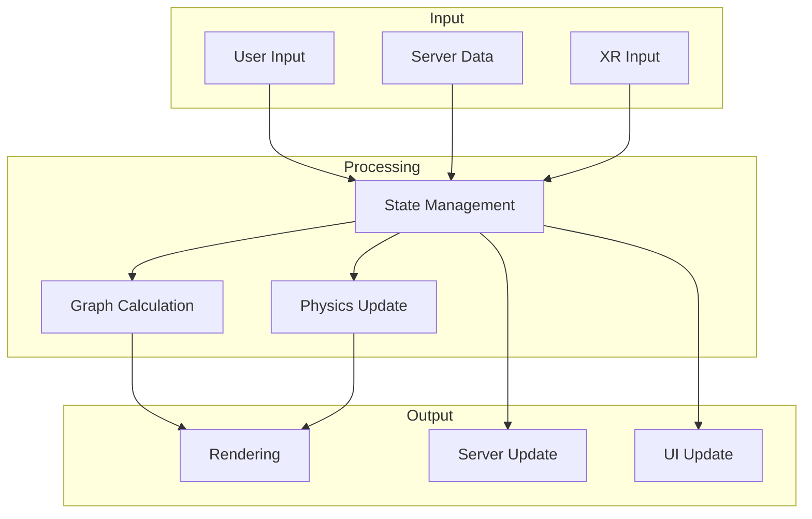
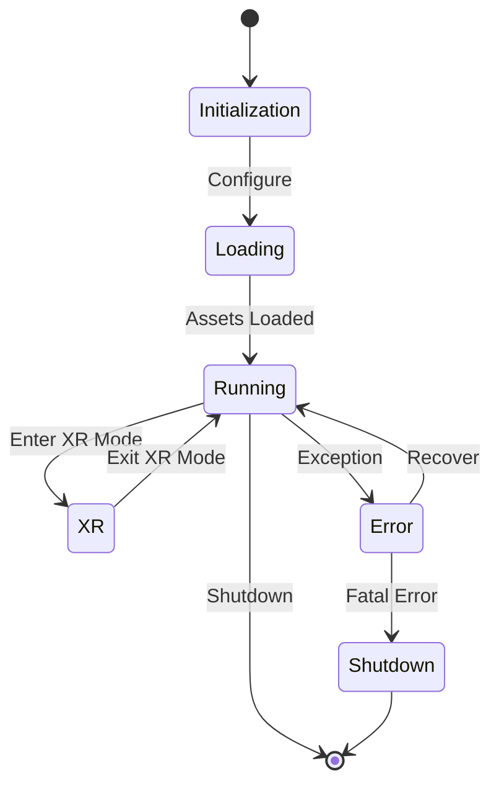

# Client Architecture Overview

This document provides a high-level overview of the LogseqSpringThing client architecture, its major components, and their interactions.

## System Architecture

The client is built as a modern TypeScript application that follows a component-based architecture. It integrates with Three.js for 3D rendering, WebXR for VR/AR capabilities, and communicates with the Rust backend server through REST APIs and WebSocket connections.

## Key Components

### User Interface Layer
The UI layer consists of modular components for controlling the application, configuring settings, and interacting with the 3D visualisation. It includes the Modular Control Panel, settings interfaces, and visualisation controls.

### State Management
State management is handled through a combination of state stores, event emitters, and observers. The primary state components include:
- `SettingsStore` - Manages application settings with validation
- `GraphDataManager` - Manages the graph data structure and its updates (`client/src/features/graph/managers/graphDataManager.ts`).
- State changes are primarily managed by Zustand's subscription mechanism, which allows components to react to specific parts of the store.

### API Layer
The API layer handles communication with the server through REST endpoints, providing abstracted access to server functionality:
- Authentication and authorization
- Graph data retrieval and updates
- File and settings management

### Rendering Engine
The rendering engine is built on React Three Fiber (`@react-three/fiber`) and Three.js, providing high-performance visualisation of graph data. Key components include `GraphCanvas.tsx`, `GraphManager.tsx`, and `GraphViewport.tsx`.
- Node and edge rendering, often utilizing instancing for performance.
- Text rendering with SDF fonts (`TextRenderer.tsx`).
- Metadata visualisation (`MetadataVisualizer.tsx`).
- Camera controls and scene management (`CameraController.tsx`, `sceneManager.ts`).

### WebSocket Client
The WebSocket client provides real-time communication with the server for:
- Live position updates using binary protocol
- Graph data synchronization
- Event notifications

### XR Module
The XR module integrates WebXR capabilities for VR/AR experiences:
- Hand tracking and interaction
- XR session management
- Spatial UI elements
- XR-specific rendering optimizations

## High-Level Data Flow

## Core Technology Stack

- **TypeScript** - Primary development language
- **TypeScript** - Primary development language
- **React Three Fiber (`@react-three/fiber`)** - React renderer for Three.js
- **Three.js** - Core 3D rendering engine
- **WebGL** - Hardware-accelerated graphics
- **WebXR** - VR/AR integration
- **Zustand** - Lightweight state management
- **WebSockets** - Real-time communication
- **Custom Shaders** - GLSL shaders for specialized rendering effects (e.g., `HologramMaterial.tsx`)

## Key Architectural Patterns

1. **Component-Based Architecture** - Leveraging React's component model for modular and reusable UI elements.
2. **State Management with Zustand** - Centralized and reactive state management for application settings and graph data.
3. **Composition over Inheritance** - Building complex behaviors by combining simpler components and hooks.
4. **Service Layer** - Abstracting API calls and WebSocket communication into dedicated service modules (`api.ts`, `WebSocketService.ts`).
5. **Context API** - Used for dependency injection and sharing global state (e.g., `ApplicationModeContext.tsx`, `WindowSizeContext.tsx`).

## Cross-Cutting Concerns

- **Logging** - Centralized logging system with multiple levels
- **Error Handling** - Comprehensive error capture and recovery
- **Performance Monitoring** - Resource and performance monitoring
- **Caching** - Strategic caching of data and assets

## Application Lifecycle

## Communication with Server

The client communicates with the server through two primary channels:

1. **REST API** - For configuration, authentication, and data operations
2. **WebSocket** - For real-time updates and streaming data

This dual-channel approach allows for efficient communication patterns based on the nature of the data being exchanged.

## Related Documentation

- [Components](components.md) - Detailed component relationships
- [State Management](state.md) - State management approach
- [WebSocket Communication](websocket.md) - WebSocket protocol details
- [XR Integration](xr.md) - WebXR implementation details