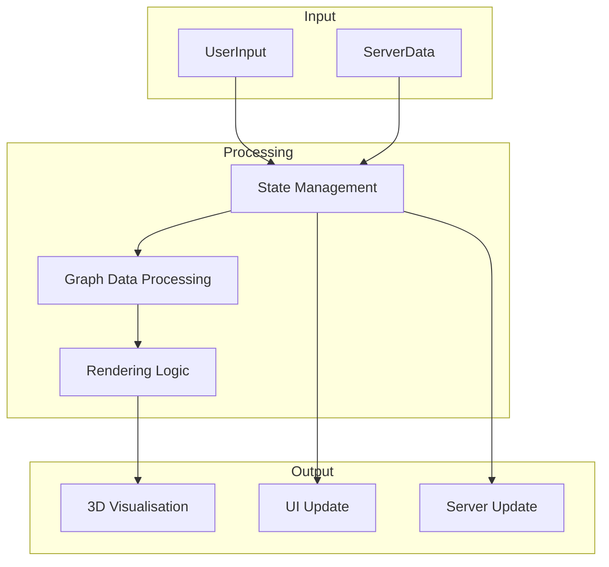
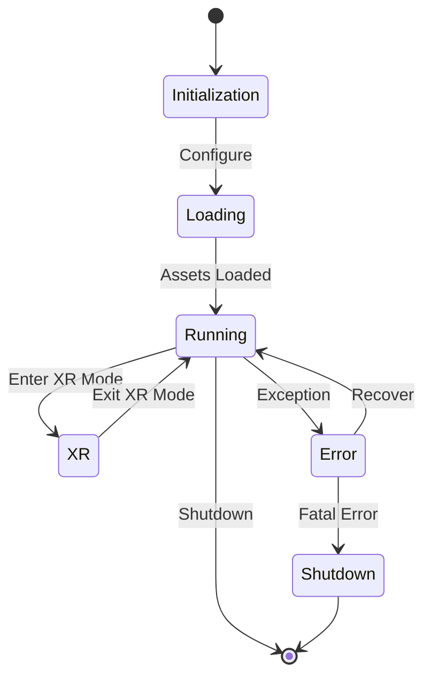

# Client Architecture Overview

This document provides a high-level overview of the LogseqSpringThing client architecture, its major components, and their interactions.

## System Architecture

The client is built as a modern TypeScript application that follows a component-based architecture. It integrates with React Three Fiber (R3F) and Three.js for 3D rendering, WebXR for VR/AR capabilities, and communicates with the Rust backend server through REST APIs and WebSocket connections.

```mermaid
graph TB
    subgraph Client Architecture
        AppInitializer[App Initializer]

        subgraph UILayer [User Interface Layer]
            TwoPaneLayout[TwoPaneLayout.tsx]
            GraphViewportUI[GraphViewport.tsx]
            RightPaneControlPanel[RightPaneControlPanel.tsx]
            SettingsPanelRedesignOptimized[SettingsPanelRedesignOptimized.tsx]
            ConversationPane[ConversationPane.tsx]
            NarrativeGoldminePanel[NarrativeGoldminePanel.tsx]
        end

        subgraph StateManagement [State Management]
            SettingsStore["useSettingsStore"]
            GraphDataManager[GraphDataManager]
        end

        subgraph APILayer [API Layer]
            NostrAuthService[nostrAuthService.ts]
            APIService[api.ts]
        end

        Rendering["Rendering Engine"]
        WebSocketClient["WebSocketClient"]
        XRModule["XR Module"]

        AppInitializer --> TwoPaneLayout
        AppInitializer --> SettingsStore
        AppInitializer --> GraphDataManager
        AppInitializer --> NostrAuthService
        AppInitializer --> APIService
        AppInitializer --> Rendering
        AppInitializer --> WebSocketClient
        AppInitializer --> XRModule

        TwoPaneLayout --> GraphViewportUI
        TwoPaneLayout --> RightPaneControlPanel
        TwoPaneLayout --> ConversationPane
        TwoPaneLayout --> NarrativeGoldminePanel
        RightPaneControlPanel --> SettingsPanelRedesignOptimized

        SettingsPanelRedesignOptimized --> SettingsStore
        ConversationPane --> APIService
        NarrativeGoldminePanel --> APIService

        SettingsStore --> Rendering
        GraphDataManager --> Rendering
        SettingsStore --> APIService
        GraphDataManager --> WebSocketClient

        NostrAuthService --> APIService
        GraphDataManager --> WebSocketClient

        XRModule --> Rendering
        XRModule --> SettingsStore
        WebSocketClient --> GraphDataManager
    end

    subgraph ServerInterface [Server Interface]
        RESTAPI[REST API]
        WebSocketServer[WebSocket Server]
        AuthHandler[Authentication Handler]

        APIService --> RESTAPI
        WebSocketClient --> WebSocketServer
        NostrAuthService --> AuthHandler
        APIService --> AuthHandler
    end

    style Client Architecture fill:#282C34,stroke:#61DAFB,stroke-width:2px,color:#FFFFFF
    style UILayer fill:#3A3F47,stroke:#61DAFB,color:#FFFFFF
    style StateManagement fill:#3A3F47,stroke:#61DAFB,color:#FFFFFF
    style APILayer fill:#3A3F47,stroke:#61DAFB,color:#FFFFFF
    style AppInitializer fill:#3A3F47,stroke:#61DAFB,color:#FFFFFF
    style TwoPaneLayout fill:#3A3F47,stroke:#61DAFB,color:#FFFFFF
    style GraphViewportUI fill:#3A3F47,stroke:#61DAFB,color:#FFFFFF
    style RightPaneControlPanel fill:#3A3F47,stroke:#61DAFB,color:#FFFFFF
    style SettingsPanelRedesignOptimized fill:#3A3F47,stroke:#61DAFB,color:#FFFFFF
    style ConversationPane fill:#3A3F47,stroke:#61DAFB,color:#FFFFFF
    style NarrativeGoldminePanel fill:#3A3F47,stroke:#61DAFB,color:#FFFFFF
    style SettingsStore fill:#3A3F47,stroke:#61DAFB,color:#FFFFFF
    style GraphDataManager fill:#3A3F47,stroke:#61DAFB,color:#FFFFFF
    style NostrAuthService fill:#3A3F47,stroke:#61DAFB,color:#FFFFFF
    style APIService fill:#3A3F47,stroke:#61DAFB,color:#FFFFFF
    style Rendering fill:#3A3F47,stroke:#61DAFB,color:#FFFFFF
    style WebSocketClient fill:#3A3F47,stroke:#61DAFB,color:#FFFFFF
    style XRModule fill:#3A3F47,stroke:#61DAFB,color:#FFFFFF

    style ServerInterface fill:#282C34,stroke:#A2AAAD,stroke-width:2px,color:#FFFFFF
    style RESTAPI fill:#3A3F47,stroke:#A2AAAD,color:#FFFFFF
    style WebSocketServer fill:#3A3F47,stroke:#A2AAAD,color:#FFFFFF
    style AuthHandler fill:#3A3F47,stroke:#A2AAAD,color:#FFFFFF
```

## Key Components

### User Interface Layer
The UI layer is built with React and TypeScript.
- [`TwoPaneLayout.tsx`](../../client/src/app/TwoPaneLayout.tsx) serves as the primary layout, dividing the screen into a main visualisation area and a control panel area.
- [`RightPaneControlPanel.tsx`](../../client/src/app/components/RightPaneControlPanel.tsx) hosts the authentication UI and the main settings panel: [`SettingsPanelRedesignOptimized.tsx`](../../client/src/features/settings/components/panels/SettingsPanelRedesignOptimized.tsx). The `ConversationPane` and `NarrativeGoldminePanel` are rendered alongside it within the main `TwoPaneLayout`.
- [`GraphViewport.tsx`](../../client/src/features/graph/components/GraphViewport.tsx) is responsible for the main 3D graph visualisation area.

### State Management
State management is handled through a combination of **Zustand** stores and **React Context API**, providing both global and localized state management solutions.

#### Zustand Stores
- `useSettingsStore` ([`client/src/store/settingsStore.ts`](../../client/src/store/settingsStore.ts)) - Manages application settings with validation and persistence
- `GraphDataManager` ([`client/src/features/graph/managers/graphDataManager.ts`](../../client/src/features/graph/managers/graphDataManager.ts)) - Manages the graph data structure (nodes, edges, metadata) and handles real-time updates from the WebSocket
- `usePlatformStore` ([`client/src/services/platformManager.ts`](../../client/src/services/platformManager.ts)) - Manages platform detection, XR capabilities, and device-specific features

#### React Contexts
- `ApplicationModeContext` ([`client/src/contexts/ApplicationModeContext.tsx`](../../client/src/contexts/ApplicationModeContext.tsx)) - Manages application mode (desktop/mobile/XR) and layout settings
- `WindowSizeContext` ([`client/src/contexts/WindowSizeContext.tsx`](../../client/src/contexts/WindowSizeContext.tsx)) - Provides responsive window size information to components
- Control panel contexts for localized UI state management

State changes are propagated through Zustand's subscription mechanism and React's context system, allowing components to react efficiently to specific state slices.

### API Layer
The API layer handles communication with the server through REST endpoints and manages authentication:
- Authentication and authorization: [`nostrAuthService.ts`](../../client/src/services/nostrAuthService.ts) handles Nostr-based authentication.
- General API communication: [`api.ts`](../../client/src/services/api.ts) provides functions for interacting with other REST endpoints (graph data, files, settings).

### Rendering Engine
The rendering engine is built on **React Three Fiber (`@react-three/fiber`)** and **Three.js**, providing high-performance visualisation of graph data. Key components include:
- [`GraphCanvas.tsx`](../../client/src/features/graph/components/GraphCanvas.tsx): The main R3F canvas where the 3D scene is rendered.
- [`GraphManager.tsx`](../../client/src/features/graph/components/GraphManager.tsx): Manages the rendering of nodes and edges, handling their positions and visual properties.
- [`GraphViewport.tsx`](../../client/src/features/graph/components/GraphViewport.tsx): Manages the camera, scene controls, and post-processing effects.
- Node and edge rendering, often utilizing instancing for performance.
- Text rendering with SDF fonts ([`TextRenderer.tsx`](../../client/src/features/visualisation/renderers/TextRenderer.tsx)).
- Custom shaders like [`HologramMaterial.tsx`](../../client/src/features/visualisation/renderers/materials/HologramMaterial.tsx) for unique visual effects.
- Metadata visualisation ([`MetadataVisualizer.tsx`](../../client/src/features/visualisation/components/MetadataVisualizer.tsx)).
- Camera controls and scene management ([`CameraController.tsx`](../../client/src/features/visualisation/components/CameraController.tsx)).

### WebSocket Client
The WebSocket client ([`client/src/services/WebSocketService.ts`](../../client/src/services/WebSocketService.ts)) provides real-time communication with the server for:
- Live position updates using a custom binary protocol
- Graph data synchronization
- Control messages and event notifications (e.g., `connection_established`, `loading`)
- Configurable reconnection attempts and compression settings
- Binary chunk processing for large data transfers

### Platform Manager
The Platform Manager ([`client/src/services/platformManager.ts`](../../client/src/services/platformManager.ts)) provides comprehensive platform detection and capability management:
- **Platform Detection**: Identifies device types (desktop, mobile, Quest, Pico)
- **XR Capabilities**: Detects VR/AR support, hand tracking availability
- **Performance Tiers**: Adjusts settings based on device capabilities
- **Event System**: Notifies components of platform changes
- **Backwards Compatibility**: Provides both hook-based and singleton patterns

### XR Module
The XR module, located under [`client/src/features/xr/`](../../client/src/features/xr/), integrates WebXR capabilities for VR/AR experiences:
- Key Components:
    - [`XRController.tsx`](../../client/src/features/xr/components/XRController.tsx): Manages the overall XR state and setup.
    - [`HandInteractionSystem.tsx`](../../client/src/features/xr/systems/HandInteractionSystem.tsx): Handles hand tracking and interactions.
    - [`xrSessionManager.ts`](../../client/src/features/xr/managers/xrSessionManager.ts): Manages WebXR sessions.
    - [`xrInitializer.ts`](../../client/src/features/xr/managers/xrInitializer.ts): Handles the initial setup for XR.
- Spatial UI elements.
- XR-specific rendering optimizations.

## High-Level Data Flow

## Core Technology Stack

- **TypeScript** - Primary development language
- **React** - Frontend UI library
- **React Three Fiber (`@react-three/fiber`)** - React renderer for Three.js
- **Three.js** - Core 3D rendering engine
- **WebGL** - Hardware-accelerated graphics
- **WebXR** - VR/AR integration
- **Zustand** - Lightweight state management
- **WebSockets** - Real-time communication
- **Tailwind CSS** - Utility-first CSS framework
- **Vite** - Frontend build tool
- **Custom Shaders** - GLSL shaders for specialized rendering effects (e.g., `HologramMaterial.tsx`)

## Key Architectural Patterns

1. **Component-Based Architecture** - Leveraging React's component model for modular and reusable UI elements
2. **Hybrid State Management** - Combining Zustand for global state and React Context for localized state
3. **Composition over Inheritance** - Building complex behaviors by combining simpler components and hooks
4. **Service Layer** - Abstracting API calls and WebSocket communication into dedicated service modules:
    - [`api.ts`](../../client/src/services/api.ts) - RESTful API communication
    - [`WebSocketService.ts`](../../client/src/services/WebSocketService.ts) - Real-time data streaming
    - [`nostrAuthService.ts`](../../client/src/services/nostrAuthService.ts) - Authentication services
    - [`platformManager.ts`](../../client/src/services/platformManager.ts) - Platform detection and capabilities
5. **Context-Based Dependency Injection** - Using React Context API for:
    - Application-wide mode management (desktop/mobile/XR)
    - Responsive design through window size context
    - Feature-specific state isolation
6. **Progressive Enhancement** - Adapting UI and features based on platform capabilities
7. **Type-Safe Communication** - Using TypeScript interfaces for client-server data contracts

## Cross-Cutting Concerns

- **Logging** - Centralized logging system with multiple levels
- **Error Handling** - Comprehensive error capture and recovery
- **Performance Monitoring** - Resource and performance monitoring
- **Caching** - Strategic caching of data and assets

## Application Lifecycle

## Communication with Server

The client communicates with the server through two primary channels:

1. **REST API** - For configuration, authentication, and data operations
    - Feature-based access control through Nostr authentication
    - Settings synchronization with server-side validation
    - File processing and graph data operations
    - AI service integration (RAGFlow, Perplexity)

2. **WebSocket** - For real-time updates and streaming data
    - Binary protocol for efficient position updates
    - JSON messages for control and metadata
    - Automatic reconnection with exponential backoff
    - Compression for large payloads

This dual-channel approach allows for efficient communication patterns based on the nature of the data being exchanged.

## Client Settings Architecture

The client uses a comprehensive settings payload structure ([`client_settings_payload.rs`](../../src/models/client_settings_payload.rs)) that includes:
- **Visualization Settings**: Nodes, edges, physics, rendering, animations, labels, bloom, hologram, camera
- **System Settings**: WebSocket configuration, debug options, persistence
- **XR Settings**: VR/AR modes, hand tracking, locomotion, passthrough
- **Authentication Settings**: Provider configuration, feature access
- **AI Service Settings**: RAGFlow, Perplexity, OpenAI, Kokoro configurations

Settings are validated on both client and server sides, with automatic type conversion between camelCase (client) and snake_case (server).

## Related Documentation

- [Components](components.md) - Detailed component relationships
- [State Management](state.md) - State management approach
- [Rendering System](rendering.md) - Technical rendering details
- [WebSocket Communication](websocket.md) - WebSocket protocol details
- [XR Integration](xr.md) - WebXR implementation details