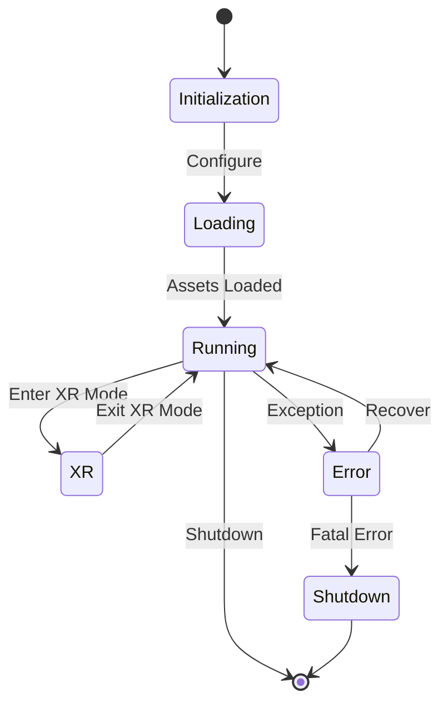

# Client Architecture Overview

This document provides a high-level overview of the LogseqSpringThing client architecture, its major components, and their interactions.

## System Architecture

The client is built as a modern TypeScript application that follows a component-based architecture. It integrates with React Three Fiber (R3F) and Three.js for 3D rendering, WebXR for VR/AR capabilities, and communicates with the Rust backend server through REST APIs and WebSocket connections.

```mermaid
graph TB
    subgraph Client Architecture
        AppInitializer[App Initializer]

        subgraph UILayer [User Interface Layer]
            TwoPaneLayout[TwoPaneLayout.tsx]
            GraphViewportUI[GraphViewport.tsx]
            RightPaneControlPanel[RightPaneControlPanel.tsx]
            SettingsPanelRedesign[SettingsPanelRedesign.tsx]
            ConversationPane[ConversationPane.tsx]
            NarrativeGoldminePanel[NarrativeGoldminePanel.tsx]
        end

        subgraph StateManagement [State Management]
            SettingsStore[useSettingsStore (Zustand)]
            GraphDataManager[GraphDataManager]
        end

        subgraph APILayer [API Layer]
            NostrAuthService[nostrAuthService.ts]
            APIService[api.ts]
        end

        Rendering[Rendering Engine (R3F/Three.js)]
        WebSocketClient[WebSocketClient (WebSocketService.ts)]
        XRModule[XR Module]

        AppInitializer --> TwoPaneLayout
        AppInitializer --> SettingsStore
        AppInitializer --> GraphDataManager
        AppInitializer --> NostrAuthService
        AppInitializer --> APIService
        AppInitializer --> Rendering
        AppInitializer --> WebSocketClient
        AppInitializer --> XRModule

        TwoPaneLayout --> GraphViewportUI
        TwoPaneLayout --> RightPaneControlPanel
        TwoPaneLayout --> ConversationPane
        TwoPaneLayout --> NarrativeGoldminePanel
        RightPaneControlPanel --> SettingsPanelRedesign

        SettingsPanelRedesign --> SettingsStore
        ConversationPane --> APIService
        NarrativeGoldminePanel --> APIService

        SettingsStore --> Rendering
        GraphDataManager --> Rendering
        SettingsStore --> APIService
        GraphDataManager --> WebSocketClient

        NostrAuthService --> APIService
        GraphDataManager --> WebSocketClient

        XRModule --> Rendering
        XRModule --> SettingsStore
        WebSocketClient --> GraphDataManager
    end

    subgraph ServerInterface [Server Interface]
        RESTAPI[REST API]
        WebSocketServer[WebSocket Server]
        AuthHandler[Authentication Handler]

        APIService --> RESTAPI
        WebSocketClient --> WebSocketServer
        NostrAuthService --> AuthHandler
        APIService --> AuthHandler
    end
```

## Key Components

### User Interface Layer
The UI layer is built with React and TypeScript.
- [`TwoPaneLayout.tsx`](../../client/src/app/TwoPaneLayout.tsx) serves as the primary layout, dividing the screen into a main visualisation area and a control panel area.
- [`RightPaneControlPanel.tsx`](../../client/src/app/components/RightPaneControlPanel.tsx) hosts the authentication UI and the main settings panel: `SettingsPanelRedesign.tsx`. The `ConversationPane` and `NarrativeGoldminePanel` are rendered alongside it within the main `TwoPaneLayout`.
- [`GraphViewport.tsx`](../../client/src/features/graph/components/GraphViewport.tsx) is responsible for the main 3D graph visualisation area.

### State Management
State management is primarily handled by **Zustand**, a lightweight and flexible state management solution. The main state stores are:
- `useSettingsStore` ([`client/src/store/settingsStore.ts`](../../client/src/store/settingsStore.ts)) - Manages application settings with validation and persistence.
- `GraphDataManager` ([`client/src/features/graph/managers/graphDataManager.ts`](../../client/src/features/graph/managers/graphDataManager.ts)) - Manages the graph data structure (nodes, edges, metadata) and handles real-time updates from the WebSocket.
State changes are propagated through Zustand's subscription mechanism, allowing components to react efficiently to specific state slices.

### API Layer
The API layer handles communication with the server through REST endpoints and manages authentication:
- Authentication and authorization: [`nostrAuthService.ts`](../../client/src/services/nostrAuthService.ts) handles Nostr-based authentication.
- General API communication: [`api.ts`](../../client/src/services/api.ts) provides functions for interacting with other REST endpoints (graph data, files, settings).

### Rendering Engine
The rendering engine is built on **React Three Fiber (`@react-three/fiber`)** and **Three.js**, providing high-performance visualisation of graph data. Key components include:
- [`GraphCanvas.tsx`](../../client/src/features/graph/components/GraphCanvas.tsx): The main R3F canvas where the 3D scene is rendered.
- [`GraphManager.tsx`](../../client/src/features/graph/components/GraphManager.tsx): Manages the rendering of nodes and edges, handling their positions and visual properties.
- [`GraphViewport.tsx`](../../client/src/features/graph/components/GraphViewport.tsx): Manages the camera, scene controls, and post-processing effects.
- Node and edge rendering, often utilizing instancing for performance.
- Text rendering with SDF fonts ([`TextRenderer.tsx`](../../client/src/features/visualisation/renderers/TextRenderer.tsx)).
- Custom shaders like [`HologramMaterial.tsx`](../../client/src/features/visualisation/renderers/materials/HologramMaterial.tsx) for unique visual effects.
- Metadata visualisation ([`MetadataVisualizer.tsx`](../../client/src/features/visualisation/components/MetadataVisualizer.tsx)).
- Camera controls and scene management ([`CameraController.tsx`](../../client/src/features/visualisation/components/CameraController.tsx)).

### WebSocket Client
The WebSocket client ([`client/src/services/WebSocketService.ts`](../../client/src/services/WebSocketService.ts)) provides real-time communication with the server for:
- Live position updates using a custom binary protocol.
- Graph data synchronization.
- Control messages and event notifications (e.g., `connection_established`, `loading`).

### XR Module
The XR module, located under [`client/src/features/xr/`](../../client/src/features/xr/), integrates WebXR capabilities for VR/AR experiences:
- Key Components:
    - [`XRController.tsx`](../../client/src/features/xr/components/XRController.tsx): Manages the overall XR state and setup.
    - [`HandInteractionSystem.tsx`](../../client/src/features/xr/systems/HandInteractionSystem.tsx): Handles hand tracking and interactions.
    - [`xrSessionManager.ts`](../../client/src/features/xr/managers/xrSessionManager.ts): Manages WebXR sessions.
    - [`xrInitializer.ts`](../../client/src/features/xr/managers/xrInitializer.ts): Handles the initial setup for XR.
- Spatial UI elements.
- XR-specific rendering optimizations.

## High-Level Data Flow

```mermaid
flowchart TB
    subgraph Input
        UserInput[User Input (UI/XR)]
        ServerData[Server Data (REST/WS)]
    end

    subgraph Processing
        State[State Management (Zustand)]
        GraphProcessing[Graph Data Processing]
        RenderingLogic[Rendering Logic]
    end

    subgraph Output
        Visualisation[3D Visualisation]
        UIUpdate[UI Update]
        ServerUpdate[Server Update (WS/REST)]
    end

    UserInput --> State
    ServerData --> State

    State --> GraphProcessing
    GraphProcessing --> RenderingLogic
    RenderingLogic --> Visualisation

    State --> UIUpdate
    State --> ServerUpdate
```

## Core Technology Stack

- **TypeScript** - Primary development language
- **React** - Frontend UI library
- **React Three Fiber (`@react-three/fiber`)** - React renderer for Three.js
- **Three.js** - Core 3D rendering engine
- **WebGL** - Hardware-accelerated graphics
- **WebXR** - VR/AR integration
- **Zustand** - Lightweight state management
- **WebSockets** - Real-time communication
- **Tailwind CSS** - Utility-first CSS framework
- **Vite** - Frontend build tool
- **Custom Shaders** - GLSL shaders for specialized rendering effects (e.g., `HologramMaterial.tsx`)

## Key Architectural Patterns

1. **Component-Based Architecture** - Leveraging React's component model for modular and reusable UI elements.
2. **State Management with Zustand** - Centralized and reactive state management for application settings and graph data.
3. **Composition over Inheritance** - Building complex behaviors by combining simpler components and hooks.
4. **Service Layer** - Abstracting API calls and WebSocket communication into dedicated service modules ([`api.ts`](../../client/src/services/api.ts), [`WebSocketService.ts`](../../client/src/services/WebSocketService.ts), [`nostrAuthService.ts`](../../client/src/services/nostrAuthService.ts)).
5. **React Context API** - Used for dependency injection and sharing global state that doesn't fit well into Zustand or is more localized. Examples include:
    - [`ApplicationModeContext.tsx`](../../client/src/contexts/ApplicationModeContext.tsx)
    - [`WindowSizeContext.tsx`](../../client/src/contexts/WindowSizeContext.tsx)
    - [`control-panel-context.tsx`](../../client/src/features/settings/components/control-panel-context.tsx)

## Cross-Cutting Concerns

- **Logging** - Centralized logging system with multiple levels
- **Error Handling** - Comprehensive error capture and recovery
- **Performance Monitoring** - Resource and performance monitoring
- **Caching** - Strategic caching of data and assets

## Application Lifecycle



## Communication with Server

The client communicates with the server through two primary channels:

1. **REST API** - For configuration, authentication, and data operations
2. **WebSocket** - For real-time updates and streaming data

This dual-channel approach allows for efficient communication patterns based on the nature of the data being exchanged.

## Related Documentation

- [Components](components.md) - Detailed component relationships
- [State Management](state.md) - State management approach
- [WebSocket Communication](websocket.md) - WebSocket protocol details
- [XR Integration](xr.md) - WebXR implementation details