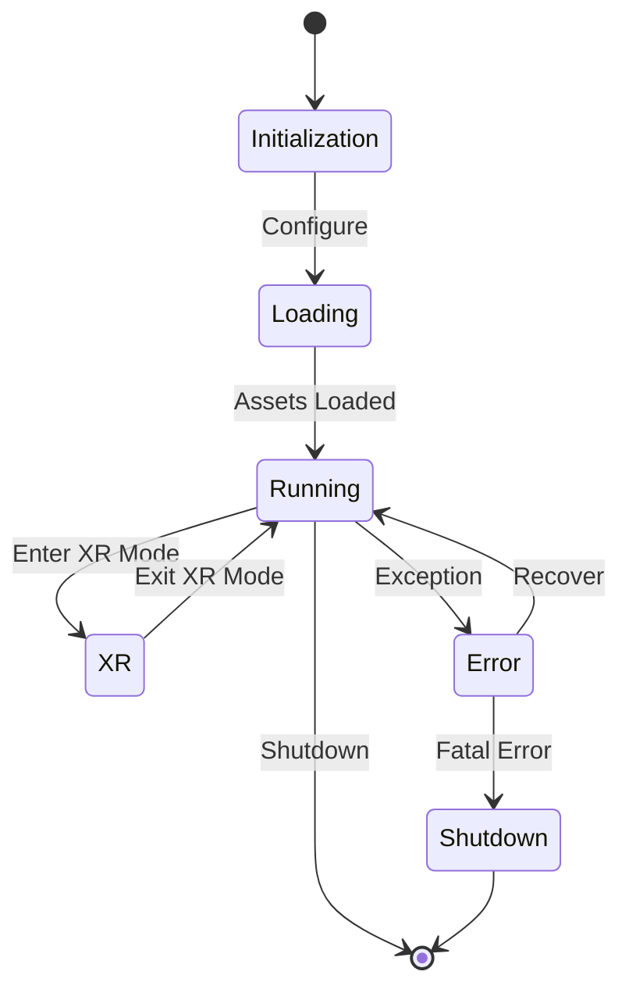

# Client Architecture Overview

This document provides a high-level overview of the LogseqSpringThing client architecture, its major components, and their interactions.

## System Architecture

The client is built as a modern TypeScript application that follows a component-based architecture. It integrates with React Three Fiber (R3F) and Three.js for 3D rendering, WebXR for VR/AR capabilities, and communicates with the Rust backend server through REST APIs and WebSocket connections.

```mermaid
graph TB
    subgraph Client Architecture
        AppInitializer[App Initializer]
        UI[User Interface Layer]
        State[State Management (Zustand)]
        API[API Layer]
        Rendering[Rendering Engine (R3F/Three.js)]
        WebSocket[WebSocket Client]
        XR[XR Module]
        
        AppInitializer --> UI
        AppInitializer --> State
        AppInitializer --> API
        AppInitializer --> Rendering
        AppInitializer --> WebSocket
        AppInitializer --> XR
        
        UI --> State
        State --> Rendering
        State --> API
        API --> WebSocket
        XR --> Rendering
        XR --> State
        WebSocket --> State
    end
    
    subgraph Server Interface
        REST[REST API]
        WS[WebSocket Server]
        Auth[Authentication]
        
        API --> REST
        WebSocket --> WS
        API --> Auth
        WebSocket --> Auth
    end
```

## Key Components

### User Interface Layer
The UI layer consists of modular components for controlling the application, configuring settings, and interacting with the 3D visualisation. The main settings UI is `client/src/features/settings/components/panels/SettingsPanelRedesign.tsx`, which is hosted within `client/src/app/components/RightPaneControlPanel.tsx`. Key components are `TwoPaneLayout.tsx`, `RightPaneControlPanel.tsx`, `SettingsPanelRedesign.tsx`, `SettingsSection.tsx`, and `SettingControlComponent.tsx`.

### State Management
State management is primarily handled by **Zustand**, a lightweight and flexible state management solution. The main state stores are:
- `useSettingsStore` (`client/src/store/settingsStore.ts`) - Manages application settings with validation and persistence.
- `GraphDataManager` (`client/src/features/graph/managers/graphDataManager.ts`) - Manages the graph data structure (nodes, edges, metadata) and handles real-time updates from the WebSocket.
State changes are propagated through Zustand's subscription mechanism, allowing components to react efficiently to specific state slices.

### API Layer
The API layer handles communication with the server through REST endpoints, providing abstracted access to server functionality:
- Authentication and authorization (`client/src/features/auth/services/nostrAuthService.ts`)
- Graph data retrieval and updates (`client/src/services/api.ts`)
- File and settings management (`client/src/services/api.ts`)

### Rendering Engine
The rendering engine is built on **React Three Fiber (`@react-three/fiber`)** and **Three.js**, providing high-performance visualisation of graph data. Key components include:
- `GraphCanvas.tsx`: The main R3F canvas where the 3D scene is rendered.
- `GraphManager.tsx`: Manages the rendering of nodes and edges, handling their positions and visual properties.
- `GraphViewport.tsx`: Manages the camera and scene controls.
- Node and edge rendering, often utilizing instancing for performance.
- Text rendering with SDF fonts (`TextRenderer.tsx`).
- Metadata visualisation (`MetadataVisualizer.tsx`).
- Camera controls and scene management (`CameraController.tsx`).

### WebSocket Client
The WebSocket client (`client/src/services/WebSocketService.ts`) provides real-time communication with the server for:
- Live position updates using a custom binary protocol.
- Graph data synchronization.
- Control messages and event notifications (e.g., `connection_established`, `loading`, `settings_update`).

### XR Module
The XR module (`client/src/features/xr/`) integrates WebXR capabilities for VR/AR experiences:
- Hand tracking and interaction (`HandInteractionSystem.tsx`).
- XR session management (`xrSessionManager.ts`).
- Spatial UI elements.
- XR-specific rendering optimizations.
- Initialisation logic (`xrInitializer.ts`).

## High-Level Data Flow

```mermaid
flowchart TB
    subgraph Input
        UserInput[User Input (UI/XR)]
        ServerData[Server Data (REST/WS)]
    end
    
    subgraph Processing
        State[State Management (Zustand)]
        GraphProcessing[Graph Data Processing]
        RenderingLogic[Rendering Logic]
    end
    
    subgraph Output
        Visualisation[3D Visualisation]
        UIUpdate[UI Update]
        ServerUpdate[Server Update (WS/REST)]
    end
    
    UserInput --> State
    ServerData --> State
    
    State --> GraphProcessing
    GraphProcessing --> RenderingLogic
    RenderingLogic --> Visualisation
    
    State --> UIUpdate
    State --> ServerUpdate
```

## Core Technology Stack

- **TypeScript** - Primary development language
- **React** - Frontend UI library
- **React Three Fiber (`@react-three/fiber`)** - React renderer for Three.js
- **Three.js** - Core 3D rendering engine
- **WebGL** - Hardware-accelerated graphics
- **WebXR** - VR/AR integration
- **Zustand** - Lightweight state management
- **WebSockets** - Real-time communication
- **Tailwind CSS** - Utility-first CSS framework
- **Vite** - Frontend build tool
- **Custom Shaders** - GLSL shaders for specialized rendering effects (e.g., `HologramMaterial.tsx`)

## Key Architectural Patterns

1. **Component-Based Architecture** - Leveraging React's component model for modular and reusable UI elements.
2. **State Management with Zustand** - Centralized and reactive state management for application settings and graph data.
3. **Composition over Inheritance** - Building complex behaviors by combining simpler components and hooks.
4. **Service Layer** - Abstracting API calls and WebSocket communication into dedicated service modules (`api.ts`, `WebSocketService.ts`).
5. **React Context API** - Used for dependency injection and sharing global state (e.g., `ApplicationModeContext.tsx`, `WindowSizeContext.tsx`, `control-panel-context.tsx`).

## Cross-Cutting Concerns

- **Logging** - Centralized logging system with multiple levels
- **Error Handling** - Comprehensive error capture and recovery
- **Performance Monitoring** - Resource and performance monitoring
- **Caching** - Strategic caching of data and assets

## Application Lifecycle



## Communication with Server

The client communicates with the server through two primary channels:

1. **REST API** - For configuration, authentication, and data operations
2. **WebSocket** - For real-time updates and streaming data

This dual-channel approach allows for efficient communication patterns based on the nature of the data being exchanged.

## Related Documentation

- [Components](components.md) - Detailed component relationships
- [State Management](state.md) - State management approach
- [WebSocket Communication](websocket.md) - WebSocket protocol details
- [XR Integration](xr.md) - WebXR implementation details