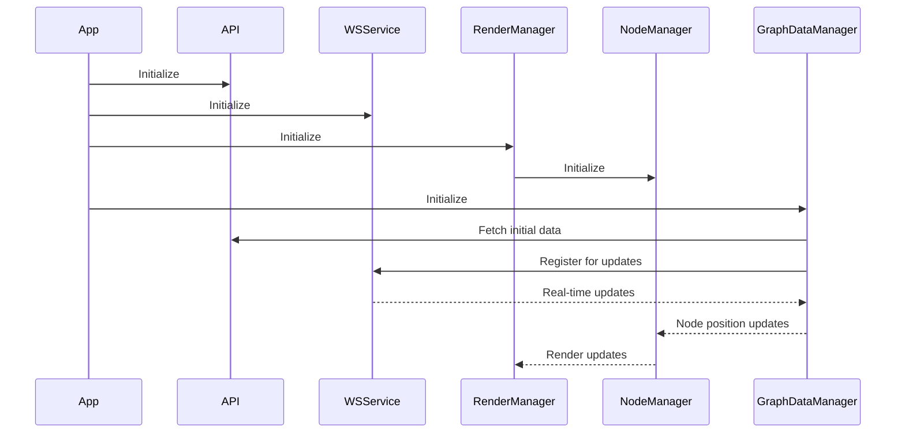

# Client Components

This document details the client component architecture, describing the relationships between major components, their responsibilities, and dependencies.

## Component Overview

The client is organized into a modular component architecture with clear separation of concerns. Each component has well-defined responsibilities and interfaces.

```mermaid
flowchart TB
    subgraph Core
        API[API Service]
        SettingsStore[Settings Store]
        Logger[Logger]
        Utils[Utilities]
    end
    
    subgraph Rendering
        GraphCanvas[Graph Canvas (R3F)]
        GraphManager[Graph Manager]
        GraphViewport[Graph Viewport]
        TextRenderer[Text Renderer]
        MetadataVisualizer[Metadata Visualizer]
        HologramManager[Hologram Manager]
        CameraController[Camera Controller]
    end
    
    subgraph UI
        App[App Component]
        TwoPaneLayout[Two Pane Layout]
        RightPaneControlPanel[Right Pane Control Panel]
        ControlPanel[Control Panel (Tabs)]
        SettingsSections[Settings Sections]
        SettingControlComponent[Setting Control Component]
        AuthUIHandler[Auth UI Handler]
        MarkdownRenderer[Markdown Renderer]
    end
    
    subgraph XR
        XRController[XR Controller]
        XRScene[XR Scene]
        XRVisualisationConnector[XR Visualisation Connector]
        HandInteractionSystem[Hand Interaction System]
        XRInitializer[XR Initializer]
        XRSessionManager[XR Session Manager]
        SafeXRProvider[Safe XR Provider]
    end
    
    subgraph Network
        WebSocketService[WebSocket Service]
        GraphDataManager[Graph Data Manager]
    end
    
    App --> TwoPaneLayout
    App --> AuthUIHandler
    TwoPaneLayout --> RightPaneControlPanel
    RightPaneControlPanel --> ControlPanel
    ControlPanel --> SettingsSections
    SettingsSections --> SettingControlComponent
    RightPaneControlPanel --> MarkdownRenderer
    
    App --> GraphCanvas
    GraphCanvas --> GraphManager
    GraphCanvas --> GraphViewport
    GraphManager --> TextRenderer
    GraphManager --> MetadataVisualizer
    GraphManager --> HologramManager
    GraphCanvas --> CameraController
    
    App --> WebSocketService
    App --> GraphDataManager
    WebSocketService --> GraphDataManager
    GraphDataManager --> GraphManager
    
    App --> XRController
    XRController --> XRScene
    XRScene --> XRVisualisationConnector
    XRVisualisationConnector --> HandInteractionSystem
    XRController --> XRInitializer
    XRController --> XRSessionManager
    XRController --> SafeXRProvider
    HandInteractionSystem --> GraphManager
    
    SettingsStore --> SettingsSections
    SettingsStore --> SettingControlComponent
    API --> GraphDataManager
    API --> SettingsStore
    API --> AuthUIHandler
    
    Logger -.-> API
    Logger -.-> WebSocketService
    Logger -.-> GraphManager
    Logger -.-> XRController
    
    Utils -.-> API
    Utils -.-> SettingsStore
    Utils -.-> GraphDataManager
```

## Core Components

### API Service (`client/src/services/api.ts`)
Provides a centralized interface for communicating with the server REST API.

**Responsibilities:**
- Build API URLs for different endpoints
- Handle authentication headers
- Provide helper functions for API requests

**Key Dependencies:**
- Constants for API endpoints
- Types for request/response formats

### State Management
Manages application state and provides reactive updates using Zustand.

**Key Components:**
- `SettingsStore` (`client/src/store/settingsStore.ts`) - Manages application settings.
- `GraphDataManager` (`client/src/features/graph/managers/graphDataManager.ts`) - Manages graph data state and updates.

**Responsibilities:**
- Store and validate application settings.
- Track graph data and node positions.
- Propagate state changes to subscribers via Zustand's subscription mechanism.

### Event Emitter
The codebase does not use a dedicated `eventEmitter.ts` file. Instead, communication patterns include:
- Direct prop passing in React components.
- Zustand store subscriptions for state changes.
- React Context for sharing data and functions across the component tree.
- WebSocket messages for server-client communication.

### Logger (`client/src/utils/logger.ts`)
Provides centralized logging with different levels.

**Responsibilities:**
- Log messages with appropriate severity
- Add metadata to log messages
- Control log output based on debug settings

## Rendering Components

### Graph Canvas (`client/src/features/graph/components/GraphCanvas.tsx`)
The main entry point for the React Three Fiber (R3F) scene. It sets up the WebGL renderer, camera, and basic scene elements.

### Graph Manager (`client/src/features/graph/components/GraphManager.tsx`)
Manages the rendering of nodes and edges within the 3D scene. It handles instanced meshes for performance and orchestrates updates based on graph data.

### Graph Viewport (`client/src/features/graph/components/GraphViewport.tsx`)
Manages the camera and post-processing effects for the 3D scene.

### Text Renderer (`client/src/features/visualisation/renderers/TextRenderer.tsx`)
Renders text labels in 3D space using SDF fonts.

### Metadata Visualizer (`client/src/features/visualisation/components/MetadataVisualizer.tsx`)
Displays metadata associated with nodes in the 3D scene.

### Hologram Manager (`client/src/features/visualisation/renderers/HologramManager.tsx`)
Manages the rendering of holographic effects for nodes.

### Camera Controller (`client/src/features/visualisation/components/CameraController.tsx`)
Handles camera controls and interactions within the 3D scene.

### Edge Manager
Edge rendering logic is primarily integrated within `GraphManager.tsx`, which handles the creation and updating of edge geometries and materials.

### WebSocket Service (`client/src/services/WebSocketService.ts`)
Manages WebSocket connection and communication with the server.

### Graph Data Manager (`client/src/features/graph/managers/graphDataManager.ts`)
Manages graph data loading, updates, and state.

## Network Components

### XR Controller (`client/src/features/xr/components/XRController.tsx`)
The main component for managing WebXR sessions and interactions.

### XR Scene (`client/src/features/xr/components/XRScene.tsx`)
A wrapper component for the R3F scene when in XR mode.

### XR Visualisation Connector (`client/src/features/xr/components/XRVisualisationConnector.tsx`)
Connects the main 3D visualisation components to the XR environment.

### Hand Interaction System (`client/src/features/xr/systems/HandInteractionSystem.tsx`)
Handles WebXR hand tracking and interactions, including gesture recognition.

### XR Initializer (`client/src/features/xr/managers/xrInitializer.ts`)
Initializes WebXR capabilities and sessions.

### XR Session Manager (`client/src/features/xr/managers/xrSessionManager.ts`)
Manages WebXR sessions and their lifecycle.

### Safe XR Provider (`client/src/features/xr/providers/SafeXRProvider.tsx`)
Provides a safe context for WebXR hooks and components, handling browser compatibility.


### Right Pane Control Panel (`client/src/app/components/RightPaneControlPanel.tsx`)
Manages the content displayed in the right pane of the main application layout, including settings and feature tabs.

### Control Panel (`client/src/components/layout/ControlPanel.tsx`)
Provides the tabbed interface for organizing different categories of settings and tools within the right pane.

### Settings Sections (`client/src/features/settings/components/SettingsSection.tsx`)
Used within panels to group related settings. Supports collapsible sections and detaching into draggable, floating windows.

### Setting Control Component (`client/src/features/settings/components/SettingControlComponent.tsx`)
Renders individual UI controls (sliders, toggles, inputs) for each setting, including dynamic tooltips using `Tooltip.tsx`.

### Auth UI Handler (`client/src/features/auth/components/AuthUIHandler.tsx`)
Manages the authentication user interface and logic, primarily for Nostr authentication.

### Markdown Renderer (`client/src/ui/markdown/MarkdownRenderer.tsx`)
Renders Markdown content within the application.


## XR Components

### Component Initialization Sequence

The application initialization flow is orchestrated by `client/src/app/AppInitializer.tsx` and `client/src/app/main.tsx`.

**Responsibilities:**
- Check WebXR availability
- Initialize WebXR sessions
- Set up XR reference space

### Component Communication Patterns

The application uses several communication patterns:

1. **React Props and State** - Standard React data flow for parent-child communication.
2. **Zustand Store Subscriptions** - Components subscribe to specific parts of the `SettingsStore` or `GraphDataManager` for reactive updates.
3. **React Context API** - Used for providing global state and services to components (e.g., `ApplicationModeContext`, `WindowSizeContext`, `control-panel-context`).
4. **WebSocket Messages** - For real-time server-client communication, managed by `WebSocketService` and `GraphDataManager`.


## UI Components

### Right Pane Control Panel (`client/src/app/components/RightPaneControlPanel.tsx`)
Manages the content displayed in the right pane of the main application layout, including settings and feature tabs.

### Control Panel (`client/src/components/layout/ControlPanel.tsx`)
Provides the tabbed interface for organizing different categories of settings and tools within the right pane.

### Settings Sections (`client/src/features/settings/components/SettingsSection.tsx`)
Used within panels to group related settings. Supports collapsible sections and detaching into draggable, floating windows.

### Setting Control Component (`client/src/features/settings/components/SettingControlComponent.tsx`)
Renders individual UI controls (sliders, toggles, inputs) for each setting, including dynamic tooltips using `Tooltip.tsx`.

### Auth UI Handler (`client/src/features/auth/components/AuthUIHandler.tsx`)
Manages the authentication user interface and logic, primarily for Nostr authentication.

### Markdown Renderer (`client/src/ui/markdown/MarkdownRenderer.tsx`)
Renders Markdown content within the application.


### Settings UI
Provides interfaces for configuring application settings.


### Component Initialization Sequence

The application initialization flow is orchestrated by `client/src/app/AppInitializer.tsx` and `client/src/app/main.tsx`.



### Component Communication Patterns

### Component Communication Patterns

The application uses several communication patterns:

1. **React Props and State** - Standard React data flow for parent-child communication.
2. **Zustand Store Subscriptions** - Components subscribe to specific parts of the `SettingsStore` or `GraphDataManager` for reactive updates.
3. **React Context API** - Used for providing global state and services to components (e.g., `ApplicationModeContext`, `WindowSizeContext`, `control-panel-context`).
4. **WebSocket Messages** - For real-time server-client communication, managed by `WebSocketService` and `GraphDataManager`.

### Interface Contracts

Key interface contracts between components:

### Node Manager Interface
The concept of a `NodeManagerInterface` is primarily embodied by the `GraphManager.tsx` component, which handles the rendering and interaction logic for nodes. Its methods align with the responsibilities described.

### WebSocket Service Interface
```typescript
interface WebSocketServiceInterface {
  connect(): Promise<void>;
  sendMessage(message: any): void;
  onBinaryMessage(callback: BinaryMessageCallback): void;
  onConnectionStatusChange(handler: (status: boolean) => void): void;
  // Note: enableRandomization and sendNodeUpdates are not directly part of the public interface in WebSocketService.ts
  // sendNodeUpdates is handled by GraphDataManager which uses WebSocketService internally.
  // enableRandomization is not present.
  getConnectionStatus(): ConnectionState;
  dispose(): void;
}
```

### Graph Data Manager Interface
```typescript
interface GraphDataManagerInterface {
  fetchInitialData(): Promise<void>;
  updateGraphData(data: any): void;
  // Note: enableBinaryUpdates is not a public method. Binary updates are inherent to the WebSocket communication.
  updateNodePositions(positions: Float32Array): void;
  getGraphData(): GraphData;
  getNode(id: string): Node | undefined;
  subscribe(listener: (data: GraphData) => void): () => void;
  subscribeToPositionUpdates(listener: (positions: Float32Array) => void): () => void;
  clear(): void;
}
```

## Dependency Injection

The application uses a mix of dependency injection patterns:

1. **Singleton Registry** - Most manager classes provide static getInstance() methods
2. **Constructor Injection** - Some components take dependencies in constructors
3. **Method Injection** - Some methods accept dependencies as parameters

## Related Documentation

- [Architecture Overview](architecture.md)
- [State Management](state.md)
- [Rendering System](rendering.md)
- [XR Integration](xr.md)