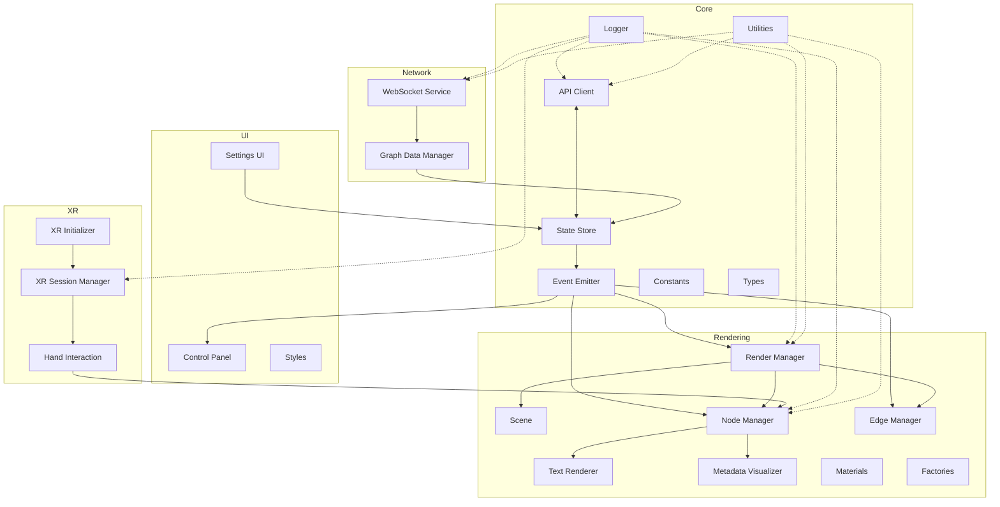
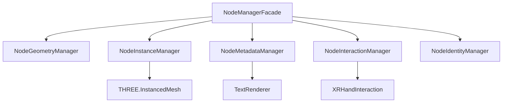
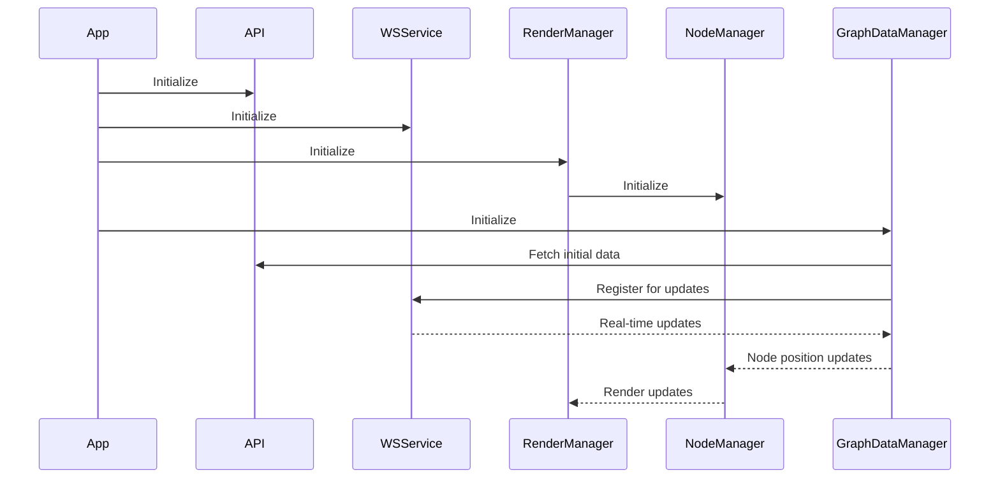

# Client Components

This document details the client component architecture, describing the relationships between major components, their responsibilities, and dependencies.

## Component Overview

The client is organized into a modular component architecture with clear separation of concerns. Each component has well-defined responsibilities and interfaces.



## Core Components

### API Client (`client/core/api.ts`)
Provides a centralized interface for communicating with the server REST API.

**Responsibilities:**
- Build API URLs for different endpoints
- Handle authentication headers
- Provide helper functions for API requests

**Key Dependencies:**
- Constants for API endpoints
- Types for request/response formats

### State Management
Manages application state and provides reactive updates.

**Key Components:**
- `SettingsStore` (`client/state/SettingsStore.ts`) - Manages application settings
- `GraphData` (`client/state/graphData.ts`) - Manages graph data state
- `SettingsObserver` (`client/state/SettingsObserver.ts`) - Observes setting changes

**Responsibilities:**
- Store and validate application settings
- Track graph data and node positions
- Propagate state changes to subscribers

### Event Emitter (`client/utils/eventEmitter.ts`)
Provides a pub/sub mechanism for cross-component communication.

**Responsibilities:**
- Register event listeners
- Dispatch events to listeners
- Unregister listeners when no longer needed

### Logger (`client/core/logger.ts`)
Provides centralized logging with different levels.

**Responsibilities:**
- Log messages with appropriate severity
- Add metadata to log messages
- Control log output based on debug settings

## Rendering Components

### Render Manager (`client/rendering/renderManager.ts`)
Orchestrates the rendering pipeline and manages Three.js integration.

**Responsibilities:**
- Initialize Three.js scene, camera, and renderer
- Manage render loop and animation frame requests
- Coordinate between different rendering components

**Key Dependencies:**
- Three.js
- Node Manager
- Edge Manager
- Scene setup

### Node Manager Facade (`client/rendering/node/NodeManagerFacade.ts`)
Provides a unified interface to the node management subsystem.

**Responsibilities:**
- Coordinate between node geometry, instance, metadata, and interaction managers
- Update node positions and states
- Handle XR interactions with nodes

**Component Structure:**


### Edge Manager (`client/rendering/EdgeManager.ts`)
Manages the visual representation of edges connecting nodes.

**Responsibilities:**
- Create and update edge geometries
- Manage edge materials and appearance
- Update edge positions based on connected nodes

### Text Renderer (`client/rendering/textRenderer.ts`)
Renders text labels in 3D space.

**Responsibilities:**
- Create and position text elements
- Manage text appearance and visibility
- Handle SDF font rendering for crisp text

## Network Components

### WebSocket Service (`client/websocket/websocketService.ts`)
Manages WebSocket connection and communication with the server.

**Responsibilities:**
- Establish and maintain WebSocket connection
- Send and receive WebSocket messages
- Handle binary protocol for position updates
- Manage reconnection on connection loss

### Graph Data Manager (`client/state/graphData.ts`)
Manages graph data loading, updates, and state.

**Responsibilities:**
- Load initial graph data
- Process graph updates
- Track node and edge data
- Manage binary position updates

## XR Components

### XR Initializer (`client/xr/xrInitializer.ts`)
Initializes WebXR capabilities and sessions.

**Responsibilities:**
- Check WebXR availability
- Initialize WebXR sessions
- Set up XR reference space

### XR Session Manager (`client/xr/xrSessionManager.ts`)
Manages WebXR sessions and state.

**Responsibilities:**
- Start and end XR sessions
- Track XR session state
- Manage XR reference spaces

### Hand Interaction (`client/xr/handInteraction.ts`)
Handles XR hand tracking and interactions.

**Responsibilities:**
- Track hand positions
- Handle grabbing and manipulation gestures
- Interact with nodes and UI elements in XR

## UI Components

### Control Panel (`client/ui/ModularControlPanel.ts`)
Provides user interface controls for the application.

**Responsibilities:**
- Display control panels
- Handle user input
- Update application state based on input

### Settings UI
Provides interfaces for configuring application settings.

**Responsibilities:**
- Display settings options
- Validate user input
- Update settings in Settings Store

## Component Initialization Sequence



## Component Communication Patterns

The application uses several communication patterns:

1. **Direct method calls** - For tightly coupled components
2. **Event-based communication** - For loosely coupled components
3. **State subscriptions** - For components that need to react to state changes
4. **WebSocket messages** - For server-client communication

## Interface Contracts

Key interface contracts between components:

### Node Manager Interface
```typescript
interface NodeManagerInterface {
  updateNodes(nodes: { id: string, data: NodeData }[]): void;
  updateNodePositions(nodes: { id: string, data: { position: Vector3, velocity?: Vector3 } }[]): void;
  handleHandInteraction(hand: XRHandWithHaptics): void;
  update(deltaTime: number): void;
  setXRMode(enabled: boolean): void;
  handleSettingsUpdate(settings: Settings): void;
  dispose(): void;
}
```

### WebSocket Service Interface
```typescript
interface WebSocketServiceInterface {
  connect(): Promise<void>;
  sendMessage(message: any): void;
  onBinaryMessage(callback: BinaryMessageCallback): void;
  onConnectionStatusChange(handler: (status: boolean) => void): void;
  enableRandomization(enabled: boolean): void;
  sendNodeUpdates(updates: NodeUpdate[]): void;
  getConnectionStatus(): ConnectionState;
  dispose(): void;
}
```

### Graph Data Manager Interface
```typescript
interface GraphDataManagerInterface {
  fetchInitialData(): Promise<void>;
  updateGraphData(data: any): void;
  enableBinaryUpdates(): void;
  updateNodePositions(positions: Float32Array): void;
  getGraphData(): GraphData;
  getNode(id: string): Node | undefined;
  subscribe(listener: (data: GraphData) => void): () => void;
  subscribeToPositionUpdates(listener: (positions: Float32Array) => void): () => void;
  clear(): void;
}
```

## Dependency Injection

The application uses a mix of dependency injection patterns:

1. **Singleton Registry** - Most manager classes provide static getInstance() methods
2. **Constructor Injection** - Some components take dependencies in constructors
3. **Method Injection** - Some methods accept dependencies as parameters

## Related Documentation

- [Architecture Overview](architecture.md)
- [State Management](state.md)
- [Rendering System](rendering.md)
- [XR Integration](xr.md)