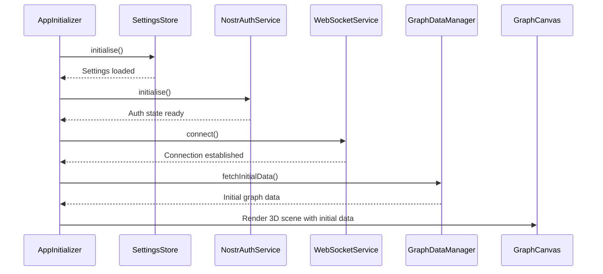

# Client Components

This document details the client component architecture, describing the relationships between major components, their responsibilities, and dependencies.

## Component Overview

The client is organized into a modular component architecture with clear separation of concerns. Each component has well-defined responsibilities and interfaces.

```mermaid
flowchart TB
    subgraph CoreServices [Core Services & Stores]
        APIService[api.ts]
        SettingsStore["settingsStore.ts"]
        NostrAuthSvc[nostrAuthService.ts]
        Logger[logger.ts]
        Utils[utils/*]
    end

    subgraph AppInit [Application Initialization]
        AppInitializer[AppInitializer.tsx]
        Main[main.tsx]
    end

    subgraph MainUILayout [Main UI Layout & Panels]
        TwoPaneLayout[TwoPaneLayout.tsx]
        RightPaneCtrlPanel[RightPaneControlPanel.tsx]
        ConversationPane[ConversationPane.tsx]
        NarrativeGoldminePanel[NarrativeGoldminePanel.tsx]
    end

    subgraph SettingsUI [Settings UI Components]
        SettingsPanelRedesignOptimized[SettingsPanelRedesignOptimized.tsx]
        TabsUI["Tabs.tsx"]
        SettingsSection[SettingsSection.tsx]
        SettingControlComp[SettingControlComponent.tsx]
    end

    subgraph AuthUI [Authentication UI]
        AuthUIHandler[AuthUIHandler.tsx]
        NostrAuthSection[NostrAuthSection.tsx]
    end

    subgraph RenderingEngine ["Rendering Engine"]
        GraphCanvas[GraphCanvas.tsx]
        GraphManager[GraphManager.tsx]
        GraphViewport[GraphViewport.tsx]
        CameraController[CameraController.tsx]
        TextRenderer[TextRenderer.tsx]
        MetadataVisualizer[MetadataVisualizer.tsx]
        HologramManager[HologramManager.tsx]
    end

    subgraph Network [Network & Data Management]
        WebSocketSvc[WebSocketService.ts]
        GraphDataMgr[GraphDataManager.ts]
    end

    subgraph XRModule [XR Module]
        XRController[XRController.tsx]
        XRScene[XRScene.tsx]
        XRVisualisationConnector[XRVisualisationConnector.tsx]
        HandInteractionSystem[HandInteractionSystem.tsx]
        XRInitializer[xrInitializer.ts]
        XRSessionManager[xrSessionManager.ts]
    end

    subgraph GenericUI [Generic UI Components]
        MarkdownRenderer[MarkdownRenderer.tsx]
        Button[Button.tsx]
        Input[Input.tsx]
        %% Add other generic UI components as needed
    end

    %% Initialization Flow
    Main --> AppInitializer
    AppInitializer --> SettingsStore
    AppInitializer --> NostrAuthSvc
    AppInitializer --> WebSocketSvc
    AppInitializer --> GraphDataMgr
    AppInitializer --> TwoPaneLayout
    AppInitializer --> AuthUIHandler
    AppInitializer --> XRController

    %% UI Structure
    TwoPaneLayout --> GraphViewport
    TwoPaneLayout --> RightPaneCtrlPanel
    TwoPaneLayout --> ConversationPane
    TwoPaneLayout --> NarrativeGoldminePanel

    RightPaneCtrlPanel --> NostrAuthSection
    RightPaneCtrlPanel --> SettingsPanelRedesignOptimized

    SettingsPanelRedesignOptimized --> TabsUI
    TabsUI --> SettingsSection
    SettingsSection --> SettingControlComp

    %% Data Flow & Dependencies
    SettingsStore --> SettingControlComp
    SettingsStore --> GraphManager
    SettingsStore --> HologramManager
    SettingsStore --> TextRenderer

    AuthUIHandler --> NostrAuthSvc
    NostrAuthSvc --> APIService

    ConversationPane --> APIService
    NarrativeGoldminePanel --> APIService

    WebSocketSvc --> GraphDataMgr
    GraphDataMgr --> GraphManager
    GraphDataMgr --> APIService

    %% Rendering Dependencies
    GraphCanvas --> GraphManager
    GraphCanvas --> GraphViewport
    GraphCanvas --> CameraController
    GraphManager --> TextRenderer
    GraphManager --> MetadataVisualizer
    GraphManager --> HologramManager

    %% XR Dependencies
    XRController --> XRScene
    XRController --> XRInitializer
    XRController --> XRSessionManager
    XRScene --> XRVisualisationConnector
    XRVisualisationConnector --> GraphManager
    XRVisualisationConnector --> HandInteractionSystem
    HandInteractionSystem --> GraphManager

    %% Cross-cutting
    Logger -.-> APIService
    Logger -.-> WebSocketSvc
    Logger -.-> GraphManager
    Logger -.-> XRController
    Utils -.-> SettingsStore
    Utils -.-> GraphDataMgr

    style CoreServices fill:#3A3F47,stroke:#61DAFB,color:#FFFFFF
    style AppInit fill:#3A3F47,stroke:#61DAFB,color:#FFFFFF
    style MainUILayout fill:#3A3F47,stroke:#61DAFB,color:#FFFFFF
    style SettingsUI fill:#3A3F47,stroke:#61DAFB,color:#FFFFFF
    style AuthUI fill:#3A3F47,stroke:#61DAFB,color:#FFFFFF
    style RenderingEngine fill:#3A3F47,stroke:#61DAFB,color:#FFFFFF
    style Network fill:#3A3F47,stroke:#61DAFB,color:#FFFFFF
    style XRModule fill:#3A3F47,stroke:#61DAFB,color:#FFFFFF
    style GenericUI fill:#3A3F47,stroke:#61DAFB,color:#FFFFFF

    style APIService fill:#3A3F47,stroke:#61DAFB,color:#FFFFFF
    style SettingsStore fill:#3A3F47,stroke:#61DAFB,color:#FFFFFF
    style NostrAuthSvc fill:#3A3F47,stroke:#61DAFB,color:#FFFFFF
    style Logger fill:#3A3F47,stroke:#61DAFB,color:#FFFFFF
    style Utils fill:#3A3F47,stroke:#61DAFB,color:#FFFFFF
    style AppInitializer fill:#3A3F47,stroke:#61DAFB,color:#FFFFFF
    style Main fill:#3A3F47,stroke:#61DAFB,color:#FFFFFF
    style TwoPaneLayout fill:#3A3F47,stroke:#61DAFB,color:#FFFFFF
    style RightPaneCtrlPanel fill:#3A3F47,stroke:#61DAFB,color:#FFFFFF
    style ConversationPane fill:#3A3F47,stroke:#61DAFB,color:#FFFFFF
    style NarrativeGoldminePanel fill:#3A3F47,stroke:#61DAFB,color:#FFFFFF
    style SettingsPanelRedesignOptimized fill:#3A3F47,stroke:#61DAFB,color:#FFFFFF
    style TabsUI fill:#3A3F47,stroke:#61DAFB,color:#FFFFFF
    style SettingsSection fill:#3A3F47,stroke:#61DAFB,color:#FFFFFF
    style SettingControlComp fill:#3A3F47,stroke:#61DAFB,color:#FFFFFF
    style AuthUIHandler fill:#3A3F47,stroke:#61DAFB,color:#FFFFFF
    style NostrAuthSection fill:#3A3F47,stroke:#61DAFB,color:#FFFFFF
    style GraphCanvas fill:#3A3F47,stroke:#61DAFB,color:#FFFFFF
    style GraphManager fill:#3A3F47,stroke:#61DAFB,color:#FFFFFF
    style GraphViewport fill:#3A3F47,stroke:#61DAFB,color:#FFFFFF
    style CameraController fill:#3A3F47,stroke:#61DAFB,color:#FFFFFF
    style TextRenderer fill:#3A3F47,stroke:#61DAFB,color:#FFFFFF
    style MetadataVisualizer fill:#3A3F47,stroke:#61DAFB,color:#FFFFFF
    style HologramManager fill:#3A3F47,stroke:#61DAFB,color:#FFFFFF
    style WebSocketSvc fill:#3A3F47,stroke:#61DAFB,color:#FFFFFF
    style GraphDataMgr fill:#3A3F47,stroke:#61DAFB,color:#FFFFFF
    style XRController fill:#3A3F47,stroke:#61DAFB,color:#FFFFFF
    style XRScene fill:#3A3F47,stroke:#61DAFB,color:#FFFFFF
    style XRVisualisationConnector fill:#3A3F47,stroke:#61DAFB,color:#FFFFFF
    style HandInteractionSystem fill:#3A3F47,stroke:#61DAFB,color:#FFFFFF
    style XRInitializer fill:#3A3F47,stroke:#61DAFB,color:#FFFFFF
    style XRSessionManager fill:#3A3F47,stroke:#61DAFB,color:#FFFFFF
    style MarkdownRenderer fill:#3A3F47,stroke:#61DAFB,color:#FFFFFF
    style Button fill:#3A3F47,stroke:#61DAFB,color:#FFFFFF
    style Input fill:#3A3F47,stroke:#61DAFB,color:#FFFFFF
```



## Core Components

### API Service ([`client/src/services/api.ts`](../../client/src/services/api.ts))
Provides a centralized interface for communicating with the server REST API.

**Responsibilities:**
- Build API URLs for different endpoints.
- Handle authentication headers (often in conjunction with `nostrAuthService.ts`).
- Provide helper functions for API requests (e.g., fetching graph data, user settings, interacting with AI services).

**Key Dependencies:**
- `nostrAuthService.ts` for obtaining auth tokens.
- Type definitions for request/response payloads.

### State Management
Manages application state and provides reactive updates using Zustand.

**Key Components:**
- `SettingsStore` ([`client/src/store/settingsStore.ts`](../../client/src/store/settingsStore.ts)) - Manages application settings.
- `GraphDataManager` ([`client/src/features/graph/managers/graphDataManager.ts`](../../client/src/features/graph/managers/graphDataManager.ts)) - Manages graph data state and updates.

**Responsibilities:**
- Store and validate application settings.
- Track graph data (nodes, edges) and their positions.
- Propagate state changes to subscribers via Zustand's subscription mechanism.

### Core Components - Event Emitter
A dedicated global `eventEmitter.ts` is **not** used in this project. Communication and event handling are achieved through:
- **Zustand Store Subscriptions**: Components subscribe to `settingsStore` or `graphDataManager` (if it exposes an observable/subscription pattern) for reactive updates to specific state slices.
- **React Context API**: Contexts like `ApplicationModeContext`, `WindowSizeContext`, and `control-panel-context` are used to share state and functions down the component tree.
- **Direct Prop Passing**: Standard React mechanism for parent-child component communication.
- **WebSocket Messages**: `WebSocketService` handles messages from the server, which are then typically processed by `GraphDataManager` or other relevant services/stores to update application state. Callbacks registered with `WebSocketService` (e.g., `onMessage`, `onBinaryMessage`) act as event handlers for server-sent events.

### Logger ([`client/src/utils/logger.ts`](../../client/src/utils/logger.ts))
Provides centralized logging with different levels.

**Responsibilities:**
- Log messages with appropriate severity (debug, info, warn, error).
- Add metadata to log messages (timestamps, component source).
- Control log output based on environment or debug settings.

## Rendering Components

### Graph Canvas ([`client/src/features/graph/components/GraphCanvas.tsx`](../../client/src/features/graph/components/GraphCanvas.tsx))
The main entry point for the React Three Fiber (R3F) scene. It sets up the WebGL renderer, camera, and basic scene elements.

### Graph Manager ([`client/src/features/graph/components/GraphManager.tsx`](../../client/src/features/graph/components/GraphManager.tsx))
Manages the rendering of nodes and edges within the 3D scene. It handles instanced meshes for performance and orchestrates updates based on graph data from `GraphDataManager`. This component effectively serves as the "Node Manager" and "Edge Manager".

### Graph Viewport ([`client/src/features/graph/components/GraphViewport.tsx`](../../client/src/features/graph/components/GraphViewport.tsx))
Manages the camera, lighting, and post-processing effects for the 3D scene.

### Text Renderer ([`client/src/features/visualisation/renderers/TextRenderer.tsx`](../../client/src/features/visualisation/renderers/TextRenderer.tsx))
Renders text labels in 3D space using SDF fonts, typically associated with nodes.

### Metadata Visualizer ([`client/src/features/visualisation/components/MetadataVisualizer.tsx`](../../client/src/features/visualisation/components/MetadataVisualizer.tsx))
Displays metadata associated with nodes in the 3D scene, potentially as interactive elements.

### Hologram Manager ([`client/src/features/visualisation/renderers/HologramManager.tsx`](../../client/src/features/visualisation/renderers/HologramManager.tsx))
Manages the rendering of holographic effects for nodes, using custom shaders like `HologramMaterial.tsx`.

### Camera Controller ([`client/src/features/visualisation/components/CameraController.tsx`](../../client/src/features/visualisation/components/CameraController.tsx))
Handles camera controls (orbit, pan, zoom) and interactions within the 3D scene.

### Edge Manager
Edge rendering logic is primarily integrated within [`GraphManager.tsx`](../../client/src/features/graph/components/GraphManager.tsx), which handles the creation, updating, and styling of edge geometries and materials based on data from `GraphDataManager`.

## Network Components

### WebSocket Service ([`client/src/services/WebSocketService.ts`](../../client/src/services/WebSocketService.ts))
Manages WebSocket connection, message serialization/deserialization (including binary protocol), and communication with the server.

### Graph Data Manager ([`client/src/features/graph/managers/graphDataManager.ts`](../../client/src/features/graph/managers/graphDataManager.ts))
Manages graph data loading (initial fetch via REST, subsequent updates via WebSocket), state, and provides an interface for other components to access and interact with graph data.

## XR Components

### XR Controller ([`client/src/features/xr/components/XRController.tsx`](../../client/src/features/xr/components/XRController.tsx))
The main component for managing WebXR sessions and interactions.

### XR Scene ([`client/src/features/xr/components/XRScene.tsx`](../../client/src/features/xr/components/XRScene.tsx))
A wrapper component for the R3F scene when in XR mode.

### XR Visualisation Connector ([`client/src/features/xr/components/XRVisualisationConnector.tsx`](../../client/src/features/xr/components/XRVisualisationConnector.tsx))
Connects the main 3D visualisation components (like `GraphManager`) to the XR environment, adapting interactions and rendering for XR.

### Hand Interaction System ([`client/src/features/xr/systems/HandInteractionSystem.tsx`](../../client/src/features/xr/systems/HandInteractionSystem.tsx))
Handles WebXR hand tracking and interactions, including gesture recognition and mapping them to application actions.

### XR Initializer ([`client/src/features/xr/managers/xrInitializer.ts`](../../client/src/features/xr/managers/xrInitializer.ts))
Initializes WebXR capabilities and sessions, checking for browser support.

### XR Session Manager ([`client/src/features/xr/managers/xrSessionManager.ts`](../../client/src/features/xr/managers/xrSessionManager.ts))
Manages WebXR sessions and their lifecycle (start, end, events).

### Safe XR Provider ([`client/src/features/xr/providers/SafeXRProvider.tsx`](../../client/src/features/xr/providers/SafeXRProvider.tsx))
Provides a safe context for WebXR hooks and components, handling browser compatibility checks.

## UI Components

### Right Pane Control Panel ([`client/src/app/components/RightPaneControlPanel.tsx`](../../client/src/app/components/RightPaneControlPanel.tsx))
Manages the content displayed in the right pane of the main application layout, including settings, authentication, and feature panels.

### Settings Panel Redesign ([`client/src/features/settings/components/panels/SettingsPanelRedesignOptimized.tsx`](../../client/src/features/settings/components/panels/SettingsPanelRedesignOptimized.tsx))
Provides the tabbed interface for organizing different categories of settings (Visualisation, System, AI, XR) within the right pane, utilizing [`client/src/ui/Tabs.tsx`](../../client/src/ui/Tabs.tsx).

### Settings Sections ([`client/src/features/settings/components/SettingsSection.tsx`](../../client/src/features/settings/components/SettingsSection.tsx))
Used within panels (like `SettingsPanelRedesign`) to group related settings. Supports collapsible sections.

### Setting Control Component ([`client/src/features/settings/components/SettingControlComponent.tsx`](../../client/src/features/settings/components/SettingControlComponent.tsx))
Renders individual UI controls (sliders, toggles, inputs, color pickers, etc.) for each setting based on its definition in `settingsUIDefinition.ts`.

### Auth UI Handler ([`client/src/features/auth/components/AuthUIHandler.tsx`](../../client/src/features/auth/components/AuthUIHandler.tsx))
Manages the authentication user interface and logic, primarily for Nostr authentication, often hosting `NostrAuthSection.tsx`.

### Markdown Renderer ([`client/src/ui/markdown/MarkdownRenderer.tsx`](../../client/src/ui/markdown/MarkdownRenderer.tsx))
Renders Markdown content within the application, used for displaying detailed information or help texts.

### Conversation Pane ([`client/src/app/components/ConversationPane.tsx`](../../client/src/app/components/ConversationPane.tsx))
Provides the UI for interacting with AI chat services (e.g., RAGFlow).

### Narrative Goldmine Panel ([`client/src/app/components/NarrativeGoldminePanel.tsx`](../../client/src/app/components/NarrativeGoldminePanel.tsx))
A panel dedicated to features for exploring and analyzing narrative elements within the graph data.

## Component Initialization Sequence

The application initialization flow is orchestrated by [`client/src/app/main.tsx`](../../client/src/app/main.tsx) which renders [`client/src/app/AppInitializer.tsx`](../../client/src/app/AppInitializer.tsx).



## Component Communication Patterns

The application uses several communication patterns:

1. **React Props and State** - Standard React data flow for parent-child communication.
2. **Zustand Store Subscriptions** - Components subscribe to specific parts of the `SettingsStore` or `GraphDataManager` for reactive updates.
3. **React Context API** - Used for providing global state and services to components (e.g., `ApplicationModeContext`, `WindowSizeContext`, `control-panel-context`).
4. **WebSocket Messages** - For real-time server-client communication, managed by `WebSocketService` and `GraphDataManager`.

## Interface Contracts

Key interface contracts between components:

### Node Manager Interface
The concept of a `NodeManagerInterface` is primarily embodied by the [`GraphManager.tsx`](../../client/src/features/graph/components/GraphManager.tsx) component. It is responsible for taking data from `GraphDataManager` and rendering/managing the visual representation of nodes (and edges) in the R3F scene.

### WebSocket Service Interface
```typescript
interface WebSocketServiceInterface {
  connect(url?: string): Promise<void>;
  sendMessage(message: object): void; // For JSON messages
  sendRawBinaryData(data: ArrayBuffer): void; // For binary messages
  onMessage(callback: (data: any) => void): () => void; // For JSON messages
  onBinaryMessage(callback: (data: ArrayBuffer) => void): () => void; // For binary messages
  onConnectionStatusChange(handler: (status: { connected: boolean; error?: any }) => void): () => void;
  isReady(): boolean; // Checks if connected and server is ready
  close(): void;
  setCustomBackendUrl(url: string): void; // Allows overriding the default WebSocket URL
}
```
Corresponds to methods in [`client/src/services/WebSocketService.ts`](../../client/src/services/WebSocketService.ts).

### Graph Data Manager Interface
```typescript
interface GraphDataManagerInterface {
  fetchInitialData(): Promise<void>;
  setGraphData(nodes: Node[], edges: Edge[], metadata?: Record<string, any>): void;
  updateNodePositions(data: ArrayBuffer): void;
  // sendNodePositions(): void; // This might be handled internally or via a different mechanism
  getGraphData(): { nodes: Node[]; edges: Edge[]; metadata: Record<string, any> };
  getNodeById(id: string): Node | undefined;
  onGraphDataChange(listener: (graphData: { nodes: Node[]; edges: Edge[] }) => void): () => void; // Subscription for overall graph data changes
  onPositionUpdate(listener: (updates: { nodeId: number; position: { x: number; y: number; z: number }}[] ) => void): () => void; // Subscription for position updates
  setWebSocketService(wsService: WebSocketServiceInterface): void;
  setBinaryUpdatesEnabled(enabled: boolean): void;
  ensureNodeHasValidPosition(nodeId: string): void;
  // Other methods like addNode, removeNode, addEdge, removeEdge might exist
}
```
The `graphDataManager` now delegates binary data processing to a web worker.
Corresponds to methods and properties in [`client/src/features/graph/managers/graphDataManager.ts`](../../client/src/features/graph/managers/graphDataManager.ts).

## Dependency Injection

The application primarily uses React's built-in mechanisms for dependency injection:

1.  **Zustand Store**: Components directly import and use Zustand stores (`settingsStore`, potentially others) which act as global, injectable state containers. This is the primary method for managing shared application state.
2.  **React Context API**: Used for more localized state sharing or providing specific functionalities down a component subtree. Examples:
    - [`ApplicationModeContext`](../../client/src/contexts/ApplicationModeContext.tsx)
    - [`WindowSizeContext`](../../client/src/contexts/WindowSizeContext.tsx)
    - [`control-panel-context`](../../client/src/features/settings/components/control-panel-context.tsx) (for managing control panel specific state like detached panels).
3.  **Prop Drilling**: Standard React prop passing is used for direct parent-to-child dependency provision, especially for UI components.
4.  **Service Instantiation/Import**: Services like `WebSocketService.getInstance()`, `nostrAuthService`, and `apiService` are often singletons or directly imported modules, making them available globally or within specific parts of the application.

## Related Documentation

- [Architecture Overview](architecture.md)
- [State Management](state.md)
- [Rendering System](rendering.md)
- [XR Integration](xr.md)