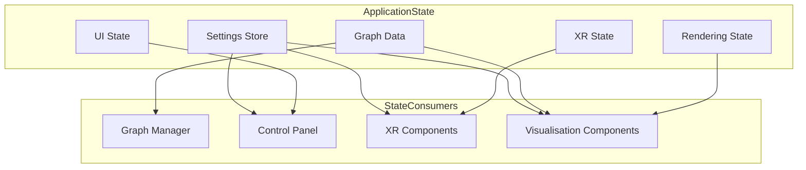
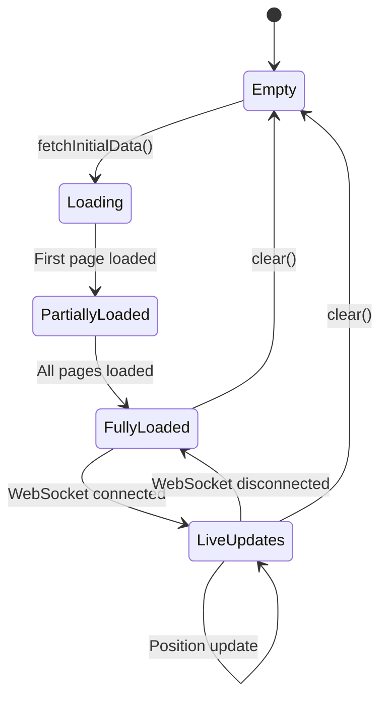
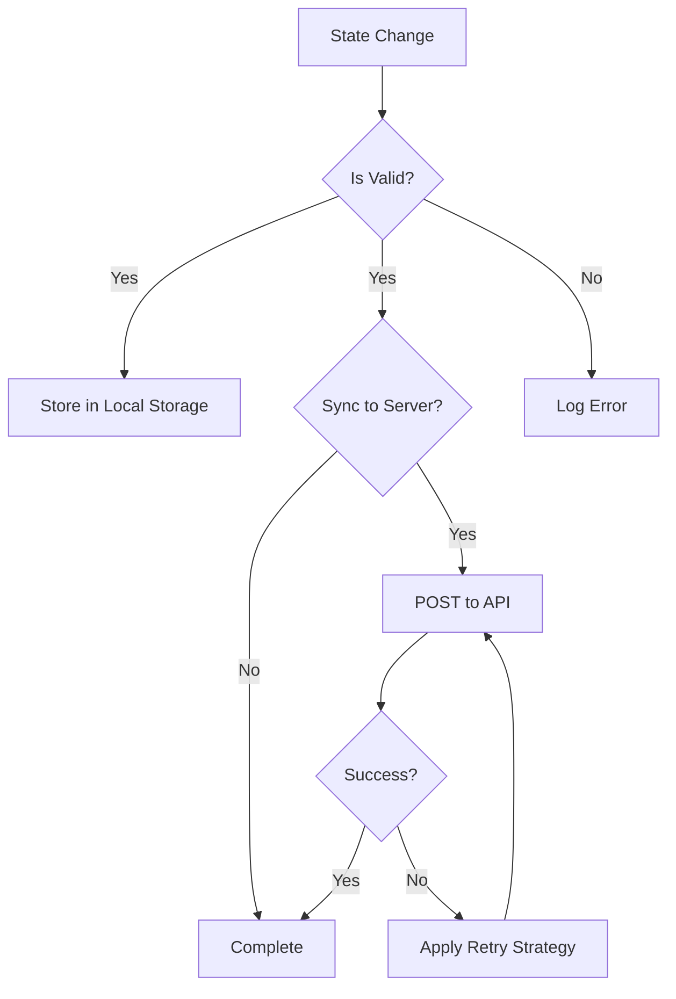

# State Management

This document details the state management patterns and mechanisms used throughout the client application. The application uses several complementary approaches to state management to handle different types of state.

## State Management Overview

The client application manages several types of state:

1.  **Application Settings** - User preferences and application configuration
2.  **Graph Data** - Nodes, edges, and metadata for the visualisation
3.  **UI State** - Control panel state, selected items, and UI configuration
4.  **Rendering State** - Camera position, visibility settings, and rendering options
5.  **XR State** - XR session status, controller positions, and interaction state



## Key State Management Components

### Settings Store (`client/src/store/settingsStore.ts`)

The Settings Store manages application settings with validation, persistence, and observation.

**Key Features:**
- Persistence to local storage and server
- Observable changes through Zustand's subscription mechanism
- Default values for all settings
- Uses `immer` middleware for immutable updates

**Implementation Pattern (Zustand):**
The `settingsStore` is a Zustand store, which provides a simplified API for state management.
```typescript
import { create } from 'zustand';
import { persist } from 'zustand/middleware';
import { immer } from 'zustand/middleware/immer';
import { Settings } from '../features/settings/config/settings';
import { defaultSettings } from '../features/settings/config/defaultSettings';
import { settingsConfig } from '../features/settings/config/settingsConfig';
import { deepMerge } from '../../utils/deepMerge';
import { logger } from '../../utils/logger';

interface SettingsState {
  settings: Settings;
  set: <T>(path: SettingsPath, value: T) => void;
  updateSettings: (updater: (draft: Settings) => void) => void;
  // ... other actions
}

export const useSettingsStore = create<SettingsState>()(
  persist(
    (set, get) => ({
      settings: defaultSettings,
      set: (path, value) => {
        set(produce(state => {
          // Logic to update nested state immutably
          // This is handled by Immer's produce function
          let current: any = state.settings;
          const pathParts = path.split('.');
          for (let i = 0; i < pathParts.length - 1; i++) {
            const part = pathParts[i];
            if (current[part] === undefined || current[part] === null) {
              current[part] = {};
            }
            current = current[part];
          }
          current[pathParts[pathParts.length - 1]] = value;
        }));
        // ... notification and server sync logic
      },
      updateSettings: (updater) => {
        set(produce(state => {
          updater(state.settings);
        }));
        // ... notification and server sync logic
      },
      // ... other actions like initialize, reset, get, subscribe, unsubscribe
    }),
    {
      name: 'logseq-xr-settings',
      storage: createJSONStorage(() => localStorage),
      // ... other persist options
    }
  )
);
```

**Settings Validation:**
While `client/src/features/settings/types/settingsSchema.ts` defines a Zod schema for settings, explicit runtime validation using this schema is not directly performed within the `set` or `updateSettings` methods of `settingsStore.ts`. Instead, the store relies on the type safety provided by TypeScript and the assumption that settings updates originate from UI components that respect the defined types. Any validation errors would typically be caught at the point of input or during API serialization on the server.

### Graph Data Manager (`client/src/features/graph/managers/graphDataManager.ts`)

The Graph Data Manager maintains the state of the graph visualisation data.

**Key Features:**
- Loads and processes graph data from server
- Manages node and edge collections
- Handles real-time position updates via binary protocol
- Provides subscription mechanism for changes

**State Transitions:**


### Settings Observer
The `SettingsObserver.ts` file is not present in the current codebase. Instead, the `settingsStore.ts` (which uses Zustand) directly handles subscriptions. Components can subscribe to specific parts of the settings store using Zustand's selectors, eliminating the need for a separate observer pattern implementation.

## State Persistence

The application persists state in several ways:

1.  **Local Storage** - User preferences and UI state (managed by Zustand's `persist` middleware).
2.  **Server Storage** - User settings synchronized to server (for authenticated users).
3.  **URL Parameters** - Shareable state in URL (not extensively used for persistence, more for initial configuration).

### Persistence Flow



## State Change Propagation

The application uses several mechanisms to propagate state changes:

### Event Emitter
The `client/utils/eventEmitter.ts` file is not present in the current codebase. Communication between components is primarily handled through:
- React's component hierarchy (props and context).
- Zustand store subscriptions.
- Direct function calls.
- WebSocket messages for server-client communication.

### Direct Subscriptions

Components can subscribe directly to state stores.

**Example:**
```typescript
// Subscribe to graph data changes
const unsubscribe = graphDataManager.subscribe((data) => {
  // Update component based on new data
});

// Subscribe to settings changes
const unsubscribe = useSettingsStore.subscribe(
  (settings) => {
    // Update component based on new settings
  },
  (state) => state.settings // Selector to subscribe to the entire settings object
);
```

## Settings Structure

The settings are defined by the `Settings` interface in `client/src/features/settings/config/settings.ts`. The structure of the settings for UI presentation and control is further defined in `client/src/features/settings/config/settingsUIDefinition.ts`. This allows for a flexible and hierarchical organization of settings.

```typescript
// Simplified representation of the Settings interface from client/src/features/settings/config/settings.ts
interface Settings {
  visualisation: {
    nodes: {
      nodeSize: number; // Changed from sizeRange: [number, number]
      baseColor: string;
      opacity: number;
      enableHologram: boolean;
      enableMetadataShape: boolean;
      quality: 'low' | 'medium' | 'high';
      enableInstancing: boolean;
      enableMetadataVisualisation: boolean;
    };
    edges: {
      color: string;
      opacity: number;
      arrowSize: number;
      baseWidth: number;
      enableArrows: boolean;
      widthRange: [number, number];
      quality: 'low' | 'medium' | 'high';
      enableFlowEffect: boolean;
      flowSpeed: number;
      flowIntensity: number;
      glowStrength: number;
      distanceIntensity: number;
      useGradient: boolean;
      gradientColors: [string, string];
    };
    physics: {
      enabled: boolean;
      attractionStrength: number;
      repulsionStrength: number;
      springStrength: number;
      damping: number;
      gravityStrength: number;
      centerAttractionStrength: number;
      boundsSize: number;
      collisionRadius: number;
      enableBounds: boolean;
      iterations: number;
      maxVelocity: number;
      repulsionDistance: number;
      massScale: number;
      boundaryDamping: number;
    };
    rendering: {
      ambientLightIntensity: number;
      backgroundColor: string;
      directionalLightIntensity: number;
      enableAmbientOcclusion: boolean;
      enableAntialiasing: boolean;
      enableShadows: boolean;
      environmentIntensity: number;
      shadowMapSize: string;
      shadowBias: number;
      context: 'desktop' | 'ar';
    };
    animations: {
      enableMotionBlur: boolean;
      enableNodeAnimations: boolean;
      motionBlurStrength: number;
      selectionWaveEnabled: boolean;
      pulseEnabled: boolean;
      pulseSpeed: number;
      pulseStrength: number;
      waveSpeed: number;
    };
    labels: {
      desktopFontSize: number;
      enableLabels: boolean;
      textColor: string;
      textOutlineColor: string;
      textOutlineWidth: number;
      textResolution: number;
      textPadding: number;
      billboardMode: 'camera' | 'vertical';
    };
    bloom: {
      edgeBloomStrength: number;
      enabled: boolean;
      environmentBloomStrength: number;
      nodeBloomStrength: number;
      radius: number;
      strength: number;
      threshold: number;
    };
    hologram: {
      ringCount: number;
      ringColor: string;
      ringOpacity: number;
      sphereSizes: [number, number];
      ringRotationSpeed: number;
      enableBuckminster: boolean;
      buckminsterSize: number;
      buckminsterOpacity: number;
      enableGeodesic: boolean;
      geodesicSize: number;
      geodesicOpacity: number;
      enableTriangleSphere: boolean;
      triangleSphereSize: number;
      triangleSphereOpacity: number;
      globalRotationSpeed: number;
    };
    camera?: CameraSettings;
  };
  system: {
    websocket: {
      reconnectAttempts: number;
      reconnectDelay: number;
      binaryChunkSize: number;
      binaryUpdateRate?: number;
      minUpdateRate?: number;
      maxUpdateRate?: number;
      motionThreshold?: number;
      motionDamping?: number;
      binaryMessageVersion?: number;
      compressionEnabled: boolean;
      compressionThreshold: number;
      heartbeatInterval?: number;
      heartbeatTimeout?: number;
      maxConnections?: number;
      maxMessageSize?: number;
      updateRate: number;
    };
    debug: {
      enabled: boolean;
      logLevel?: 'debug' | 'info' | 'warn' | 'error';
      logFormat?: 'json' | 'text';
      enableDataDebug: boolean;
      enableWebsocketDebug: boolean;
      logBinaryHeaders: boolean;
      logFullJson: boolean;
      enablePhysicsDebug: boolean;
      enableNodeDebug: boolean;
      enableShaderDebug: boolean;
      enableMatrixDebug: boolean;
      enablePerformanceDebug: boolean;
    };
    persistSettings: boolean;
    customBackendUrl?: string;
  };
  xr: {
    enabled: boolean;
    clientSideEnableXR?: boolean;
    mode?: 'inline' | 'immersive-vr' | 'immersive-ar';
    roomScale?: number;
    spaceType?: 'local-floor' | 'bounded-floor' | 'unbounded';
    quality?: 'low' | 'medium' | 'high';
    enableHandTracking: boolean;
    handMeshEnabled?: boolean;
    handMeshColor?: string;
    handMeshOpacity?: number;
    handPointSize?: number;
    handRayEnabled?: boolean;
    handRayColor?: string;
    handRayWidth?: number;
    gestureSmoothing?: number;
    enableHaptics: boolean;
    hapticIntensity?: number;
    dragThreshold?: number;
    pinchThreshold?: number;
    rotationThreshold?: number;
    interactionRadius?: number;
    movementSpeed?: number;
    deadZone?: number;
    movementAxesHorizontal?: number;
    movementAxesVertical?: number;
    enableLightEstimation?: boolean;
    enablePlaneDetection?: boolean;
    enableSceneUnderstanding?: boolean;
    planeColor?: string;
    planeOpacity?: number;
    planeDetectionDistance?: number;
    showPlaneOverlay?: boolean;
    snapToFloor?: boolean;
    enablePassthroughPortal?: boolean;
    passthroughOpacity?: number;
    passthroughBrightness?: number;
    passthroughContrast?: number;
    portalSize?: number;
    portalEdgeColor?: string;
    portalEdgeWidth?: number;
    controllerModel?: string;
    renderScale?: number;
    interactionDistance?: number;
    locomotionMethod?: 'teleport' | 'continuous';
    teleportRayColor?: string;
    displayMode?: 'inline' | 'immersive-vr' | 'immersive-ar';
    controllerRayColor?: string;
  };
  auth: AuthSettings;
  ragflow?: RAGFlowSettings;
  perplexity?: PerplexitySettings;
  openai?: OpenAISettings;
  kokoro?: KokoroSettings;
  whisper?: WhisperSettings;
}
```

### Settings Validation

Settings are validated against schemas that define:
- Type constraints
- Range constraints
- Required properties
- Default values

Invalid settings are rejected with error messages.

## State Immutability

The application uses immutability patterns to prevent unexpected state changes, primarily facilitated by the `immer` middleware in Zustand. This ensures that state updates always result in new state objects, simplifying change detection and preventing unintended side effects.

**Example of Immutable Update (handled by Immer in Zustand):**
```typescript
// When using Immer with Zustand, direct modification within the 'set' callback is safe:
set((state) => {
  state.user.name = "New Name"; // This is automatically converted to an immutable update
});

// Without Immer, you would manually create new objects:
set((state) => ({
  ...state,
  user: {
    ...state.user,
    name: "New Name"
  }
}));
```

## Related Documentation

- [Components](components.md) - Component relationships and dependencies
- [Architecture](architecture.md) - Overall system architecture
- [WebSocket Communication](websocket.md) - Real-time state updates