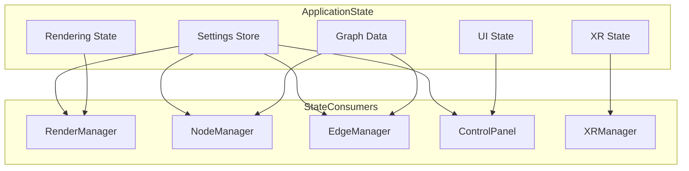
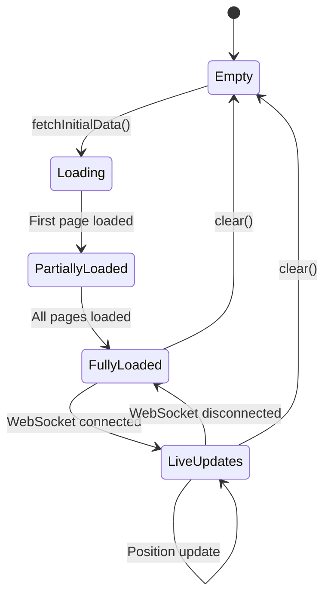
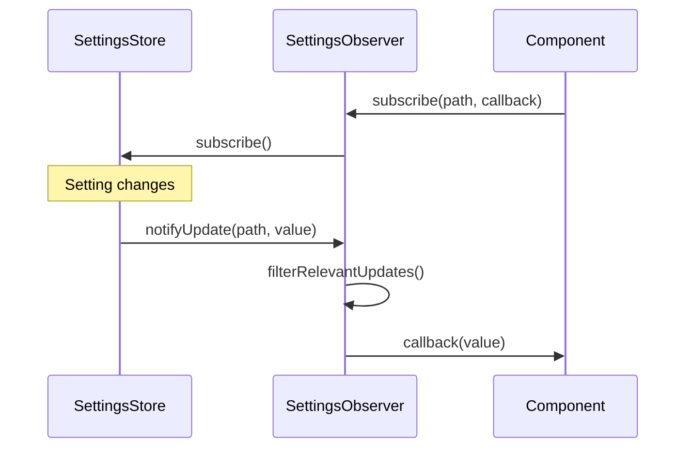
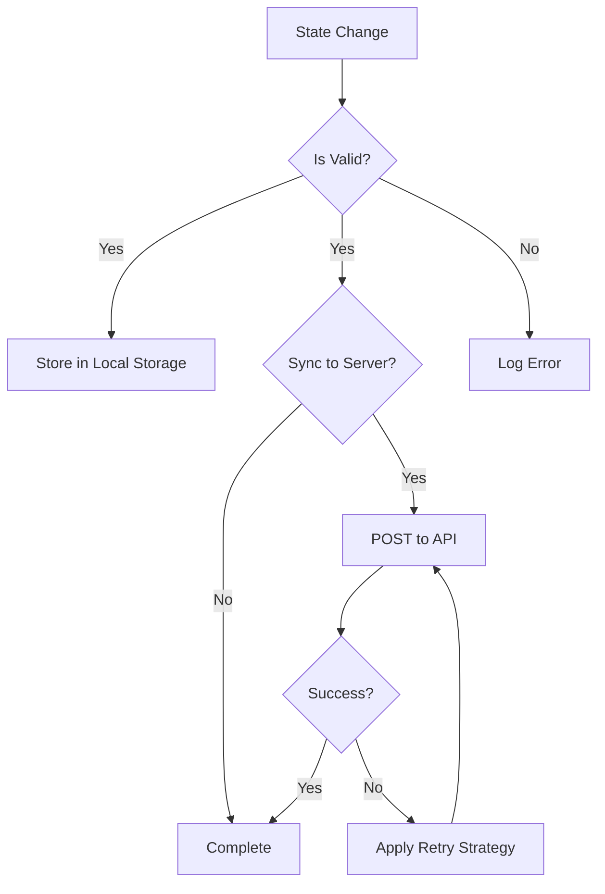

# State Management

This document details the state management patterns and mechanisms used throughout the client application. The application uses several complementary approaches to state management to handle different types of state.

## State Management Overview

The client application manages several types of state:

1. **Application Settings** - User preferences and application configuration
2. **Graph Data** - Nodes, edges, and metadata for the visualisation
3. **UI State** - Control panel state, selected items, and UI configuration
4. **Rendering State** - Camera position, visibility settings, and rendering options
5. **XR State** - XR session status, controller positions, and interaction state



## Key State Management Components

### Settings Store (`client/src/store/settingsStore.ts`)

The Settings Store manages application settings with validation, persistence, and observation.

**Key Features:**
- Schema-based validation of settings
- Persistence to local storage and server
- Observable changes through subscribers
- Default values for all settings

**Implementation Pattern (Zustand):**
The `settingsStore` is a Zustand store, which provides a simplified API for state management.
```typescript
import { create } from 'zustand';
import { persist } from 'zustand/middleware';
import { immer } from 'zustand/middleware/immer';
import { Settings } from '../features/settings/config/settings';
import { defaultSettings } from '../features/settings/config/defaultSettings';
import { settingsConfig } from '../features/settings/config/settingsConfig';
import { validateSettings } from '../features/settings/utils/settingsValidation';
import { deepMerge } from '../../utils/deepMerge';
import { logger } from '../../utils/logger';

interface SettingsState {
  settings: Settings;
  setSetting: (path: string, value: any) => void;
  // ... other actions
}

export const useSettingsStore = create<SettingsState>()(
  immer(
    persist(
      (set, get) => ({
        settings: defaultSettings,
        setSetting: (path, value) => {
          set((state) => {
            // Logic to update nested state immutably
            // Validation and persistence handled by middleware or internal logic
          });
        },
        // ... other actions like initialize, reset
      }),
      {
        name: 'logseq-xr-settings',
        getStorage: () => localStorage,
        // ... other persist options
      }
    )
  )
);
```

### Graph Data Manager (`client/src/features/graph/managers/graphDataManager.ts`)

The Graph Data Manager maintains the state of the graph visualisation data.

**Key Features:**
- Loads and processes graph data from server
- Manages node and edge collections
- Handles real-time position updates via binary protocol
- Provides subscription mechanism for changes

**State Transitions:**


### Settings Observer
The `SettingsObserver.ts` file is not present in the current codebase. Instead, the `settingsStore.ts` (which uses Zustand) directly handles subscriptions. Components can subscribe to specific parts of the settings store using Zustand's selectors, eliminating the need for a separate observer pattern implementation.

The Settings Observer implements the Observer pattern to propagate settings changes.

**Key Features:**
- Subscribes to Settings Store
- Filters and transforms settings updates
- Distributes settings to appropriate components

**Observer Pattern Implementation:**


## State Persistence

The application persists state in several ways:

1. **Local Storage** - User preferences and UI state
2. **Server Storage** - User settings synchronized to server
3. **URL Parameters** - Shareable state in URL

### Persistence Flow



## State Change Propagation

The application uses several mechanisms to propagate state changes:

### Event Emitter
The `client/utils/eventEmitter.ts` file is not present in the current codebase. Communication between components is primarily handled through:
- React's component hierarchy (props and context).
- Zustand store subscriptions.
- Direct function calls.
- WebSocket messages for server-client communication.

A publish-subscribe system for loose coupling between components.

**Key Features:**
- Named events with typed payloads
- Multiple subscribers per event
- Ability to unsubscribe
- Debugging and tracing capabilities

**Usage Pattern:**
```typescript
// Publisher
eventEmitter.emit('settings:changed', { path: 'visualisation.rendering.quality', value: 'high' });

// Subscriber
const unsubscribe = eventEmitter.on('settings:changed', (data) => {
  // Handle event
});

// Later
unsubscribe();
```

### Direct Subscriptions

Components can subscribe directly to state stores.

**Example:**
```typescript
// Subscribe to graph data changes
const unsubscribe = graphDataManager.subscribe((data) => {
  // Update component based on new data
});

// Subscribe to settings changes
const unsubscribe = settingsStore.subscribe((settings) => {
  // Update component based on new settings
});
```

## Settings Structure

The settings are defined by the `Settings` interface in `client/src/features/settings/config/settings.ts` and its structure is configured in `client/src/features/settings/config/settingsUIDefinition.ts`. The actual structure is more dynamic and less rigidly nested than the example below, but it generally follows a hierarchical pattern.

```typescript
// Simplified representation of the Settings interface
interface Settings {
  visualisation: {
    nodes: {
      quality: 'low' | 'medium' | 'high';
      enableInstancing: boolean;
      enableHologram: boolean;
      enableMetadataShape: boolean;
      sizeRange: [number, number];
      baseColor: string;
      opacity: number;
      // ... other node settings
    };
    edges: {
      color: string;
      opacity: number;
      arrowSize: number;
      baseWidth: number;
      enableArrows: boolean;
      widthRange: [number, number];
      quality: 'low' | 'medium' | 'high';
      // ... other edge settings
    };
    physics: {
      enabled: boolean;
      attractionStrength: number;
      repulsionStrength: number;
      springStrength: number;
      damping: number;
      // ... other physics settings
    };
    rendering: {
      ambientLightIntensity: number;
      directionalLightIntensity: number;
      environmentIntensity: number;
      backgroundColor: string;
      enableAmbientOcclusion: boolean;
      enableAntialiasing: boolean;
      enableShadows: boolean;
      // ... other rendering settings
    };
    animations: {
      enableNodeAnimations: boolean;
      enableMotionBlur: boolean;
      motionBlurStrength: number;
      // ... other animation settings
    };
    labels: {
      enableLabels: boolean;
      desktopFontSize: number;
      textColor: string;
      textOutlineColor: string;
      // ... other label settings
    };
    bloom: {
      enabled: boolean;
      strength: number;
      radius: number;
      threshold: number;
      // ... other bloom settings
    };
    hologram: {
      ringCount: number;
      sphereSizes: number[];
      ringRotationSpeed: number;
      globalRotationSpeed: number;
      // ... other hologram settings
    };
  };
  system: {
    websocket: {
      reconnectAttempts: number;
      reconnectDelay: number;
      binaryChunkSize: number;
      compressionEnabled: boolean;
      // ... other websocket settings
    };
    debug: {
      enabled: boolean;
      enableDataDebug: boolean;
      enableWebsocketDebug: boolean;
      logBinaryHeaders: boolean;
      // ... other debug settings
    };
  };
  xr: {
    mode: 'immersive-ar';
    roomScale: number;
    spaceType: 'local-floor';
    quality: 'low' | 'medium' | 'high';
    enableHandTracking: boolean;
    handMeshEnabled: boolean;
    handMeshColor: string;
    handMeshOpacity: number;
    // ... other XR settings
  };
  // ... other top-level categories like 'ai'
}
```

The settings are organized hierarchically by domain:

```typescript
interface Settings {
  visualisation: {
    nodes: {
      quality: 'low' | 'medium' | 'high';
      enableInstancing: boolean;
      enableHologram: boolean;
      enableMetadataShape: boolean;
      sizeRange: [number, number];
      baseColor: string;
      opacity: number;
      // ...
    };
    edges: {
      color: string;
      opacity: number;
      arrowSize: number;
      baseWidth: number;
      enableArrows: boolean;
      widthRange: [number, number];
      quality: 'low' | 'medium' | 'high';
      // ...
    };
    physics: {
      enabled: boolean;
      attractionStrength: number;
      repulsionStrength: number;
      springStrength: number;
      damping: number;
      // ...
    };
    rendering: {
      ambientLightIntensity: number;
      directionalLightIntensity: number;
      environmentIntensity: number;
      backgroundColor: string;
      enableAmbientOcclusion: boolean;
      enableAntialiasing: boolean;
      enableShadows: boolean;
      // ...
    };
    animations: {
      enableNodeAnimations: boolean;
      enableMotionBlur: boolean;
      motionBlurStrength: number;
      // ...
    };
    labels: {
      enableLabels: boolean;
      desktopFontSize: number;
      textColor: string;
      textOutlineColor: string;
      // ...
    };
    bloom: {
      enabled: boolean;
      strength: number;
      radius: number;
      threshold: number;
      // ...
    };
    hologram: {
      ringCount: number;
      sphereSizes: number[];
      ringRotationSpeed: number;
      globalRotationSpeed: number;
      // ...
    };
  };
  system: {
    websocket: {
      reconnectAttempts: number;
      reconnectDelay: number;
      binaryChunkSize: number;
      compressionEnabled: boolean;
      // ...
    };
    debug: {
      enabled: boolean;
      enableDataDebug: boolean;
      enableWebsocketDebug: boolean;
      logBinaryHeaders: boolean;
      // ...
    };
  };
  xr: {
    mode: 'immersive-ar';
    roomScale: number;
    spaceType: 'local-floor';
    quality: 'low' | 'medium' | 'high';
    enableHandTracking: boolean;
    handMeshEnabled: boolean;
    handMeshColor: string;
    handMeshOpacity: number;
    // ...
  };
}
```

### Settings Validation

Settings are validated against schemas that define:
- Type constraints
- Range constraints
- Required properties
- Default values

Invalid settings are rejected with error messages.

## State Immutability

The application uses immutability patterns to prevent unexpected state changes, primarily facilitated by the `immer` middleware in Zustand.

The application uses immutability patterns to prevent unexpected state changes:

1. Creating new objects or arrays when updating state
2. Using spread operators for shallow copies
3. Using deep copy functions for nested structures
4. Using getters without setters for read-only access

**Example of Immutable Update:**
```typescript
// Instead of modifying state directly
this.state.user.name = "New Name"; // BAD

// Create a new state object
this.state = {
  ...this.state,
  user: {
    ...this.state.user,
    name: "New Name"
  }
}; // GOOD
```

## Related Documentation

- [Components](components.md) - Component relationships and dependencies
- [Architecture](architecture.md) - Overall system architecture
- [WebSocket Communication](websocket.md) - Real-time state updates