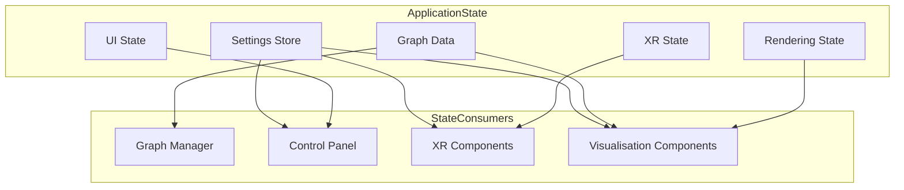
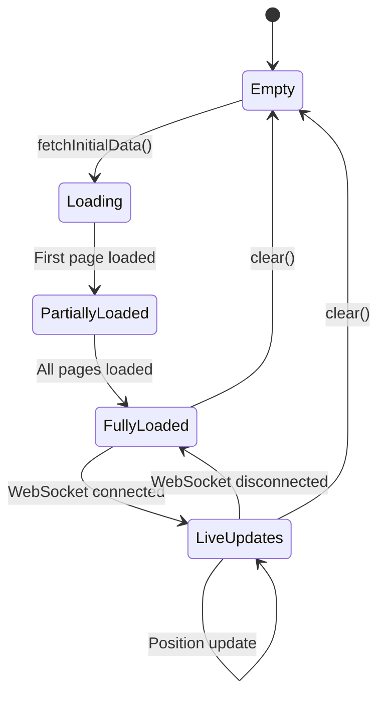
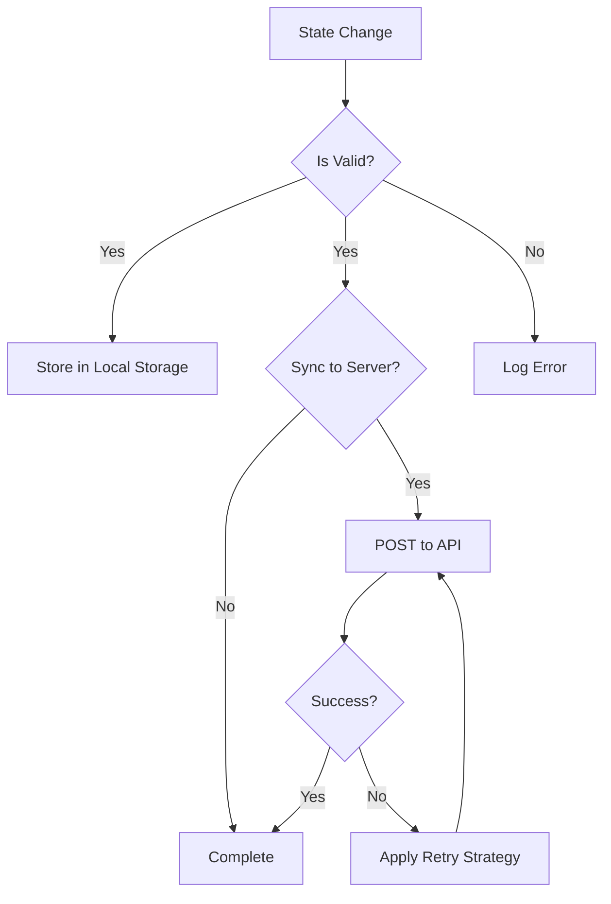

# State Management

This document details the state management patterns and mechanisms used throughout the client application. The application uses several complementary approaches to state management to handle different types of state.

## State Management Overview

The client application manages several types of state:

1.  **Application Settings** - User preferences and application configuration
2.  **Graph Data** - Nodes, edges, and metadata for the visualisation
3.  **UI State** - Control panel state, selected items, and UI configuration
4.  **Rendering State** - Camera position, visibility settings, and rendering options
5.  **XR State** - XR session status, controller positions, and interaction state



## Key State Management Components

### Settings Store ([`client/src/store/settingsStore.ts`](../../client/src/store/settingsStore.ts))

The Settings Store manages application settings with validation (primarily type-based), persistence, and observation. It uses Zustand with `immer` for immutable updates and `persist` for local storage.

**Key Features:**
- Persistence to local storage (and potentially server-side sync via `settingsService.ts`).
- Observable changes through Zustand's subscription mechanism.
- Default values loaded from [`client/src/features/settings/config/defaultSettings.ts`](../../client/src/features/settings/config/defaultSettings.ts).
- Uses `immer` middleware for convenient immutable updates.
- Employs a `deepMerge` utility ([`client/src/utils/deepMerge.ts`](../../client/src/utils/deepMerge.ts)) for merging settings updates.

**Implementation Pattern (Zustand with Immer):**
The `settingsStore` is a Zustand store. The `updateSettings` action leverages `immer`'s `produce` utility to allow direct-style mutations of the draft state, which `immer` then converts into an immutable update.
```typescript
import { create } from 'zustand';
import { persist, createJSONStorage } from 'zustand/middleware';
import { immer } from 'zustand/middleware/immer'; // Correct import for immer middleware
import { produce } from 'immer'; // produce can also be used directly if needed
import { Settings } from '../features/settings/config/settings';
import { defaultSettings } from '../features/settings/config/defaultSettings';
// import { settingsConfig } from '../features/settings/config/settingsConfig'; // May not be directly used in store
import { deepMerge } from '../../utils/deepMerge';
import { logger } from '../../utils/logger';
// Assuming SettingsPath is a defined type for string paths
type SettingsPath = string;

interface SettingsState {
  settings: Settings;
  // Example of a more specific set function if paths are known
  // setSetting: <K extends keyof Settings>(key: K, value: Settings[K]) => void;
  updateSettings: (updater: (draft: Settings) => void | Settings) => void;
  // Function to update a specific setting by path, using immer
  setSettingByPath: (path: SettingsPath, value: any) => void;
  // ... other actions
}

export const useSettingsStore = create<SettingsState>()(
  persist(
    immer( // Apply immer middleware
      (set, get) => ({
        settings: defaultSettings,
        updateSettings: (updater) => {
          // Immer's produce is implicitly handled by the immer middleware
          // when the updater function mutates the draft directly.
          // Or, if updater returns a new state, immer handles that too.
          set((state) => {
            // Create a draft and apply updates
            const nextSettings = produce(state.settings, draftSettings => {
              const result = updater(draftSettings);
              // If updater returns a new settings object, use that,
              // otherwise, the mutations on draftSettings are used.
              if (result !== undefined) {
                return result;
              }
            });
            state.settings = nextSettings;
          });
          // ... notification and server sync logic (e.g., via settingsService.ts)
        },
        setSettingByPath: (path, value) => {
          set(state => {
            // Use produce to immutably update nested state via path
            produce(state.settings, draft => {
              let current: any = draft;
              const pathParts = path.split('.');
              for (let i = 0; i < pathParts.length - 1; i++) {
                const part = pathParts[i];
                if (current[part] === undefined || typeof current[part] !== 'object') {
                  current[part] = {}; // Create structure if not exists
                }
                current = current[part];
              }
              current[pathParts[pathParts.length - 1]] = value;
            })(state.settings); // This applies the changes to state.settings
                                // The immer middleware for create() handles the final immutable update to the store state.
                                // A more direct way with immer middleware:
            // state.settings = produce(state.settings, draft => { ... });
            // Or even more direct if immer middleware is correctly wrapping `set`:
            // const pathParts = path.split('.');
            // let current: any = state.settings;
            // ... (mutation logic) ...
            // However, the safest way with `set` is to ensure a new object is returned for `state.settings`
            // or that `state.settings` itself is a draft that gets mutated.
            // The example below ensures a new state.settings is created by produce
            // and then assigned back.
          });
          // To be absolutely clear with immer middleware, the update can be:
          // set(state => {
          //   produce(state.settings, draft => {
          //     // ... (mutation logic using path on draft) ...
          //   });
          // });
          // Or if you want to replace the whole settings object:
          // set(produce(draftState => {
          //    // ... (mutation logic using path on draftState.settings) ...
          // }));

          // Corrected and simplified setSettingByPath using immer middleware:
          // The `set` function provided by `immer` middleware already wraps `state` in a draft.
          // So, you can mutate `state.settings` directly.
          // set(state => {
          //   let current: any = state.settings;
          //   const pathParts = path.split('.');
          //   for (let i = 0; i < pathParts.length - 1; i++) {
          //     const part = pathParts[i];
          //     if (current[part] === undefined || typeof current[part] !== 'object') {
          //       current[part] = {};
          //     }
          //     current = current[part];
          //   }
          //   current[pathParts[pathParts.length - 1]] = value;
          // });
          // ... notification and server sync logic
        },
        // ... other actions like initialize, reset, get, subscribe, unsubscribe
      })
    ),
    {
      name: 'logseq-xr-settings', // LocalStorage key
      storage: createJSONStorage(() => localStorage),
      // Custom merge function to handle merging persisted state with initial/default state
      merge: (persistedState, currentState) => {
        // Ensure persistedState is an object and has 'settings'
        if (typeof persistedState === 'object' && persistedState !== null && 'settings' in persistedState) {
          return deepMerge(currentState, { settings: (persistedState as any).settings });
        }
        return currentState;
      },
      // ... other persist options
    }
  )
);
```

**Settings Validation:**
Settings validation primarily relies on **TypeScript's static type checking** during development and the structure enforced by UI components ([`SettingControlComponent.tsx`](../../client/src/features/settings/components/SettingControlComponent.tsx) based on [`settingsUIDefinition.ts`](../../client/src/features/settings/config/settingsUIDefinition.ts)). There is **no explicit runtime validation using Zod schemas** (like from `client/src/features/settings/types/settingsSchema.ts`) directly within the `settingsStore`'s `set` or `updateSettings` methods. Input validation is expected to occur in the UI components before attempting to update the store.

### Graph Data Manager ([`client/src/features/graph/managers/graphDataManager.ts`](../../client/src/features/graph/managers/graphDataManager.ts))

The Graph Data Manager maintains the state of the graph visualisation data.

**Key Features:**
- Loads and processes graph data from server
- Manages node and edge collections
- Handles real-time position updates via binary protocol
- Provides subscription mechanism for changes

**State Transitions:**


### Settings Observer
The file `SettingsObserver.ts` is **not used** in the current architecture. Zustand itself provides the subscription mechanism. Components subscribe directly to `useSettingsStore` (often using selectors to pick specific parts of the state) to react to changes.

## State Persistence

The application persists state in several ways:

1.  **Local Storage** - User preferences and UI state (managed by Zustand's `persist` middleware).
2.  **Server Storage** - User settings synchronized to server (for authenticated users).
3.  **URL Parameters** - Shareable state in URL (not extensively used for persistence, more for initial configuration).

### Persistence Flow



## State Change Propagation

The application uses several mechanisms to propagate state changes:

### Event Emitter
A dedicated global event emitter (e.g., `client/utils/eventEmitter.ts`) is **not present** in the current codebase. Communication and event-like propagation are handled by:
- **Zustand store subscriptions**: For changes in global state like settings.
- **React Context API**: For more localized state or function sharing.
- **Callbacks and Props**: Standard React patterns for component communication.
- **WebSocketService event handlers**: For server-sent messages (e.g., `onMessage`, `onBinaryMessage`).
- `graphDataManager` might expose its own subscription mechanism for graph-specific updates (e.g., `onGraphDataChange`, `onPositionUpdate`).

### Direct Subscriptions

Components can subscribe directly to state stores.

**Example:**
```typescript
// Example: Subscribe to graph data changes from GraphDataManager
// (Assuming graphDataManager instance has an onGraphDataChange method)
const graphDataManager = GraphDataManager.getInstance(); // Or however it's accessed
const unsubscribeGraph = graphDataManager.onGraphDataChange((newGraphData) => {
  console.log('Graph data changed:', newGraphData);
  // Update component based on new graph data
});

// Example: Subscribe to settings changes from useSettingsStore
const unsubscribeSettings = useSettingsStore.subscribe(
  (newSettings) => {
    console.log('Settings changed (entire settings object):', newSettings);
    // Update component based on new settings
  },
  state => state.settings // Selector for the entire settings object
);

// Example: Subscribe to a specific setting value
const unsubscribeSpecificSetting = useSettingsStore.subscribe(
  (newNodeSize) => {
    console.log('Node size changed:', newNodeSize);
  },
  state => state.settings.visualisation.nodes.nodeSize // Selector for a specific value
);

// Remember to call unsubscribe functions on component unmount
// useEffect(() => {
//   return () => {
//     unsubscribeGraph();
//     unsubscribeSettings();
//     unsubscribeSpecificSetting();
//   };
// }, []);
```

## Settings Structure

## Settings Structure

The **source of truth** for the client-side settings structure is the `Settings` interface defined in [`client/src/features/settings/config/settings.ts`](../../client/src/features/settings/config/settings.ts). The UI representation and controls are defined in [`client/src/features/settings/config/settingsUIDefinition.ts`](../../client/src/features/settings/config/settingsUIDefinition.ts).

**Key structural aspects to note from `settings.ts`:**

*   **`visualisation.nodes.nodeSize`**: This is a single `number`, not a `sizeRange: [number, number]`.
*   **`visualisation.physics`**: The `gravityStrength` and `centerAttractionStrength` fields previously documented are **not** part of the `PhysicsSettings` interface in the actual `settings.ts`. Refer to `settings.ts` for the correct fields within `PhysicsSettings` (e.g., `attractionStrength`, `repulsionStrength`, `damping`, etc.).
*   **`visualisation.camera`**: `CameraSettings` is an optional property within `VisualisationSettings`.
*   **AI Services**: Settings for AI services like `ragflow`, `perplexity`, `openai`, and `kokoro` are optional properties at the root level of the main `Settings` interface.
*   **`whisper`**: Settings for `whisper` are **not present** in the current `Settings` interface in `settings.ts`.
*   Many other fields might differ from previous documentation. **Always refer to [`client/src/features/settings/config/settings.ts`](../../client/src/features/settings/config/settings.ts) for the most accurate and complete structure.**

Below is a *simplified conceptual representation*, highlighting some key categories. For the exact structure, please consult the `settings.ts` file.

```typescript
// Simplified conceptual representation.
// For the complete and accurate structure, see:
// client/src/features/settings/config/settings.ts

interface Settings {
  visualisation: {
    nodes: {
      nodeSize: number;
      baseColor: string;
      // ... other node settings
    };
    edges: {
      baseWidth: number;
      color: string;
      // ... other edge settings
    };
    labels: {
      enableLabels: boolean;
      textColor: string;
      // ... other label settings
    };
    physics: { // Check settings.ts for actual fields
      enabled: boolean;
      // ... other physics settings
    };
    rendering: {
      backgroundColor: string;
      // ... other rendering settings
    };
    hologram?: HologramSettings; // Optional
    camera?: CameraSettings;   // Optional
    // ... other visualisation categories
  };
  system: {
    websocket: ClientWebSocketSettings; // Defined in settings.ts
    debug: DebugSettings;             // Defined in settings.ts
    persistSettings: boolean;
    customBackendUrl?: string;
  };
  xr: XRSettings; // Defined in settings.ts
  auth: AuthSettings; // Defined in settings.ts

  // Optional AI Service Settings
  ragflow?: RAGFlowSettings;       // Defined in settings.ts
  perplexity?: PerplexitySettings; // Defined in settings.ts
  openai?: OpenAISettings;         // Defined in settings.ts
  kokoro?: KokoroSettings;         // Defined in settings.ts
}
```

### Settings Validation
As mentioned earlier, settings validation primarily relies on TypeScript's static type checking and UI component constraints. There is no explicit Zod validation layer directly within the `settingsStore`'s update methods.

## State Immutability

The application uses immutability patterns to prevent unexpected state changes, primarily facilitated by the `immer` middleware in Zustand. This ensures that state updates always result in new state objects, simplifying change detection and preventing unintended side effects.

**Example of Immutable Update (handled by Immer in Zustand):**
```typescript
// When using Immer with Zustand, direct modification within the 'set' callback is safe:
set((state) => {
  state.user.name = "New Name"; // This is automatically converted to an immutable update
});

// Without Immer, you would manually create new objects:
set((state) => ({
  ...state,
  user: {
    ...state.user,
    name: "New Name"
  }
}));
```

## Related Documentation

- [Components](components.md) - Component relationships and dependencies
- [Architecture](architecture.md) - Overall system architecture
- [WebSocket Communication](websocket.md) - Real-time state updates