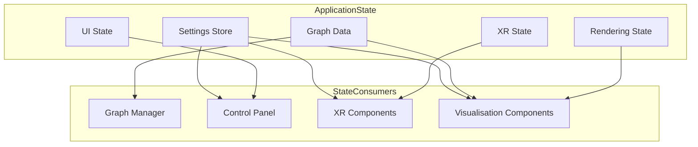
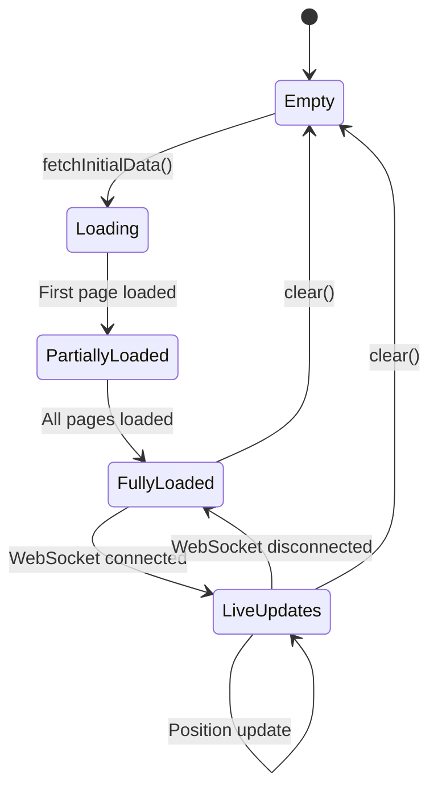
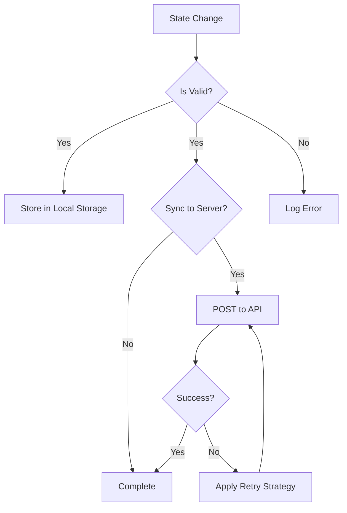

# State Management

This document details the state management patterns and mechanisms used throughout the client application. The application uses several complementary approaches to state management to handle different types of state.

## State Management Overview

The client application manages several types of state:

1.  **Application Settings** - User preferences and application configuration
2.  **Graph Data** - Nodes, edges, and metadata for the visualisation
3.  **UI State** - Control panel state, selected items, and UI configuration
4.  **Rendering State** - Camera position, visibility settings, and rendering options
5.  **XR State** - XR session status, controller positions, and interaction state



## Key State Management Components

### Settings Store ([`client/src/store/settingsStore.ts`](../../client/src/store/settingsStore.ts))

It uses Zustand for state management, `persist` middleware for saving to local storage, and `immer`'s `produce` utility for safe, immutable updates.

**Key Features:**
- Persistence to local storage (and potentially server-side sync via `settingsService.ts`).
- Observable changes through Zustand's subscription mechanism.
- Default values loaded from [`client/src/features/settings/config/defaultSettings.ts`](../../client/src/features/settings/config/defaultSettings.ts).
- Uses `immer` middleware for convenient immutable updates.
- Employs a `deepMerge` utility ([`client/src/utils/deepMerge.ts`](../../client/src/utils/deepMerge.ts)) for merging settings updates.

**Implementation Pattern (Zustand with Immer):**
The `set` and `updateSettings` methods in the store handle immutable updates for nested properties. The `set` method uses a path-based string to update specific values, while `updateSettings` accepts an Immer-style producer function for more complex mutations.

**Settings Validation:**
Settings validation primarily relies on **TypeScript's static type checking** during development and the structure enforced by UI components ([`SettingControlComponent.tsx`](../../client/src/features/settings/components/SettingControlComponent.tsx) based on [`settingsUIDefinition.ts`](../../client/src/features/settings/config/settingsUIDefinition.ts)). There is **no explicit runtime validation using Zod schemas** (like from `client/src/features/settings/types/settingsSchema.ts`) directly within the `settingsStore`'s `set` or `updateSettings` methods. Input validation is expected to occur in the UI components before attempting to update the store.

### Graph Data Manager ([`client/src/features/graph/managers/graphDataManager.ts`](../../client/src/features/graph/managers/graphDataManager.ts))

The Graph Data Manager maintains the state of the graph visualisation data.

**Key Features:**
- Loads and processes graph data from server
- Manages node and edge collections
- Handles real-time position updates via binary protocol
- Provides subscription mechanism for changes

**State Transitions:**


### Settings Observer
The file `SettingsObserver.ts` is **not used** in the current architecture. Zustand itself provides the subscription mechanism. Components subscribe directly to `useSettingsStore` (often using selectors to pick specific parts of the state) to react to changes.

## State Persistence

The application persists state in several ways:

1.  **Local Storage** - User preferences and UI state (managed by Zustand's `persist` middleware).
2.  **Server Storage** - User settings synchronized to server (for authenticated users).
3.  **URL Parameters** - Shareable state in URL (not extensively used for persistence, more for initial configuration).

### Persistence Flow



## State Change Propagation

The application uses several mechanisms to propagate state changes:

### Event Emitter
A dedicated global event emitter (e.g., `client/utils/eventEmitter.ts`) is **not present** in the current codebase. Communication and event-like propagation are handled by:
- **Zustand store subscriptions**: For changes in global state like settings.
- **React Context API**: For more localized state or function sharing.
- **Callbacks and Props**: Standard React patterns for component communication.
- **WebSocketService event handlers**: For server-sent messages (e.g., `onMessage`, `onBinaryMessage`).
- `graphDataManager` might expose its own subscription mechanism for graph-specific updates (e.g., `onGraphDataChange`, `onPositionUpdate`).

### Direct Subscriptions

Components can subscribe directly to state stores.

**Example:**
```typescript
// Example: Subscribe to graph data changes from GraphDataManager
// (Assuming graphDataManager instance has an onGraphDataChange method)
const graphDataManager = GraphDataManager.getInstance(); // Or however it's accessed
const unsubscribeGraph = graphDataManager.onGraphDataChange((newGraphData) => {
  console.log('Graph data changed:', newGraphData);
  // Update component based on new graph data
});

// Example: Subscribe to settings changes from useSettingsStore
const unsubscribeSettings = useSettingsStore.subscribe(
  (newSettings) => {
    console.log('Settings changed (entire settings object):', newSettings);
    // Update component based on new settings
  },
  state => state.settings // Selector for the entire settings object
);

// Example: Subscribe to a specific setting value
const unsubscribeSpecificSetting = useSettingsStore.subscribe(
  (newNodeSize) => {
    console.log('Node size changed:', newNodeSize);
  },
  state => state.settings.visualisation.nodes.nodeSize // Selector for a specific value
);

// Remember to call unsubscribe functions on component unmount
// useEffect(() => {
//   return () => {
//     unsubscribeGraph();
//     unsubscribeSettings();
//     unsubscribeSpecificSetting();
//   };
// }, []);
```

## Settings Structure

```typescript
// Simplified conceptual representation.
// For the complete and accurate structure, see:
// client/src/features/settings/config/settings.ts

interface Settings {
  visualisation: {
    nodes: {
      nodeSize: number; // Note: This is a single number, not a range.
      baseColor: string;
      // ... other node properties
    };
    edges: {
      baseWidth: number;
      // ... other edge properties
    };
    physics: {
      enabled: boolean;
      // Note: gravityStrength and centerAttractionStrength are not in the config.
      // ... other physics properties
    };
    // ... other visualisation categories
  };
  system: {
    websocket: ClientWebSocketSettings;
    debug: DebugSettings;
    persistSettings: boolean;
  };
  xr: XRSettings;
  auth: AuthSettings;
  // Optional AI Service Settings (whisper is not a setting)
  ragflow?: RAGFlowSettings;
  perplexity?: PerplexitySettings;
  openai?: OpenAISettings;
  kokoro?: KokoroSettings;
}
```

### Settings Validation
As mentioned earlier, settings validation primarily relies on TypeScript's static type checking and UI component constraints. There is no explicit Zod validation layer directly within the `settingsStore`'s update methods.

## State Immutability

The application uses immutability patterns to prevent unexpected state changes, primarily facilitated by the `immer` middleware in Zustand. This ensures that state updates always result in new state objects, simplifying change detection and preventing unintended side effects.

**Example of Immutable Update (handled by Immer in Zustand):**
```typescript
// When using Immer with Zustand, direct modification within the 'set' callback is safe:
set((state) => {
  state.user.name = "New Name"; // This is automatically converted to an immutable update
});

// Without Immer, you would manually create new objects:
set((state) => ({
  ...state,
  user: {
    ...state.user,
    name: "New Name"
  }
}));
```

## Related Documentation

- [Components](components.md) - Component relationships and dependencies
- [Architecture](architecture.md) - Overall system architecture
- [WebSocket Communication](websocket.md) - Real-time state updates