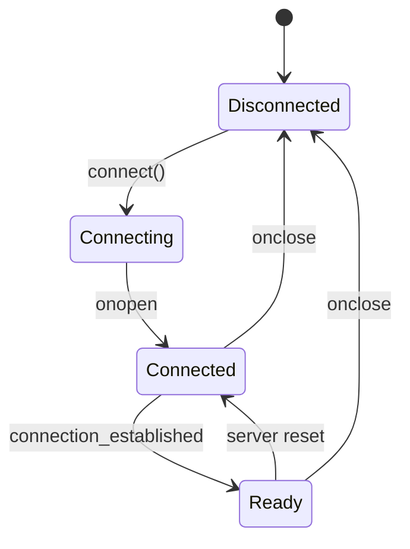

# WebSocket Readiness Protocol

This document describes the improvements made to the WebSocket communication system to ensure proper connection establishment and binary data flow.

## Problem Statement

The original implementation encountered issues where:

1. Binary updates were enabled before the WebSocket connection was fully established
2. The GraphDataManager attempted to send data before the WebSocket service was ready
3. The WebSocket service didn't track its readiness state properly
4. Connection retry mechanisms didn't account for full readiness

## Improved Implementation

### WebSocket Readiness States

The WebSocket connection now has three distinct states:

1. **Disconnected**: No connection established
2. **Connected**: Socket connection is open but not fully established with server
3. **Ready**: Connection is open AND server has sent "connection_established" message



### WebSocketService Readiness Tracking

The [`WebSocketService.ts`](../../client/src/services/WebSocketService.ts) now includes:

-   `isConnected`: A boolean flag indicating if the WebSocket's `readyState` is `OPEN`.
-   `isServerReady`: A boolean flag set to `true` when the server sends a `connection_established` message (or a similar indicator like `updatesStarted`).
-   `isReady()`: A method that returns `true` only if both `isConnected` and `isServerReady` are true.
-   Logic to reset `isServerReady` to `false` on disconnection or error events.

```typescript
// In client/src/services/WebSocketService.ts (conceptual)
private isConnected: boolean = false;
private isServerReady: boolean = false;

// ... onopen sets isConnected = true ...
// ... onmessage checks for "connection_established" or "updatesStarted" to set isServerReady = true ...
// ... onclose / onerror sets both to false ...

public isReady(): boolean {
    return this.isConnected && this.isServerReady;
}
```

### GraphDataManager Enhancements

The [`GraphDataManager.ts`](../../client/src/features/graph/managers/graphDataManager.ts) now:

1.  Uses the `setWebSocketService` method to receive an adapter/instance of `WebSocketService`.
2.  Checks the `isReady()` method of the provided WebSocket service adapter before attempting to send data or enabling features that depend on a live connection (like `enableBinaryUpdates`).
3.  The `enableBinaryUpdates` method in `graphDataManager.ts` contains logic to attempt enabling updates and may include retries or checks based on the WebSocket service's readiness.

```typescript
// In client/src/features/graph/managers/graphDataManager.ts (conceptual)
private wsServiceAdapter: WebSocketServiceAdapter | null = null;

public setWebSocketService(adapter: WebSocketServiceAdapter): void {
    this.wsServiceAdapter = adapter;
    // Potentially try to enable binary updates if ready
    this.enableBinaryUpdates();
}

public enableBinaryUpdates(force: boolean = false): void {
    if (this.wsServiceAdapter?.isReady()) {
        // Send a message to server to start binary updates if needed
        // Or set a flag to start processing incoming binary updates
        logger.info('Binary updates enabled as WebSocket is ready.');
        // this.wsServiceAdapter.sendMessage({ type: 'subscribe_position_updates', binary: true, interval: ... });
        this.binaryUpdatesEnabled = true;
    } else {
        logger.warn('Cannot enable binary updates: WebSocket not ready.');
        // Implement retry logic if desired, e.g., after a delay or on next readiness change
    }
}
```

### Adapter Pattern for Service Integration

An adapter pattern is used, typically during application initialization (e.g., in [`AppInitializer.tsx`](../../client/src/app/AppInitializer.tsx)), to provide the `GraphDataManager` with a way to interact with the `WebSocketService`.

```typescript
// In client/src/app/AppInitializer.tsx (conceptual)
// Assuming websocketService is an instance of WebSocketService
// Assuming graphDataManager is an instance of GraphDataManager

if (websocketService && graphDataManager) {
    const wsAdapter = {
        sendRawBinaryData: (data: ArrayBuffer) => {
            websocketService.sendRawBinaryData(data);
        },
        sendMessage: (message: object) => { // For JSON messages
            websocketService.sendMessage(message);
        },
        isReady: () => websocketService.isReady(),
        // Expose other necessary WebSocketService methods to GraphDataManager
        onBinaryMessage: (callback: (data: ArrayBuffer) => void) => {
            return websocketService.onBinaryMessage(callback);
        },
        onMessage: (callback: (data: any) => void) => { // For JSON messages
            return websocketService.onMessage(callback);
        }
    };
    graphDataManager.setWebSocketService(wsAdapter);
}
```
This adapter ensures that `GraphDataManager` can use the `WebSocketService` without being tightly coupled to its specific implementation details, focusing only on the necessary interface for sending/receiving data and checking readiness.

## Benefits of Improved Implementation

1. **Reliability**: Binary updates are only enabled when the WebSocket connection is truly ready
2. **Error Prevention**: Avoids attempting to send data before the connection is established
3. **Diagnostic**: Better logging identifies exact state of connection
4. **Recovery**: Enhanced retry mechanisms handle reconnection scenarios better

## Connection Sequence

```mermaid
sequenceDiagram
    participant Client
    participant WSService as WebSocketService
    participant GraphMgr as GraphDataManager
    participant Server
    
    Client->>WSService: connect()
    WSService->>Server: WebSocket connection
    Server-->>WSService: onopen
    WSService->>Client: onConnectionStatusChange(true)
    Server-->>WSService: connection_established
    WSService->>WSService: isReadyFlag = true
    WSService->>Client: notifyReadiness()
    Client->>GraphMgr: enableBinaryUpdates()
    GraphMgr->>WSService: isReady() check
    WSService-->>GraphMgr: true
    GraphMgr->>WSService: send binary data
    WSService->>Server: binary data
    Server-->>WSService: binary position updates
    WSService->>GraphMgr: updateNodePositions()