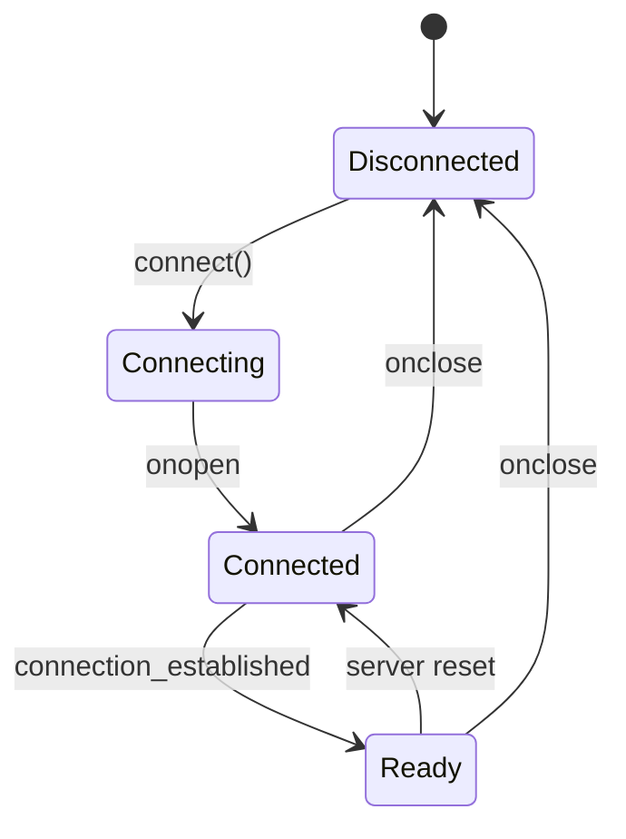

# WebSocket Readiness Protocol

This document describes the improvements made to the WebSocket communication system to ensure proper connection establishment and binary data flow.

## Problem Statement

The original implementation encountered issues where:

1. Binary updates were enabled before the WebSocket connection was fully established
2. The GraphDataManager attempted to send data before the WebSocket service was ready
3. The WebSocket service didn't track its readiness state properly
4. Connection retry mechanisms didn't account for full readiness

## Improved Implementation

### WebSocket Readiness States

The WebSocket connection now has three distinct states:

1. **Disconnected**: No connection established
2. **Connected**: Socket connection is open but not fully established with server
3. **Ready**: Connection is open AND server has sent "connection_established" message



### WebSocketService Readiness Tracking

The WebSocketService now includes:

- `isReadyFlag`: Boolean tracking if "connection_established" message has been received
- `isReady()`: Method that checks both connection state and readiness flag
- Readiness reset on reconnection or close events

```typescript
public isReady(): boolean {
    return this.connectionState === ConnectionState.CONNECTED && this.isReadyFlag;
}
```

### GraphDataManager Enhancements

The GraphDataManager now:

1. Checks for WebSocket readiness before enabling binary updates
2. Uses an enhanced retry mechanism that verifies both connection and readiness
3. Includes an improved interface for WebSocketService integration

```typescript
// Check if WebSocket service is configured AND ready before sending update
const isDefaultService = this.wsService.send.toString().includes('WebSocket service not configured');
const isReady = typeof this.wsService.isReady === 'function' && this.wsService.isReady();

if (!isDefaultService && isReady) {
    // Service is configured and ready, send initial update
    this.updatePositions(new Float32Array());
    debugState.setBinaryProtocolStatus('active');
}
```

### Adapter Pattern for Service Integration

An adapter pattern is used to connect GraphVisualisation with GraphDataManager's WebSocket requirements:

```typescript
// Configure GraphDataManager with WebSocket service (adapter pattern)
if (this.websocketService) {
    const wsAdapter = {
        send: (data: ArrayBuffer) => {
            this.websocketService?.sendRawBinaryData(data);
        },
        isReady: () => this.websocketService?.isReady() || false
    };
    graphDataManager.setWebSocketService(wsAdapter);
}
```

## Benefits of Improved Implementation

1. **Reliability**: Binary updates are only enabled when the WebSocket connection is truly ready
2. **Error Prevention**: Avoids attempting to send data before the connection is established
3. **Diagnostic**: Better logging identifies exact state of connection
4. **Recovery**: Enhanced retry mechanisms handle reconnection scenarios better

## Connection Sequence

```mermaid
sequenceDiagram
    participant Client
    participant WSService as WebSocketService
    participant GraphMgr as GraphDataManager
    participant Server
    
    Client->>WSService: connect()
    WSService->>Server: WebSocket connection
    Server-->>WSService: onopen
    WSService->>Client: onConnectionStatusChange(true)
    Server-->>WSService: connection_established
    WSService->>WSService: isReadyFlag = true
    WSService->>Client: notifyReadiness()
    Client->>GraphMgr: enableBinaryUpdates()
    GraphMgr->>WSService: isReady() check
    WSService-->>GraphMgr: true
    GraphMgr->>WSService: send binary data
    WSService->>Server: binary data
    Server-->>WSService: binary position updates
    WSService->>GraphMgr: updateNodePositions()