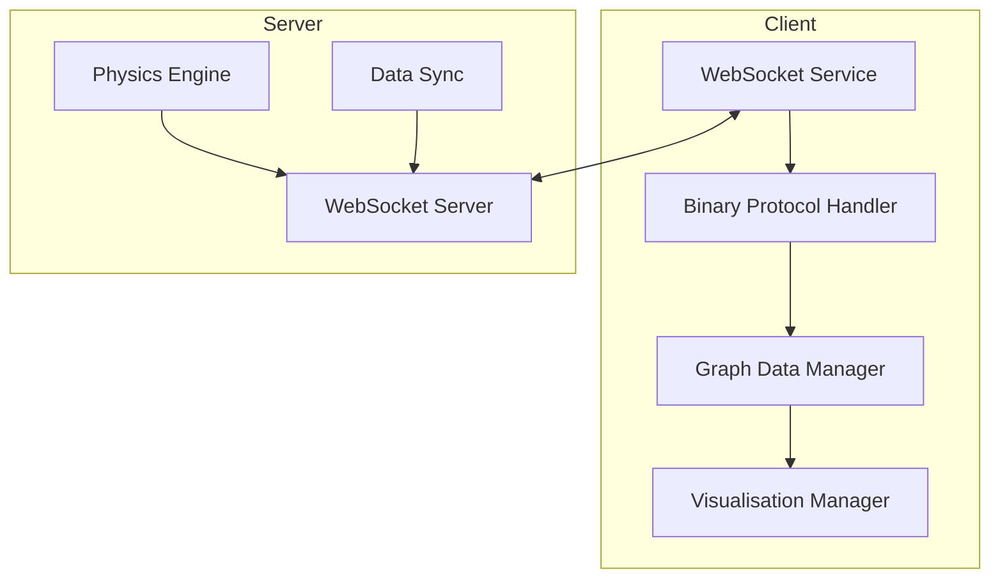
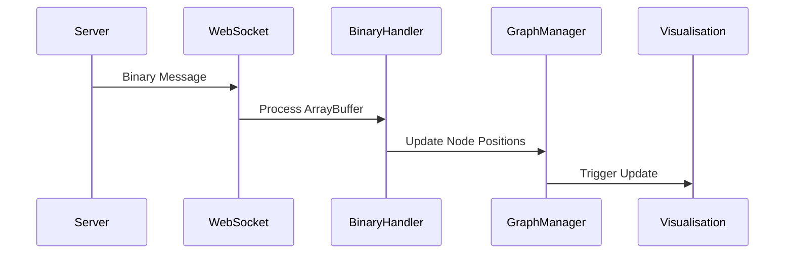
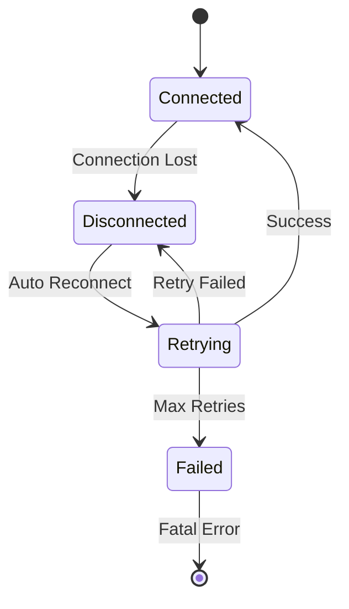

# WebSocket Communication

This document describes the WebSocket communication system used in the client.

## Overview

The client uses WebSocket connections for real-time communication with the server, particularly for:
- Binary position updates for graph nodes
- Graph data synchronization
- Event notifications
- Connection status management

## Architecture



## WebSocket Service

The WebSocket service (`client/websocket/websocketService.ts`) is implemented as a singleton that manages:
- Connection establishment and maintenance
- Message handling
- Binary protocol processing
- Error handling and recovery

### Key Features

- Automatic reconnection with exponential backoff
- Binary message support
- Connection status monitoring
- Event-based message handling

## Binary Protocol

The binary protocol is used for efficient transmission of node position updates.

### Message Format

Position updates use a binary format where each node's data is packed as follows:

```
| Field    | Type        | Size (bytes) | Description           |
|----------|-------------|--------------|------------------------|
| Node ID  | uint16      | 2           | Unique node identifier |
| Position | float32[3]  | 12          | X, Y, Z coordinates    |
| Velocity | float32[3]  | 12          | VX, VY, VZ components |
```

Total bytes per node: 26 bytes

### Processing Flow



## Message Types

The WebSocket service handles several types of messages:

1. **Binary Position Updates**
   - Format: ArrayBuffer
   - Handler: `onBinaryMessage`
   - Used for real-time node position updates

2. **Connection Status**
   - Format: JSON
   - Handler: `onConnectionStatusChange`
   - Used for connection state management

## Error Handling

The WebSocket service implements robust error handling, primarily by logging errors and attempting reconnection.

### Recovery Strategy



## Configuration

WebSocket behavior can be configured through settings:

```typescript
interface WebSocketSettings {
    reconnectAttempts: number;    // Maximum reconnection attempts (e.g., from system.websocket.reconnectAttempts)
    reconnectDelay: number;       // Base delay between retries in ms (e.g., from system.websocket.reconnectDelay)
    // binaryChunkSize, compressionEnabled, compressionThreshold, updateRate are also relevant
    // but their direct mapping to the store might be via other system.websocket.* paths or defaults.
}
```

## Performance Considerations

1. **Binary Protocol**
   - Reduces message size by ~60% compared to JSON
   - Minimizes parsing overhead
   - Enables efficient batch updates

2. **Message Batching**
   - Position updates are batched for efficiency
   - Configurable batch size and update rate
   - Automatic throttling under high load

3. **Connection Management**
   - Heartbeat mechanism for connection health
   - Automatic reconnection with backoff
   - Connection status monitoring

## Usage Example

```typescript
// Initialize WebSocket service
const ws = WebSocketService.getInstance();

// Subscribe to binary updates
ws.onBinaryMessage((data) => {
    if (data instanceof ArrayBuffer) {
        graphDataManager.updateNodePositions(new Float32Array(data));
    }
});

// Handle connection status
ws.onConnectionStatusChange((connected) => {
    if (connected) {
        graphDataManager.setBinaryUpdatesEnabled(true);
    }
});

// Connect to server
await ws.connect();
```

## Related Documentation

- [State Management](state.md) - State management integration
- [Graph Data](graph.md) - Graph data structure and updates
- [Performance](performance.md) - Performance optimization details