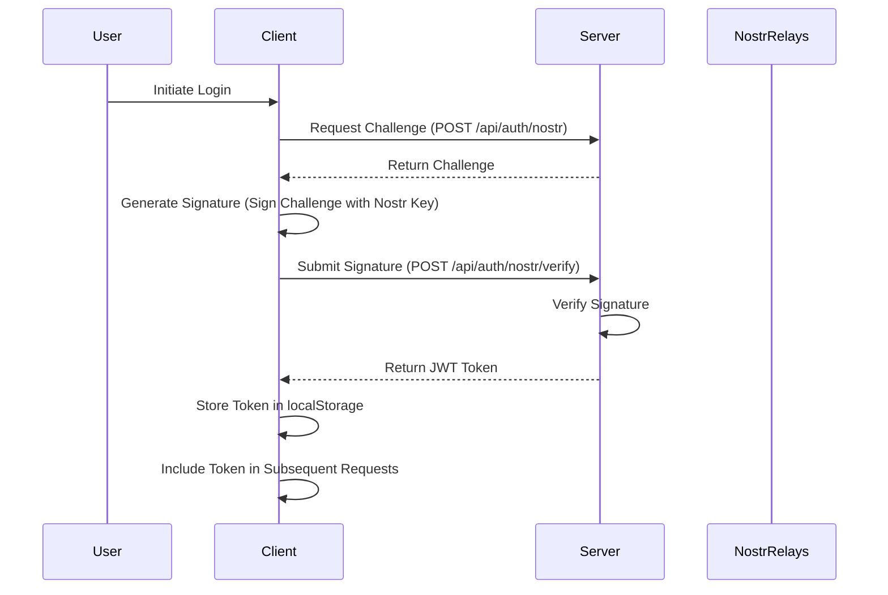

# Authentication

This document details the authentication mechanisms used in the client application, including the Nostr-based authentication flow, token handling, and authorization procedures.

## Authentication Overview

The application uses Nostr for authentication, providing a decentralized authentication mechanism. The authentication flow involves a challenge-response pattern using Nostr public keys and digital signatures.



## Nostr Authentication

[Nostr (Notes and Other Stuff Transmitted by Relays)](https://github.com/nostr-protocol/nostr) is a decentralized protocol that enables censorship-resistant and globally-distributed social media. In this application, Nostr is used for authentication.

### Nostr Keys

Nostr uses public key cryptography:

- **Public Key**: Serves as the user's identity (converted to npub format for user-facing display)
- **Private Key**: Used to sign messages (kept secret, never shared with the server)

### Authentication Flow

#### 1. Request Challenge

The client requests a challenge from the server:

```typescript
async function requestNostrChallenge(pubkey: string): Promise<string> {
  const response = await fetch(buildApiUrl(API_ENDPOINTS.AUTH_NOSTR), {
    method: 'POST',
    headers: {
      'Content-Type': 'application/json'
    },
    body: JSON.stringify({ pubkey })
  });
  
  if (!response.ok) {
    throw new Error(`Failed to request challenge: ${response.status} ${response.statusText}`);
  }
  
  const data = await response.json();
  return data.challenge;
}
```

#### 2. Sign Challenge

The client signs the challenge using the Nostr private key:

```typescript
async function signChallenge(challenge: string, privateKey: string): Promise<string> {
  // Convert hex private key to Uint8Array if needed
  const privateKeyBytes = typeof privateKey === 'string' && privateKey.startsWith('nsec')
    ? nip19.decode(privateKey).data
    : privateKey;
  
  // Sign the challenge
  const signatureBytes = await nobleSecp256k1.schnorr.sign(
    Buffer.from(challenge, 'utf8'),
    privateKeyBytes
  );
  
  // Convert to hex
  return Buffer.from(signatureBytes).toString('hex');
}
```

#### 3. Verify Signature

The client sends the signature to the server for verification:

```typescript
async function verifyNostrSignature(pubkey: string, challenge: string, signature: string): Promise<AuthToken> {
  const response = await fetch(buildApiUrl(API_ENDPOINTS.AUTH_NOSTR_VERIFY), {
    method: 'POST',
    headers: {
      'Content-Type': 'application/json'
    },
    body: JSON.stringify({
      pubkey,
      challenge,
      signature
    })
  });
  
  if (!response.ok) {
    throw new Error(`Failed to verify signature: ${response.status} ${response.statusText}`);
  }
  
  const data = await response.json();
  return {
    token: data.token,
    expiresAt: data.expiresAt
  };
}
```

#### 4. Store Token

Upon successful verification, the client stores the token:

```typescript
function storeAuthToken(pubkey: string, token: string): void {
  localStorage.setItem('nostr_pubkey', pubkey);
  localStorage.setItem('nostr_token', token);
}
```

## Nostr Auth Service (`client/services/NostrAuthService.ts`)

The Nostr Auth Service manages the authentication flow:

```typescript
class NostrAuthService {
  private static instance: NostrAuthService;
  private pubkey: string | null = null;
  private token: string | null = null;
  private expiresAt: number | null = null;
  private authStatusListeners: Set<(isAuthenticated: boolean) => void> = new Set();
  
  private constructor() {
    // Load from local storage if available
    this.pubkey = localStorage.getItem('nostr_pubkey');
    this.token = localStorage.getItem('nostr_token');
    const expiresAtStr = localStorage.getItem('nostr_token_expires');
    this.expiresAt = expiresAtStr ? parseInt(expiresAtStr, 10) : null;
  }
  
  static getInstance(): NostrAuthService {
    if (!NostrAuthService.instance) {
      NostrAuthService.instance = new NostrAuthService();
    }
    return NostrAuthService.instance;
  }
  
  // Check if authenticated
  isAuthenticated(): boolean {
    // Check if token exists
    if (!this.token || !this.pubkey) {
      return false;
    }
    
    // Check if token is expired
    if (this.expiresAt && Date.now() > this.expiresAt) {
      this.logout(); // Auto-logout if token is expired
      return false;
    }
    
    return true;
  }
  
  // Get public key
  getPubkey(): string | null {
    return this.pubkey;
  }
  
  // Login with Nostr
  async login(privateKey: string): Promise<boolean> {
    try {
      // Decode private key if in nsec format
      const privateKeyBytes = privateKey.startsWith('nsec')
        ? nip19.decode(privateKey).data
        : privateKey;
      
      // Get public key from private key
      const pubkey = nobleSecp256k1.schnorr.getPublicKey(privateKeyBytes);
      const pubkeyHex = Buffer.from(pubkey).toString('hex');
      
      // Request challenge
      const challenge = await requestNostrChallenge(pubkeyHex);
      
      // Sign challenge
      const signature = await signChallenge(challenge, privateKeyBytes);
      
      // Verify signature
      const { token, expiresAt } = await verifyNostrSignature(pubkeyHex, challenge, signature);
      
      // Store token
      this.pubkey = pubkeyHex;
      this.token = token;
      this.expiresAt = expiresAt;
      
      // Save to local storage
      localStorage.setItem('nostr_pubkey', pubkeyHex);
      localStorage.setItem('nostr_token', token);
      localStorage.setItem('nostr_token_expires', expiresAt.toString());
      
      // Notify listeners
      this.notifyStatusChange(true);
      
      return true;
    } catch (error) {
      logger.error('Login failed:', error);
      return false;
    }
  }
  
  // Logout
  async logout(): Promise<void> {
    // Skip if not authenticated
    if (!this.isAuthenticated()) {
      return;
    }
    
    try {
      // Call logout endpoint
      await fetch(buildApiUrl(API_ENDPOINTS.AUTH_NOSTR_LOGOUT), {
        method: 'POST',
        headers: getAuthHeaders()
      });
    } catch (error) {
      logger.error('Logout request failed:', error);
    }
    
    // Clear local storage
    localStorage.removeItem('nostr_pubkey');
    localStorage.removeItem('nostr_token');
    localStorage.removeItem('nostr_token_expires');
    
    // Clear memory
    this.pubkey = null;
    this.token = null;
    this.expiresAt = null;
    
    // Notify listeners
    this.notifyStatusChange(false);
  }
  
  // Add authentication status listener
  addStatusListener(listener: (isAuthenticated: boolean) => void): () => void {
    this.authStatusListeners.add(listener);
    
    // Call listener with current status
    listener(this.isAuthenticated());
    
    // Return unsubscribe function
    return () => {
      this.authStatusListeners.delete(listener);
    };
  }
  
  // Notify status change
  private notifyStatusChange(isAuthenticated: boolean): void {
    this.authStatusListeners.forEach(listener => {
      try {
        listener(isAuthenticated);
      } catch (error) {
        logger.error('Error in auth status listener:', error);
      }
    });
  }
}
```

## Authentication Headers

The application includes authentication headers in all authenticated requests:

```typescript
// From client/core/api.ts
export function getAuthHeaders(): HeadersInit {
    const headers: HeadersInit = {
        'Content-Type': 'application/json'
    };
    
    const pubkey = localStorage.getItem('nostr_pubkey');
    const token = localStorage.getItem('nostr_token');
    if (pubkey && token) {
        headers['X-Nostr-Pubkey'] = pubkey;
        headers['Authorization'] = `Bearer ${token}`;
    }
    return headers;
}
```

## Token Format

The JWT token returned by the server has the following structure:

```
header.payload.signature
```

### Header
```json
{
  "alg": "HS256",
  "typ": "JWT"
}
```

### Payload
```json
{
  "sub": "npub...", // Nostr public key (npub format)
  "iat": 1615479082, // Issued at timestamp
  "exp": 1615565482, // Expiration timestamp
  "nbf": 1615479082  // Not before timestamp
}
```

The token is signed by the server using a secret key.

## Authentication UI

The authentication UI includes:

1. Login form that accepts Nostr private key (nsec) or extension connection
2. Logout button when authenticated
3. Authentication status indicator

```typescript
// Login form component
function LoginForm({ onLogin }: { onLogin: () => void }) {
  const [privateKey, setPrivateKey] = useState('');
  const [isLoading, setIsLoading] = useState(false);
  const [error, setError] = useState<string | null>(null);
  
  const handleSubmit = async (e: React.FormEvent) => {
    e.preventDefault();
    setIsLoading(true);
    setError(null);
    
    try {
      const success = await NostrAuthService.getInstance().login(privateKey);
      
      if (success) {
        onLogin();
      } else {
        setError('Login failed. Please check your private key and try again.');
      }
    } catch (error) {
      setError('An error occurred during login. Please try again.');
    } finally {
      setIsLoading(false);
    }
  };
  
  return (
    <form onSubmit={handleSubmit}>
      <h2>Login with Nostr</h2>
      <div>
        <label htmlFor="privateKey">Private Key (nsec):</label>
        <input
          type="password"
          id="privateKey"
          value={privateKey}
          onChange={(e) => setPrivateKey(e.target.value)}
          required
        />
      </div>
      {error && <div className="error">{error}</div>}
      <button type="submit" disabled={isLoading}>
        {isLoading ? 'Logging in...' : 'Login'}
      </button>
    </form>
  );
}
```

## Security Considerations

### Private Key Handling

Private keys are sensitive data and should be handled carefully:

1. Never store private keys in local storage or cookies
2. Only use private keys temporarily in memory during the signing process
3. Encourage users to use browser extensions that handle key management securely

### Token Security

JWT tokens are stored in localStorage, which has some security implications:

1. Tokens are vulnerable to XSS attacks
2. Tokens should have a relatively short expiration time
3. The server should maintain a token blacklist for revoked tokens

### Cross-Origin Considerations

To protect against CSRF and other cross-origin attacks:

1. Use SameSite=Strict cookies if cookie-based authentication is added
2. Implement proper CORS headers on the server
3. Use CSRF tokens for state-changing operations

## Authentication Integration

The authentication service integrates with the application in several ways:

### API Requests

```typescript
async function fetchProtectedResource() {
  const response = await fetch(buildApiUrl('/api/protected-resource'), {
    headers: getAuthHeaders()
  });
  
  if (response.status === 401) {
    // Handle authentication error
    NostrAuthService.getInstance().logout();
    window.location.href = '/login';
    return;
  }
  
  return await response.json();
}
```

### UI Components

```typescript
function AuthStatusIndicator() {
  const [isAuthenticated, setIsAuthenticated] = useState(false);
  
  useEffect(() => {
    const authService = NostrAuthService.getInstance();
    
    // Subscribe to auth status changes
    const unsubscribe = authService.addStatusListener((status) => {
      setIsAuthenticated(status);
    });
    
    // Cleanup
    return unsubscribe;
  }, []);
  
  return (
    <div className="auth-status">
      {isAuthenticated ? (
        <span className="status-authenticated">Authenticated</span>
      ) : (
        <span className="status-unauthenticated">Not Authenticated</span>
      )}
    </div>
  );
}
```

## Next Sections

For more detailed information, refer to:
- [REST Endpoints](rest-endpoints.md) - REST API details
- [WebSocket Protocol](websocket-protocol.md) - WebSocket protocol details
- [Error Handling](../core/error-handling.md) - Error handling patterns