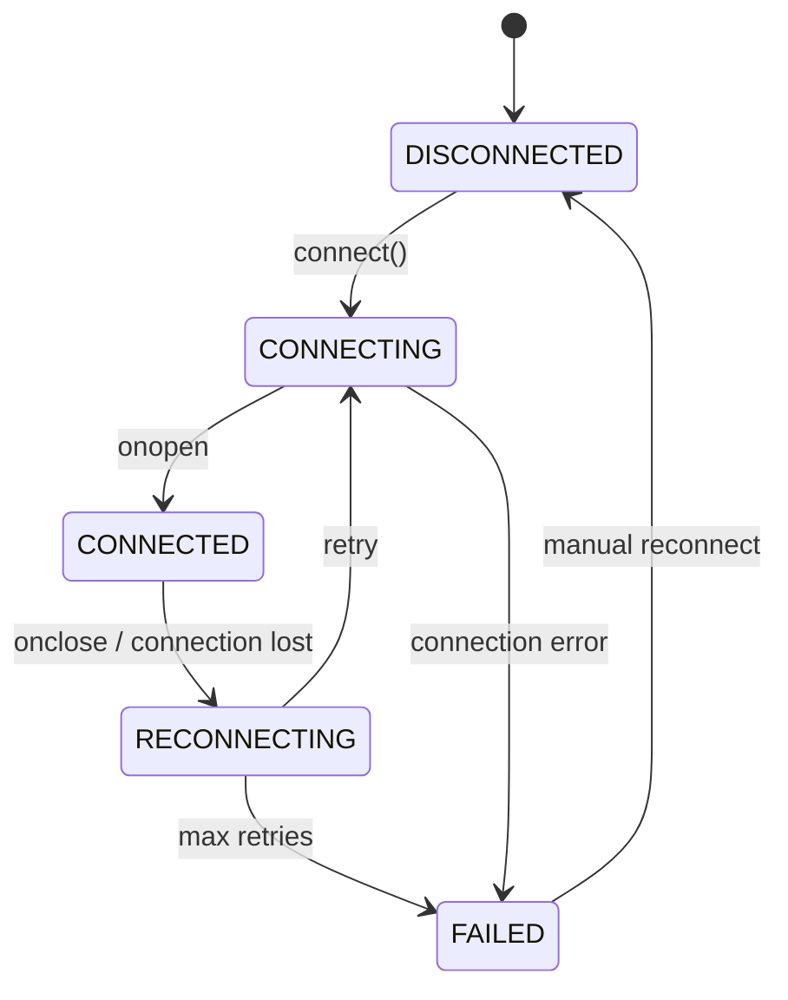
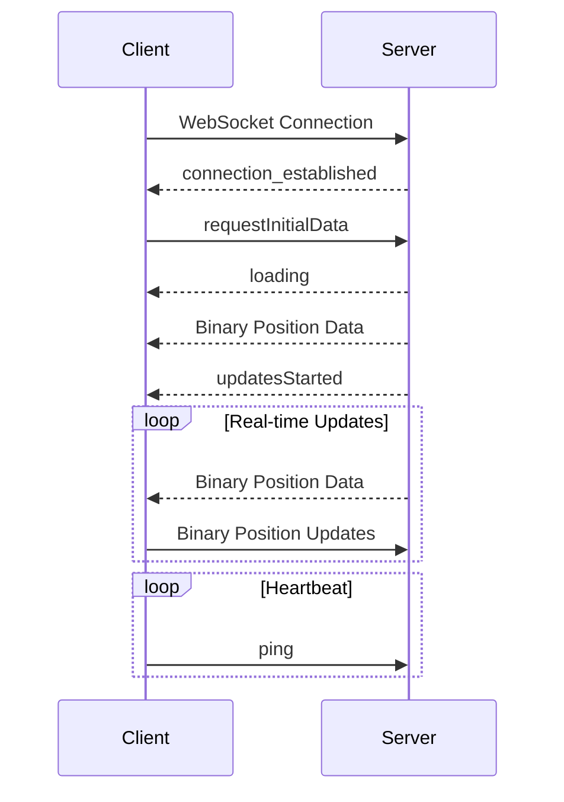

# WebSocket Protocol

This document provides a comprehensive specification of the WebSocket protocol used for real-time communication between the client and server. It covers connection management, message formats, binary protocols, and error handling.

## Connection Establishment

The WebSocket connection URL is constructed dynamically based on the environment:

```typescript
// From client/core/api.ts
export function buildWsUrl(): string {
    const protocol = window.location.protocol === 'https:' ? 'wss:' : 'ws:';
    const host = window.location.hostname;
    // Check if we're in production (any visionflow.info domain)
    const isProduction = host.endsWith('visionflow.info');
    
    if (isProduction) {
        // For production, use relative path to ensure proper proxy handling
        return `${protocol}//${host}/wss`;
    } else {
        // For development, use port 4000 as specified in the documentation
        return `${protocol}//${host}:4000/wss`;
    }
}
```

- Production: `wss://[hostname]/wss`
- Development: `ws://[hostname]:4000/wss`

### Connection States

The WebSocket connection goes through several states:



### Reconnection Strategy

The client implements an exponential backoff reconnection strategy:

```typescript
private getReconnectDelay(): number {
    // Exponential backoff with max delay
    const delay = Math.min(
        this.initialReconnectDelay * Math.pow(2, this.reconnectAttempts),
        this.maxReconnectDelay
    );
    // Add some jitter
    return delay + (Math.random() * 500);
}
```

- Initial delay: 1000ms (1 second)
- Max delay: 30000ms (30 seconds)
- Max reconnection attempts: 5

## Message Types

The WebSocket protocol supports both text and binary messages:

### Text Messages (JSON)

Text messages use JSON format for control messages and metadata:

#### Request for Initial Data

**Client → Server**:
```json
{
  "type": "requestInitialData",
  "timestamp": 1615479082
}
```

#### Loading Status

**Server → Client**:
```json
{
  "type": "loading",
  "message": "Loading graph data...",
  "timestamp": 1615479082
}
```

#### Updates Started

**Server → Client**:
```json
{
  "type": "updatesStarted",
  "timestamp": 1615479082
}
```

#### Connection Established

**Server → Client**:
```json
{
  "type": "connection_established",
  "timestamp": 1615479082
}
```

#### Enable Randomization

**Client → Server**:
```json
{
  "type": "enableRandomization",
  "enabled": true,
  "timestamp": 1615479082
}
```

#### Heartbeat (Ping)

**Client → Server**:
```json
{
  "type": "ping",
  "timestamp": 1615479082
}
```

### Binary Messages

Binary messages are used for efficient transmission of position data. The binary protocol is designed for high performance with minimal overhead.

#### Binary Format Specification

Each node's position data is encoded in a fixed-length binary format:

| Field      | Type    | Size (bytes) | Description                   |
|------------|---------|--------------|-------------------------------|
| Node ID    | uint16  | 2            | Numeric ID for the node       |
| Position X | float32 | 4            | X coordinate                  |
| Position Y | float32 | 4            | Y coordinate                  |
| Position Z | float32 | 4            | Z coordinate                  |
| Velocity X | float32 | 4            | X velocity component          |
| Velocity Y | float32 | 4            | Y velocity component          |
| Velocity Z | float32 | 4            | Z velocity component          |
| **Total**  |         | **26**       | **Bytes per node**            |

The binary message consists of multiple node entries concatenated together:

```
[Node1][Node2][Node3]...
```

Where each `[NodeN]` is 26 bytes as specified above.

#### Binary Message Encoding

```typescript
// Calculate buffer size based on node count (26 bytes per node)
const bufferSize = updates.length * BYTES_PER_NODE;
const buffer = new ArrayBuffer(bufferSize);
const dataView = new DataView(buffer);

// Start writing node data from the beginning
let offset = 0;

updates.forEach(update => {
    const id = parseInt(update.id, 10); 
    
    // Write node ID as u16 
    dataView.setUint16(offset, id, true);
    offset += 2;

    // Write position
    dataView.setFloat32(offset, position.x, true);
    dataView.setFloat32(offset + 4, position.y, true);
    dataView.setFloat32(offset + 8, position.z, true);
    offset += 12;
    
    // Write velocity
    dataView.setFloat32(offset, velocity.x, true);
    dataView.setFloat32(offset + 4, velocity.y, true);
    dataView.setFloat32(offset + 8, velocity.z, true);
    offset += 12;
});
```

#### Binary Message Decoding

```typescript
const dataView = new DataView(decompressedBuffer);
            
// Calculate how many complete nodes we can read
const nodeCount = Math.floor(decompressedBuffer.byteLength / BYTES_PER_NODE);
const nodes = [];

for (let i = 0; i < nodeCount; i++) {
    // Calculate offset for this node
    const offset = i * BYTES_PER_NODE;
    
    // Read node ID (u16)
    const id = dataView.getUint16(offset, true);
    
    // Create Vector3 objects for position and velocity
    const position = new Vector3(
        dataView.getFloat32(offset + 2, true),      // x
        dataView.getFloat32(offset + 6, true),      // y
        dataView.getFloat32(offset + 10, true)      // z
    );
    
    const velocity = new Vector3(
        dataView.getFloat32(offset + 14, true),     // x
        dataView.getFloat32(offset + 18, true),     // y
        dataView.getFloat32(offset + 22, true)      // z
    );
    
    nodes.push({ id, position, velocity });
}
```

## Compression

For larger messages, compression is applied to reduce bandwidth:

```typescript
private compressIfNeeded(buffer: ArrayBuffer): ArrayBuffer {
    if (buffer.byteLength > COMPRESSION_THRESHOLD) {
        try {
            const compressed = pako.deflate(new Uint8Array(buffer));
            return compressed.buffer;
        } catch (error) {
            logger.warn('Compression failed, using original data:', createErrorMetadata(error));
            return buffer;
        }
    }
    return buffer;
}

private tryDecompress(buffer: ArrayBuffer): ArrayBuffer {
    try {
        const decompressed = pako.inflate(new Uint8Array(buffer));
        if (decompressed.length < 8 || decompressed.length % 4 !== 0) {
            return buffer;
        }
        return decompressed.buffer;
    } catch (error) {
        return buffer;
    }
}
```

- Compression is applied to messages larger than 1KB
- The pako library (zlib implementation) is used for compression
- Decompression is attempted on all incoming binary messages
- If decompression fails, the original buffer is used

## Message Flow Sequence

The typical message flow sequence follows this pattern:



## Connection Maintenance

### Heartbeat Mechanism

A heartbeat mechanism is used to keep the connection alive and detect disconnections:

```typescript
private setupHeartbeat(): void {
    this.clearHeartbeat(); // Clear any existing heartbeat
    this.heartbeatInterval = window.setInterval(() => {
        // Send a simple ping message to keep the connection alive
        if (this.ws && this.ws.readyState === WebSocket.OPEN) {
            try {
                this.sendMessage({ type: 'ping', timestamp: Date.now() });
            } catch (err) {
                logger.error('Failed to send heartbeat ping:', createErrorMetadata(err));
            }
        } else if (this.ws && this.ws.readyState === WebSocket.CLOSED) {
            // If socket is closed but heartbeat still running, attempt reconnect
            logger.warn('Heartbeat detected closed socket, attempting reconnect');
            this.handleReconnect();
        }
    }, 10000); // Send ping every 10 seconds
}
```

- Heartbeat interval: 10 seconds
- The heartbeat is used to detect zombie connections
- If a heartbeat fails to send, reconnection is attempted

## Performance Optimizations

The WebSocket implementation includes several performance optimizations:

### Position Deadbanding

To reduce the number of updates sent, position changes below a threshold are filtered out:

```typescript
// Position update deadband threshold
const POSITION_DEADBAND = 0.15; // Units in world space (0.15 = 15cm)

// Apply deadband filtering - only include if position has changed significantly
const lastPosition = this.lastNodePositions.get(id);
let positionChanged = true;

if (lastPosition) {
    // Calculate squared distance to avoid unnecessary sqrt
    const dx = position.x - lastPosition.x;
    const dy = position.y - lastPosition.y;
    const dz = position.z - lastPosition.z;
    const distanceSquared = dx*dx + dy*dy + dz*dz;
    
    // Only consider position changed if it exceeds our threshold
    positionChanged = distanceSquared > (POSITION_DEADBAND * POSITION_DEADBAND);
}
```

### Update Throttling

Updates are throttled to prevent overwhelming the network or rendering:

```typescript
// Process updates with throttling
if (this.updateThrottler.shouldUpdate()) {
    this.processPendingNodeUpdates();
} else {
    // Schedule processing if not already scheduled
    if (this.nodeUpdateTimer === null) {
        this.nodeUpdateTimer = window.setTimeout(() => {
            this.processPendingNodeUpdates();
            this.nodeUpdateTimer = null;
        }, this.updateThrottler.getTimeUntilNextUpdate());
    }
}
```

- Update throttle rate: 150ms (~6-7fps)
- Updates are batched to improve performance

## Error Handling

The WebSocket implementation includes robust error handling:

### Connection Errors

```typescript
this.ws.onerror = (event: Event): void => {
    logger.error('WebSocket error:', createDataMetadata(event));
    // onerror is typically followed by onclose, so handling reconnection there
};

this.ws.onclose = (event: CloseEvent): void => {
    logger.warn('WebSocket closed', createDataMetadata({
        code: event.code,
        reason: event.reason || "No reason provided",
        initialDataReceived: this.initialDataReceived,
        wasConnected: this.connectionState === ConnectionState.CONNECTED,
        url: this.url
    }));
    
    // Clear heartbeat on connection close
    this.clearHeartbeat();
    
    if (this.connectionStatusHandler) {
        this.connectionStatusHandler(false);
    }
    
    this.handleReconnect();
};
```

### Message Processing Errors

```typescript
try {
    // Process message
} catch (error) {
    logger.error('Failed to process binary message:', createErrorMetadata(error));
}
```

## Debugging and Monitoring

The WebSocket implementation includes extensive debugging and monitoring capabilities:

### Debug Logging

```typescript
if (debugState.isWebsocketDebugEnabled()) {
    logger.debug('WebSocket message received:', message);
}
```

### Connection Status Tracking

```typescript
public onConnectionStatusChange(handler: (status: boolean) => void): void {
    this.connectionStatusHandler = handler;
    if (this.connectionState === ConnectionState.CONNECTED && handler) {
        handler(true);
    }
}
```

### Loading Status Tracking

```typescript
public onLoadingStatusChange(handler: (isLoading: boolean, message?: string) => void): void {
    this.loadingStatusHandler = handler;
    
    // Immediately notify with current state if already loading
    if (this.isLoading && handler) {
        handler(true);
    }
}
```

## WebSocket Service Implementation

The WebSocket service is implemented as a singleton to ensure a single connection is maintained:

```typescript
export class WebSocketService {
    private static instance: WebSocketService | null = null;
    
    public static getInstance(): WebSocketService {
        if (!WebSocketService.instance) {
            WebSocketService.instance = new WebSocketService();
        }
        return WebSocketService.instance;
    }
    
    // ...implementation details...
}
```

## Server-Side Randomization

The client can control server-side node position randomization:

```typescript
public enableRandomization(enabled: boolean): void {
    if (!this.ws || this.ws.readyState !== WebSocket.OPEN) {
        if (enabled) {
            logger.warn('WebSocket not connected, attempting to reconnect before enabling randomization');
            // Try to reconnect
            this.connect().then(() => {
                // If connection succeeded, try again
                if (this.ws?.readyState === WebSocket.OPEN) {
                    logger.info(`${enabled ? 'Enabling' : 'Disabling'} server-side position randomization after reconnection`);
                    this.sendMessage({ type: 'enableRandomization', enabled });
                }
            }).catch(e => {
                logger.error('Failed to reconnect for randomization:', createErrorMetadata(e));
            });
        } else {
            logger.warn('WebSocket not connected, cannot disable randomization');
        }
        return;
    }

    logger.info(`${enabled ? 'Enabling' : 'Disabling'} server-side position randomization`);
    this.sendMessage({ type: 'enableRandomization', enabled });
}
```

## Next Sections

For more detailed information, refer to:
- [REST Endpoints](rest-endpoints.md) - REST API details
- [Payload Formats](payload-formats.md) - Request/response payload formats
- [Authentication](authentication.md) - Authentication mechanisms