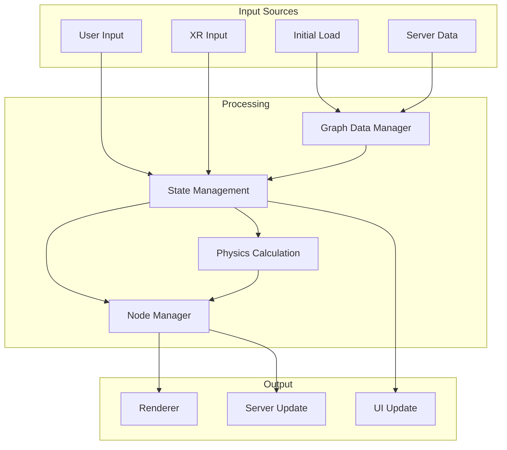
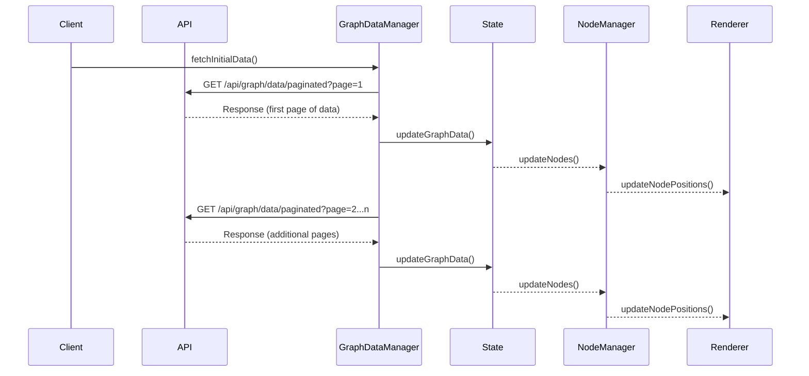
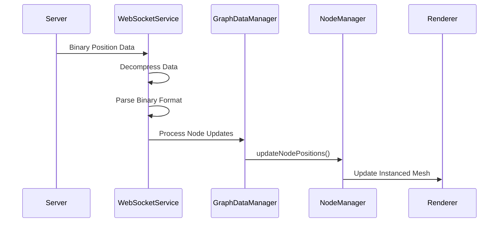
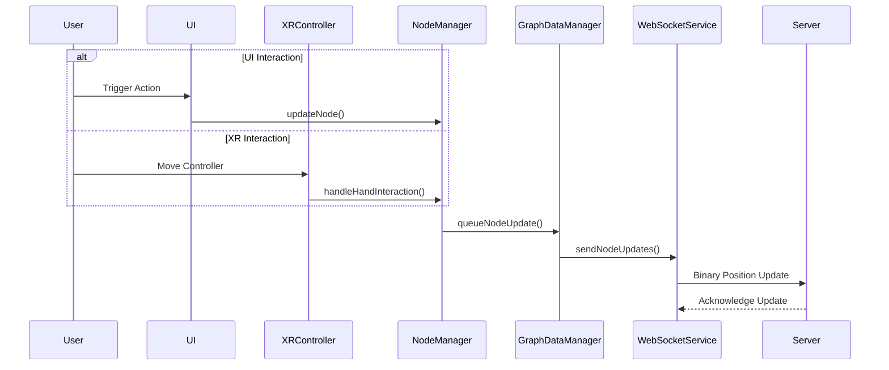
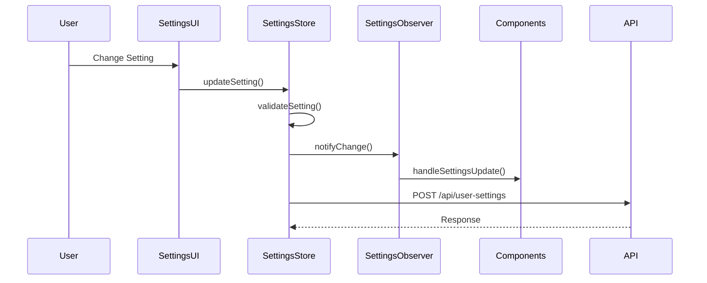
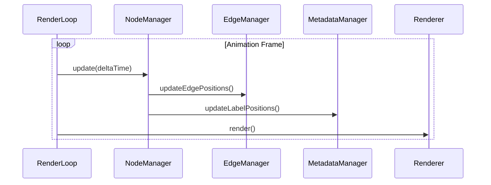
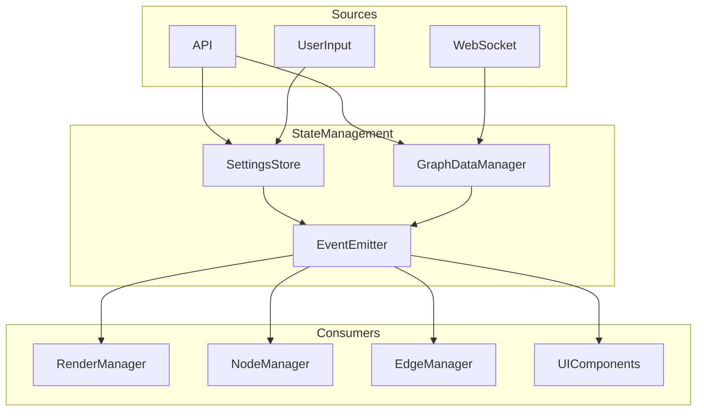
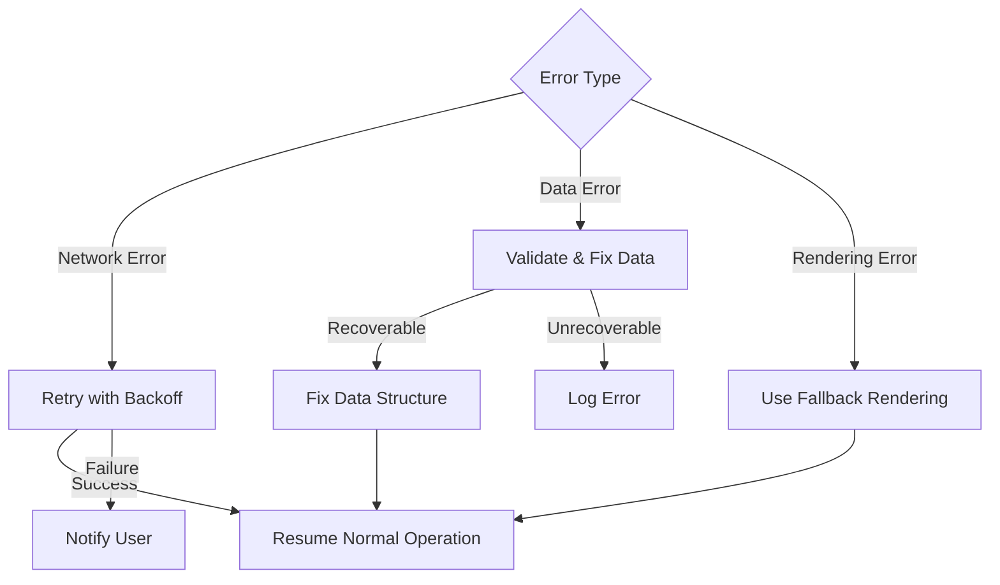
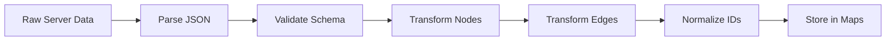
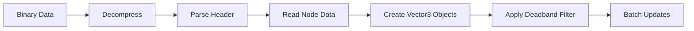

# Data Flow

This document details the flow of data through the client application, including request/response patterns, real-time updates, and internal data transformations.

## High-Level Data Flow

The client application follows several distinct data flow patterns based on the type of interaction:

1. **Initial Data Loading** - Loading graph data when the application starts
2. **Real-time Updates** - Streaming position updates via WebSocket
3. **User Interaction** - User-initiated changes through the UI or XR
4. **Settings Changes** - Updates to application settings
5. **Rendering Loop** - Continuous rendering and state updates

## Initial Data Loading Flow

When the application starts, it loads initial graph data from the server.

### Pagination Strategy

The client uses pagination to load large datasets efficiently:

1. First, load page 1 with a small page size (typically 100 items)
2. Notify UI to start showing data immediately
3. Load remaining pages in the background
4. Aggregate data as pages arrive
5. Process any edges with missing nodes when all pages are loaded

This approach balances initial load performance with completeness of data.

## WebSocket Real-time Updates

Real-time position updates occur through a binary WebSocket protocol.

### Binary Protocol

The WebSocket binary protocol has a compact format:

- **Node ID**: 2 bytes (u16)
- **Position**: 12 bytes (3 × f32 for X, Y, Z)
- **Velocity**: 12 bytes (3 × f32 for X, Y, Z)

Total bytes per node: 26 bytes

This compact format allows efficient transmission of position updates for many nodes.

### Throttling and Batching

Position updates are throttled and batched to balance responsiveness with performance:

1. Updates are collected in a buffer
2. Updates are processed at most every 16ms (approximately 60fps)
3. Position deadbanding filters out minor changes
4. Binary updates are compressed when over 1KB

## User Interaction Flow

User interaction through UI or XR controllers triggers changes that propagate through the system.

### Node Selection and Manipulation

When a user selects and manipulates a node:

1. Selection is tracked in NodeInteractionManager
2. Position changes are applied locally first for immediate feedback
3. Changes are sent to the server via WebSocket
4. Server validates and broadcasts changes
5. Changes are received back by all clients including the originator

## Settings Changes Flow

Settings changes follow a validation and notification pattern.

### Settings Validation and Persistence

Settings changes undergo several steps:

1. Validation against schema
2. Local state update
3. Notification to observers
4. Persistence to server
5. Acknowledgment from server

## Rendering Loop Data Flow

The rendering loop continuously updates the visual representation based on current state.

### Performance Optimization

The rendering loop implements several optimization techniques:

1. Request Animation Frame for timing
2. Level of Detail (LOD) based on camera distance
3. Visibility culling for off-screen objects
4. Throttling of metadata updates
5. Instanced rendering for nodes

## State Management Flow

The application state flows through a central state management system.

### State Synchronization

Multiple strategies ensure state remains synchronized:

1. Event-based notifications for state changes
2. Subscription-based observation
3. Polling for certain time-dependent updates
4. WebSocket for server-initiated updates

## Error Handling Flow

Error handling follows a specific flow to ensure reliability.

### Retry Strategies

Network operations implement retry strategies:

1. Exponential backoff with jitter
2. Maximum retry count (typically 5)
3. Circuit breaking to prevent cascading failures
4. Graceful degradation for non-critical features

## Data Transformation

Several key data transformations occur within the application:

### Graph Data Transformation

### Binary Format Transformation

## Next Sections

For more detailed information, refer to:
- [State Management](state-management.md) - State management approach
- [WebSocket Protocol](../apis/websocket-protocol.md) - WebSocket protocol details
- [REST Endpoints](../apis/rest-endpoints.md) - REST API details