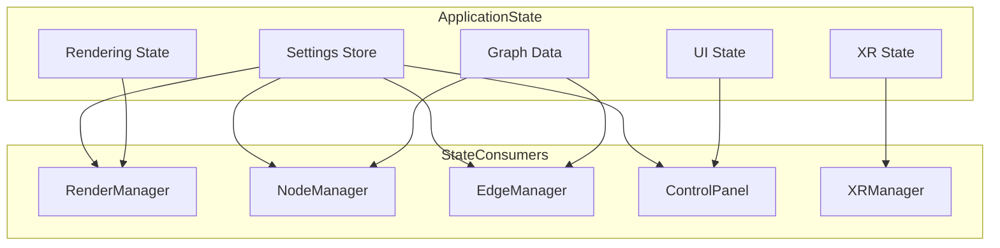
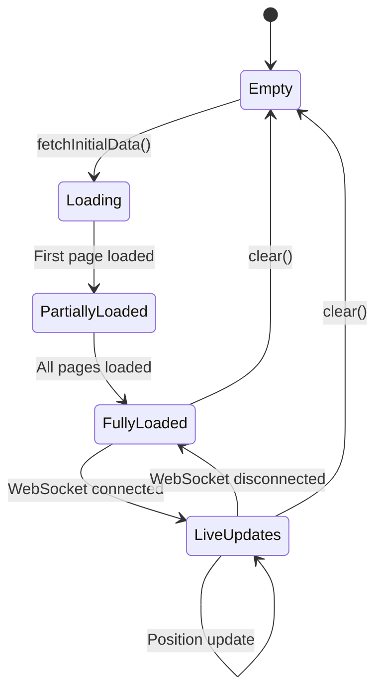
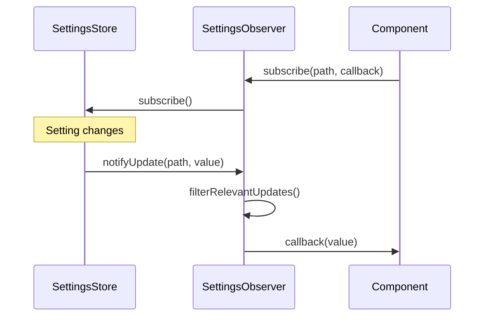
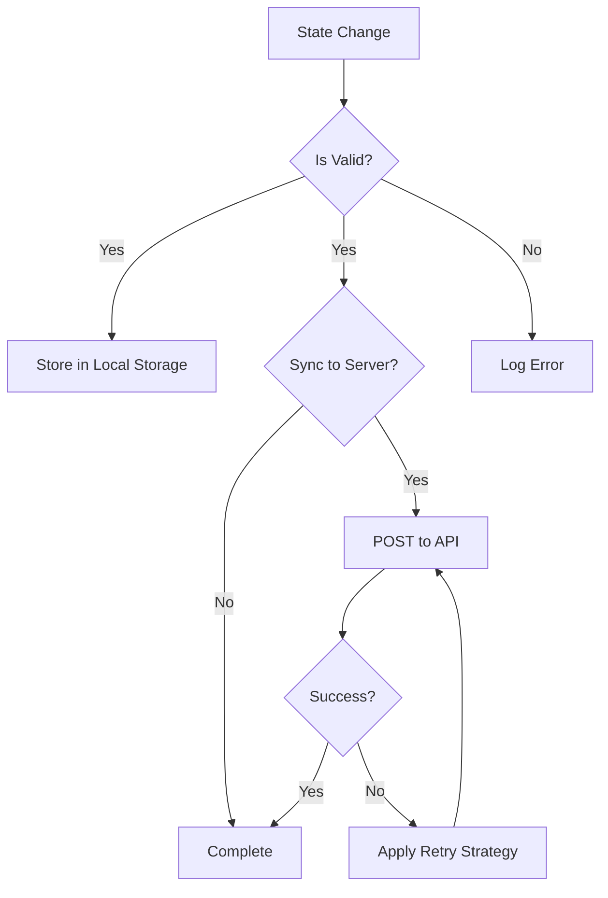
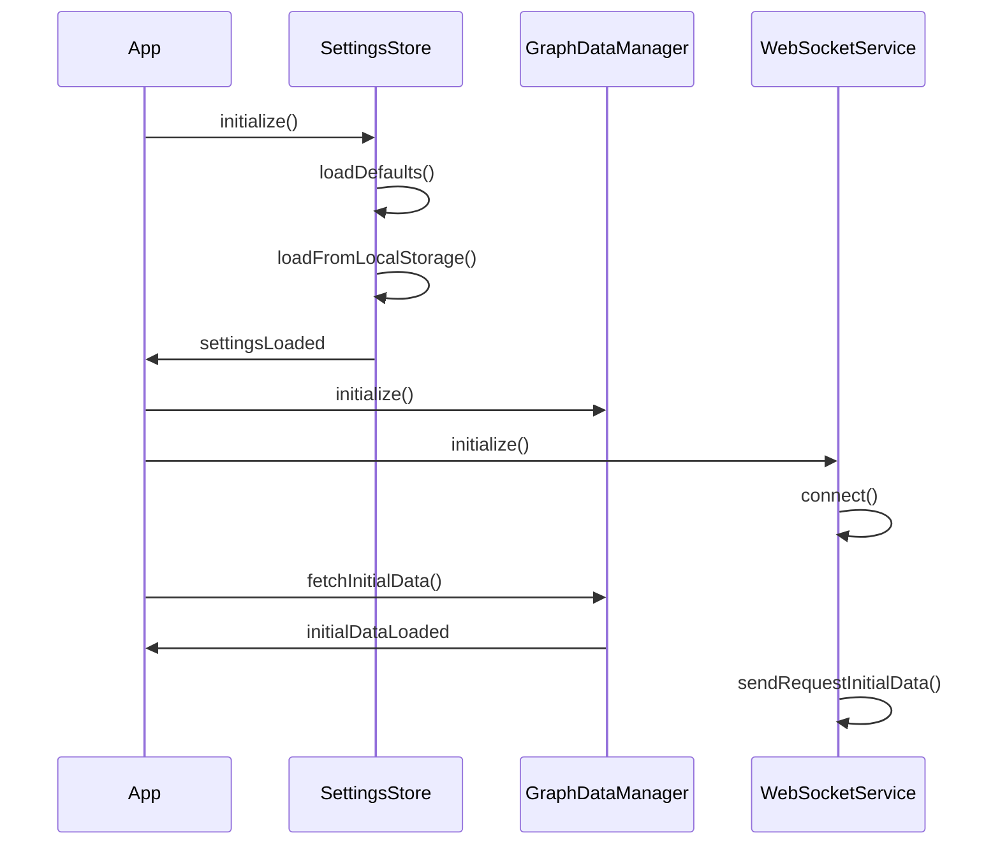

# State Management

This document details the state management patterns and mechanisms used throughout the client application. The application uses several complementary approaches to state management to handle different types of state.

## State Management Overview

The client application manages several types of state:

1. **Application Settings** - User preferences and application configuration
2. **Graph Data** - Nodes, edges, and metadata for the visualization
3. **UI State** - Control panel state, selected items, and UI configuration
4. **Rendering State** - Camera position, visibility settings, and rendering options
5. **XR State** - XR session status, controller positions, and interaction state



## Key State Management Components

### Settings Store (`client/state/SettingsStore.ts`)

The Settings Store manages application settings with validation, persistence, and observation.

**Key Features:**
- Schema-based validation of settings
- Persistence to local storage and server
- Observable changes through subscribers
- Default values for all settings

**Implementation Pattern:**
```typescript
class SettingsStore {
  private settings: Settings;
  private observers: Set<Observer>;
  
  updateSetting(path: string, value: any): boolean {
    // Validate against schema
    // Update if valid
    // Notify observers
    // Persist to storage
  }
  
  subscribe(observer: Observer): () => void {
    // Add observer to set
    // Return unsubscribe function
  }
}
```

### Graph Data Manager (`client/state/graphData.ts`)

The Graph Data Manager maintains the state of the graph visualization data.

**Key Features:**
- Loads and processes graph data from server
- Manages node and edge collections
- Handles real-time position updates
- Provides subscription mechanism for changes

**State Transitions:**


### Settings Observer (`client/state/SettingsObserver.ts`)

The Settings Observer implements the Observer pattern to propagate settings changes.

**Key Features:**
- Subscribes to Settings Store
- Filters and transforms settings updates
- Distributes settings to appropriate components

**Observer Pattern Implementation:**


### Debug State (`client/core/debugState.ts`)

Debug State manages debug flags and settings that control logging and development features.

**Key Features:**
- Feature flags for debug capabilities
- Controlled access to debug state
- Persistence of debug settings

## State Persistence

The application persists state in several ways:

1. **Local Storage** - User preferences and UI state
2. **Server Storage** - User settings synchronized to server
3. **URL Parameters** - Shareable state in URL

### Persistence Flow



## State Change Propagation

The application uses several mechanisms to propagate state changes:

### Event Emitter (`client/utils/eventEmitter.ts`)

A publish-subscribe system for loose coupling between components.

**Key Features:**
- Named events with typed payloads
- Multiple subscribers per event
- Ability to unsubscribe
- Debugging and tracing capabilities

**Usage Pattern:**
```typescript
// Publisher
eventEmitter.emit('settings:changed', { path: 'rendering.quality', value: 'high' });

// Subscriber
const unsubscribe = eventEmitter.on('settings:changed', (data) => {
  // Handle event
});

// Later
unsubscribe();
```

### Direct Subscriptions

Components can subscribe directly to state stores.

**Example:**
```typescript
// Subscribe to graph data changes
const unsubscribe = graphDataManager.subscribe((data) => {
  // Update component based on new data
});

// Subscribe to settings changes
const unsubscribe = settingsStore.subscribe((settings) => {
  // Update component based on new settings
});
```

### DOM Events

Used for global application events and cross-component communication.

**Example:**
```typescript
// Dispatch event
window.dispatchEvent(new CustomEvent('graph-data-reset', { detail: {} }));

// Listen for event
window.addEventListener('graph-data-reset', () => {
  // Handle event
});
```

## State Initialization Sequence



## Settings Structure

The settings are organized hierarchically by domain:

```typescript
interface Settings {
  visualization: {
    nodes: {
      size: number;
      color: string;
      // ...
    };
    edges: {
      thickness: number;
      color: string;
      // ...
    };
    labels: {
      visible: boolean;
      size: number;
      // ...
    };
    // ...
  };
  physics: {
    enabled: boolean;
    gravity: number;
    // ...
  };
  network: {
    reconnectDelay: number;
    // ...
  };
  // ...
}
```

### Settings Validation

Settings are validated against schemas that define:
- Type constraints
- Range constraints
- Required properties
- Default values

Invalid settings are rejected with error messages.

## State Immutability

The application uses immutability patterns to prevent unexpected state changes:

1. Creating new objects or arrays when updating state
2. Using spread operators for shallow copies
3. Using deep copy functions for nested structures
4. Using getters without setters for read-only access

**Example of Immutable Update:**
```typescript
// Instead of modifying state directly
this.state.user.name = "New Name"; // BAD

// Create a new state object
this.state = {
  ...this.state,
  user: {
    ...this.state.user,
    name: "New Name"
  }
}; // GOOD
```

## Common State Patterns

### State Initialization

Components initialize state in a consistent pattern:

1. Create with default values
2. Load from persistent storage if available
3. Subscribe to relevant state updates
4. Initialize async resources
5. Signal readiness

### Error State Management

Error states are managed through:

1. Try-catch blocks for synchronous operations
2. Promise catch handlers for async operations
3. Error objects with type information
4. Centralized error logging
5. State flags to indicate error conditions

### Loading State Management

Loading states are tracked to improve user experience:

1. Boolean flags for loading status
2. Progress indicators for long operations
3. Throttling to prevent UI flicker
4. Timeout detection for stuck operations

## Next Sections

For more detailed information, refer to:
- [Data Flow](data-flow.md) - How data flows through the application
- [Component Architecture](component-architecture.md) - Component relationships
- [Business Logic](../core/business-logic.md) - Core business rules and logic