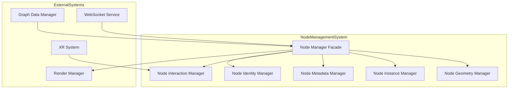
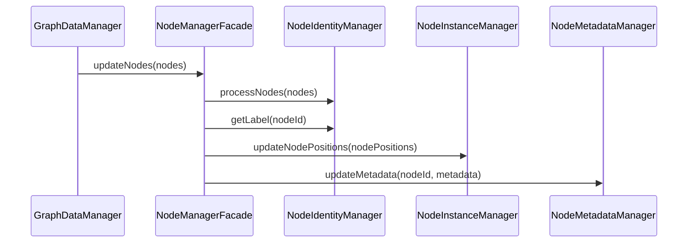

# Node Management

This document provides a detailed overview of the node management system in the client application. The node management system is responsible for creating, updating, and rendering nodes in the 3D visualization.

## Node Management Architecture

The node management system uses a facade pattern to provide a unified interface to several specialized components:



### Key Components

#### Node Manager Facade (`client/rendering/node/NodeManagerFacade.ts`)

The Node Manager Facade is the central coordinator of the node management system. It provides a unified interface to the specialized components and coordinates their activities.

**Key Responsibilities:**
- Coordinate between the specialized node managers
- Handle node updates from the Graph Data Manager
- Process node position updates from the WebSocket Service
- Update node metadata and labels
- Handle XR interactions with nodes

**Interface:**
```typescript
interface NodeManagerInterface {
  updateNodes(nodes: { id: string, data: NodeData }[]): void;
  updateNodePositions(nodes: { id: string, data: { position: Vector3, velocity?: Vector3 } }[]): void;
  handleHandInteraction(hand: XRHandWithHaptics): void;
  update(deltaTime: number): void;
  setXRMode(enabled: boolean): void;
  handleSettingsUpdate(settings: Settings): void;
  dispose(): void;
}
```

#### Node Geometry Manager (`client/rendering/node/geometry/NodeGeometryManager.ts`)

The Node Geometry Manager handles the creation and management of node geometries.

**Key Responsibilities:**
- Create node geometries with different detail levels
- Optimize geometries for performance
- Cache geometries for reuse

**Implementation Details:**
```typescript
class NodeGeometryManager {
  private geometries: Map<string, BufferGeometry>;
  
  // Create or get node geometry
  getGeometry(detail: NodeGeometryDetail): BufferGeometry {
    const key = this.getGeometryKey(detail);
    
    if (!this.geometries.has(key)) {
      // Create new geometry based on detail level
      const geometry = this.createGeometry(detail);
      this.geometries.set(key, geometry);
    }
    
    return this.geometries.get(key)!;
  }
  
  // Create geometry with specified detail
  private createGeometry(detail: NodeGeometryDetail): BufferGeometry {
    switch (detail) {
      case NodeGeometryDetail.High:
        return new SphereGeometry(1, 32, 32);
      case NodeGeometryDetail.Medium:
        return new SphereGeometry(1, 16, 16);
      case NodeGeometryDetail.Low:
        return new SphereGeometry(1, 8, 8);
      default:
        return new SphereGeometry(1, 8, 8);
    }
  }
}
```

#### Node Instance Manager (`client/rendering/node/instance/NodeInstanceManager.ts`)

The Node Instance Manager handles the instanced rendering of nodes, which allows rendering many nodes with a single draw call.

**Key Responsibilities:**
- Create and manage instanced mesh for nodes
- Update node positions, rotations, and scales
- Handle node visibility and level of detail
- Map between node IDs and instance indices

**Implementation Details:**
```typescript
class NodeInstanceManager {
  private instancedMesh: InstancedMesh;
  private nodeIdToInstanceIndex: Map<string, number>;
  private instanceIndexToNodeId: Map<number, string>;
  private nodePositions: Map<string, Vector3>;
  
  // Create instanced mesh
  constructor(scene: Scene, material: Material) {
    // Create geometry
    const geometry = new SphereGeometry(1, 16, 16);
    
    // Create instanced mesh
    this.instancedMesh = new InstancedMesh(
      geometry,
      material,
      MAX_NODES
    );
    
    // Add to scene
    scene.add(this.instancedMesh);
  }
  
  // Update node positions
  updateNodePositions(updates: NodeUpdate[]): void {
    // Create dummy objects for matrix composition
    const position = new Vector3();
    const quaternion = new Quaternion();
    const scale = new Vector3(1, 1, 1);
    const matrix = new Matrix4();
    
    // Process each update
    updates.forEach(update => {
      // Get instance index
      const instanceIndex = this.getInstanceIndex(update.id);
      if (instanceIndex === undefined) return;
      
      // Update position
      position.copy(update.position);
      this.nodePositions.set(update.id, position.clone());
      
      // Update matrix
      scale.setScalar(update.metadata?.nodeSize || DEFAULT_NODE_SIZE);
      matrix.compose(position, quaternion, scale);
      this.instancedMesh.setMatrixAt(instanceIndex, matrix);
    });
    
    // Mark instance matrix as needing update
    this.instancedMesh.instanceMatrix.needsUpdate = true;
  }
  
  // Get node position
  getNodePosition(nodeId: string): Vector3 | undefined {
    return this.nodePositions.get(nodeId);
  }
  
  // Get instance index for node ID
  private getInstanceIndex(nodeId: string): number | undefined {
    // Check if node already has an instance
    if (this.nodeIdToInstanceIndex.has(nodeId)) {
      return this.nodeIdToInstanceIndex.get(nodeId);
    }
    
    // Create new instance if possible
    if (this.nextInstanceIndex < MAX_NODES) {
      const instanceIndex = this.nextInstanceIndex++;
      this.nodeIdToInstanceIndex.set(nodeId, instanceIndex);
      this.instanceIndexToNodeId.set(instanceIndex, nodeId);
      return instanceIndex;
    }
    
    // No available instances
    return undefined;
  }
}
```

#### Node Metadata Manager (`client/rendering/node/metadata/NodeMetadataManager.ts`)

The Node Metadata Manager handles node metadata, including labels and visualization properties.

**Key Responsibilities:**
- Create and update node labels
- Visualize node metadata (size, color, etc.)
- Handle label visibility based on camera distance
- Update label positions when nodes move

**Implementation Details:**
```typescript
class NodeMetadataManager {
  private labels: Map<string, Object3D>;
  private labelData: Map<string, NodeLabelData>;
  private textRenderer: TextRenderer;
  private labelVisibilityThreshold: number;
  
  // Update metadata for node
  updateMetadata(nodeId: string, metadata: NodeMetadata): void {
    // Skip if no metadata
    if (!metadata) return;
    
    // Create or update label
    if (!this.labels.has(nodeId)) {
      // Create new label
      const label = this.createLabel(nodeId, metadata);
      this.labels.set(nodeId, label);
      this.scene.add(label);
    } else {
      // Update existing label
      const label = this.labels.get(nodeId)!;
      this.updateLabel(label, metadata);
    }
    
    // Store label data
    this.labelData.set(nodeId, {
      name: metadata.name,
      position: metadata.position.clone(),
      importance: metadata.importance || 0,
      nodeSize: metadata.nodeSize || 1,
    });
  }
  
  // Update label position
  updatePosition(nodeId: string, position: Vector3): void {
    // Skip if label doesn't exist
    if (!this.labels.has(nodeId)) return;
    
    // Get label
    const label = this.labels.get(nodeId)!;
    
    // Update position
    label.position.copy(position);
    label.position.y += 0.5; // Offset above node
    
    // Update label data
    const labelData = this.labelData.get(nodeId);
    if (labelData) {
      labelData.position.copy(position);
    }
  }
  
  // Update label visibility based on camera distance
  update(camera: Camera): void {
    // Skip if no labels
    if (this.labels.size === 0) return;
    
    // Get camera position
    const cameraPosition = camera.position;
    
    // Update label visibility
    this.labels.forEach((label, nodeId) => {
      const labelData = this.labelData.get(nodeId);
      if (!labelData) return;
      
      // Calculate distance to camera
      const distance = cameraPosition.distanceTo(labelData.position);
      
      // Calculate visibility threshold based on importance
      const threshold = this.labelVisibilityThreshold * (1 + labelData.importance * 0.5);
      
      // Set visibility
      label.visible = distance < threshold;
    });
  }
}
```

#### Node Interaction Manager (`client/rendering/node/interaction/NodeInteractionManager.ts`)

The Node Interaction Manager handles interactions with nodes, such as selection, dragging, and XR interactions.

**Key Responsibilities:**
- Handle node selection
- Process XR interactions with nodes
- Handle node dragging and manipulation
- Communicate node interactions to other components

**Implementation Details:**
```typescript
class NodeInteractionManager {
  private instancedMesh: InstancedMesh;
  private selectedNode: string | null = null;
  private raycaster: Raycaster;
  private tempVector: Vector3;
  
  // Handle mouse interaction
  handleMouseInteraction(event: MouseEvent, camera: Camera): void {
    // Skip if no instanced mesh
    if (!this.instancedMesh) return;
    
    // Calculate mouse position
    const mouse = new Vector2(
      (event.clientX / window.innerWidth) * 2 - 1,
      -(event.clientY / window.innerHeight) * 2 + 1
    );
    
    // Update raycaster
    this.raycaster.setFromCamera(mouse, camera);
    
    // Intersect objects
    const intersects = this.raycaster.intersectObject(this.instancedMesh, true);
    
    // Handle intersection
    if (intersects.length > 0) {
      // Get instance ID
      const instanceId = intersects[0].instanceId;
      
      // Get node ID
      const nodeId = this.getNodeId(instanceId!);
      
      // Select node
      this.selectNode(nodeId);
    } else {
      // Deselect node
      this.deselectNode();
    }
  }
  
  // Handle XR hand interaction
  handleHandInteraction(hand: XRHandWithHaptics): void {
    // Skip if no instanced mesh or hand
    if (!this.instancedMesh || !hand) return;
    
    // Get hand position
    const handPosition = new Vector3();
    hand.position.getWorldPosition(handPosition);
    
    // Get hand direction
    const handDirection = new Vector3();
    hand.direction.getWorldDirection(handDirection);
    
    // Update raycaster
    this.raycaster.set(handPosition, handDirection);
    
    // Intersect objects
    const intersects = this.raycaster.intersectObject(this.instancedMesh, true);
    
    // Handle intersection
    if (intersects.length > 0) {
      // Get instance ID
      const instanceId = intersects[0].instanceId;
      
      // Get node ID
      const nodeId = this.getNodeId(instanceId!);
      
      // Select node
      this.selectNode(nodeId);
      
      // Trigger haptic feedback
      hand.hapticActuators[0]?.pulse(0.5, 100);
    }
  }
  
  // Select node
  private selectNode(nodeId: string | null): void {
    // Skip if already selected
    if (this.selectedNode === nodeId) return;
    
    // Deselect previous node
    if (this.selectedNode) {
      this.deselectNode();
    }
    
    // Select new node
    this.selectedNode = nodeId;
    
    // Dispatch selection event
    if (nodeId) {
      this.dispatchEvent('node-selected', { nodeId });
    }
  }
  
  // Deselect node
  private deselectNode(): void {
    // Skip if no selected node
    if (!this.selectedNode) return;
    
    // Dispatch deselection event
    this.dispatchEvent('node-deselected', { nodeId: this.selectedNode });
    
    // Clear selected node
    this.selectedNode = null;
  }
}
```

#### Node Identity Manager (`client/rendering/node/identity/NodeIdentityManager.ts`)

The Node Identity Manager manages node identities, including mapping between different identifier types and handling label generation.

**Key Responsibilities:**
- Map between node IDs and display labels
- Ensure unique labels for nodes
- Handle node ID validation
- Track all known nodes

**Implementation Details:**
```typescript
class NodeIdentityManager {
  private nodeLabels: Map<string, string>;
  private labelToNodeIds: Map<string, Set<string>>;
  private allNodeIds: Set<string>;
  
  // Get label for node
  getLabel(nodeId: string): string {
    // Return existing label if available
    if (this.nodeLabels.has(nodeId)) {
      return this.nodeLabels.get(nodeId)!;
    }
    
    // Default to node ID itself
    return `Node_${nodeId}`;
  }
  
  // Force a specific label for a node
  forceNodeLabel(nodeId: string, label: string): void {
    // Skip if null or undefined
    if (!nodeId || !label) return;
    
    // Get old label
    const oldLabel = this.nodeLabels.get(nodeId);
    
    // Skip if label is unchanged
    if (oldLabel === label) return;
    
    // Remove from old label mapping
    if (oldLabel && this.labelToNodeIds.has(oldLabel)) {
      const nodeIds = this.labelToNodeIds.get(oldLabel)!;
      nodeIds.delete(nodeId);
      if (nodeIds.size === 0) {
        this.labelToNodeIds.delete(oldLabel);
      }
    }
    
    // Set new label
    this.nodeLabels.set(nodeId, label);
    
    // Add to label mapping
    if (!this.labelToNodeIds.has(label)) {
      this.labelToNodeIds.set(label, new Set());
    }
    this.labelToNodeIds.get(label)!.add(nodeId);
    
    // Add to all node IDs
    this.allNodeIds.add(nodeId);
  }
  
  // Process nodes to detect duplicates
  processNodes(nodes: { id: string }[]): { duplicateLabels: Map<string, string[]> } {
    const duplicateLabels = new Map<string, string[]>();
    
    // Process nodes
    nodes.forEach(node => {
      // Add to all node IDs
      this.allNodeIds.add(node.id);
      
      // Skip if no label
      const label = this.nodeLabels.get(node.id);
      if (!label) return;
      
      // Check for duplicates
      const nodeIds = this.labelToNodeIds.get(label);
      if (nodeIds && nodeIds.size > 1) {
        duplicateLabels.set(label, Array.from(nodeIds));
      }
    });
    
    return { duplicateLabels };
  }
  
  // Check if ID is a valid numeric ID
  isValidNumericId(id: string): boolean {
    return id !== undefined && id !== null && /^\d+$/.test(id);
  }
  
  // Get all known node IDs
  getAllNodeIds(): string[] {
    return Array.from(this.allNodeIds);
  }
}
```

## Node Data Structure

The node data structure is defined in `client/core/types.ts`:

```typescript
interface Node {
  id: string;
  data: NodeData;
}

interface NodeData {
  position: Vector3;
  velocity?: Vector3;
  metadata?: NodeMetadata;
}

interface NodeMetadata {
  name?: string;
  file_name?: string;
  lastModified?: number;
  links?: string[];
  references?: string[];
  fileSize?: number;
  hyperlinkCount?: number;
  importance?: number;
  nodeSize?: number;
}
```

## Node Update Flow

The node update flow follows these steps:



### Initial Node Loading

When nodes are initially loaded:

1. GraphDataManager fetches node data from the server
2. GraphDataManager transforms the data into a usable format
3. GraphDataManager calls NodeManagerFacade.updateNodes()
4. NodeManagerFacade processes the nodes:
   a. Validates node IDs
   b. Processes node metadata
   c. Generates or retrieves node labels
   d. Updates node positions
   e. Updates node metadata and labels

### Real-time Node Updates

When nodes are updated in real-time:

1. WebSocketService receives binary position data
2. WebSocketService decodes the binary format
3. WebSocketService calls GraphDataManager.updateNodePositions()
4. GraphDataManager calls NodeManagerFacade.updateNodePositions()
5. NodeManagerFacade updates node positions
6. During the render loop, NodeManagerFacade updates label positions

## Node Rendering

Nodes are rendered using instanced rendering for performance:

```typescript
// Create instanced mesh
this.instancedMesh = new InstancedMesh(
  geometry,
  material,
  maxInstances
);

// Update instance matrices
updates.forEach(update => {
  const instanceIndex = this.getInstanceIndex(update.id);
  if (instanceIndex === undefined) return;
  
  position.copy(update.position);
  scale.setScalar(update.metadata?.nodeSize || DEFAULT_NODE_SIZE);
  matrix.compose(position, quaternion, scale);
  this.instancedMesh.setMatrixAt(instanceIndex, matrix);
});
this.instancedMesh.instanceMatrix.needsUpdate = true;
```

This approach allows rendering thousands of nodes with minimal draw calls, significantly improving performance.

## Node Selection and Interaction

Nodes can be selected and interacted with using mouse, touch, or XR controllers:

```typescript
// Mouse selection
renderer.domElement.addEventListener('mousedown', (event) => {
  this.interactionManager.handleMouseInteraction(event, camera);
});

// XR controller interaction
xrController.addEventListener('select', (event) => {
  this.interactionManager.handleXRInteraction(event.controller);
});
```

Selected nodes can be manipulated:

```typescript
// Node manipulation
renderer.domElement.addEventListener('mousemove', (event) => {
  if (this.interactionManager.hasSelectedNode()) {
    const movement = new Vector2(
      event.movementX / window.innerWidth,
      -event.movementY / window.innerHeight
    );
    this.interactionManager.moveSelectedNode(movement, camera);
  }
});
```

## Node Performance Considerations

Several optimizations are used to maintain performance with large node counts:

1. **Instanced Rendering**: All nodes share the same geometry and material, significantly reducing draw calls
2. **Level of Detail**: Node geometry detail is reduced based on distance from camera
3. **Visibility Culling**: Nodes outside the camera frustum are not processed
4. **Position Deadbanding**: Small position changes are ignored to reduce update frequency
5. **Label Throttling**: Label updates are throttled to reduce update frequency
6. **Binary Protocol**: A compact binary format is used for position updates

## Next Sections

For more detailed information, refer to:
- [Rendering Pipeline](rendering-pipeline.md) - Rendering pipeline overview
- [Metadata Visualization](metadata-visualization.md) - Metadata visualization details
- [XR Integration](xr-integration.md) - WebXR integration