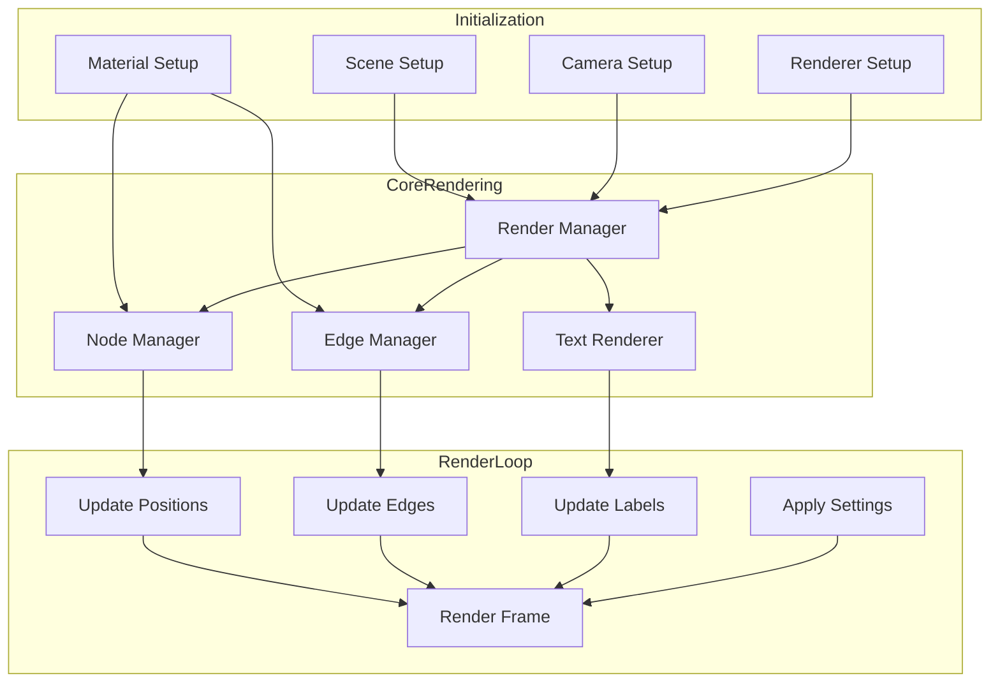
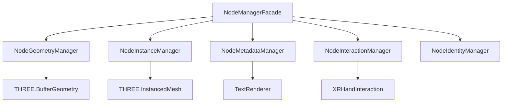

# Rendering Pipeline

This document provides a comprehensive overview of the client rendering pipeline, which is built on Three.js and WebGL. It covers scene setup, rendering optimization, material management, and the overall rendering architecture.

## Rendering Architecture Overview

The client rendering pipeline is designed for efficient visualization of large graph data structures in 3D space. It uses instanced rendering for nodes, optimized line rendering for edges, and SDF (Signed Distance Field) text rendering for labels.



## Key Components

### Render Manager (`client/rendering/renderManager.ts`)

The Render Manager is the central orchestrator of the rendering pipeline. It initializes the Three.js environment and coordinates between rendering components.

**Responsibilities:**
- Initialize and configure the Three.js renderer
- Create and manage the scene graph
- Handle the render loop
- Coordinate camera controls
- Handle window resizing
- Manage rendering quality settings

**Core Architecture:**
```typescript
class RenderManager {
  private scene: Scene;
  private camera: PerspectiveCamera;
  private renderer: WebGLRenderer;
  private nodeManager: NodeManagerFacade;
  private edgeManager: EdgeManager;
  private textRenderer: TextRenderer;
  private controls: OrbitControls;
  
  constructor() {
    // Initialize Three.js components
    this.initRenderer();
    this.initScene();
    this.initCamera();
    this.initControls();
    
    // Initialize rendering components
    this.initNodeManager();
    this.initEdgeManager();
    this.initTextRenderer();
    
    // Start render loop
    this.startRenderLoop();
  }
  
  private render(time: number): void {
    // Update delta time
    const deltaTime = this.clock.getDelta();
    
    // Update components
    this.nodeManager.update(deltaTime);
    this.edgeManager.update(deltaTime);
    this.controls.update();
    
    // Render the scene
    this.renderer.render(this.scene, this.camera);
  }
}
```

### Node Manager Facade (`client/rendering/node/NodeManagerFacade.ts`)

The Node Manager Facade provides a unified interface to the node management subsystem, which handles the rendering of nodes.

**Component Hierarchy:**


**Key Responsibilities:**
- Manage node geometries and materials
- Handle instanced rendering for performance
- Update node positions and metadata
- Handle node interactions
- Manage node visibility and level of detail

### Instanced Rendering

The rendering pipeline uses instanced rendering for efficient node visualization:

```typescript
// Create an instanced mesh for all nodes
this.instancedMesh = new THREE.InstancedMesh(
  geometry,
  material,
  maxInstances
);

// Update a specific instance matrix
const matrix = new THREE.Matrix4();
matrix.compose(
  position,         // Vector3 position
  quaternion,       // Quaternion rotation
  new THREE.Vector3(scale, scale, scale) // Vector3 scale
);
this.instancedMesh.setMatrixAt(instanceId, matrix);

// Mark instance matrices as needing update
this.instancedMesh.instanceMatrix.needsUpdate = true;
```

This approach allows rendering thousands of nodes with minimal draw calls, significantly improving performance.

### Edge Manager (`client/rendering/EdgeManager.ts`)

The Edge Manager handles the rendering of edges (connections between nodes).

**Key Responsibilities:**
- Create and update edge geometries
- Manage edge materials and appearance
- Update edge positions based on connected nodes
- Handle edge visibility and level of detail

**Implementation Approach:**
```typescript
class EdgeManager {
  private edges: Map<string, LineSegments>;
  private material: LineBasicMaterial;
  
  // Create an edge between two nodes
  createEdge(sourceId: string, targetId: string): void {
    // Create geometry
    const geometry = new BufferGeometry();
    
    // Set initial positions
    const positions = new Float32Array(6); // 2 vertices × 3 coordinates
    geometry.setAttribute('position', new BufferAttribute(positions, 3));
    
    // Create line
    const line = new LineSegments(geometry, this.material);
    this.edges.set(this.createEdgeId(sourceId, targetId), line);
    this.scene.add(line);
  }
  
  // Update edge positions based on node positions
  updateEdgePositions(nodePositions: Map<string, Vector3>): void {
    this.edges.forEach((line, edgeId) => {
      const [sourceId, targetId] = this.parseEdgeId(edgeId);
      const sourcePos = nodePositions.get(sourceId);
      const targetPos = nodePositions.get(targetId);
      
      if (sourcePos && targetPos) {
        // Update buffer geometry
        const positions = line.geometry.attributes.position.array as Float32Array;
        
        // Source position
        positions[0] = sourcePos.x;
        positions[1] = sourcePos.y;
        positions[2] = sourcePos.z;
        
        // Target position
        positions[3] = targetPos.x;
        positions[4] = targetPos.y;
        positions[5] = targetPos.z;
        
        // Mark positions as needing update
        line.geometry.attributes.position.needsUpdate = true;
      }
    });
  }
}
```

### Text Renderer (`client/rendering/textRenderer.ts` and `client/rendering/UnifiedTextRenderer.ts`)

The Text Renderer handles the rendering of text labels in 3D space using SDF fonts.

**Key Responsibilities:**
- Load and process fonts
- Create SDF textures for crisp text rendering
- Position text labels in 3D space
- Handle text visibility and level of detail

**SDF Font Rendering:**
```typescript
// Generate SDF texture
const fontAtlas = new SDFFontAtlasGenerator();
const texture = fontAtlas.generateAtlas(font, chars);

// Create text material
const material = new ShaderMaterial({
  uniforms: {
    map: { value: texture },
    color: { value: new Color(color) },
    threshold: { value: threshold },
    smoothing: { value: smoothing }
  },
  vertexShader: textVertexShader,
  fragmentShader: textFragmentShader,
  transparent: true,
  side: DoubleSide
});

// Create text mesh
const geometry = new PlaneGeometry(width, height);
const mesh = new Mesh(geometry, material);
```

## Material Management

### Material Factory (`client/rendering/factories/MaterialFactory.ts`)

The Material Factory creates and manages materials for the rendering pipeline.

**Key Responsibilities:**
- Create node materials
- Create edge materials
- Create label materials
- Handle material updates based on settings

**Implementation Pattern:**
```typescript
class MaterialFactory {
  // Create node material
  createNodeMaterial(options: NodeMaterialOptions): Material {
    // Basic material for standard rendering
    if (options.renderingMode === 'standard') {
      return new MeshStandardMaterial({
        color: options.color,
        roughness: options.roughness,
        metalness: options.metalness,
        transparent: options.transparent,
        opacity: options.opacity
      });
    }
    
    // Custom shader material for advanced effects
    return new ShaderMaterial({
      uniforms: {
        color: { value: new Color(options.color) },
        opacity: { value: options.opacity }
        // Other uniforms...
      },
      vertexShader: nodeVertexShader,
      fragmentShader: nodeFragmentShader,
      transparent: options.transparent
    });
  }
}
```

### Custom Shaders

The rendering pipeline uses custom shaders for various effects:

**Edge Shader Material (`client/rendering/materials/EdgeShaderMaterial.ts`)**:
```glsl
// Vertex shader
varying vec3 vPosition;

void main() {
  vPosition = position;
  gl_Position = projectionMatrix * modelViewMatrix * vec4(position, 1.0);
}

// Fragment shader
uniform vec3 color;
uniform float opacity;
varying vec3 vPosition;

void main() {
  float intensity = 1.0 - abs(vPosition.y);
  gl_FragColor = vec4(color, opacity * intensity);
}
```

**Hologram Shader Material (`client/rendering/materials/HologramShaderMaterial.ts`)**:
```glsl
// Vertex shader
varying vec2 vUv;
varying vec3 vPosition;

void main() {
  vUv = uv;
  vPosition = position;
  gl_Position = projectionMatrix * modelViewMatrix * vec4(position, 1.0);
}

// Fragment shader
uniform vec3 color;
uniform float time;
uniform float opacity;
uniform float scanlineIntensity;
varying vec2 vUv;
varying vec3 vPosition;

void main() {
  // Scanline effect
  float scanline = sin(vUv.y * 30.0 + time) * 0.5 + 0.5;
  scanline = mix(1.0, scanline, scanlineIntensity);
  
  // Edge glow
  float edge = 1.0 - max(abs(vUv.x - 0.5), abs(vUv.y - 0.5)) * 2.0;
  edge = smoothstep(0.0, 0.5, edge);
  
  // Final color
  vec3 finalColor = color * scanline;
  float finalOpacity = opacity * edge;
  
  gl_FragColor = vec4(finalColor, finalOpacity);
}
```

## Scene Setup

The rendering pipeline sets up a Three.js scene with the following components:

```typescript
// Create scene
this.scene = new Scene();
this.scene.background = new Color(BACKGROUND_COLOR);

// Create camera
this.camera = new PerspectiveCamera(
  75, // Field of view
  window.innerWidth / window.innerHeight, // Aspect ratio
  0.1, // Near plane
  1000 // Far plane
);
this.camera.position.z = 5;

// Create renderer
this.renderer = new WebGLRenderer({
  antialias: true,
  alpha: true,
  logarithmicDepthBuffer: true
});
this.renderer.setSize(window.innerWidth, window.innerHeight);
this.renderer.setPixelRatio(window.devicePixelRatio);
this.renderer.shadowMap.enabled = true;
this.renderer.shadowMap.type = PCFSoftShadowMap;

// Create lights
const ambientLight = new AmbientLight(0xffffff, 0.5);
this.scene.add(ambientLight);

const directionalLight = new DirectionalLight(0xffffff, 0.5);
directionalLight.position.set(10, 10, 10);
directionalLight.castShadow = true;
this.scene.add(directionalLight);
```

## Render Loop

The render loop continuously updates and renders the scene:

```typescript
private startRenderLoop(): void {
  // Animation loop function
  const animate = (time: number) => {
    // Request next frame
    this.animationFrameId = requestAnimationFrame(animate);
    
    // Update delta time
    const deltaTime = this.clock.getDelta();
    
    // Update components
    this.nodeManager.update(deltaTime);
    this.edgeManager.update(deltaTime);
    
    // Update controls
    this.controls.update();
    
    // Render the scene
    this.renderer.render(this.scene, this.camera);
  };
  
  // Start the animation loop
  this.animationFrameId = requestAnimationFrame(animate);
}
```

## Performance Optimizations

The rendering pipeline includes various performance optimizations:

### Level of Detail (LOD)

The rendering pipeline implements LOD based on camera distance:

```typescript
private updateLOD(): void {
  const cameraPosition = this.camera.position;
  
  // Iterate through instances
  for (let i = 0; i < this.instanceCount; i++) {
    const position = this.getNodePosition(i);
    if (!position) continue;
    
    // Calculate distance to camera
    const distanceToCamera = position.distanceTo(cameraPosition);
    
    // Determine detail level
    let detailLevel = 0; // Highest detail
    if (distanceToCamera > this.highDetailThreshold) {
      detailLevel = 1; // Medium detail
    }
    if (distanceToCamera > this.mediumDetailThreshold) {
      detailLevel = 2; // Low detail
    }
    
    // Apply detail level
    this.setNodeDetailLevel(i, detailLevel);
  }
}
```

### Visibility Culling

The rendering pipeline culls invisible objects:

```typescript
private updateVisibility(): void {
  const frustum = new Frustum();
  frustum.setFromProjectionMatrix(
    new Matrix4().multiplyMatrices(
      this.camera.projectionMatrix,
      this.camera.matrixWorldInverse
    )
  );
  
  // Iterate through instances
  for (let i = 0; i < this.instanceCount; i++) {
    const position = this.getNodePosition(i);
    if (!position) continue;
    
    // Check if in frustum
    const sphere = new Sphere(position, this.nodeSize);
    const visible = frustum.intersectsSphere(sphere);
    
    // Set visibility
    this.setNodeVisible(i, visible);
  }
}
```

### Instanced Rendering

The rendering pipeline uses instanced rendering for nodes:

```typescript
// Create instanced mesh
this.instancedMesh = new InstancedMesh(
  this.geometry,
  this.material,
  maxInstances
);

// Set instance transforms
for (let i = 0; i < instances.length; i++) {
  const matrix = new Matrix4();
  matrix.compose(
    instances[i].position,
    instances[i].quaternion,
    instances[i].scale
  );
  this.instancedMesh.setMatrixAt(i, matrix);
}
this.instancedMesh.instanceMatrix.needsUpdate = true;
```

## WebGL Resource Management

The rendering pipeline carefully manages WebGL resources:

```typescript
public dispose(): void {
  // Dispose geometry
  if (this.geometry) {
    this.geometry.dispose();
  }
  
  // Dispose material
  if (this.material) {
    this.material.dispose();
  }
  
  // Dispose instanced mesh
  if (this.instancedMesh) {
    // Remove from scene
    this.scene.remove(this.instancedMesh);
    
    // Dispose instanced mesh
    if (this.instancedMesh.geometry) {
      this.instancedMesh.geometry.dispose();
    }
    if (this.instancedMesh.material) {
      if (Array.isArray(this.instancedMesh.material)) {
        this.instancedMesh.material.forEach(material => material.dispose());
      } else {
        this.instancedMesh.material.dispose();
      }
    }
  }
}
```

## Metadata Visualization

The rendering pipeline includes metadata visualization:

```typescript
class MetadataVisualizer {
  private textLabels: Map<string, Object3D>;
  
  // Create label for node
  createLabel(nodeId: string, metadata: NodeMetadata): void {
    // Create text geometry
    const text = this.createText(metadata.name);
    
    // Position label
    text.position.copy(metadata.position);
    text.position.y += 0.5; // Offset above node
    
    // Add to scene
    this.scene.add(text);
    this.textLabels.set(nodeId, text);
  }
  
  // Update label positions
  updatePositions(nodePositions: Map<string, Vector3>): void {
    this.textLabels.forEach((label, nodeId) => {
      const position = nodePositions.get(nodeId);
      if (position) {
        label.position.copy(position);
        label.position.y += 0.5; // Offset above node
      }
    });
  }
}
```

## Post-Processing Effects

The rendering pipeline supports post-processing effects:

```typescript
class PostProcessingManager {
  private composer: EffectComposer;
  private renderPass: RenderPass;
  private bloomPass: UnrealBloomPass;
  
  constructor(renderer: WebGLRenderer, scene: Scene, camera: Camera) {
    // Create composer
    this.composer = new EffectComposer(renderer);
    
    // Add render pass
    this.renderPass = new RenderPass(scene, camera);
    this.composer.addPass(this.renderPass);
    
    // Add bloom pass
    this.bloomPass = new UnrealBloomPass(
      new Vector2(window.innerWidth, window.innerHeight),
      1.5, // Strength
      0.4, // Radius
      0.85 // Threshold
    );
    this.composer.addPass(this.bloomPass);
  }
  
  // Render with post-processing
  render(): void {
    this.composer.render();
  }
}
```

## Next Sections

For more detailed information, refer to:
- [Node Management](node-management.md) - Node rendering details
- [Metadata Visualization](metadata-visualization.md) - Metadata visualization details
- [XR Integration](xr-integration.md) - WebXR integration