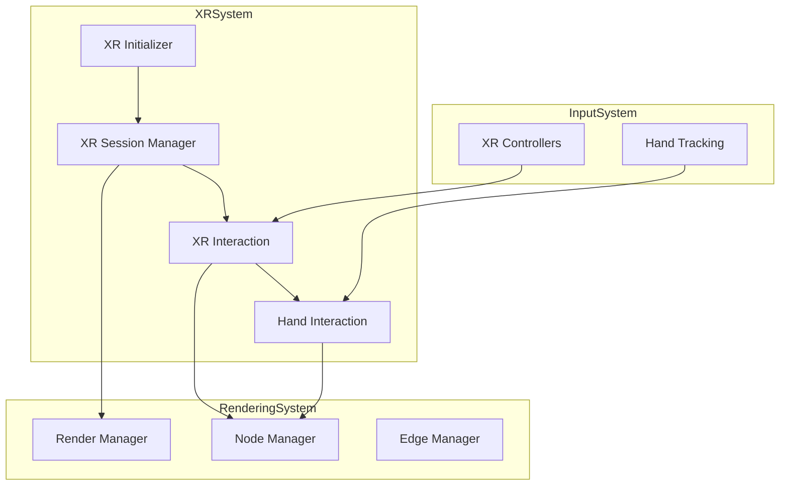
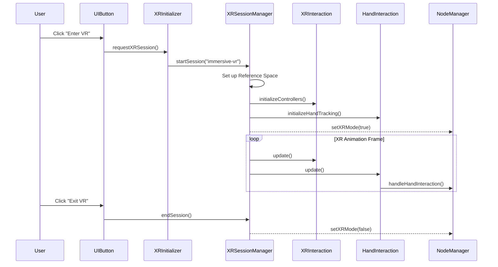

# WebXR Integration

This document provides a comprehensive overview of the WebXR integration in the client application. The WebXR integration enables immersive Virtual Reality (VR) and Augmented Reality (AR) experiences, allowing users to interact with the 3D graph visualization using VR headsets and controllers.

## WebXR Architecture Overview

The WebXR integration is built using the WebXR Device API and is integrated with Three.js for rendering. The integration follows a modular design to handle various aspects of XR interactions:



## Key Components

### XR Initializer (`client/xr/xrInitializer.ts`)

The XR Initializer is responsible for initializing WebXR capabilities and checking device compatibility.

**Key Responsibilities:**
- Check WebXR compatibility
- Initialize the WebXR session
- Handle XR session creation and termination
- Provide entry points for immersive XR experiences

**Implementation Pattern:**
```typescript
class XRInitializer {
  private renderer: WebGLRenderer;
  private scene: Scene;
  private camera: PerspectiveCamera;
  
  // Initialize XR
  async initialize(): Promise<boolean> {
    if (!this.isXRSupported()) {
      logger.warn('WebXR not supported in this browser');
      return false;
    }
    
    try {
      // Set up XR compatible renderer
      this.renderer.xr.enabled = true;
      
      // Add XR button to UI
      const xrButton = this.createXRButton();
      document.body.appendChild(xrButton);
      
      logger.info('WebXR initialized successfully');
      return true;
    } catch (error) {
      logger.error('Failed to initialize WebXR:', error);
      return false;
    }
  }
  
  // Check if XR is supported
  private isXRSupported(): boolean {
    return 'xr' in navigator && 'isSessionSupported' in (navigator as any).xr;
  }
  
  // Create XR session
  async createXRSession(sessionMode: XRSessionMode = 'immersive-vr'): Promise<XRSession | null> {
    if (!this.isXRSupported()) {
      return null;
    }
    
    try {
      // Check if session mode is supported
      const isSupported = await (navigator as any).xr.isSessionSupported(sessionMode);
      if (!isSupported) {
        logger.warn(`XR session mode '${sessionMode}' not supported`);
        return null;
      }
      
      // Request session
      const session = await (navigator as any).xr.requestSession(sessionMode, {
        requiredFeatures: ['local-floor', 'hand-tracking'],
        optionalFeatures: ['bounded-floor', 'layers']
      });
      
      // Initialize session
      await this.renderer.xr.setSession(session);
      
      logger.info(`XR session '${sessionMode}' created successfully`);
      return session;
    } catch (error) {
      logger.error(`Failed to create XR session '${sessionMode}':`, error);
      return null;
    }
  }
}
```

### XR Session Manager (`client/xr/xrSessionManager.ts`)

The XR Session Manager handles the lifecycle of XR sessions and provides a central point for XR state management.

**Key Responsibilities:**
- Manage XR session lifecycle
- Configure XR reference spaces
- Setup XR rendering pipeline
- Handle XR session events

**Implementation Pattern:**
```typescript
class XRSessionManager {
  private session: XRSession | null = null;
  private referenceSpace: XRReferenceSpace | null = null;
  private isPresenting: boolean = false;
  private renderer: WebGLRenderer;
  private camera: Camera;
  private scene: Scene;
  
  // Start XR session
  async startSession(sessionMode: XRSessionMode = 'immersive-vr'): Promise<boolean> {
    if (this.isPresenting) {
      logger.warn('XR session already active');
      return false;
    }
    
    try {
      // Create session
      this.session = await XRInitializer.getInstance().createXRSession(sessionMode);
      if (!this.session) {
        return false;
      }
      
      // Set up reference space
      this.referenceSpace = await this.session.requestReferenceSpace('local-floor');
      
      // Configure renderer for XR
      this.renderer.xr.setReferenceSpace(this.referenceSpace);
      this.renderer.xr.setSession(this.session);
      
      // Set up event listeners
      this.session.addEventListener('end', this.handleSessionEnd);
      
      // Update state
      this.isPresenting = true;
      
      // Notify components of XR mode
      this.dispatchEvent('xr-session-started', { session: this.session });
      
      logger.info('XR session started successfully');
      return true;
    } catch (error) {
      logger.error('Failed to start XR session:', error);
      return false;
    }
  }
  
  // End XR session
  async endSession(): Promise<void> {
    if (!this.isPresenting || !this.session) {
      logger.warn('No active XR session to end');
      return;
    }
    
    try {
      // End session
      await this.session.end();
      
      // Session end event will clean up
    } catch (error) {
      logger.error('Failed to end XR session:', error);
      
      // Clean up anyway
      this.handleSessionEnd();
    }
  }
  
  // Handle session end
  private handleSessionEnd = (): void => {
    // Clean up session
    this.session = null;
    this.referenceSpace = null;
    
    // Update state
    this.isPresenting = false;
    
    // Notify components
    this.dispatchEvent('xr-session-ended', {});
    
    logger.info('XR session ended');
  };
  
  // Check if presenting
  isInXR(): boolean {
    return this.isPresenting;
  }
  
  // Get reference space
  getReferenceSpace(): XRReferenceSpace | null {
    return this.referenceSpace;
  }
}
```

### XR Interaction (`client/xr/xrInteraction.ts`)

The XR Interaction component handles user interactions in XR mode, such as controller inputs and spatial UI interactions.

**Key Responsibilities:**
- Handle controller inputs
- Process XR selection events
- Manage XR-specific UI elements
- Coordinate between XR inputs and application actions

**Implementation Pattern:**
```typescript
class XRInteraction {
  private sessionManager: XRSessionManager;
  private controllers: Map<number, XRController> = new Map();
  private raycaster: Raycaster = new Raycaster();
  private tempMatrix: Matrix4 = new Matrix4();
  
  // Initialize controllers
  initializeControllers(session: XRSession): void {
    // Get input sources
    const inputSources = session.inputSources;
    
    // Process each input source
    inputSources.forEach((inputSource, index) => {
      // Create controller
      const controller = this.renderer.xr.getController(index);
      
      // Add to scene
      this.scene.add(controller);
      
      // Store controller
      this.controllers.set(index, {
        object: controller,
        inputSource
      });
      
      // Add event listeners
      controller.addEventListener('selectstart', this.handleSelectStart);
      controller.addEventListener('selectend', this.handleSelectEnd);
      
      // Add visual representation
      this.addControllerModel(controller, inputSource);
      
      logger.info(`XR controller ${index} initialized`);
    });
  }
  
  // Handle controller select start
  private handleSelectStart = (event: any): void => {
    const controller = event.target;
    
    // Get controller index
    const controllerIndex = this.getControllerIndex(controller);
    if (controllerIndex === -1) return;
    
    // Get controller data
    const controllerData = this.controllers.get(controllerIndex);
    if (!controllerData) return;
    
    // Perform raycasting
    this.tempMatrix.identity().extractRotation(controller.matrixWorld);
    this.raycaster.ray.origin.setFromMatrixPosition(controller.matrixWorld);
    this.raycaster.ray.direction.set(0, 0, -1).applyMatrix4(this.tempMatrix);
    
    // Find intersections
    const intersects = this.raycaster.intersectObjects(this.scene.children, true);
    
    // Handle intersection
    if (intersects.length > 0) {
      const intersection = intersects[0];
      this.dispatchEvent('xr-select', {
        controller: controllerData,
        intersection
      });
    }
  };
  
  // Handle controller select end
  private handleSelectEnd = (event: any): void => {
    const controller = event.target;
    
    // Get controller index
    const controllerIndex = this.getControllerIndex(controller);
    if (controllerIndex === -1) return;
    
    // Get controller data
    const controllerData = this.controllers.get(controllerIndex);
    if (!controllerData) return;
    
    // Dispatch event
    this.dispatchEvent('xr-selectend', {
      controller: controllerData
    });
  };
  
  // Update controllers
  update(): void {
    // Skip if not in XR
    if (!this.sessionManager.isInXR()) return;
    
    // Update controller positions and interactions
    this.controllers.forEach((controllerData, index) => {
      // Handle controller-specific updates
    });
  }
}
```

### Hand Interaction (`client/xr/handInteraction.ts`)

The Hand Interaction component handles hand tracking-based interactions, allowing users to use their hands in XR mode.

**Key Responsibilities:**
- Process hand tracking data
- Handle gesture recognition
- Manage hand-based interactions with nodes
- Provide haptic feedback for interactions

**Implementation Pattern:**
```typescript
class HandInteraction {
  private sessionManager: XRSessionManager;
  private hands: Map<XRHandedness, XRHandWithHaptics> = new Map();
  private jointMeshes: Map<string, Mesh> = new Map();
  private pinchState: Map<XRHandedness, boolean> = new Map();
  private nodeManager: NodeManagerFacade;
  
  // Initialize hand tracking
  initializeHandTracking(session: XRSession): void {
    // Check if hand tracking is supported
    if (!session.inputSources || !session.inputSources.some(inputSource => inputSource.hand)) {
      logger.warn('Hand tracking not supported or enabled');
      return;
    }
    
    // Initialize hands
    session.inputSources.forEach(inputSource => {
      if (inputSource.hand && inputSource.handedness) {
        // Create hand object
        const controller = this.renderer.xr.getControllerGrip(
          inputSource.handedness === 'left' ? 0 : 1
        );
        
        // Create hand with haptics
        const hand: XRHandWithHaptics = {
          inputSource,
          controller,
          hand: inputSource.hand,
          position: controller,
          direction: this.createDirectionObject(controller),
          handedness: inputSource.handedness,
          hapticActuators: inputSource.gamepad?.hapticActuators || []
        };
        
        // Store hand
        this.hands.set(inputSource.handedness, hand);
        
        // Initialize pinch state
        this.pinchState.set(inputSource.handedness, false);
        
        // Create joint meshes
        this.createJointMeshes(hand);
        
        logger.info(`Hand tracking initialized for ${inputSource.handedness} hand`);
      }
    });
  }
  
  // Create joint meshes
  private createJointMeshes(hand: XRHandWithHaptics): void {
    // Create joint meshes for visualization
    const geometry = new SphereGeometry(0.008, 8, 8);
    const material = new MeshStandardMaterial({
      color: hand.handedness === 'left' ? 0x00ffff : 0xff00ff,
      roughness: 0.7,
      metalness: 0.1
    });
    
    // For each joint in the hand
    HAND_JOINTS.forEach(jointName => {
      // Create mesh
      const mesh = new Mesh(geometry, material);
      mesh.visible = false;
      
      // Add to scene
      this.scene.add(mesh);
      
      // Store mesh
      const key = `${hand.handedness}-${jointName}`;
      this.jointMeshes.set(key, mesh);
    });
  }
  
  // Update hand positions
  update(frame: XRFrame, referenceSpace: XRReferenceSpace): void {
    // Skip if not in XR
    if (!this.sessionManager.isInXR()) return;
    
    // Update each hand
    this.hands.forEach((hand, handedness) => {
      // Get hand data
      const xrHand = hand.hand;
      
      // Update joint positions
      HAND_JOINTS.forEach(jointName => {
        const joint = xrHand.get(jointName as XRHandJoint);
        if (joint) {
          // Get joint pose
          const jointPose = frame.getJointPose(joint, referenceSpace);
          
          // Update joint mesh
          if (jointPose) {
            const key = `${handedness}-${jointName}`;
            const mesh = this.jointMeshes.get(key);
            
            if (mesh) {
              // Update position
              mesh.position.set(
                jointPose.transform.position.x,
                jointPose.transform.position.y,
                jointPose.transform.position.z
              );
              
              // Update rotation
              mesh.quaternion.set(
                jointPose.transform.orientation.x,
                jointPose.transform.orientation.y,
                jointPose.transform.orientation.z,
                jointPose.transform.orientation.w
              );
              
              // Show mesh
              mesh.visible = true;
            }
          }
        }
      });
      
      // Check for pinch gesture
      this.checkPinchGesture(hand, handedness);
      
      // Send hand data to node manager for interactions
      this.nodeManager.handleHandInteraction(hand);
    });
  }
  
  // Check for pinch gesture
  private checkPinchGesture(hand: XRHandWithHaptics, handedness: XRHandedness): void {
    // Get thumb and index finger positions
    const thumbTip = this.jointMeshes.get(`${handedness}-thumb-tip`);
    const indexTip = this.jointMeshes.get(`${handedness}-index-finger-tip`);
    
    if (thumbTip && indexTip) {
      // Calculate distance
      const distance = thumbTip.position.distanceTo(indexTip.position);
      
      // Detect pinch gesture
      const isPinching = distance < 0.03; // 3cm threshold
      
      // Check for state change
      const wasPinching = this.pinchState.get(handedness) || false;
      
      if (isPinching !== wasPinching) {
        // Update state
        this.pinchState.set(handedness, isPinching);
        
        // Dispatch events
        if (isPinching) {
          this.dispatchEvent('hand-pinchstart', { hand, handedness });
          
          // Trigger haptic feedback
          hand.hapticActuators[0]?.pulse(0.7, 50);
        } else {
          this.dispatchEvent('hand-pinchend', { hand, handedness });
          
          // Trigger haptic feedback
          hand.hapticActuators[0]?.pulse(0.3, 30);
        }
      }
    }
  }
}
```

### XR Types (`client/xr/xrTypes.ts`)

The XR Types file defines TypeScript interfaces for XR-related data structures:

```typescript
// XR Controller interface
export interface XRController {
  object: Object3D;
  inputSource: XRInputSource;
}

// XR Hand with haptics
export interface XRHandWithHaptics {
  inputSource: XRInputSource;
  controller: Object3D;
  hand: XRHand;
  position: Object3D;
  direction: Object3D;
  handedness: XRHandedness;
  hapticActuators: any[];
}

// Hand joint names
export const HAND_JOINTS = [
  'wrist',
  'thumb-metacarpal',
  'thumb-phalanx-proximal',
  'thumb-phalanx-distal',
  'thumb-tip',
  'index-finger-metacarpal',
  'index-finger-phalanx-proximal',
  'index-finger-phalanx-intermediate',
  'index-finger-phalanx-distal',
  'index-finger-tip',
  'middle-finger-metacarpal',
  'middle-finger-phalanx-proximal',
  'middle-finger-phalanx-intermediate',
  'middle-finger-phalanx-distal',
  'middle-finger-tip',
  'ring-finger-metacarpal',
  'ring-finger-phalanx-proximal',
  'ring-finger-phalanx-intermediate',
  'ring-finger-phalanx-distal',
  'ring-finger-tip',
  'pinky-finger-metacarpal',
  'pinky-finger-phalanx-proximal',
  'pinky-finger-phalanx-intermediate',
  'pinky-finger-phalanx-distal',
  'pinky-finger-tip'
];
```

## XR Integration Flow

The WebXR integration follows this flow:



## WebXR Initialization

When the application starts, it checks for WebXR compatibility:

```typescript
// Check WebXR support
const xrInitializer = XRInitializer.getInstance();
const isXRSupported = await xrInitializer.initialize();

// Update UI based on XR support
if (isXRSupported) {
  // Show VR button
  document.getElementById('vr-button')?.classList.remove('hidden');
} else {
  // Hide VR button
  document.getElementById('vr-button')?.classList.add('hidden');
}
```

## Entering XR Mode

When the user enters XR mode:

1. The application requests an XR session
2. Three.js is configured for XR rendering
3. Controllers and hand tracking are initialized
4. The scene is configured for optimal XR viewing
5. Node and edge rendering is adjusted for XR

```typescript
// Enter XR
async function enterXR() {
  try {
    // Start session
    const success = await xrSessionManager.startSession('immersive-vr');
    
    if (success) {
      logger.info('Entered XR mode successfully');
      
      // Configure scene for XR
      configureSceneForXR();
      
      // Set XR mode for renderers
      nodeManager.setXRMode(true);
      edgeManager.setXRMode(true);
      
      // Show VR-specific UI
      showVRUI();
    } else {
      logger.error('Failed to enter XR mode');
    }
  } catch (error) {
    logger.error('Error entering XR mode:', error);
  }
}
```

## XR Interaction Handling

XR interactions include controller inputs and hand gestures:

### Controller Interactions

```typescript
// Handle controller selection
controller.addEventListener('selectstart', (event) => {
  // Perform raycasting from controller
  raycaster.set(
    controllerWorldPosition,
    controllerWorldDirection
  );
  
  // Find intersections
  const intersects = raycaster.intersectObject(nodeManager.getInstancedMesh());
  
  if (intersects.length > 0) {
    // Get instance ID
    const instanceId = intersects[0].instanceId;
    
    // Get node ID from instance ID
    const nodeId = nodeManager.getNodeId(instanceId);
    
    // Select node
    selectNode(nodeId);
    
    // Trigger haptic feedback
    const gamepad = event.data.gamepad;
    if (gamepad && gamepad.hapticActuators && gamepad.hapticActuators[0]) {
      gamepad.hapticActuators[0].pulse(0.7, 100);
    }
  }
});
```

### Hand Interactions

```typescript
// Handle pinch gesture
function handlePinchGesture(hand, isPinching) {
  if (isPinching) {
    // Get hand position
    const handPosition = hand.position.position;
    
    // Find closest node
    const closestNode = findClosestNode(handPosition, 0.1); // 10cm radius
    
    if (closestNode) {
      // Select node
      selectNode(closestNode.id);
      
      // Trigger haptic feedback
      hand.hapticActuators[0]?.pulse(0.7, 100);
    }
  } else {
    // Release node
    releaseNode();
  }
}
```

## Node Manipulation in XR

Nodes can be manipulated in XR mode:

```typescript
// Handle node manipulation in XR
function manipulateNode(nodeId, hand) {
  // Get node position
  const nodePosition = nodeManager.getNodePosition(nodeId);
  
  // Get hand position
  const handPosition = hand.position.position;
  
  // Calculate new position
  const newPosition = new Vector3(
    handPosition.x,
    handPosition.y,
    handPosition.z
  );
  
  // Update node position
  nodeManager.updateNodePosition(nodeId, newPosition);
  
  // Send update to server
  graphDataManager.updateNodePosition(nodeId, newPosition);
}
```

## XR UI Design

In XR mode, the UI is adapted for spatial interaction:

```typescript
// Create spatial UI element
function createSpatialUIElement(options) {
  // Create text geometry
  const text = textRenderer.createText(options.text);
  
  // Create panel
  const panel = new Mesh(
    new PlaneGeometry(options.width, options.height),
    new MeshBasicMaterial({ color: options.color, opacity: 0.7, transparent: true })
  );
  
  // Add text to panel
  panel.add(text);
  
  // Position panel
  panel.position.copy(options.position);
  panel.quaternion.copy(options.quaternion);
  
  // Add to XR scene
  scene.add(panel);
  
  // Make interactive
  panel.userData.interactive = true;
  panel.userData.callback = options.callback;
  
  return panel;
}
```

## Performance Considerations in XR

XR rendering has specific performance requirements:

1. **Frame Rate**: Maintaining 72-90fps is critical in VR
2. **Stereo Rendering**: Content is rendered twice (once for each eye)
3. **Batching**: Draw calls must be minimized
4. **LOD**: More aggressive level-of-detail may be needed

```typescript
// Optimize for XR
function optimizeForXR(enabled) {
  if (enabled) {
    // Reduce draw distance
    nodeManager.setDrawDistance(75);
    
    // Reduce geometry detail
    nodeManager.setDetailLevel(0.7);
    
    // Disable expensive post-processing
    postProcessor.setEnabled(false);
    
    // Use instanced rendering
    nodeManager.useInstancing(true);
  } else {
    // Restore normal settings
    nodeManager.setDrawDistance(100);
    nodeManager.setDetailLevel(1.0);
    postProcessor.setEnabled(true);
  }
}
```

## Next Sections

For more detailed information, refer to:
- [Node Management](node-management.md) - Node rendering details
- [Rendering Pipeline](rendering-pipeline.md) - Rendering pipeline overview
- [UI Components](ui-components.md) - User interface components