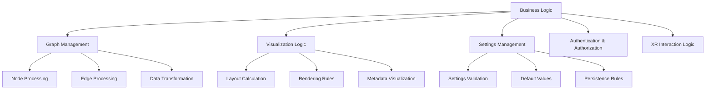

# Business Logic

This document provides a comprehensive overview of the core business logic in the client application. It details the central rules, algorithms, and data processing that form the foundation of the application's functionality.

## Core Business Domains

The application's business logic is divided into several domains:



## Graph Data Management

The graph data management domain handles the core functionality related to the graph structure, including nodes, edges, and metadata.

### Node Identity Rules

```typescript
// Node identity rules from NodeIdentityManager
export class NodeIdentityManager {
  // Rules for generating node labels
  private generateNodeLabel(nodeId: string, metadata?: NodeMetadata): string {
    // Rule 1: Use metadata.name if available
    if (metadata?.name && 
        typeof metadata.name === 'string' && 
        metadata.name !== 'undefined' &&
        metadata.name !== 'null') {
      return metadata.name;
    }
    
    // Rule 2: Use metadata.file_name if available
    if (metadata?.file_name && 
        typeof metadata.file_name === 'string' && 
        metadata.file_name !== 'undefined' &&
        metadata.file_name !== 'null') {
      return metadata.file_name;
    }
    
    // Rule 3: Use node ID with prefix
    return `Node_${nodeId}`;
  }
  
  // Rules for validating node IDs
  public isValidNumericId(id: string): boolean {
    // Ensure the ID is a string and contains only digits
    return id !== undefined && id !== null && /^\d+$/.test(id);
  }
  
  // Rules for handling duplicate labels
  private handleDuplicateLabel(label: string, nodeId: string): string {
    const existingNodes = this.labelToNodeIds.get(label);
    
    // If no duplicates exist, use the original label
    if (!existingNodes || existingNodes.size === 0) {
      return label;
    }
    
    // If the node is already in the set, use the original label
    if (existingNodes.has(nodeId)) {
      return label;
    }
    
    // Add a numeric suffix to make the label unique
    let counter = 1;
    let uniqueLabel = `${label} (${counter})`;
    
    // Keep incrementing the counter until we find a unique label
    while (this.labelToNodeIds.has(uniqueLabel)) {
      counter++;
      uniqueLabel = `${label} (${counter})`;
    }
    
    return uniqueLabel;
  }
}
```

### Edge Creation Rules

```typescript
// Rules for creating edges
export class EdgeManager {
  // Rules for generating edge IDs
  private createEdgeId(source: string, target: string): string {
    // Sort the node IDs to ensure consistent edge IDs regardless of direction
    // This implements a non-directional edge in the visualization
    return [source, target].sort().join('_');
  }
  
  // Rules for creating edges
  public createEdge(source: string, target: string, data?: EdgeData): boolean {
    // Rule 1: Both source and target nodes must exist
    if (!this.nodeManager.hasNode(source) || !this.nodeManager.hasNode(target)) {
      logger.warn(`Cannot create edge: source or target node does not exist (${source}->${target})`);
      return false;
    }
    
    // Rule 2: Self-loops are not allowed
    if (source === target) {
      logger.warn(`Cannot create self-loop edge for node ${source}`);
      return false;
    }
    
    // Rule 3: Duplicate edges are not allowed
    const edgeId = this.createEdgeId(source, target);
    if (this.edges.has(edgeId)) {
      logger.warn(`Edge already exists between ${source} and ${target}`);
      return false;
    }
    
    // Create the edge
    const edge: EdgeWithId = {
      source,
      target,
      data: data || {},
      id: edgeId
    };
    
    this.edges.set(edgeId, edge);
    return true;
  }
}
```

### Graph Data Transformation

The application applies several transformations to graph data:

```typescript
// From client/core/types.ts
export function transformGraphData(data: any): GraphData {
  // Ensure nodes is an array
  const nodes = Array.isArray(data.nodes) ? data.nodes : [];
  
  // Ensure edges is an array
  const edges = Array.isArray(data.edges) ? data.edges : [];
  
  // Transform nodes
  const transformedNodes = nodes.map((node: any) => {
    // Ensure node has an ID
    if (!node.id) {
      logger.warn('Node missing ID:', node);
      node.id = generateRandomId();
    }
    
    // Ensure node has data object
    if (!node.data) {
      node.data = {};
    }
    
    // Ensure position is a Vector3
    if (!node.data.position) {
      node.data.position = new Vector3(0, 0, 0);
    } else if (!(node.data.position instanceof Vector3)) {
      node.data.position = new Vector3(
        node.data.position.x || 0,
        node.data.position.y || 0,
        node.data.position.z || 0
      );
    }
    
    // Ensure velocity is a Vector3
    if (!node.data.velocity) {
      node.data.velocity = new Vector3(0, 0, 0);
    } else if (!(node.data.velocity instanceof Vector3)) {
      node.data.velocity = new Vector3(
        node.data.velocity.x || 0,
        node.data.velocity.y || 0,
        node.data.velocity.z || 0
      );
    }
    
    return node;
  });
  
  // Transform edges
  const transformedEdges = edges.map((edge: any) => {
    // Ensure edge has source and target
    if (!edge.source || !edge.target) {
      logger.warn('Edge missing source or target:', edge);
      return null;
    }
    
    // Ensure edge has data object
    if (!edge.data) {
      edge.data = {};
    }
    
    return edge;
  }).filter(Boolean); // Remove null entries
  
  return {
    nodes: transformedNodes,
    edges: transformedEdges,
    metadata: data.metadata || {}
  };
}
```

## Settings Management

The settings management domain handles application configuration, including validation, defaults, and persistence.

### Settings Validation Rules

```typescript
// From client/types/settings/validation.ts
export function validateSettings(settings: Partial<Settings>, schema: SettingsSchema): ValidationResult {
  const errors: ValidationError[] = [];
  
  // Validate against schema
  for (const [path, field] of Object.entries(schema.fields)) {
    // Get value from nested path
    const value = getValueAtPath(settings, path);
    
    // Skip validation if value is undefined and not required
    if (value === undefined && !field.required) {
      continue;
    }
    
    // Check required fields
    if (field.required && (value === undefined || value === null)) {
      errors.push({
        path,
        message: `${path} is required`,
        code: 'required'
      });
      continue;
    }
    
    // Skip remaining validation if value is undefined or null
    if (value === undefined || value === null) {
      continue;
    }
    
    // Type validation
    if (field.type && typeof value !== field.type) {
      errors.push({
        path,
        message: `${path} must be of type ${field.type}`,
        code: 'type',
        details: {
          expected: field.type,
          received: typeof value
        }
      });
      continue;
    }
    
    // Numeric validations
    if (field.type === 'number' && typeof value === 'number') {
      // Minimum value
      if (field.min !== undefined && value < field.min) {
        errors.push({
          path,
          message: `${path} must be at least ${field.min}`,
          code: 'min',
          details: {
            min: field.min,
            value
          }
        });
      }
      
      // Maximum value
      if (field.max !== undefined && value > field.max) {
        errors.push({
          path,
          message: `${path} must be at most ${field.max}`,
          code: 'max',
          details: {
            max: field.max,
            value
          }
        });
      }
    }
    
    // String validations
    if (field.type === 'string' && typeof value === 'string') {
      // Minimum length
      if (field.minLength !== undefined && value.length < field.minLength) {
        errors.push({
          path,
          message: `${path} must be at least ${field.minLength} characters`,
          code: 'minLength',
          details: {
            minLength: field.minLength,
            length: value.length
          }
        });
      }
      
      // Maximum length
      if (field.maxLength !== undefined && value.length > field.maxLength) {
        errors.push({
          path,
          message: `${path} must be at most ${field.maxLength} characters`,
          code: 'maxLength',
          details: {
            maxLength: field.maxLength,
            length: value.length
          }
        });
      }
      
      // Pattern
      if (field.pattern && !new RegExp(field.pattern).test(value)) {
        errors.push({
          path,
          message: `${path} must match pattern ${field.pattern}`,
          code: 'pattern',
          details: {
            pattern: field.pattern,
            value
          }
        });
      }
    }
    
    // Enum validation
    if (field.enum && !field.enum.includes(value)) {
      errors.push({
        path,
        message: `${path} must be one of: ${field.enum.join(', ')}`,
        code: 'enum',
        details: {
          allowed: field.enum,
          value
        }
      });
    }
  }
  
  return {
    valid: errors.length === 0,
    errors
  };
}
```

### Default Settings

The application provides default settings for various components:

```typescript
// From client/state/defaultSettings.ts
export const defaultSettings: Settings = {
  visualization: {
    nodes: {
      size: 1,
      color: '#4CAF50',
      opacity: 0.8,
      detail: 'medium',
      highlighted: {
        color: '#FF4444',
        scale: 1.2
      }
    },
    edges: {
      thickness: 0.25,
      color: '#E0E0E0',
      opacity: 0.6,
      highlight: {
        color: '#FFFF00',
        thickness: 0.5
      }
    },
    labels: {
      visible: true,
      size: 1,
      color: '#FFFFFF',
      backgroundColor: 'rgba(0,0,0,0.3)',
      visibilityThreshold: 15,
      font: 'Roboto'
    },
    rendering: {
      quality: 'high',
      antialiasing: true,
      shadows: false,
      bloomEffect: false,
      outlineEffect: true
    },
    animations: {
      enabled: true,
      duration: 0.5,
      easing: 'easeInOutCubic'
    },
    background: {
      color: '#212121',
      opacity: 1
    },
    bloom: {
      enabled: false,
      strength: 1.5,
      threshold: 0.85,
      radius: 0.4
    },
    hologram: {
      enabled: false,
      color: '#00FFFF',
      opacity: 0.8,
      scanlineIntensity: 0.5,
      glowIntensity: 0.3
    }
  },
  physics: {
    enabled: true,
    gravity: 0,
    friction: 0.1,
    attractionForce: 0.01,
    repulsionForce: 0.1,
    maxSpeed: 1,
    defaultMass: 1
  },
  camera: {
    fov: 75,
    near: 0.1,
    far: 1000,
    position: { x: 0, y: 0, z: 50 },
    lookAt: { x: 0, y: 0, z: 0 },
    controls: {
      rotateSpeed: 1,
      zoomSpeed: 1.2,
      panSpeed: 0.8,
      dampingFactor: 0.2,
      enableDamping: true
    }
  },
  xr: {
    enabled: true,
    handTracking: true,
    defaultReferenceSpace: 'local-floor',
    controllerModelEnabled: true,
    interactionDistance: 0.5,
    locomotion: {
      enabled: true,
      type: 'teleport',
      speed: 2
    }
  },
  network: {
    reconnectDelay: 1000,
    maxReconnectAttempts: 5,
    compressionEnabled: true,
    binaryProtocolEnabled: true
  },
  debug: {
    enabled: false,
    showPerformanceStats: false,
    logLevel: 'warn',
    showBoundingBoxes: false,
    showNodeIds: false,
    showPositions: false
  }
};
```

### Settings Persistence Rules

```typescript
// From client/services/SettingsPersistenceService.ts
export class SettingsPersistenceService {
  private static instance: SettingsPersistenceService;
  private serverPersistenceEnabled: boolean = true;
  private localPersistenceEnabled: boolean = true;
  
  // Get instance (singleton pattern)
  public static getInstance(): SettingsPersistenceService {
    if (!SettingsPersistenceService.instance) {
      SettingsPersistenceService.instance = new SettingsPersistenceService();
    }
    return SettingsPersistenceService.instance;
  }
  
  // Save settings
  public async saveSettings(settings: Settings): Promise<boolean> {
    try {
      // Local persistence
      if (this.localPersistenceEnabled) {
        this.saveToLocalStorage(settings);
      }
      
      // Server persistence
      if (this.serverPersistenceEnabled) {
        await this.saveToServer(settings);
      }
      
      return true;
    } catch (error) {
      logger.error('Failed to save settings:', createErrorMetadata(error));
      return false;
    }
  }
  
  // Load settings
  public async loadSettings(): Promise<Settings | null> {
    try {
      // Try server first
      if (this.serverPersistenceEnabled) {
        const serverSettings = await this.loadFromServer();
        if (serverSettings) {
          return serverSettings;
        }
      }
      
      // Fall back to local storage
      if (this.localPersistenceEnabled) {
        const localSettings = this.loadFromLocalStorage();
        if (localSettings) {
          return localSettings;
        }
      }
      
      // Return default settings
      return null;
    } catch (error) {
      logger.error('Failed to load settings:', createErrorMetadata(error));
      return null;
    }
  }
  
  // Save to local storage
  private saveToLocalStorage(settings: Settings): void {
    try {
      localStorage.setItem('app_settings', JSON.stringify(settings));
    } catch (error) {
      logger.error('Failed to save settings to local storage:', createErrorMetadata(error));
      throw error;
    }
  }
  
  // Load from local storage
  private loadFromLocalStorage(): Settings | null {
    try {
      const settingsJson = localStorage.getItem('app_settings');
      if (!settingsJson) {
        return null;
      }
      
      return JSON.parse(settingsJson);
    } catch (error) {
      logger.error('Failed to load settings from local storage:', createErrorMetadata(error));
      return null;
    }
  }
  
  // Save to server
  private async saveToServer(settings: Settings): Promise<void> {
    try {
      const response = await fetch(buildApiUrl(API_ENDPOINTS.SETTINGS_ROOT), {
        method: 'POST',
        headers: getAuthHeaders(),
        body: JSON.stringify(settings)
      });
      
      if (!response.ok) {
        throw new Error(`Failed to save settings to server: ${response.status} ${response.statusText}`);
      }
    } catch (error) {
      logger.error('Failed to save settings to server:', createErrorMetadata(error));
      throw error;
    }
  }
  
  // Load from server
  private async loadFromServer(): Promise<Settings | null> {
    try {
      const response = await fetch(buildApiUrl(API_ENDPOINTS.SETTINGS_ROOT), {
        method: 'GET',
        headers: getAuthHeaders()
      });
      
      if (!response.ok) {
        if (response.status === 404) {
          // Settings not found on server, but not an error
          return null;
        }
        throw new Error(`Failed to load settings from server: ${response.status} ${response.statusText}`);
      }
      
      return await response.json();
    } catch (error) {
      logger.error('Failed to load settings from server:', createErrorMetadata(error));
      return null;
    }
  }
}
```

## Visualization Logic

The visualization logic domain handles the rules and algorithms for visualizing the graph data.

### Node Size Calculation

```typescript
// From client/rendering/node/NodeManagerFacade.ts
private calculateNodeSize(fileSize: number = DEFAULT_FILE_SIZE): number {
  // Map file size logarithmically to 0-1 range
  const normalizedSize = Math.log(Math.min(fileSize, MAX_FILE_SIZE)) / Math.log(MAX_FILE_SIZE);
  // Map to node size range
  return MIN_NODE_SIZE + normalizedSize * (MAX_NODE_SIZE - MIN_NODE_SIZE);
}
```

### Label Visibility Logic

```typescript
// From client/rendering/node/metadata/NodeMetadataManager.ts
public updateVisibility(camera: Camera): void {
  // Skip if no camera
  if (!camera) return;
  
  // Get camera position
  const cameraPosition = camera.position;
  
  // Update each label
  this.labels.forEach((label, nodeId) => {
    // Get label data
    const labelData = this.labelData.get(nodeId);
    if (!labelData || !labelData.position) return;
    
    // Calculate distance to camera
    const distance = cameraPosition.distanceTo(labelData.position);
    
    // Calculate visibility threshold based on label importance
    const importanceFactor = 1 + (labelData.importance || 0) * 0.5;
    const threshold = this.visibilityThreshold * importanceFactor;
    
    // Update visibility
    const visible = distance < threshold;
    if (label.visible !== visible) {
      label.visible = visible;
    }
  });
}
```

### Node Highlight Logic

```typescript
// From client/rendering/node/interaction/NodeInteractionManager.ts
private highlightNode(nodeId: string, highlighted: boolean): void {
  // Get node instance index
  const instanceIndex = this.nodeManager.getInstanceIndex(nodeId);
  if (instanceIndex === undefined) return;
  
  // Get current node color and size
  const currentColor = new Color();
  this.instancedMesh.getColorAt(instanceIndex, currentColor);
  
  // Get highlight settings
  const highlightColor = new Color(this.settings.visualization.nodes.highlighted.color);
  const normalColor = new Color(this.settings.visualization.nodes.color);
  
  // Set color
  const targetColor = highlighted ? highlightColor : normalColor;
  this.instancedMesh.setColorAt(instanceIndex, targetColor);
  
  // Update instance color attribute
  if (this.instancedMesh.instanceColor) {
    this.instancedMesh.instanceColor.needsUpdate = true;
  }
  
  // Update scale in matrix
  this.updateNodeScale(nodeId, highlighted ? 
    this.settings.visualization.nodes.highlighted.scale : 1);
}
```

## XR Interaction Logic

The XR interaction domain handles the rules and algorithms for interacting with the application in XR mode.

### Hand Gesture Recognition

```typescript
// From client/xr/handInteraction.ts
private detectPinchGesture(hand: XRHand): boolean {
  // Get joint positions
  const thumbTip = hand.get('thumb-tip');
  const indexTip = hand.get('index-finger-tip');
  
  // Skip if either joint is missing
  if (!thumbTip || !indexTip) return false;
  
  // Get joint poses
  const thumbPose = this.frame.getJointPose(thumbTip, this.referenceSpace);
  const indexPose = this.frame.getJointPose(indexTip, this.referenceSpace);
  
  // Skip if either pose is missing
  if (!thumbPose || !indexPose) return false;
  
  // Calculate distance between thumb and index finger
  const thumbPosition = new Vector3(
    thumbPose.transform.position.x,
    thumbPose.transform.position.y,
    thumbPose.transform.position.z
  );
  
  const indexPosition = new Vector3(
    indexPose.transform.position.x,
    indexPose.transform.position.y,
    indexPose.transform.position.z
  );
  
  const distance = thumbPosition.distanceTo(indexPosition);
  
  // Pinch threshold in meters
  const PINCH_THRESHOLD = 0.03; // 3cm
  
  return distance < PINCH_THRESHOLD;
}
```

### XR Node Selection Logic

```typescript
// From client/xr/xrInteraction.ts
private handleControllerSelection(controller: XRController): void {
  // Create raycaster from controller
  this.raycaster.set(
    controller.position,
    controller.direction.normalize()
  );
  
  // Intersect with nodes
  const intersects = this.raycaster.intersectObject(this.nodeManager.getInstancedMesh());
  
  // Find closest intersection
  const closestIntersection = intersects[0];
  if (!closestIntersection) return;
  
  // Get instance ID
  const instanceId = closestIntersection.instanceId;
  if (instanceId === undefined) return;
  
  // Get node ID
  const nodeId = this.nodeManager.getNodeId(instanceId);
  if (!nodeId) return;
  
  // Select node
  this.selectNode(nodeId);
  
  // Trigger haptic feedback
  this.triggerHapticFeedback(controller, 'selection');
}
```

## Authentication Logic

The authentication domain handles user authentication and authorization.

### Token Validation

```typescript
// From client/services/NostrAuthService.ts
public isAuthenticated(): boolean {
  // Check if token exists
  if (!this.token || !this.pubkey) {
    return false;
  }
  
  // Check if token is expired
  if (this.expiresAt && Date.now() > this.expiresAt) {
    this.logout(); // Auto-logout if token is expired
    return false;
  }
  
  return true;
}
```

### Nostr Authentication Logic

```typescript
// From client/services/NostrAuthService.ts
public async authenticate(nsec: string): Promise<boolean> {
  try {
    // Parse private key
    const privateKey = nsec.startsWith('nsec') 
      ? nip19.decode(nsec).data as Uint8Array
      : Buffer.from(nsec, 'hex');
    
    // Derive public key
    const publicKey = nobleSecp256k1.schnorr.getPublicKey(privateKey);
    const pubkeyHex = Buffer.from(publicKey).toString('hex');
    
    // Request challenge
    const challenge = await this.requestChallenge(pubkeyHex);
    
    // Sign challenge
    const signature = await this.signChallenge(challenge, privateKey);
    
    // Verify signature
    const result = await this.verifySignature(pubkeyHex, challenge, signature);
    
    if (result.success) {
      // Store auth data
      this.token = result.token;
      this.pubkey = pubkeyHex;
      this.expiresAt = result.expiresAt;
      
      // Save to local storage
      localStorage.setItem('nostr_token', result.token);
      localStorage.setItem('nostr_pubkey', pubkeyHex);
      localStorage.setItem('nostr_expires', result.expiresAt.toString());
      
      // Notify listeners
      this.notifyListeners(true);
      
      return true;
    } else {
      return false;
    }
  } catch (error) {
    logger.error('Authentication failed:', createErrorMetadata(error));
    return false;
  }
}
```

## Business Rules Implementation

The business rules are implemented through various classes and functions. Key implementation patterns include:

### Strategy Pattern

```typescript
// Abstract strategy interface
interface LayoutStrategy {
  calculateLayout(nodes: Node[], edges: Edge[]): void;
  update(deltaTime: number): void;
}

// Concrete strategies
class ForceDirectedLayout implements LayoutStrategy {
  // Implementation
}

class GridLayout implements LayoutStrategy {
  // Implementation
}

class RadialLayout implements LayoutStrategy {
  // Implementation
}

// Context using the strategy
class GraphLayoutManager {
  private strategy: LayoutStrategy;
  
  constructor(strategy: LayoutStrategy) {
    this.strategy = strategy;
  }
  
  setStrategy(strategy: LayoutStrategy): void {
    this.strategy = strategy;
  }
  
  calculateLayout(nodes: Node[], edges: Edge[]): void {
    this.strategy.calculateLayout(nodes, edges);
  }
  
  update(deltaTime: number): void {
    this.strategy.update(deltaTime);
  }
}
```

### Observer Pattern

```typescript
// Subject interface
interface Subject {
  subscribe(observer: Observer): () => void;
  unsubscribe(observer: Observer): void;
  notify(data: any): void;
}

// Observer interface
interface Observer {
  update(data: any): void;
}

// Concrete subject
class GraphState implements Subject {
  private observers: Set<Observer> = new Set();
  private data: GraphData;
  
  subscribe(observer: Observer): () => void {
    this.observers.add(observer);
    return () => this.unsubscribe(observer);
  }
  
  unsubscribe(observer: Observer): void {
    this.observers.delete(observer);
  }
  
  notify(data: GraphData): void {
    this.observers.forEach(observer => {
      try {
        observer.update(data);
      } catch (error) {
        logger.error('Error notifying observer:', createErrorMetadata(error));
      }
    });
  }
  
  updateData(data: GraphData): void {
    this.data = data;
    this.notify(data);
  }
}

// Concrete observer
class NodeRenderer implements Observer {
  update(data: GraphData): void {
    // Update node rendering
  }
}
```

### Command Pattern

```typescript
// Command interface
interface Command {
  execute(): void;
  undo(): void;
}

// Concrete commands
class AddNodeCommand implements Command {
  private node: Node;
  private graphManager: GraphDataManager;
  
  constructor(node: Node, graphManager: GraphDataManager) {
    this.node = node;
    this.graphManager = graphManager;
  }
  
  execute(): void {
    this.graphManager.addNode(this.node);
  }
  
  undo(): void {
    this.graphManager.removeNode(this.node.id);
  }
}

// Command invoker
class CommandManager {
  private commands: Command[] = [];
  private undoneCommands: Command[] = [];
  
  execute(command: Command): void {
    command.execute();
    this.commands.push(command);
    this.undoneCommands = [];
  }
  
  undo(): void {
    const command = this.commands.pop();
    if (command) {
      command.undo();
      this.undoneCommands.push(command);
    }
  }
  
  redo(): void {
    const command = this.undoneCommands.pop();
    if (command) {
      command.execute();
      this.commands.push(command);
    }
  }
}
```

## Next Sections

For more detailed information, refer to:
- [Error Handling](error-handling.md) - Error handling patterns
- [Performance](performance.md) - Performance considerations
- [Technical Debt](technical-debt.md) - Technical debt analysis