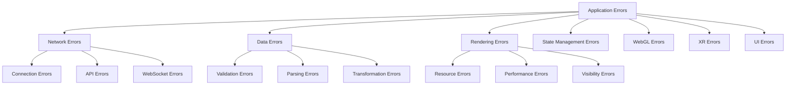
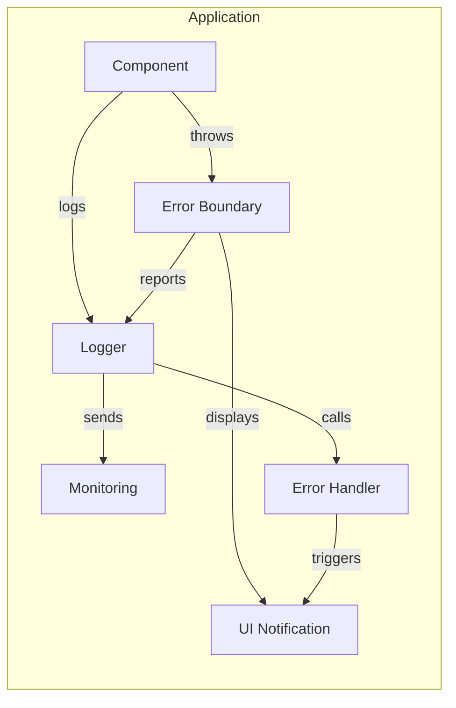

# Error Handling

This document provides a comprehensive overview of the error handling patterns and strategies implemented throughout the client application. Proper error handling is essential for creating a robust and user-friendly application.

## Error Handling Philosophy

The application follows several key principles for error handling:

1. **Graceful Degradation** - Errors should not crash the application; instead, fallback behaviors should be implemented
2. **Detailed Logging** - Errors should be logged with sufficient context for troubleshooting
3. **User Feedback** - Users should be notified of errors when appropriate, with clear messaging
4. **Recovery Strategies** - Where possible, the application should attempt to recover from errors
5. **Consistent Patterns** - Error handling should follow consistent patterns throughout the codebase

## Error Classification

Errors in the application are classified into several categories:



## Error Handling Architecture

The application uses a centralized error handling architecture:



## Centralized Logging

The application uses a centralized logging system defined in `client/core/logger.ts`:

```typescript
// Logger interface
export interface Logger {
  debug(message: string, ...meta: any[]): void;
  info(message: string, ...meta: any[]): void;
  warn(message: string, ...meta: any[]): void;
  error(message: string, ...meta: any[]): void;
}

// Create logger with metadata helpers
export function createLogger(name: string): Logger {
  return {
    debug: (message: string, ...meta: any[]) => {
      if (debugState.isEnabled()) {
        console.debug(`[${name}] ${message}`, ...meta);
      }
    },
    info: (message: string, ...meta: any[]) => {
      console.info(`[${name}] ${message}`, ...meta);
    },
    warn: (message: string, ...meta: any[]) => {
      console.warn(`[${name}] ${message}`, ...meta);
    },
    error: (message: string, ...meta: any[]) => {
      console.error(`[${name}] ${message}`, ...meta);
      // Here we could also send to an error monitoring service
    }
  };
}

// Helper for creating error metadata
export function createErrorMetadata(error: any): any {
  return {
    message: error.message || String(error),
    stack: error.stack,
    code: error.code,
    name: error.name,
    cause: error.cause
  };
}

// Helper for creating data metadata
export function createDataMetadata(data: any): any {
  return data;
}

// Helper for creating message metadata
export function createMessageMetadata(message: any): any {
  if (typeof message === 'string') {
    return { message };
  }
  return message;
}
```

## Custom Error Types

The application defines custom error types for different components:

### Node Manager Errors

```typescript
// From client/rendering/node/NodeManagerInterface.ts
export enum NodeManagerErrorType {
  INITIALIZATION_FAILED = 'initialization_failed',
  UPDATE_FAILED = 'update_failed',
  RESOURCE_CLEANUP_FAILED = 'resource_cleanup_failed',
  INVALID_NODE_ID = 'invalid_node_id',
  XR_MODE_SWITCH_FAILED = 'xr_mode_switch_failed'
}

export class NodeManagerError extends Error {
  type: NodeManagerErrorType;
  cause?: any;
  
  constructor(type: NodeManagerErrorType, message: string, cause?: any) {
    super(message);
    this.name = 'NodeManagerError';
    this.type = type;
    this.cause = cause;
  }
}
```

### API Errors

```typescript
// API error handling
export enum APIErrorType {
  NETWORK_ERROR = 'network_error',
  SERVER_ERROR = 'server_error',
  AUTHENTICATION_ERROR = 'authentication_error',
  VALIDATION_ERROR = 'validation_error',
  NOT_FOUND = 'not_found',
  REQUEST_TIMEOUT = 'request_timeout'
}

export class APIError extends Error {
  type: APIErrorType;
  statusCode?: number;
  response?: any;
  
  constructor(type: APIErrorType, message: string, statusCode?: number, response?: any) {
    super(message);
    this.name = 'APIError';
    this.type = type;
    this.statusCode = statusCode;
    this.response = response;
  }
}
```

## Error Handling Patterns

### Try-Catch Pattern

For synchronous operations, the try-catch pattern is used:

```typescript
try {
  // Perform operation that might throw
  const result = doSomethingRisky();
  return result;
} catch (error) {
  // Log error
  logger.error('Operation failed:', createErrorMetadata(error));
  
  // Handle error
  handleError(error);
  
  // Return fallback or throw
  return fallbackValue;
}
```

### Promise Catch Pattern

For asynchronous operations, promises with catch handlers are used:

```typescript
doSomethingAsync()
  .then(result => {
    // Process result
    return processResult(result);
  })
  .catch(error => {
    // Log error
    logger.error('Async operation failed:', createErrorMetadata(error));
    
    // Handle error
    handleAsyncError(error);
    
    // Return fallback or throw
    return fallbackValue;
  });
```

### Async/Await with Try-Catch

For modern async code, async/await with try-catch is used:

```typescript
async function performOperation() {
  try {
    // Perform async operation
    const result = await doSomethingAsync();
    return processResult(result);
  } catch (error) {
    // Log error
    logger.error('Async operation failed:', createErrorMetadata(error));
    
    // Handle error
    await handleAsyncError(error);
    
    // Return fallback or throw
    return fallbackValue;
  }
}
```

## Network Error Handling

### API Request Error Handling

```typescript
async function fetchWithErrorHandling(url: string, options?: RequestInit): Promise<any> {
  try {
    // Add timeout
    const controller = new AbortController();
    const timeoutId = setTimeout(() => controller.abort(), 30000); // 30 second timeout
    
    const response = await fetch(url, {
      ...options,
      signal: controller.signal
    });
    
    // Clear timeout
    clearTimeout(timeoutId);
    
    // Check for HTTP errors
    if (!response.ok) {
      let errorData;
      try {
        // Try to parse error JSON
        errorData = await response.json();
      } catch {
        // If parsing fails, use status text
        errorData = { message: response.statusText };
      }
      
      // Determine error type
      let errorType: APIErrorType;
      switch (response.status) {
        case 401:
        case 403:
          errorType = APIErrorType.AUTHENTICATION_ERROR;
          break;
        case 404:
          errorType = APIErrorType.NOT_FOUND;
          break;
        case 422:
          errorType = APIErrorType.VALIDATION_ERROR;
          break;
        default:
          errorType = APIErrorType.SERVER_ERROR;
          break;
      }
      
      throw new APIError(
        errorType,
        errorData.message || `Request failed with status ${response.status}`,
        response.status,
        errorData
      );
    }
    
    // Parse response
    return await response.json();
  } catch (error) {
    // Handle specific error types
    if (error instanceof APIError) {
      throw error; // Re-throw APIError
    } else if (error.name === 'AbortError') {
      // Timeout error
      throw new APIError(
        APIErrorType.REQUEST_TIMEOUT,
        'Request timed out after 30 seconds',
        undefined,
        { originalError: error }
      );
    } else {
      // Network or other error
      throw new APIError(
        APIErrorType.NETWORK_ERROR,
        error.message || 'Network request failed',
        undefined,
        { originalError: error }
      );
    }
  }
}
```

### WebSocket Error Handling

```typescript
// WebSocket connection error handling
private handleWebSocketError(event: Event): void {
  logger.error('WebSocket error:', createDataMetadata(event));
  
  // Update connection state
  this.connectionState = ConnectionState.RECONNECTING;
  
  // Notify status handlers
  if (this.connectionStatusHandler) {
    this.connectionStatusHandler(false);
  }
  
  // Attempt reconnection
  this.handleReconnect();
}

// WebSocket reconnection with exponential backoff
private handleReconnect(): void {
  if (this.reconnectAttempts >= this.maxReconnectAttempts) {
    logger.error('WebSocket reconnection failed after maximum attempts');
    this.connectionState = ConnectionState.FAILED;
    
    // Update UI
    if (this.connectionStatusHandler) {
      this.connectionStatusHandler(false);
    }
    
    return;
  }
  
  // Calculate delay with exponential backoff
  const delay = Math.min(
    this.initialReconnectDelay * Math.pow(2, this.reconnectAttempts),
    this.maxReconnectDelay
  ) + (Math.random() * 1000); // Add jitter
  
  logger.info(`WebSocket reconnecting in ${Math.round(delay/1000)}s (attempt ${this.reconnectAttempts + 1} of ${this.maxReconnectAttempts})`);
  
  // Schedule reconnection
  this.reconnectTimeout = window.setTimeout(() => {
    this.reconnectAttempts++;
    this.reconnectTimeout = null;
    this.connect();
  }, delay);
}
```

## Rendering Error Handling

### WebGL Error Detection

```typescript
function checkWebGLError(gl: WebGLRenderingContext, operation: string): boolean {
  const error = gl.getError();
  if (error !== gl.NO_ERROR) {
    let errorName;
    switch (error) {
      case gl.INVALID_ENUM:
        errorName = 'INVALID_ENUM';
        break;
      case gl.INVALID_VALUE:
        errorName = 'INVALID_VALUE';
        break;
      case gl.INVALID_OPERATION:
        errorName = 'INVALID_OPERATION';
        break;
      case gl.OUT_OF_MEMORY:
        errorName = 'OUT_OF_MEMORY';
        break;
      case gl.CONTEXT_LOST_WEBGL:
        errorName = 'CONTEXT_LOST_WEBGL';
        break;
      default:
        errorName = `Unknown Error (${error})`;
    }
    
    logger.error(`WebGL error in ${operation}: ${errorName}`);
    return true;
  }
  return false;
}
```

### WebGL Context Loss Handling

```typescript
// Set up context loss handler
this.renderer.domElement.addEventListener('webglcontextlost', this.handleContextLoss);
this.renderer.domElement.addEventListener('webglcontextrestored', this.handleContextRestore);

// Handle WebGL context loss
private handleContextLoss = (event: Event): void => {
  event.preventDefault(); // Allow context to be restored
  
  logger.error('WebGL context lost');
  
  // Pause rendering
  this.isPaused = true;
  
  // Notify user
  this.showError('WebGL context lost. Attempting to restore...');
};

// Handle WebGL context restoration
private handleContextRestore = (): void => {
  logger.info('WebGL context restored');
  
  // Reinitialize resources
  this.reinitializeResources();
  
  // Resume rendering
  this.isPaused = false;
  
  // Clear error message
  this.clearError();
};

// Reinitialize WebGL resources
private reinitializeResources(): void {
  try {
    // Recreate materials
    this.nodeManager.reloadMaterials();
    this.edgeManager.reloadMaterials();
    
    // Recreate textures
    this.textRenderer.reloadTextures();
    
    logger.info('WebGL resources reinitialized successfully');
  } catch (error) {
    logger.error('Failed to reinitialize WebGL resources:', createErrorMetadata(error));
    
    // Show fatal error
    this.showFatalError('Failed to restore WebGL context. Please reload the page.');
  }
}
```

## Data Validation and Error Handling

### Schema Validation

```typescript
// Validate settings against schema
function validateSettings(settings: any, schema: SettingsSchema): ValidationResult {
  const errors: ValidationError[] = [];
  
  // Check required fields
  for (const [key, fieldSchema] of Object.entries(schema.fields)) {
    if (fieldSchema.required && (settings[key] === undefined || settings[key] === null)) {
      errors.push({
        field: key,
        message: `${key} is required`,
        code: 'required'
      });
      continue;
    }
    
    // Skip validation if value is undefined/null and not required
    if (settings[key] === undefined || settings[key] === null) {
      continue;
    }
    
    // Type validation
    if (fieldSchema.type && typeof settings[key] !== fieldSchema.type) {
      errors.push({
        field: key,
        message: `${key} must be of type ${fieldSchema.type}`,
        code: 'type',
        expected: fieldSchema.type,
        received: typeof settings[key]
      });
    }
    
    // Range validation for numbers
    if (
      fieldSchema.type === 'number' && 
      typeof settings[key] === 'number'
    ) {
      if (fieldSchema.min !== undefined && settings[key] < fieldSchema.min) {
        errors.push({
          field: key,
          message: `${key} must be at least ${fieldSchema.min}`,
          code: 'min',
          min: fieldSchema.min,
          value: settings[key]
        });
      }
      
      if (fieldSchema.max !== undefined && settings[key] > fieldSchema.max) {
        errors.push({
          field: key,
          message: `${key} must be at most ${fieldSchema.max}`,
          code: 'max',
          max: fieldSchema.max,
          value: settings[key]
        });
      }
    }
    
    // Pattern validation for strings
    if (
      fieldSchema.type === 'string' && 
      typeof settings[key] === 'string' &&
      fieldSchema.pattern && 
      !new RegExp(fieldSchema.pattern).test(settings[key])
    ) {
      errors.push({
        field: key,
        message: `${key} does not match required pattern`,
        code: 'pattern',
        pattern: fieldSchema.pattern,
        value: settings[key]
      });
    }
    
    // Enum validation
    if (
      fieldSchema.enum && 
      !fieldSchema.enum.includes(settings[key])
    ) {
      errors.push({
        field: key,
        message: `${key} must be one of: ${fieldSchema.enum.join(', ')}`,
        code: 'enum',
        allowed: fieldSchema.enum,
        value: settings[key]
      });
    }
  }
  
  return {
    valid: errors.length === 0,
    errors
  };
}
```

### Input Sanitization

```typescript
// Sanitize user input
function sanitizeInput(input: string): string {
  // Remove HTML tags
  let sanitized = input.replace(/<[^>]*>/g, '');
  
  // Remove script tags and content
  sanitized = sanitized.replace(/<script\b[^<]*(?:(?!<\/script>)<[^<]*)*<\/script>/gi, '');
  
  // Encode HTML entities
  sanitized = sanitized
    .replace(/&/g, '&amp;')
    .replace(/</g, '&lt;')
    .replace(/>/g, '&gt;')
    .replace(/"/g, '&quot;')
    .replace(/'/g, '&#039;');
  
  return sanitized;
}
```

## UI Error Handling

### Error Display Component

```typescript
function ErrorDisplay({ error, onRetry, onDismiss }: ErrorDisplayProps) {
  // If no error, don't render anything
  if (!error) return null;
  
  // Determine error type and message
  let errorMessage = 'An unexpected error occurred.';
  let errorType = 'error';
  
  if (typeof error === 'string') {
    errorMessage = error;
  } else if (error instanceof Error) {
    errorMessage = error.message || 'An unexpected error occurred.';
    
    // Determine error type
    if (error instanceof APIError) {
      switch (error.type) {
        case APIErrorType.NETWORK_ERROR:
          errorType = 'network';
          break;
        case APIErrorType.AUTHENTICATION_ERROR:
          errorType = 'auth';
          break;
        case APIErrorType.SERVER_ERROR:
          errorType = 'server';
          break;
        case APIErrorType.VALIDATION_ERROR:
          errorType = 'validation';
          break;
        default:
          errorType = 'api';
      }
    } else if (error instanceof NodeManagerError) {
      errorType = 'rendering';
    }
  }
  
  return (
    <div className={`error-display error-${errorType}`}>
      <div className="error-icon">
        {/* Icon based on error type */}
        {errorType === 'network' && <NetworkErrorIcon />}
        {errorType === 'auth' && <AuthErrorIcon />}
        {errorType === 'server' && <ServerErrorIcon />}
        {errorType === 'validation' && <ValidationErrorIcon />}
        {errorType === 'rendering' && <RenderingErrorIcon />}
        {errorType === 'error' && <GenericErrorIcon />}
      </div>
      
      <div className="error-content">
        <h3 className="error-title">
          {errorType === 'network' && 'Network Error'}
          {errorType === 'auth' && 'Authentication Error'}
          {errorType === 'server' && 'Server Error'}
          {errorType === 'validation' && 'Validation Error'}
          {errorType === 'rendering' && 'Rendering Error'}
          {errorType === 'error' && 'Error'}
        </h3>
        
        <p className="error-message">{errorMessage}</p>
        
        <div className="error-actions">
          {onRetry && (
            <button className="error-retry" onClick={onRetry}>
              Retry
            </button>
          )}
          
          {onDismiss && (
            <button className="error-dismiss" onClick={onDismiss}>
              Dismiss
            </button>
          )}
        </div>
      </div>
    </div>
  );
}
```

### Global Error Handling

```typescript
// Set up global error handler
window.addEventListener('error', (event) => {
  logger.error('Unhandled error:', createErrorMetadata({
    message: event.message,
    filename: event.filename,
    lineno: event.lineno,
    colno: event.colno,
    error: event.error
  }));
  
  // Show error notification
  showErrorNotification(
    'An unexpected error occurred. Please try reloading the page.'
  );
  
  // Don't prevent default handling
  return false;
});

// Set up promise rejection handler
window.addEventListener('unhandledrejection', (event) => {
  logger.error('Unhandled promise rejection:', createErrorMetadata({
    reason: event.reason
  }));
  
  // Show error notification
  showErrorNotification(
    'An unexpected error occurred. Please try reloading the page.'
  );
  
  // Don't prevent default handling
  return false;
});
```

## Retry Strategies

### Exponential Backoff

```typescript
async function fetchWithRetry(url: string, options?: RequestInit, maxRetries: number = 3): Promise<Response> {
  let retries = 0;
  
  while (true) {
    try {
      return await fetch(url, options);
    } catch (error) {
      // Don't retry if we've reached max retries
      if (retries >= maxRetries) {
        throw error;
      }
      
      // Don't retry certain errors
      if (error instanceof APIError && error.type === APIErrorType.AUTHENTICATION_ERROR) {
        throw error;
      }
      
      // Calculate delay with exponential backoff
      const delay = Math.pow(2, retries) * 1000 + Math.random() * 1000;
      
      logger.warn(`Retrying failed request in ${Math.round(delay)}ms (${retries + 1}/${maxRetries})`, createDataMetadata({
        url,
        error: error.message
      }));
      
      // Wait before retrying
      await new Promise(resolve => setTimeout(resolve, delay));
      
      // Increment retry counter
      retries++;
    }
  }
}
```

### Circuit Breaker

```typescript
class CircuitBreaker {
  private failureCount: number = 0;
  private lastFailureTime: number = 0;
  private state: 'CLOSED' | 'OPEN' | 'HALF_OPEN' = 'CLOSED';
  
  constructor(
    private readonly failureThreshold: number = 5,
    private readonly resetTimeout: number = 30000
  ) {}
  
  async execute<T>(fn: () => Promise<T>): Promise<T> {
    // Check if circuit is open
    if (this.state === 'OPEN') {
      // Check if reset timeout has elapsed
      const now = Date.now();
      if (now - this.lastFailureTime >= this.resetTimeout) {
        this.state = 'HALF_OPEN';
      } else {
        throw new Error('Circuit breaker is open');
      }
    }
    
    try {
      // Execute function
      const result = await fn();
      
      // Reset failure count on success
      this.failureCount = 0;
      this.state = 'CLOSED';
      
      return result;
    } catch (error) {
      // Record failure
      this.failureCount++;
      this.lastFailureTime = Date.now();
      
      // Open circuit if threshold is reached
      if (this.state === 'HALF_OPEN' || this.failureCount >= this.failureThreshold) {
        this.state = 'OPEN';
      }
      
      throw error;
    }
  }
  
  get isOpen(): boolean {
    return this.state === 'OPEN';
  }
  
  reset(): void {
    this.failureCount = 0;
    this.state = 'CLOSED';
  }
}
```

## XR Error Handling

```typescript
// Handle XR session errors
private handleXRSessionError(error: Error): void {
  logger.error('XR session error:', createErrorMetadata(error));
  
  // Determine error type
  let errorMessage = 'Failed to start XR session.';
  
  if (error.name === 'NotSupportedError') {
    errorMessage = 'WebXR not supported by your browser or device.';
  } else if (error.name === 'SecurityError') {
    errorMessage = 'WebXR access denied due to security policy.';
  } else if (error.name === 'AbortError') {
    errorMessage = 'XR session was aborted.';
  }
  
  // Show error to user
  this.showXRError(errorMessage);
  
  // Fallback to non-XR mode
  this.fallbackToNonXR();
}

// Fallback to non-XR mode
private fallbackToNonXR(): void {
  // Reset XR state
  this.isInXR = false;
  
  // Update UI
  this.updateUIForXRMode(false);
  
  // Update renderers
  this.nodeManager.setXRMode(false);
}
```

## Error Recovery

### Automatic Retry for Essential Operations

```typescript
// Retry essential operations with backoff
async function retryEssentialOperation<T>(
  operation: () => Promise<T>,
  options?: {
    maxRetries?: number;
    initialDelay?: number;
    maxDelay?: number;
    shouldRetry?: (error: Error) => boolean;
  }
): Promise<T> {
  const maxRetries = options?.maxRetries ?? 5;
  const initialDelay = options?.initialDelay ?? 1000;
  const maxDelay = options?.maxDelay ?? 30000;
  const shouldRetry = options?.shouldRetry ?? (() => true);
  
  let retries = 0;
  let lastError: Error;
  
  while (retries <= maxRetries) {
    try {
      return await operation();
    } catch (error) {
      lastError = error;
      
      // Check if we should retry
      if (!shouldRetry(error) || retries >= maxRetries) {
        break;
      }
      
      // Calculate delay with exponential backoff
      const delay = Math.min(
        initialDelay * Math.pow(2, retries),
        maxDelay
      );
      
      logger.warn(`Retrying essential operation in ${delay}ms (${retries + 1}/${maxRetries})`, createDataMetadata({
        error: error.message
      }));
      
      // Wait before retrying
      await new Promise(resolve => setTimeout(resolve, delay));
      
      // Increment retry counter
      retries++;
    }
  }
  
  // If we reached here, all retries failed
  throw lastError;
}
```

### Graceful Degradation

```typescript
// Gracefully degrade rendering quality
private degradeRenderingQuality(): boolean {
  // Current quality level
  const currentQuality = this.renderingQuality;
  
  // Try to degrade quality
  switch (currentQuality) {
    case RenderingQuality.Ultra:
      this.setRenderingQuality(RenderingQuality.High);
      return true;
    case RenderingQuality.High:
      this.setRenderingQuality(RenderingQuality.Medium);
      return true;
    case RenderingQuality.Medium:
      this.setRenderingQuality(RenderingQuality.Low);
      return true;
    case RenderingQuality.Low:
      this.setRenderingQuality(RenderingQuality.Minimal);
      return true;
    case RenderingQuality.Minimal:
      // Already at minimum quality
      return false;
  }
  
  return false;
}

// Handle performance issues
private handlePerformanceIssue(): void {
  // Check if we can degrade quality
  if (this.degradeRenderingQuality()) {
    logger.warn('Degraded rendering quality due to performance issues');
    
    // Notify user
    this.showPerformanceWarning();
  } else {
    logger.error('Cannot degrade rendering quality further');
    
    // Show error to user
    this.showPerformanceError();
  }
}
```

## Error Monitoring and Reporting

In a production environment, errors would be sent to a monitoring service:

```typescript
// Error reporting service
class ErrorReportingService {
  private static instance: ErrorReportingService;
  private isInitialized: boolean = false;
  
  private constructor() {}
  
  static getInstance(): ErrorReportingService {
    if (!ErrorReportingService.instance) {
      ErrorReportingService.instance = new ErrorReportingService();
    }
    return ErrorReportingService.instance;
  }
  
  initialize(): void {
    if (this.isInitialized) return;
    
    // Set up global error handlers
    window.addEventListener('error', this.handleError);
    window.addEventListener('unhandledrejection', this.handlePromiseRejection);
    
    this.isInitialized = true;
  }
  
  private handleError = (event: ErrorEvent): void => {
    this.reportError({
      message: event.message,
      stack: event.error?.stack,
      source: event.filename,
      line: event.lineno,
      column: event.colno
    });
  };
  
  private handlePromiseRejection = (event: PromiseRejectionEvent): void => {
    const error = event.reason;
    
    this.reportError({
      message: error.message || 'Unhandled Promise Rejection',
      stack: error.stack,
      source: 'promise_rejection'
    });
  };
  
  reportError(errorData: any): void {
    // In a real implementation, this would send the error to a monitoring service
    // Such as Sentry, LogRocket, etc.
    console.error('Would report to monitoring service:', errorData);
    
    // Example implementation:
    // fetch('/api/error-reporting', {
    //   method: 'POST',
    //   headers: { 'Content-Type': 'application/json' },
    //   body: JSON.stringify({
    //     timestamp: Date.now(),
    //     error: errorData,
    //     userAgent: navigator.userAgent,
    //     url: window.location.href
    //   })
    // }).catch(err => {
    //   console.error('Failed to report error:', err);
    // });
  }
}
```

## Next Sections

For more detailed information, refer to:
- [Business Logic](business-logic.md) - Core business rules
- [Technical Debt](technical-debt.md) - Technical debt analysis
- [Performance](performance.md) - Performance considerations