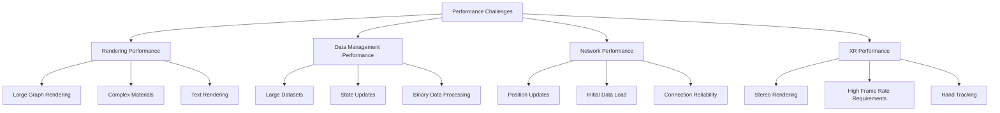

# Performance

This document provides a comprehensive overview of performance considerations, optimizations, and techniques used in the client application. Performance is critical for maintaining a smooth, responsive user experience, especially with large graph visualizations and in XR environments.

## Performance Considerations

The application faces several performance challenges:



## Rendering Optimizations

### Instanced Rendering

The application uses instanced rendering to draw many similar objects (nodes) with a single draw call:

```typescript
// Create instanced mesh
this.instancedMesh = new THREE.InstancedMesh(
  geometry,
  material,
  maxNodes
);

// Update all instances in a single update
for (let i = 0; i < nodeCount; i++) {
  const matrix = new THREE.Matrix4();
  matrix.compose(
    positions[i],
    quaternions[i],
    scales[i]
  );
  this.instancedMesh.setMatrixAt(i, matrix);
}
this.instancedMesh.instanceMatrix.needsUpdate = true;
```

This approach significantly reduces draw calls, which is one of the main performance bottlenecks in WebGL.

### Level of Detail (LOD)

The application implements a level of detail system to reduce geometric complexity for distant objects:

```typescript
// LOD thresholds
private readonly HIGH_DETAIL_THRESHOLD = 20;  // Distance in world units
private readonly MEDIUM_DETAIL_THRESHOLD = 50;

// Update LOD based on camera distance
private updateLOD(camera: THREE.Camera): void {
  if (!this.instancedMesh) return;
  
  const cameraPosition = camera.position;
  
  this.nodes.forEach((node, nodeId) => {
    const distance = node.position.distanceTo(cameraPosition);
    
    let detailLevel: NodeDetailLevel;
    if (distance < this.HIGH_DETAIL_THRESHOLD) {
      detailLevel = NodeDetailLevel.High;
    } else if (distance < this.MEDIUM_DETAIL_THRESHOLD) {
      detailLevel = NodeDetailLevel.Medium;
    } else {
      detailLevel = NodeDetailLevel.Low;
    }
    
    // Only update if detail level changed
    if (node.detailLevel !== detailLevel) {
      node.detailLevel = detailLevel;
      this.updateNodeGeometry(nodeId, detailLevel);
    }
  });
}
```

### Frustum Culling

Objects outside the camera's view frustum are culled to avoid rendering invisible objects:

```typescript
// Create frustum from camera
const frustum = new THREE.Frustum();
const projScreenMatrix = new THREE.Matrix4();
projScreenMatrix.multiplyMatrices(
  camera.projectionMatrix,
  camera.matrixWorldInverse
);
frustum.setFromProjectionMatrix(projScreenMatrix);

// Check each object against frustum
this.objects.forEach(object => {
  // Create bounding sphere around object
  const boundingSphere = new THREE.Sphere(
    object.position,
    object.geometry.boundingSphere.radius * object.scale.x
  );
  
  // Set visibility based on frustum intersection
  object.visible = frustum.intersectsSphere(boundingSphere);
});
```

### Occlusion Culling

For dense scenes, occlusion culling is implemented to avoid rendering objects that are hidden behind other objects:

```typescript
// Use Three.js built-in occlusion culling
renderer.setRenderListDepth(true);

// Alternatively, implement manual occlusion culling for specific cases
function isOccluded(object: THREE.Object3D, camera: THREE.Camera, occluders: THREE.Object3D[]): boolean {
  const raycaster = new THREE.Raycaster();
  const direction = new THREE.Vector3();
  
  // Get direction from camera to object
  direction.subVectors(object.position, camera.position).normalize();
  
  // Set up raycaster
  raycaster.set(camera.position, direction);
  
  // Cast ray and check for intersections
  const intersections = raycaster.intersectObjects(occluders);
  
  // If any intersection is closer than the object, it's occluded
  if (intersections.length > 0) {
    const distanceToObject = camera.position.distanceTo(object.position);
    return intersections[0].distance < distanceToObject;
  }
  
  return false;
}
```

### Efficient Text Rendering

Text rendering is optimized using SDF (Signed Distance Field) fonts, which provide crisp text at any scale with minimal texture memory:

```typescript
// Generate SDF texture
const fontAtlas = new SDFFontAtlasGenerator();
const texture = fontAtlas.generateAtlas(font, chars);

// Create material using SDF shader
const material = new THREE.ShaderMaterial({
  uniforms: {
    map: { value: texture },
    color: { value: new THREE.Color(color) },
    smoothing: { value: 0.25 },
    threshold: { value: 0.2 }
  },
  vertexShader: textVertexShader,
  fragmentShader: textFragmentShader,
  transparent: true,
  side: THREE.DoubleSide
});
```

### ShaderMaterial Optimization

Custom shader materials are optimized for performance:

```glsl
// Optimized vertex shader
void main() {
  // Compute only what's necessary
  vUv = uv;
  gl_Position = projectionMatrix * modelViewMatrix * vec4(position, 1.0);
}

// Optimized fragment shader
void main() {
  // Use texture2D once and store result
  vec4 texColor = texture2D(map, vUv);
  
  // Early return for transparent pixels
  if (texColor.a < 0.01) discard;
  
  // Simplified calculations
  float alpha = smoothstep(threshold - smoothing, threshold + smoothing, texColor.a);
  gl_FragColor = vec4(color, alpha);
}
```

## Data Management Optimizations

### Binary Data Processing

Binary data is processed efficiently:

```typescript
// Preallocate typed arrays to avoid garbage collection
const positions = new Float32Array(nodeCount * 3);
const indices = new Uint32Array(nodeCount);

// Process binary data in one pass
function processBinaryData(buffer: ArrayBuffer): void {
  const view = new DataView(buffer);
  let offset = 0;
  
  for (let i = 0; i < nodeCount; i++) {
    // Read node ID
    const id = view.getUint32(offset, true);
    indices[i] = id;
    offset += 4;
    
    // Read position
    positions[i * 3] = view.getFloat32(offset, true);
    positions[i * 3 + 1] = view.getFloat32(offset + 4, true);
    positions[i * 3 + 2] = view.getFloat32(offset + 8, true);
    offset += 12;
  }
}
```

### Object Pooling

Object pooling is used to reduce garbage collection:

```typescript
class Vector3Pool {
  private pool: THREE.Vector3[] = [];
  private index: number = 0;
  
  constructor(initialSize: number = 1000) {
    // Pre-allocate pool
    for (let i = 0; i < initialSize; i++) {
      this.pool.push(new THREE.Vector3());
    }
  }
  
  get(): THREE.Vector3 {
    if (this.index >= this.pool.length) {
      // Expand pool if needed
      this.pool.push(new THREE.Vector3());
    }
    
    return this.pool[this.index++];
  }
  
  reset(): void {
    this.index = 0;
  }
}

// Usage
const vectorPool = new Vector3Pool();

function processVectors(count: number): void {
  vectorPool.reset();
  
  for (let i = 0; i < count; i++) {
    const vec = vectorPool.get();
    // Use vec...
  }
}
```

### Immutable Data Patterns

Immutable data patterns are used to optimize state updates:

```typescript
function updateState(state, path, value) {
  // Split path into parts
  const parts = path.split('.');
  const key = parts[0];
  
  if (parts.length === 1) {
    // Leaf property, create new object with updated value
    return {
      ...state,
      [key]: value
    };
  } else {
    // Nested property, recurse
    const remainingPath = parts.slice(1).join('.');
    return {
      ...state,
      [key]: updateState(state[key] || {}, remainingPath, value)
    };
  }
}
```

## Network Optimizations

### Binary Protocol

The application uses a binary protocol for efficient position updates:

```typescript
// Define binary format
const BYTES_PER_NODE = 26; // 2 (ID) + 12 (position) + 12 (velocity)

// Encode binary message
function encodeBinaryMessage(nodes): ArrayBuffer {
  const buffer = new ArrayBuffer(nodes.length * BYTES_PER_NODE);
  const view = new DataView(buffer);
  
  nodes.forEach((node, index) => {
    const offset = index * BYTES_PER_NODE;
    
    // Write node ID
    view.setUint16(offset, parseInt(node.id), true);
    
    // Write position
    view.setFloat32(offset + 2, node.position.x, true);
    view.setFloat32(offset + 6, node.position.y, true);
    view.setFloat32(offset + 10, node.position.z, true);
    
    // Write velocity
    view.setFloat32(offset + 14, node.velocity.x, true);
    view.setFloat32(offset + 18, node.velocity.y, true);
    view.setFloat32(offset + 22, node.velocity.z, true);
  });
  
  return buffer;
}
```

### Data Compression

Data compression is used for large messages:

```typescript
// Compress data if over threshold
function compressIfNeeded(buffer: ArrayBuffer): ArrayBuffer {
  if (buffer.byteLength > COMPRESSION_THRESHOLD) {
    return pako.deflate(new Uint8Array(buffer)).buffer;
  }
  return buffer;
}

// Decompress data
function tryDecompress(buffer: ArrayBuffer): ArrayBuffer {
  try {
    return pako.inflate(new Uint8Array(buffer)).buffer;
  } catch (e) {
    // If decompression fails, return original buffer
    return buffer;
  }
}
```

### Request Batching

Requests are batched to reduce network overhead:

```typescript
class RequestBatcher {
  private queue: any[] = [];
  private timer: number | null = null;
  private readonly delay: number;
  
  constructor(delay: number = 50) {
    this.delay = delay;
  }
  
  add(item: any): void {
    this.queue.push(item);
    
    if (!this.timer) {
      this.timer = window.setTimeout(() => {
        this.flush();
        this.timer = null;
      }, this.delay);
    }
  }
  
  private flush(): void {
    if (this.queue.length === 0) return;
    
    const items = [...this.queue];
    this.queue = [];
    
    this.sendBatch(items);
  }
  
  private sendBatch(items: any[]): void {
    // Send batch request
    fetch('/api/batch', {
      method: 'POST',
      headers: {
        'Content-Type': 'application/json'
      },
      body: JSON.stringify({ items })
    });
  }
}
```

### Pagination

Pagination is used for loading large datasets:

```typescript
async function loadGraphData(): Promise<void> {
  let page = 1;
  const pageSize = 100;
  let hasMoreData = true;
  
  // Load first page immediately
  const firstPage = await fetchPage(page, pageSize);
  processPage(firstPage);
  
  // Check if there are more pages
  hasMoreData = firstPage.hasMorePages;
  
  // Continue loading pages in background
  while (hasMoreData) {
    page++;
    
    // Use setTimeout to avoid blocking the main thread
    await new Promise(resolve => setTimeout(resolve, 0));
    
    const nextPage = await fetchPage(page, pageSize);
    processPage(nextPage);
    
    hasMoreData = nextPage.hasMorePages;
    
    // Update progress indicator
    updateProgress(page, nextPage.totalPages);
  }
}
```

## Animation and Rendering Optimizations

### Request Animation Frame

The application uses requestAnimationFrame for efficient animations:

```typescript
function startAnimationLoop(): void {
  let lastTime = 0;
  
  function animate(time: number): void {
    // Request next frame
    requestAnimationFrame(animate);
    
    // Calculate delta time
    const deltaTime = lastTime ? (time - lastTime) / 1000 : 0;
    lastTime = time;
    
    // Update scene
    update(deltaTime);
    
    // Render scene
    render();
  }
  
  // Start animation loop
  requestAnimationFrame(animate);
}
```

### Performance Monitoring

The application includes performance monitoring to identify bottlenecks:

```typescript
class PerformanceMonitor {
  private metrics: Map<string, number[]> = new Map();
  private maxSamples: number;
  
  constructor(maxSamples: number = 100) {
    this.maxSamples = maxSamples;
  }
  
  startMeasure(name: string): () => void {
    const startTime = performance.now();
    
    return () => {
      const endTime = performance.now();
      const duration = endTime - startTime;
      
      this.recordMetric(name, duration);
    };
  }
  
  recordMetric(name: string, value: number): void {
    if (!this.metrics.has(name)) {
      this.metrics.set(name, []);
    }
    
    const values = this.metrics.get(name)!;
    values.push(value);
    
    // Keep only the last maxSamples
    if (values.length > this.maxSamples) {
      values.shift();
    }
  }
  
  getAverageMetric(name: string): number | null {
    if (!this.metrics.has(name)) return null;
    
    const values = this.metrics.get(name)!;
    if (values.length === 0) return null;
    
    return values.reduce((sum, value) => sum + value, 0) / values.length;
  }
  
  getMetrics(): Record<string, { average: number, min: number, max: number }> {
    const result: Record<string, { average: number, min: number, max: number }> = {};
    
    this.metrics.forEach((values, name) => {
      if (values.length === 0) return;
      
      const sum = values.reduce((acc, value) => acc + value, 0);
      const min = Math.min(...values);
      const max = Math.max(...values);
      
      result[name] = {
        average: sum / values.length,
        min,
        max
      };
    });
    
    return result;
  }
}
```

### Throttling and Debouncing

Throttling and debouncing are used for expensive operations:

```typescript
class UpdateThrottler {
  private lastUpdateTime: number = 0;
  private readonly updateInterval: number;
  
  constructor(updateInterval: number = 16) {
    this.updateInterval = updateInterval;
  }
  
  shouldUpdate(): boolean {
    const now = performance.now();
    if (now - this.lastUpdateTime >= this.updateInterval) {
      this.lastUpdateTime = now;
      return true;
    }
    return false;
  }
  
  getTimeUntilNextUpdate(): number {
    const now = performance.now();
    return Math.max(0, this.updateInterval - (now - this.lastUpdateTime));
  }
  
  getRate(): number {
    return 1000 / this.updateInterval;
  }
}

function debounce<T extends (...args: any[]) => any>(
  func: T,
  wait: number
): (...args: Parameters<T>) => void {
  let timeout: number | null = null;
  
  return function(...args: Parameters<T>): void {
    if (timeout !== null) {
      window.clearTimeout(timeout);
    }
    
    timeout = window.setTimeout(() => {
      func(...args);
      timeout = null;
    }, wait);
  };
}
```

## Memory Management

### Resource Cleanup

Resources are properly cleaned up to prevent memory leaks:

```typescript
// Dispose Three.js resources
dispose(): void {
  // Dispose geometries
  this.geometries.forEach(geometry => {
    geometry.dispose();
  });
  this.geometries.clear();
  
  // Dispose materials
  this.materials.forEach(material => {
    material.dispose();
  });
  this.materials.clear();
  
  // Dispose textures
  this.textures.forEach(texture => {
    texture.dispose();
  });
  this.textures.clear();
  
  // Remove from scene
  if (this.instancedMesh) {
    this.scene.remove(this.instancedMesh);
    this.instancedMesh.dispose();
    this.instancedMesh = null;
  }
  
  // Clean up event listeners
  window.removeEventListener('resize', this.handleResize);
}
```

### Texture Management

Textures are managed efficiently:

```typescript
class TextureManager {
  private textures: Map<string, THREE.Texture> = new Map();
  
  async loadTexture(url: string): Promise<THREE.Texture> {
    // Check if texture is already loaded
    if (this.textures.has(url)) {
      return this.textures.get(url)!;
    }
    
    // Load texture
    const texture = await new Promise<THREE.Texture>((resolve, reject) => {
      new THREE.TextureLoader().load(
        url,
        resolve,
        undefined,
        reject
      );
    });
    
    // Optimize texture settings
    texture.anisotropy = 16;
    texture.generateMipmaps = true;
    texture.minFilter = THREE.LinearMipmapLinearFilter;
    texture.magFilter = THREE.LinearFilter;
    texture.needsUpdate = true;
    
    // Store texture
    this.textures.set(url, texture);
    
    return texture;
  }
  
  disposeTexture(url: string): void {
    if (this.textures.has(url)) {
      const texture = this.textures.get(url)!;
      texture.dispose();
      this.textures.delete(url);
    }
  }
  
  disposeAll(): void {
    this.textures.forEach(texture => {
      texture.dispose();
    });
    this.textures.clear();
  }
}
```

### Buffer Reuse

Buffers are reused to reduce memory allocations:

```typescript
// Reuse array buffers
class BufferPool {
  private floatBuffers: Map<number, Float32Array> = new Map();
  private uint32Buffers: Map<number, Uint32Array> = new Map();
  
  getFloat32Buffer(size: number): Float32Array {
    if (!this.floatBuffers.has(size)) {
      this.floatBuffers.set(size, new Float32Array(size));
    }
    return this.floatBuffers.get(size)!;
  }
  
  getUint32Buffer(size: number): Uint32Array {
    if (!this.uint32Buffers.has(size)) {
      this.uint32Buffers.set(size, new Uint32Array(size));
    }
    return this.uint32Buffers.get(size)!;
  }
}
```

## WebXR Optimizations

WebXR applications require additional optimizations due to the high performance requirements:

### Mobile VR Optimizations

```typescript
function optimizeForMobileVR(): void {
  // Reduce texture quality
  renderer.setPixelRatio(1.0);
  
  // Disable expensive effects
  renderer.shadowMap.enabled = false;
  
  // Use simpler materials
  this.materials.forEach(material => {
    material.flatShading = true;
    material.needsUpdate = true;
  });
  
  // Reduce geometry complexity
  this.geometries.forEach((geometry, key) => {
    if (geometry instanceof THREE.SphereGeometry) {
      const simplified = new THREE.SphereGeometry(
        geometry.parameters.radius,
        Math.max(8, Math.floor(geometry.parameters.widthSegments / 2)),
        Math.max(6, Math.floor(geometry.parameters.heightSegments / 2))
      );
      this.geometries.set(key, simplified);
    }
  });
}
```

### XR-specific Rendering Optimizations

```typescript
function optimizeForXR(renderer: THREE.WebGLRenderer): void {
  // Set recommended WebXR settings
  renderer.xr.enabled = true;
  renderer.xr.setReferenceSpaceType('local-floor');
  
  // Enable foveated rendering if available
  const gl = renderer.getContext();
  if (gl.getExtension('OCULUS_multiview')) {
    renderer.xr.setFoveation(0.5);
  }
  
  // Set frame rate to match display refresh rate
  const session = renderer.xr.getSession();
  if (session) {
    const framerate = session.supportedFrameRates
      ? Math.max(...session.supportedFrameRates)
      : 72;
    session.updateTargetFrameRate(framerate);
  }
}
```

## Performance Profiling

The application includes tools for performance profiling:

```typescript
class PerformanceProfiler {
  private static instance: PerformanceProfiler;
  private active: boolean = false;
  private markers: Map<string, number> = new Map();
  private measurements: Map<string, number[]> = new Map();
  
  static getInstance(): PerformanceProfiler {
    if (!PerformanceProfiler.instance) {
      PerformanceProfiler.instance = new PerformanceProfiler();
    }
    return PerformanceProfiler.instance;
  }
  
  startProfiling(): void {
    this.active = true;
    this.markers.clear();
    this.measurements.clear();
    console.log('Performance profiling started');
  }
  
  stopProfiling(): Record<string, { avg: number, min: number, max: number, count: number }> {
    this.active = false;
    
    const result: Record<string, { avg: number, min: number, max: number, count: number }> = {};
    
    this.measurements.forEach((times, name) => {
      if (times.length === 0) return;
      
      const sum = times.reduce((acc, time) => acc + time, 0);
      const avg = sum / times.length;
      const min = Math.min(...times);
      const max = Math.max(...times);
      
      result[name] = {
        avg,
        min,
        max,
        count: times.length
      };
    });
    
    console.table(result);
    
    return result;
  }
  
  mark(name: string): void {
    if (!this.active) return;
    
    this.markers.set(name, performance.now());
  }
  
  measure(name: string, startMark: string, endMark?: string): void {
    if (!this.active) return;
    
    const endTime = endMark ? this.markers.get(endMark) : performance.now();
    const startTime = this.markers.get(startMark);
    
    if (startTime === undefined || endTime === undefined) {
      console.warn(`Invalid markers for measure "${name}": start=${startMark}, end=${endMark}`);
      return;
    }
    
    const duration = endTime - startTime;
    
    if (!this.measurements.has(name)) {
      this.measurements.set(name, []);
    }
    
    this.measurements.get(name)!.push(duration);
  }
}
```

## Next Sections

For more detailed information, refer to:
- [Technical Debt](technical-debt.md) - Technical debt analysis
- [Business Logic](business-logic.md) - Business logic documentation
- [Error Handling](error-handling.md) - Error handling patterns