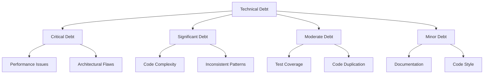

# Technical Debt

This document provides a comprehensive analysis of technical debt in the client application. Technical debt refers to development decisions that prioritize speed over optimal implementation, leading to future costs in terms of maintenance and extensibility. This analysis categorizes debt by severity, suggests remediation strategies, and provides a roadmap for addressing the most critical issues.

## Overview of Technical Debt

Technical debt in the application is categorized by severity and impact:



## Critical Technical Debt

### Performance Issues in Large Graph Rendering

**Description:** The current implementation of the graph rendering system doesn't scale well with very large graphs (10,000+ nodes). Frame rate drops significantly when visualizing large datasets.

**Impact:** Users with large datasets experience poor performance, making the application unusable for complex graphs.

**Root Causes:**
- Insufficient node culling for off-screen objects
- Too many draw calls when rendering node labels
- Inefficient handling of binary position updates for large datasets

**Remediation:**
1. Implement more aggressive frustum and distance culling for nodes
2. Use instanced rendering for node labels
3. Optimize binary position update processing with chunking and web workers

```typescript
// Current implementation (inefficient)
function updateNodePositions(positions: Float32Array): void {
  // Process all nodes in a single frame
  for (let i = 0; i < positions.length; i += 6) {
    // Update node position...
  }
}

// Recommended implementation
function updateNodePositions(positions: Float32Array): void {
  // Process nodes in chunks across multiple frames
  const CHUNK_SIZE = 1000;
  let offset = 0;
  
  function processChunk() {
    const endOffset = Math.min(offset + CHUNK_SIZE * 6, positions.length);
    
    for (let i = offset; i < endOffset; i += 6) {
      // Update node position...
    }
    
    offset = endOffset;
    
    if (offset < positions.length) {
      // Schedule next chunk
      setTimeout(processChunk, 0);
    }
  }
  
  // Start processing
  processChunk();
}
```

### WebSocket Connection Reliability

**Description:** The WebSocket connection management has reliability issues, particularly with reconnection logic and error recovery.

**Impact:** Users experience disconnections and data synchronization issues, leading to inconsistent state and potential data loss.

**Root Causes:**
- Inadequate error handling for certain connection failure scenarios
- Race conditions in the reconnection logic
- Lack of proper state synchronization after reconnection

**Remediation:**
1. Refactor WebSocket connection management with a proper state machine
2. Implement robust error recovery with automatic state resynchronization
3. Add exponential backoff with jitter for reconnection attempts

```typescript
// Current implementation
private handleReconnect(): void {
  // Simple reconnect logic with fixed timing
  if (this.reconnectAttempts < this.maxReconnectAttempts) {
    this.reconnectAttempts++;
    const delay = this.getReconnectDelay();
    setTimeout(() => this.connect(), delay);
  }
}

// Recommended implementation
private handleReconnect(): void {
  if (this.reconnectAttempts < this.maxReconnectAttempts) {
    this.reconnectAttempts++;
    
    // Exponential backoff with jitter
    const baseDelay = Math.min(
      this.initialReconnectDelay * Math.pow(2, this.reconnectAttempts - 1),
      this.maxReconnectDelay
    );
    const jitter = Math.random() * 0.5 * baseDelay;
    const delay = baseDelay + jitter;
    
    // Set reconnection state
    this.connectionState = ConnectionState.RECONNECTING;
    this.notifyConnectionStatus();
    
    // Schedule reconnection
    this.reconnectTimeout = setTimeout(() => {
      this.reconnectTimeout = null;
      this.connect().catch(error => {
        logger.error('Reconnection attempt failed:', error);
        this.handleReconnect();
      });
    }, delay);
  } else {
    // Max retries reached
    this.connectionState = ConnectionState.FAILED;
    this.notifyConnectionStatus();
  }
}
```

## Significant Technical Debt

### Inconsistent State Management

**Description:** The application uses multiple approaches to state management, including direct prop passing, context API, and a custom state store, creating inconsistency and complexity.

**Impact:** Developers struggle to understand data flow, leading to bugs, maintenance challenges, and slower development.

**Root Causes:**
- Organic growth of the application without architectural planning
- Different developers applying different patterns over time
- Lack of clear guidelines for state management

**Remediation:**
1. Define a consistent state management architecture
2. Refactor to use a single state management pattern (e.g., centralized store with subscribable slices)
3. Document the state management approach and enforce it in code reviews

```typescript
// Current situation: Multiple state management approaches

// Approach 1: Direct prop passing
function ComponentA({ data, onUpdate }) {
  // Use data directly, call onUpdate to modify
}

// Approach 2: Context API
const DataContext = React.createContext(null);

function ComponentB() {
  const data = useContext(DataContext);
  // Use context data
}

// Approach 3: Custom store with observables
class DataStore {
  private data = {};
  private listeners = new Set();
  
  update(newData) {
    this.data = { ...this.data, ...newData };
    this.notify();
  }
  
  subscribe(listener) {
    this.listeners.add(listener);
    return () => this.listeners.delete(listener);
  }
  
  notify() {
    this.listeners.forEach(listener => listener(this.data));
  }
}

// Recommended approach: Standardize on a single pattern
class Store<T> {
  private state: T;
  private listeners: Set<(state: T) => void> = new Set();
  
  constructor(initialState: T) {
    this.state = initialState;
  }
  
  getState(): T {
    return this.state;
  }
  
  setState(updater: (state: T) => T): void {
    this.state = updater(this.state);
    this.notifyListeners();
  }
  
  subscribe(listener: (state: T) => void): () => void {
    this.listeners.add(listener);
    return () => {
      this.listeners.delete(listener);
    };
  }
  
  private notifyListeners(): void {
    for (const listener of this.listeners) {
      listener(this.state);
    }
  }
}
```

### Tightly Coupled Components

**Description:** Many components have tight coupling with specific implementations, making them difficult to test, reuse, and maintain.

**Impact:** Changes to one component often require changes to multiple other components, increasing the risk of bugs and making testing difficult.

**Root Causes:**
- Direct dependencies on concrete implementations rather than abstractions
- Singleton pattern overuse
- Lack of dependency injection

**Remediation:**
1. Refactor components to depend on interfaces rather than concrete implementations
2. Introduce dependency injection for services and managers
3. Create a more modular architecture with clear boundaries

```typescript
// Current implementation (tightly coupled)
class NodeManager {
  private static instance: NodeManager;
  
  static getInstance(): NodeManager {
    if (!NodeManager.instance) {
      NodeManager.instance = new NodeManager();
    }
    return NodeManager.instance;
  }
  
  updateNode(nodeId: string, position: Vector3): void {
    // Direct dependency on WebSocketService singleton
    WebSocketService.getInstance().sendNodeUpdate(nodeId, position);
  }
}

// Recommended implementation
interface IWebSocketService {
  sendNodeUpdate(nodeId: string, position: Vector3): void;
}

class NodeManager {
  constructor(private webSocketService: IWebSocketService) {}
  
  updateNode(nodeId: string, position: Vector3): void {
    this.webSocketService.sendNodeUpdate(nodeId, position);
  }
}
```

## Moderate Technical Debt

### Inadequate Test Coverage

**Description:** The application has limited automated test coverage, particularly for complex components like the rendering pipeline and WebSocket data handling.

**Impact:** Changes are risky, bugs are discovered late, and refactoring is difficult due to lack of safety net.

**Root Causes:**
- Initial focus on feature development over testing
- Complex rendering logic that's difficult to test
- Lack of clear testing strategy

**Remediation:**
1. Define a testing strategy for different types of components
2. Increase unit test coverage for core business logic
3. Add integration tests for critical paths
4. Implement visual regression testing for rendering components

```typescript
// Example of testable code with dependency injection
class GraphDataManager {
  constructor(
    private apiClient: IApiClient,
    private eventEmitter: IEventEmitter
  ) {}
  
  async loadGraphData(): Promise<GraphData> {
    try {
      const data = await this.apiClient.fetchGraphData();
      this.eventEmitter.emit('graphDataLoaded', data);
      return data;
    } catch (error) {
      this.eventEmitter.emit('graphDataError', error);
      throw error;
    }
  }
}

// Example test
describe('GraphDataManager', () => {
  let manager: GraphDataManager;
  let mockApiClient: jest.Mocked<IApiClient>;
  let mockEventEmitter: jest.Mocked<IEventEmitter>;
  
  beforeEach(() => {
    mockApiClient = {
      fetchGraphData: jest.fn()
    };
    
    mockEventEmitter = {
      emit: jest.fn()
    };
    
    manager = new GraphDataManager(mockApiClient, mockEventEmitter);
  });
  
  it('should load graph data and emit event', async () => {
    const mockData = { nodes: [], edges: [] };
    mockApiClient.fetchGraphData.mockResolvedValue(mockData);
    
    const result = await manager.loadGraphData();
    
    expect(result).toEqual(mockData);
    expect(mockEventEmitter.emit).toHaveBeenCalledWith('graphDataLoaded', mockData);
  });
});
```

### Code Duplication

**Description:** Several areas of the codebase contain duplicated logic, particularly in the WebSocket handling, position calculations, and error handling.

**Impact:** Bug fixes and enhancements must be applied in multiple places, increasing the risk of inconsistencies and errors.

**Root Causes:**
- Copy-paste programming during rapid development
- Lack of shared utilities and abstractions
- Insufficient code reviews

**Remediation:**
1. Extract common logic into shared utility functions
2. Create reusable abstractions for repeated patterns
3. Implement stricter code review policies for duplication

```typescript
// Current situation: Duplicated position validation logic

// In file1.ts
function validatePosition(position: Vector3): boolean {
  return !isNaN(position.x) && !isNaN(position.y) && !isNaN(position.z) &&
         isFinite(position.x) && isFinite(position.y) && isFinite(position.z);
}

// In file2.ts
function isValidPosition(pos: Vector3): boolean {
  return !isNaN(pos.x) && !isNaN(pos.y) && !isNaN(pos.z) &&
         isFinite(pos.x) && isFinite(pos.y) && isFinite(pos.z);
}

// Recommended approach: Create a shared utility
// In vectorUtils.ts
export function isValidVector3(vector: Vector3): boolean {
  return !isNaN(vector.x) && !isNaN(vector.y) && !isNaN(vector.z) &&
         isFinite(vector.x) && isFinite(vector.y) && isFinite(vector.z);
}

export function sanitizeVector3(vector: Vector3, fallbackValue: number = 0, maxValue?: number): Vector3 {
  const result = vector.clone();
  
  // Replace NaN values
  if (isNaN(result.x)) result.x = fallbackValue;
  if (isNaN(result.y)) result.y = fallbackValue;
  if (isNaN(result.z)) result.z = fallbackValue;
  
  // Replace infinite values
  if (!isFinite(result.x)) result.x = fallbackValue;
  if (!isFinite(result.y)) result.y = fallbackValue;
  if (!isFinite(result.z)) result.z = fallbackValue;
  
  // Clamp to max value if provided
  if (maxValue !== undefined) {
    result.x = Math.max(-maxValue, Math.min(maxValue, result.x));
    result.y = Math.max(-maxValue, Math.min(maxValue, result.y));
    result.z = Math.max(-maxValue, Math.min(maxValue, result.z));
  }
  
  return result;
}
```

### Inconsistent Error Handling

**Description:** Error handling is inconsistent across the application, with some areas using try/catch, others using Promise chains, and others not handling errors at all.

**Impact:** Errors are not properly caught, reported, or recovered from, leading to poor user experience and difficult debugging.

**Root Causes:**
- Lack of error handling strategy
- Mix of asynchronous patterns (callbacks, promises, async/await)
- Insufficient attention to error scenarios

**Remediation:**
1. Define a consistent error handling strategy
2. Implement centralized error logging and reporting
3. Add proper error recovery mechanisms
4. Use consistent asynchronous patterns (prefer async/await)

```typescript
// Current situation: Inconsistent error handling

// Style 1: Promise chains
fetchData()
  .then(data => processData(data))
  .catch(error => console.error('Error:', error));

// Style 2: Async/await with try/catch
async function loadData() {
  try {
    const data = await fetchData();
    return processData(data);
  } catch (error) {
    console.error('Failed to load data:', error);
    return null;
  }
}

// Style 3: No error handling
function updateNode(id, position) {
  // No error handling at all
  const node = getNode(id);
  node.position = position;
  saveNode(node);
}

// Recommended approach: Consistent error handling
class ErrorHandler {
  static async handleAsync<T>(
    operation: () => Promise<T>,
    errorContext: string
  ): Promise<T | null> {
    try {
      return await operation();
    } catch (error) {
      logger.error(`Error in ${errorContext}:`, createErrorMetadata(error));
      
      // Optionally report to monitoring service
      ErrorReportingService.reportError(error, errorContext);
      
      // Rethrow or return null depending on strategy
      return null;
    }
  }
}

// Usage
async function loadData() {
  return ErrorHandler.handleAsync(
    async () => {
      const data = await fetchData();
      return processData(data);
    },
    'loadData'
  );
}
```

## Minor Technical Debt

### Inconsistent Code Style

**Description:** The codebase exhibits inconsistent code style, naming conventions, and organization patterns across different modules.

**Impact:** Reduced readability, increased cognitive load for developers, and subtle bugs from misunderstanding patterns.

**Root Causes:**
- Multiple developers with different preferences
- Lack of enforced code style guidelines
- Legacy code intermixed with newer patterns

**Remediation:**
1. Define coding standards and style guidelines
2. Implement automatic code formatting with ESLint and Prettier
3. Configure pre-commit hooks to enforce style
4. Gradually refactor existing code to meet standards

```typescript
// Add development dependencies
// package.json
{
  "devDependencies": {
    "eslint": "^8.0.0",
    "prettier": "^2.5.0",
    "husky": "^7.0.0",
    "lint-staged": "^12.0.0"
  },
  "scripts": {
    "lint": "eslint --ext .ts,.tsx src",
    "format": "prettier --write \"src/**/*.{ts,tsx}\"",
    "prepare": "husky install"
  },
  "husky": {
    "hooks": {
      "pre-commit": "lint-staged"
    }
  },
  "lint-staged": {
    "*.{ts,tsx}": [
      "prettier --write",
      "eslint --fix"
    ]
  }
}
```

### Outdated Dependencies

**Description:** Several dependencies are outdated, including Three.js, TypeScript, and various utility libraries.

**Impact:** Missing out on performance improvements, bug fixes, and new features from updated dependencies.

**Root Causes:**
- Fear of breaking changes
- Accumulated technical debt making upgrades risky
- Lack of regular dependency maintenance

**Remediation:**
1. Create a dependency update schedule and process
2. Implement better testing to make upgrades safer
3. Upgrade dependencies incrementally, starting with minor versions
4. Modernize build tools and configurations

```typescript
// Current package.json
{
  "dependencies": {
    "three": "^0.125.0",
    "typescript": "^4.1.3",
    // ...other outdated dependencies
  }
}

// Recommended process for upgrading
// 1. Create a dependency update branch
// 2. Update non-breaking minor versions first
// 3. Run tests and fix any issues
// 4. Update major versions with breaking changes one at a time
// 5. Update build configurations and types as needed
```

## Technical Debt Remediation Plan

### Short-term (1-3 Months)

1. **Address Critical Performance Issues**
   - Implement chunked processing for position updates
   - Optimize WebSocket binary protocol handling
   - Improve node culling for large graphs

2. **Fix WebSocket Connection Reliability**
   - Refactor WebSocket connection state management
   - Implement proper reconnection logic with backoff
   - Add comprehensive error recovery

3. **Improve Error Handling**
   - Create central error handling utilities
   - Standardize error reporting and logging
   - Add error boundary components

### Medium-term (3-6 Months)

1. **Reduce Code Duplication**
   - Extract common patterns into shared utilities
   - Create reusable components for repeated UI patterns
   - Establish code reuse guidelines

2. **Standardize State Management**
   - Define state management architecture
   - Refactor to consistent patterns
   - Document state flow and management approach

3. **Improve Test Coverage**
   - Add unit tests for core business logic
   - Implement integration tests for critical flows
   - Set up visual regression testing

### Long-term (6-12 Months)

1. **Reduce Component Coupling**
   - Refactor to use dependency injection
   - Replace singleton patterns with proper DI
   - Create clearer module boundaries

2. **Update Dependencies**
   - Establish regular dependency update process
   - Upgrade all outdated dependencies
   - Modernize build tools and configurations

3. **Code Style Standardization**
   - Define and document coding standards
   - Configure and enforce automated linting
   - Gradually refactor legacy code

## Measuring Technical Debt

To track progress in addressing technical debt, we can use the following metrics:

### Code Quality Metrics

- **Cyclomatic Complexity**: Measure the complexity of functions and methods
- **Duplication**: Track the percentage of duplicated code
- **Test Coverage**: Measure the percentage of code covered by tests
- **Warning Count**: Track ESLint warnings and errors

### Performance Metrics

- **Frame Rate**: Monitor average and minimum frame rates
- **Memory Usage**: Track memory consumption over time
- **Loading Time**: Measure time to interactive and data loading performance
- **Network Efficiency**: Monitor WebSocket message size and frequency

### Development Metrics

- **Bug Rate**: Track the number of bugs per feature or release
- **Change Failure Rate**: Measure the percentage of changes that result in issues
- **Time to Fix**: Measure how long it takes to fix issues
- **Developer Satisfaction**: Survey developers about codebase maintainability

## Next Sections

For more detailed information, refer to:
- [Performance](performance.md) - Performance considerations and optimizations
- [Error Handling](error-handling.md) - Error handling patterns and implementation
- [Business Logic](business-logic.md) - Core business rules and implementation