# Technical Architecture

LogseqXR is built on a robust and scalable architecture that combines a Rust-based backend server with a TypeScript-based frontend client.

## Core System Architecture

The following diagram illustrates the core components of the LogseqXR system and their interactions:

```mermaid
graph TB
    subgraph Frontend
        UI[User Interface Layer]
        VR[WebXR Controller]
        WS[WebSocket Client]
        GPU[GPU Compute Layer]
        ThreeJS[Three.js Renderer]
        ChatUI[Chat Interface]
        GraphUI[Graph Interface]
        ControlPanel[Modular Control Panel]
        VRControls[VR Control System]
        WSService[WebSocket Service]
        DataManager[Graph Data Manager]
        LayoutEngine[Layout Engine]
        SpaceMouse[SpaceMouse Controller]
        NostrAuth[Nostr Authentication]
        SettingsStore[Settings Store]
    end

    subgraph Backend
        Server[Actix Web Server]
        FileH[File Handler]
        GraphH[Graph Handler]
        WSH[WebSocket Handler]
        PerplexityH[Perplexity Handler]
        RagFlowH[RagFlow Handler]
        VisualizationH[Visualization Handler]
        NostrH[Nostr Handler]
        FileS[File Service]
        GraphS[Graph Service]
        GPUS[GPU Compute Service]
        PerplexityS[Perplexity Service]
        RagFlowS[RagFlow Service]
        SpeechS[Speech Service]
        NostrS[Nostr Service]
        WSManager[WebSocket Manager]
        GPUCompute[GPU Compute]
        Compression[Compression Utils]
        AudioProc[Audio Processor]
        Node[Node Model]
        Edge[Edge Model]
        Graph[Graph Model]
        Metadata[Metadata Model]
        Position[Position Update Model]
        SimParams[Simulation Parameters]
    end

    subgraph External
        GitHub[GitHub API]
        Perplexity[Perplexity AI]
        RagFlow[RagFlow API]
        OpenAI[OpenAI API]
        Nostr[Nostr API]
    end

    UI --> ChatUI
    UI --> GraphUI
    UI --> ControlPanel
    UI --> VRControls
    UI --> NostrAuth

    VR --> ThreeJS
    WS --> WSService
    WSService --> Server

    Server --> FileH
    Server --> GraphH
    Server --> WSH
    Server --> PerplexityH
    Server --> RagFlowH
    Server --> VisualizationH
    Server --> NostrH

    FileH --> FileS
    GraphH --> GraphS
    WSH --> WSManager
    PerplexityH --> PerplexityS
    RagFlowH --> RagFlowS
    NostrH --> NostrS

    FileS --> GitHub
    PerplexityS --> Perplexity
    RagFlowS --> RagFlow
    SpeechS --> OpenAI
    NostrS --> Nostr
```

## Component Breakdown

### Frontend Components

- **UI (User Interface Layer)**: Handles user interactions, displays information, and manages UI elements.
- **VR (WebXR Controller)**: Manages WebXR sessions, input, and rendering for VR/AR devices.
- **WS (WebSocket Client)**: Establishes and maintains a WebSocket connection with the backend server.
- **GPU (GPU Compute Layer)**: Performs GPU-accelerated computations using CUDA.
- **ThreeJS (Three.js Renderer)**: Renders the 3D graph visualization using WebGL.
- **ChatUI**: Handles the chat interface for interacting with the AI.
- **GraphUI**: Manages the graph visualization, including nodes, edges, and layout.
- **ControlPanel**: Modular control panel with dockable sections, Nostr authentication, and real-time settings management.
- **VRControls**: Handles VR-specific controls and interactions.
- **WSService**: Manages the WebSocket connection and message handling.
- **DataManager**: Manages the graph data structure and updates.
- **LayoutEngine**: Computes the force-directed layout of the graph.
- **SpaceMouse**: Handles input from Spacemouse devices.
- **NostrAuth**: Manages Nostr-based authentication and user sessions.
- **SettingsStore**: Centralized settings management with persistence and validation.

### Backend Components

- **Server (Actix Web Server)**: The core backend server built with the Actix web framework.
- **FileH (File Handler)**: Handles file-related operations, such as fetching and processing Markdown files.
- **GraphH (Graph Handler)**: Manages graph data and operations, such as building and updating the graph.
- **WSH (WebSocket Handler)**: Handles WebSocket connections and messages.
- **PerplexityH (Perplexity Handler)**: Interfaces with the Perplexity AI service.
- **RagFlowH (RagFlow Handler)**: Interfaces with the RAGFlow service.
- **VisualizationH (Visualization Handler)**: Handles visualization-related requests.
- **NostrH (Nostr Handler)**: Manages Nostr authentication and user sessions.
- **FileS (File Service)**: Provides file-related services.
- **GraphS (Graph Service)**: Provides graph-related services.
- **GPUS (GPU Compute Service)**: Manages GPU-accelerated computations.
- **PerplexityS (Perplexity Service)**: Provides an interface to the Perplexity AI service.
- **RagFlowS (RagFlow Service)**: Provides an interface to the RAGFlow service.
- **SpeechS (Speech Service)**: Manages text-to-speech functionality.
- **NostrS (Nostr Service)**: Provides Nostr-related services and user management.
- **WSManager (WebSocket Manager)**: Manages WebSocket connections and message routing.

### External Services

- **GitHub API**: Provides access to the GitHub API for fetching and updating files.
- **Perplexity AI**: Provides AI-powered question answering and content analysis.
- **RagFlow API**: Provides AI-powered conversational capabilities.
- **OpenAI API**: Provides text-to-speech functionality.
- **Nostr API**: Provides decentralized authentication and user management.

For more detailed technical information, please refer to:
- [Binary Protocol](../technical/binary-protocol.md)
- [Performance Optimizations](../technical/performance.md)
- [Class Diagrams](../technical/class-diagrams.md)