# Technical Architecture

LogseqXR is built on a robust and scalable architecture that combines a Rust-based backend server with a TypeScript-based frontend client.

## Core System Architecture

The following diagram illustrates the core components of the LogseqXR system and their interactions:

```mermaid
graph TD
    subgraph ClientApp ["Frontend"]
        AppInitializer["AppInitializer.tsx"] --> UIMain["TwoPaneLayout.tsx"]
        UIMain --> GraphViewport["GraphViewport.tsx"]
        UIMain --> RightPane["RightPaneControlPanel.tsx"]
        UIMain --> ConversationPane["ConversationPane.tsx"]
        UIMain --> NarrativeGoldmine["NarrativeGoldminePanel.tsx"]
        RightPane --> SettingsPanel["SettingsPanelRedesignOptimized.tsx"]

        SettingsPanel --> SettingsStore["settingsStore.ts"]
        GraphViewport --> RenderingEngine["GraphCanvas_and_GraphManager"]

        DataManager["GraphDataManager.ts"] <--> RenderingEngine
        DataManager <--> WebSocketClient["WebSocketService.ts"]
        DataManager <--> APIService["api.ts"]

        NostrAuthClient["nostrAuthService.ts"] <--> APIService
        NostrAuthClient <--> UIMain

        XRModule["XRController.tsx"] <--> RenderingEngine
        XRModule <--> SettingsStore
    end

    subgraph ServerApp ["Backend"]
        ActixServer["Actix Web Server"]

        subgraph Handlers ["API_WebSocket_Handlers"]
            direction LR
            SettingsHandler["settings_handler.rs"]
            NostrAuthHandler["nostr_handler.rs"]
            GraphAPIHandler["api_handler_graph_mod_rs"]
            FilesAPIHandler["api_handler_files_mod_rs"]
            RAGFlowAPIHandler["ragflow_handler.rs"]
            SocketFlowHandler["socket_flow_handler.rs"]
            SpeechSocketHandler["speech_socket_handler.rs"]
            HealthHandler["health_handler.rs"]
        end

        subgraph Services ["Core_Services"]
            direction LR
            GraphService["GraphService"]
            FileService["FileService"]
            NostrService["NostrService"]
            SpeechService["SpeechService"]
            RAGFlowService["RAGFlowService"]
            PerplexityService["PerplexityService"]
        end

        subgraph Actors ["Actor_System"]
            direction LR
            GraphServiceActor["GraphServiceActor"]
            SettingsActor["SettingsActor"]
            MetadataActor["MetadataActor"]
            ClientManagerActor["ClientManagerActor"]
            GPUComputeActor["GPUComputeActor"]
            ProtectedSettingsActor["ProtectedSettingsActor"]
        end
        AppState["AppState"]

        ActixServer --> SettingsHandler
        ActixServer --> NostrAuthHandler
        ActixServer --> GraphAPIHandler
        ActixServer --> FilesAPIHandler
        ActixServer --> RAGFlowAPIHandler
        ActixServer --> SocketFlowHandler
        ActixServer --> SpeechSocketHandler
        ActixServer --> HealthHandler

        SettingsHandler --> SettingsActor
        NostrAuthHandler --> NostrService
        NostrAuthHandler --> ProtectedSettingsActor
        GraphAPIHandler --> GraphServiceActor
        FilesAPIHandler --> FileService
        RAGFlowAPIHandler --> RAGFlowService

        SocketFlowHandler --> ClientManagerActor
        SpeechSocketHandler --> SpeechService

        GraphServiceActor --> ClientManagerActor
        GraphServiceActor --> MetadataActor
        GraphServiceActor --> GPUComputeActor
        GraphServiceActor --> SettingsActor

        FileService --> MetadataActor

        NostrService --> ProtectedSettingsActor
        SpeechService --> SettingsActor
        RAGFlowService --> SettingsActor
        PerplexityService --> SettingsActor

        Handlers --> AppState
    end

    subgraph ExternalServices ["External_Services"]
        GitHubAPI["GitHub API"]
        NostrRelays["Nostr Relays"]
        OpenAI_API["OpenAI API"]
        PerplexityAI_API["Perplexity AI API"]
        RAGFlow_API["RAGFlow API"]
        KokoroAPI["Kokoro API"]
    end

    WebSocketClient <--> SocketFlowHandler
    APIService <--> ActixServer

    FileService --> GitHubAPI
    NostrService --> NostrRelays
    SpeechService --> OpenAI_API
    SpeechService --> KokoroAPI
    PerplexityService --> PerplexityAI_API
    RAGFlowService --> RAGFlow_API
```

## Component Breakdown

### Frontend Components (Client - TypeScript, React, R3F)

-   **AppInitializer ([`AppInitializer.tsx`](../../client/src/app/AppInitializer.tsx))**: Initializes core services, settings, and authentication.
-   **UI Layout ([`TwoPaneLayout.tsx`](../../client/src/app/TwoPaneLayout.tsx), [`RightPaneControlPanel.tsx`](../../client/src/app/components/RightPaneControlPanel.tsx))**: Manages the main application layout.
-   **Settings UI ([`SettingsPanelRedesign.tsx`](../../client/src/features/settings/components/panels/SettingsPanelRedesign.tsx))**: Provides the interface for user settings.
-   **Conversation UI ([`ConversationPane.tsx`](../../client/src/app/components/ConversationPane.tsx))**: Interface for AI chat.
-   **Narrative UI ([`NarrativeGoldminePanel.tsx`](../../client/src/app/components/NarrativeGoldminePanel.tsx))**: Interface for narrative exploration.
-   **Rendering Engine ([`GraphCanvas.tsx`](../../client/src/features/graph/components/GraphCanvas.tsx), [`GraphManager.tsx`](../../client/src/features/graph/components/GraphManager.tsx), [`GraphViewport.tsx`](../../client/src/features/graph/components/GraphViewport.tsx))**: Handles 3D graph visualization using React Three Fiber.
-   **State Management**:
    -   [`settingsStore.ts`](../../client/src/store/settingsStore.ts) (Zustand): Manages application settings.
    -   [`GraphDataManager.ts`](../../client/src/features/graph/managers/graphDataManager.ts): Manages graph data, updates, and interaction with WebSocketService.
-   **Communication**:
    -   [`WebSocketService.ts`](../../client/src/services/WebSocketService.ts): Handles real-time communication with the backend via WebSockets.
    -   [`api.ts`](../../client/src/services/api.ts): Handles REST API calls to the backend.
-   **Authentication ([`nostrAuthService.ts`](../../client/src/services/nostrAuthService.ts))**: Manages Nostr-based client-side authentication logic. (Often referred to as NostrAuthClient in diagrams).
-   **XR Module ([`XRController.tsx`](../../client/src/features/xr/components/XRController.tsx) and other components in `client/src/features/xr/`)**: Manages WebXR integration for VR/AR experiences.

### Backend Components (Server - Rust, Actix)

-   **Actix Web Server**: The core HTTP server framework.
-   **Request Handlers**:
    -   [`SocketFlowHandler`](../../src/handlers/socket_flow_handler.rs): Manages WebSocket connections for graph updates.
    -   [`SpeechSocketHandler`](../../src/handlers/speech_socket_handler.rs): Manages WebSocket connections for speech services.
    -   [`NostrAuthHandler`](../../src/handlers/nostr_handler.rs): Handles Nostr authentication requests.
    -   [`SettingsHandler`](../../src/handlers/settings_handler.rs): Manages API requests for user settings.
    -   [`GraphAPIHandler`](../../src/handlers/api_handler/graph/mod.rs): Handles API requests for graph data.
    -   [`FilesAPIHandler`](../../src/handlers/api_handler/files/mod.rs): Handles API requests for file operations.
    -   [`RAGFlowAPIHandler`](../../src/handlers/ragflow_handler.rs): Handles API requests for RAGFlow.
    -   [`HealthHandler`](../../src/handlers/health_handler.rs): Provides health check endpoints.
-   **Core Services**:
    -   [`GraphService`](../../src/services/graph_service.rs): Manages graph data, physics simulation (CPU/GPU), and broadcasts updates. Contains the **PhysicsEngine** logic.
    -   [`FileService`](../../src/services/file_service.rs): Handles file fetching (local, GitHub), processing, and metadata management.
    -   [`NostrService`](../../src/services/nostr_service.rs): Manages Nostr authentication logic, user profiles, and session tokens.
    -   [`SpeechService`](../../src/services/speech_service.rs): Orchestrates STT and TTS functionalities, interacting with external AI providers.
    -   [`RAGFlowService`](../../src/services/ragflow_service.rs): Interacts with the RAGFlow API.
    -   [`PerplexityService`](../../src/services/perplexity_service.rs): Interacts with the Perplexity AI API.
-   **Shared State & Utilities**:
    -   [`AppState`](../../src/app_state.rs): Holds shared application state like settings and references to some services.
    -   [`ProtectedSettings`](../../src/models/protected_settings.rs): Manages sensitive configurations like API keys and user data, stored separately.
    -   [`MetadataStore`](../../src/models/metadata.rs): In-memory store for file/node metadata, managed by `FileService` and read by `GraphService`.
    -   [`ClientManager`](../../src/handlers/socket_flow_handler.rs): (Often part of `socket_flow_handler` or a static utility) Manages active WebSocket clients for broadcasting.
    -   [`GPUCompute`](../../src/utils/gpu_compute.rs): Optional utility for CUDA-accelerated physics calculations.

### External Services

- **GitHub API**: Provides access to the GitHub API for fetching and updating files.
- **Perplexity AI**: Provides AI-powered question answering and content analysis.
- **RagFlow API**: Provides AI-powered conversational capabilities.
- **OpenAI API**: Provides text-to-speech functionality.
- **Nostr API**: Provides decentralized authentication and user management.

For more detailed technical information, please refer to:
- [Binary Protocol](../technical/binary-protocol.md)
- [Decoupled Graph Architecture](../technical/decoupled-graph-architecture.md)
- [Performance Optimizations](../technical/performance.md)
- [Class Diagrams](../technical/class-diagrams.md)
- [WebSockets Implementation](../api/websocket-updated.md)
- [Graph Node Stacking Fix](../technical/graph-node-stacking-fix.md)

## Server Architecture

The server now uses a continuous physics simulation system that pre-computes node positions independent of client connections. When clients connect, they receive the complete graph state and any ongoing updates. This architecture enables bidirectional synchronization of graph state between all connected clients.