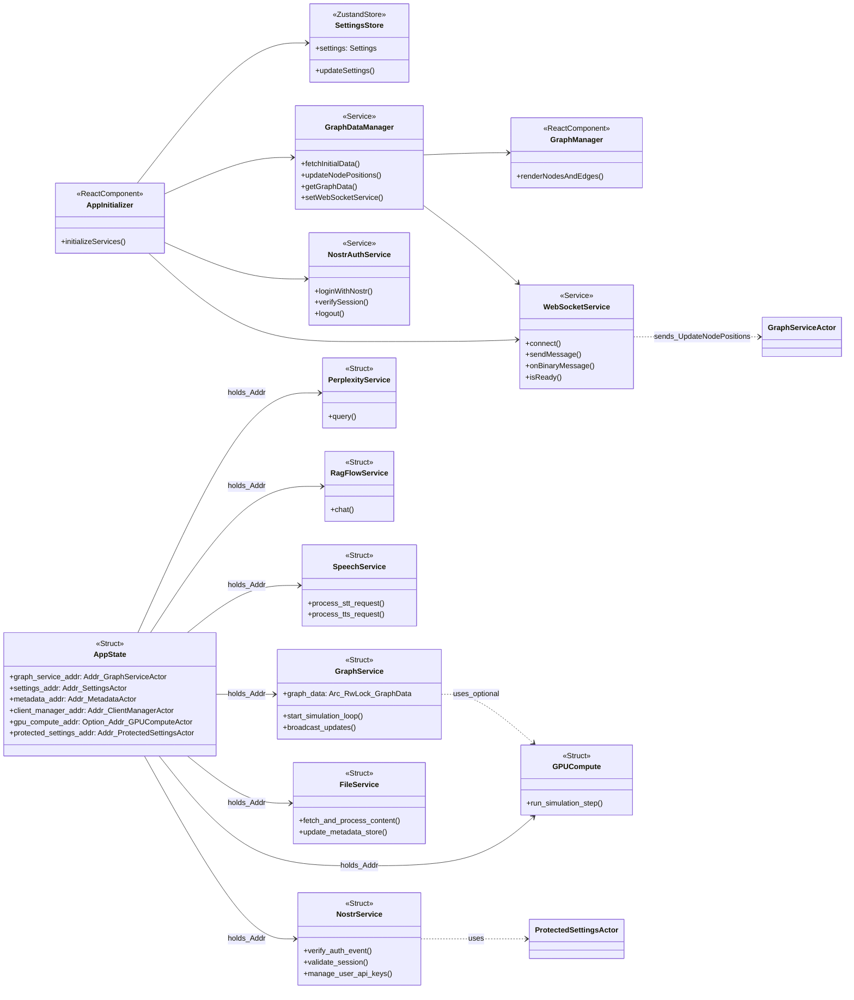

# Repository Map

This document provides a visual map of the repository, generated from the project's structure and README file. The diagrams below illustrate the high-level architecture, component relationships, and data flows within the system.

## System Architecture

This diagram provides a high-level overview of the entire system, including the frontend, backend, and external services.

```mermaid
graph TD
    subgraph ClientApp ["Frontend"]
        direction LR
        AppInit[AppInitializer]
        TwoPane[TwoPaneLayout]
        GraphView[GraphViewport]
        RightCtlPanel[RightPaneControlPanel]
        SettingsUI[SettingsPanelRedesign]
        ConvoPane[ConversationPane]
        NarrativePane[NarrativeGoldminePanel]
        SettingsMgr[settingsStore]
        GraphDataMgr[GraphDataManager]
        RenderEngine[GraphCanvas & GraphManager]
        WebSocketSvc[WebSocketService]
        APISvc[api]
        NostrAuthSvcClient[nostrAuthService]
        XRController[XRController]

        AppInit --> TwoPane
        AppInit --> SettingsMgr
        AppInit --> NostrAuthSvcClient
        AppInit --> WebSocketSvc
        AppInit --> GraphDataMgr

        TwoPane --> GraphView
        TwoPane --> RightCtlPanel
        TwoPane --> ConvoPane
        TwoPane --> NarrativePane
        RightCtlPanel --> SettingsUI

        SettingsUI --> SettingsMgr
        GraphView --> RenderEngine
        RenderEngine <--> GraphDataMgr
        GraphDataMgr <--> WebSocketSvc
        GraphDataMgr <--> APISvc
        NostrAuthSvcClient <--> APISvc
        XRController <--> RenderEngine
        XRController <--> SettingsMgr
    end

    subgraph ServerApp ["Backend"]
        direction LR
        Actix[ActixWebServer]

        subgraph Handlers_Srv ["API_WebSocket_Handlers"]
            direction TB
            SettingsH[SettingsHandler]
            NostrAuthH[NostrAuthHandler]
            GraphAPI_H[GraphAPIHandler]
            FilesAPI_H[FilesAPIHandler]
            RAGFlowH_Srv[RAGFlowHandler]
            SocketFlowH[SocketFlowHandler]
            SpeechSocketH[SpeechSocketHandler]
            HealthH[HealthHandler]
        end

        subgraph Services_Srv ["Core_Services"]
            direction TB
            GraphSvc_Srv[GraphService]
            FileSvc_Srv[FileService]
            NostrSvc_Srv[NostrService]
            SpeechSvc_Srv[SpeechService]
            RAGFlowSvc_Srv[RAGFlowService]
            PerplexitySvc_Srv[PerplexityService]
        end

        subgraph Actors_Srv ["Actor_System"]
            direction TB
            GraphServiceActor[GraphServiceActor]
            SettingsActor[SettingsActor]
            MetadataActor[MetadataActor]
            ClientManagerActor[ClientManagerActor]
            GPUComputeActor[GPUComputeActor]
            ProtectedSettingsActor[ProtectedSettingsActor]
        end
        AppState_Srv[AppState holds Addr<...>]

        Actix --> Handlers_Srv

        Handlers_Srv --> AppState_Srv
        SocketFlowH --> ClientManagerActor
        GraphAPI_H --> GraphServiceActor
        SettingsH --> SettingsActor
        NostrAuthH --> ProtectedSettingsActor

        GraphServiceActor --> ClientManagerActor
        GraphServiceActor --> MetadataActor
        GraphServiceActor --> GPUComputeActor
        GraphServiceActor --> SettingsActor

        FileSvc_Srv --> MetadataActor
        NostrSvc_Srv --> ProtectedSettingsActor
        SpeechSvc_Srv --> SettingsActor
        RAGFlowSvc_Srv --> SettingsActor
        PerplexitySvc_Srv --> SettingsActor
    end

    subgraph External_Srv ["External_Services"]
        direction LR
        GitHub[GitHubAPI]
        NostrRelays_Ext[NostrRelays]
        OpenAI[OpenAIAPI]
        PerplexityAI_Ext[PerplexityAIAPI]
        RAGFlow_Ext[RAGFlowAPI]
        Kokoro_Ext[KokoroAPI]
    end

    WebSocketSvc <--> SocketFlowH
    APISvc <--> Actix

    FileSvc_Srv --> GitHub
    NostrSvc_Srv --> NostrRelays_Ext
    SpeechSvc_Srv --> OpenAI
    SpeechSvc_Srv --> Kokoro_Ext
    PerplexitySvc_Srv --> PerplexityAI_Ext
    RAGFlowSvc_Srv --> RAGFlow_Ext

    style ClientApp fill:#lightgrey,stroke:#333,stroke-width:2px
    style ServerApp fill:#lightblue,stroke:#333,stroke-width:2px
    style External_Srv fill:#lightgreen,stroke:#333,stroke-width:2px
```

## Class Diagram

This diagram shows the key classes and their relationships in the frontend and backend.

