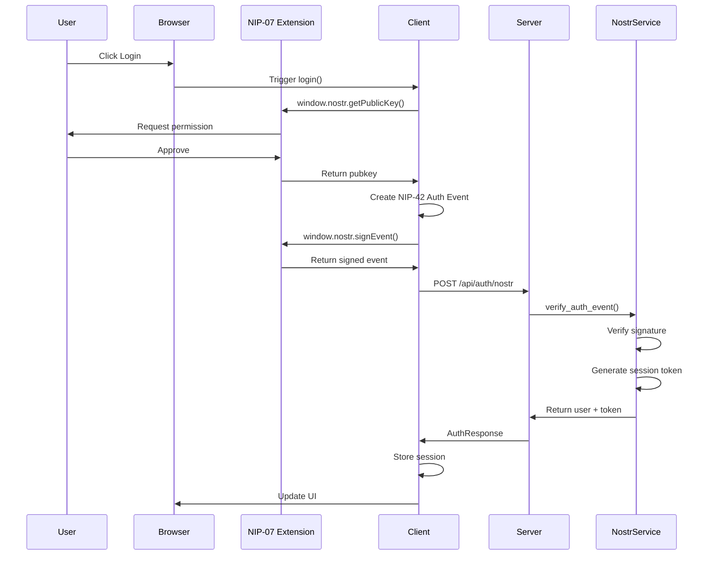
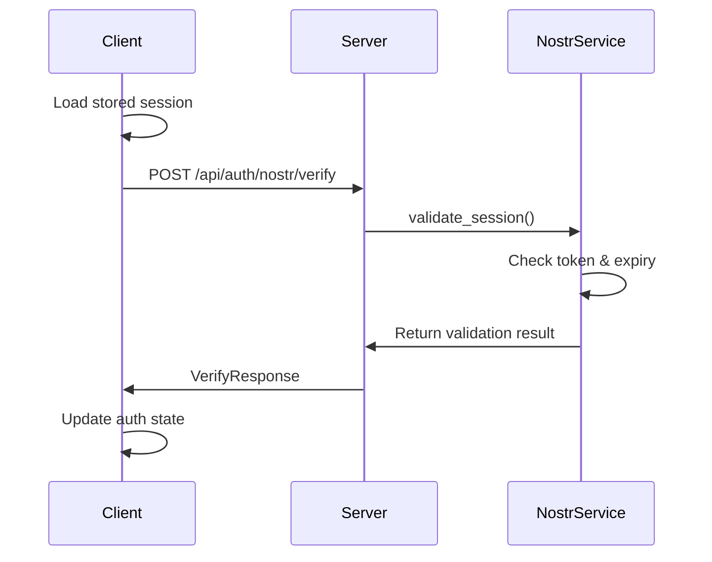
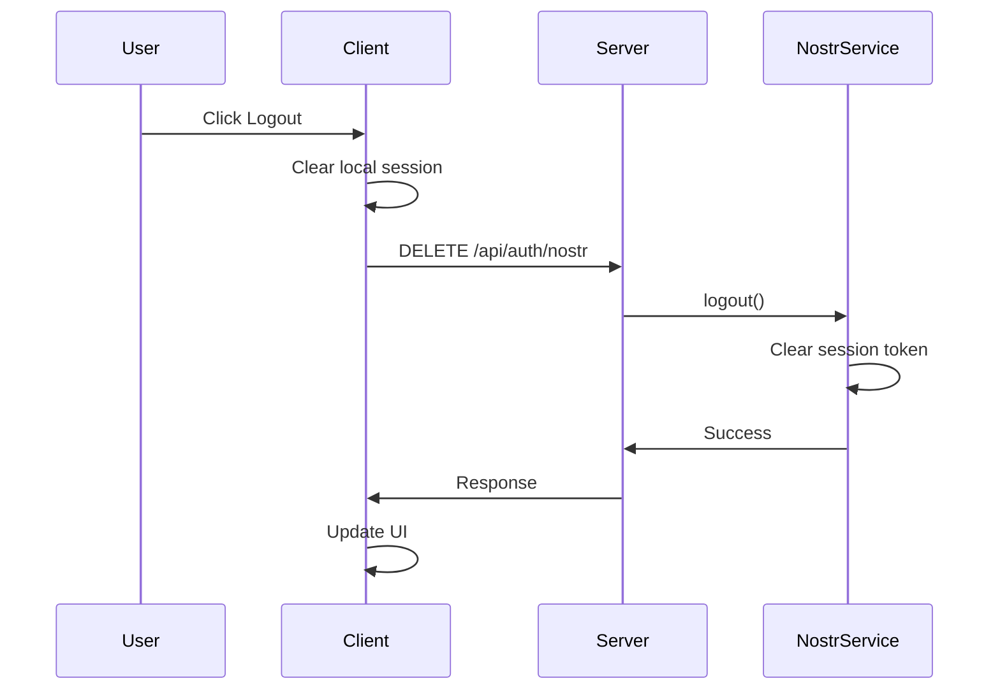

# Authentication & Security

## Overview

LogseqSpringThing implements a comprehensive authentication system using Nostr (Notes and Other Stuff Transmitted by Relays) protocol for decentralized identity verification, combined with session-based authentication and role-based access control.

## Architecture

### Components

1. **Nostr Authentication Service** (`src/services/nostr_service.rs`)
   - Verifies Nostr event signatures
   - Manages user sessions
   - Handles power user identification
   - Session cleanup and expiration

2. **Nostr Handler** (`src/handlers/nostr_handler.rs`)
   - HTTP endpoints for authentication operations, delegating core logic to `NostrService`.
   - Handles session validation and refresh requests.
   - Manages API key updates by interacting with `NostrService`.
   - Controls feature access by querying `FeatureAccess`.

3. **Client Authentication Service** (`client/src/services/nostrAuthService.ts`)
   - NIP-07 browser extension integration
   - Session persistence
   - Authentication state management
   - Automatic session restoration

4. **Protected Settings** (`src/models/protected_settings.rs`)
   - User data storage
   - API key management
   - Session token storage
   - Security configuration

## Authentication Flow

### 1. Login Flow



### 2. Session Verification



### 3. Logout Flow



## Nostr Authentication Details

### NIP-42 Authentication Event

The system uses NIP-42 specification for authentication with Kind 22242 events:

```typescript
interface AuthEvent {
  id: string;           // Event ID
  pubkey: string;       // User's public key
  content: string;      // Authentication message
  sig: string;          // Event signature
  created_at: number;   // Unix timestamp
  kind: 22242;          // NIP-42 auth event kind
  tags: string[][];     // Event tags
}
```

Example authentication event:
```json
{
  "id": "event-id-hash",
  "pubkey": "user-public-key-hex",
  "content": "Authenticate to LogseqSpringThing",
  "sig": "event-signature",
  "created_at": 1234567890,
  "kind": 22242,
  "tags": [
    ["relay", "wss://relay.damus.io"],
    ["challenge", "uuid-v4-challenge"]
  ]
}
```

### Signature Verification

The server verifies the authenticity of authentication events using the Nostr SDK:

```rust
pub async fn verify_auth_event(&self, event: AuthEvent) -> Result<NostrUser, NostrError> {
    // Convert to Nostr Event for verification
    let json_str = serde_json::to_string(&event)?;
    let nostr_event = Event::from_json(&json_str)?;
    
    // Verify signature
    if let Err(e) = nostr_event.verify() {
        return Err(NostrError::InvalidSignature);
    }

    // Register new user if not already registered
    let mut feature_access = self.feature_access.write().await;
    if feature_access.register_new_user(&event.pubkey) {
        info!("Registered new user with basic access: {}", event.pubkey);
    }
    
    // Create/update user session
    let session_token = Uuid::new_v4().to_string();
    let user = NostrUser {
        pubkey: event.pubkey.clone(),
        npub: nostr_event.pubkey.to_bech32()?,
        is_power_user: self.power_user_pubkeys.contains(&event.pubkey),
        session_token: Some(session_token),
        // ... other fields
    };
    
    Ok(user)
}
```

## Session Management

### Session Tokens

- Generated using UUID v4 for uniqueness
- Stored in memory with user data
- Configurable expiration (default: 1 hour)
- Automatically cleaned up after 24 hours of inactivity (via `cleanup_sessions` method, which needs to be explicitly called or scheduled)

### Session Storage

Client-side:
```typescript
localStorage.setItem('nostr_session_token', token);
localStorage.setItem('nostr_user', JSON.stringify(user));
```

Server-side:
```rust
pub struct NostrUser {
    pub pubkey: String,
    pub npub: String,
    pub is_power_user: bool,
    pub session_token: Option<String>,
    pub last_seen: i64,
    // ... other fields
}
```

### Session Validation

Sessions are validated on each authenticated request:

```rust
pub async fn validate_session(&self, pubkey: &str, token: &str) -> bool {
    if let Some(user) = self.get_user(pubkey).await {
        if let Some(session_token) = user.session_token {
            let now = Utc::now().timestamp();
            if now - user.last_seen <= self.token_expiry {
                return session_token == token;
            }
        }
    }
    false
}
```

## Role-Based Access Control

### User Roles

1. **Regular Users**
   - Basic feature access
   - Can store their own API keys
   - Limited to configured features

2. **Power Users**
   - Full feature access
   - Use environment-based API keys
   - Cannot modify API keys via API
   - Identified by pubkey in `POWER_USER_PUBKEYS` env var

### Feature Access Control

Features are controlled through the `FeatureAccess` configuration:

```rust
pub struct FeatureAccess {
    basic_features: Vec<String>,
    power_user_features: Vec<String>,
    user_features: HashMap<String, Vec<String>>,
}
```

Example feature check:
```rust
async fn check_feature_access(
    req: HttpRequest,
    feature_access: web::Data<FeatureAccess>,
    feature: web::Path<String>,
) -> Result<HttpResponse, Error> {
    let pubkey = req.headers()
        .get("X-Nostr-Pubkey")
        .and_then(|h| h.to_str().ok())
        .unwrap_or("");
    
    Ok(HttpResponse::Ok().json(json!({
        "has_access": feature_access.has_feature_access(pubkey, &feature)
    })))
}
```

## API Key Management

### Storage and Retrieval

API keys are stored differently based on user type:

```rust
pub async fn get_api_keys(protected_settings_addr: Addr<ProtectedSettingsActor>, pubkey: &str) -> ApiKeys {
    match protected_settings_addr.send(GetApiKeys { pubkey: pubkey.to_string() }).await {
        Ok(api_keys) => api_keys,
        Err(e) => {
            error!("Failed to get API keys from ProtectedSettingsActor: {}", e);
            ApiKeys::default() // Return default if actor call fails
        }
    }
}
```

### API Key Update

Only non-power users can update their API keys:

```rust
async fn update_api_keys(
    req: web::Json<ApiKeysRequest>,
    app_state: web::Data<AppState>,
    pubkey: web::Path<String>,
) -> Result<HttpResponse, Error> {
    let api_keys = ApiKeys {
        perplexity: req.perplexity.clone(),
        openai: req.openai.clone(),
        ragflow: req.ragflow.clone(),
    };
    
    match app_state.update_nostr_user_api_keys(&pubkey, api_keys).await {
        Ok(user) => Ok(HttpResponse::Ok().json(user)),
        Err(e) => {
            // Handle specific errors from update_nostr_user_api_keys
            let error_response = match e.as_str() {
                "Power user operation" => HttpResponse::Forbidden().json(json!({ "error": "Cannot update API keys for power users" })),
                "User not found" => HttpResponse::NotFound().json(json!({ "error": "User not found" })),
                _ => HttpResponse::InternalServerError().json(json!({ "error": format!("Failed to update API keys: {}", e) })),
            };
            Ok(error_response)
        }
    }
}
```

## Security Best Practices

### 1. Environment Variables

Required environment variables for security:
```bash
# Authentication
AUTH_TOKEN_EXPIRY=3600  # Session expiry in seconds
POWER_USER_PUBKEYS=pubkey1,pubkey2,pubkey3  # Comma-separated list

# API Keys (for power users)
PERPLEXITY_API_KEY=your-key
OPENAI_API_KEY=your-key
RAGFLOW_API_KEY=your-key
```

### 2. Request Headers

Authenticated requests must include:
```
X-Nostr-Pubkey: user-public-key
Authorization: Bearer session-token
```

### 3. CORS Configuration

Configure allowed origins in protected settings:
```json
{
  "security": {
    "allowed_origins": [
      "http://localhost:3000",
      "https://your-domain.com"
    ]
  }
}
```

### 4. Session Security

- Use HTTPS in production to protect session tokens
- Implement rate limiting on authentication endpoints
- Regular session cleanup to prevent memory bloat
- Short session expiry times (default: 1 hour)

### 5. Client Security

- Store sessions in localStorage (not accessible to other domains)
- Clear sessions on logout
- Validate sessions on app initialization
- Handle session expiry gracefully

## API Endpoints

### Authentication Endpoints

| Endpoint | Method | Description | Auth Required |
|----------|--------|-------------|---------------|
| `/api/auth/nostr` | POST | Login with Nostr event | No |
| `/api/auth/nostr` | DELETE | Logout | Yes |
| `/api/auth/nostr/verify` | POST | Verify session | No |
| `/api/auth/nostr/refresh` | POST | Refresh session | Yes |
| `/api/auth/nostr/api-keys` | GET | Get user's API keys | Yes |
| `/api/auth/nostr/api-keys` | POST | Update API keys | Yes |
| `/api/auth/nostr/power-user-status` | GET | Check power user status | Yes |
| `/api/auth/nostr/features` | GET | Get available features | Yes |
| `/api/auth/nostr/features/{feature}` | GET | Check specific feature access | Yes |

### Request/Response Examples

#### Login Request
```http
POST /api/auth/nostr
Content-Type: application/json

{
  "id": "event-id",
  "pubkey": "user-pubkey",
  "content": "Authenticate to LogseqSpringThing",
  "sig": "signature",
  "created_at": 1234567890,
  "kind": 22242,
  "tags": [["relay", "wss://relay.damus.io"], ["challenge", "uuid"]]
}
```

#### Login Response
```json
{
  "user": {
    "pubkey": "user-pubkey",
    "npub": "npub1...",
    "isPowerUser": false
  },
  "token": "session-token-uuid",
  "expiresAt": 1234567890,
  "features": ["feature1", "feature2"]
}
```

#### Verify Session Request
```http
POST /api/auth/nostr/verify
Content-Type: application/json

{
  "pubkey": "user-pubkey",
  "token": "session-token"
}
```

#### Verify Session Response
```json
{
  "valid": true,
  "user": {
    "pubkey": "user-pubkey",
    "npub": "npub1...",
    "isPowerUser": false
  },
  "features": ["feature1", "feature2"]
}
```

## Error Handling

### Common Error Responses

```json
// Invalid signature
{
  "error": "Invalid signature"
}

// Session expired
{
  "error": "Session expired"
}

// User not found
{
  "error": "User not found"
}

// Power user operation
{
  "error": "Cannot update API keys for power users"
}
```

### Client Error Handling

```typescript
try {
  await nostrAuth.login();
} catch (error) {
  if (error.message.includes('User rejected')) {
    // User cancelled in extension
  } else if (error.message.includes('Invalid signature')) {
    // Authentication failed
  } else if (error.message.includes('extension')) {
    // No NIP-07 extension found
  }
}
```

## Testing Authentication

### Manual Testing

1. Install a NIP-07 compatible browser extension (e.g., Alby, nos2x)
2. Generate or import a Nostr keypair
3. Navigate to the application
4. Click login and approve the authentication request
5. Verify session persistence across page refreshes
6. Test logout functionality

### Automated Testing

Example test for session validation:
```rust
#[tokio::test]
async fn test_session_validation() {
    let service = NostrService::new();
    
    // Create test user
    let event = create_test_auth_event();
    let user = service.verify_auth_event(event).await.unwrap();
    let token = user.session_token.unwrap();
    
    // Test valid session
    assert!(service.validate_session(&user.pubkey, &token).await);
    
    // Test invalid token
    assert!(!service.validate_session(&user.pubkey, "invalid").await);
}
```

## Troubleshooting

### Common Issues

1. **"Nostr NIP-07 provider not found"**
   - Install a NIP-07 compatible browser extension
   - Ensure the extension is enabled for the site

2. **"Invalid signature"**
   - Check system time synchronization
   - Verify the extension is signing with the correct key

3. **"Session expired"**
   - Sessions expire after configured time (default: 1 hour)
   - Implement automatic refresh or re-authentication

4. **"Cannot update API keys for power users"**
   - Power users must use environment variables for API keys
   - Remove pubkey from `POWER_USER_PUBKEYS` to allow API key updates

### Debug Logging

Enable debug logging for authentication:
```rust
RUST_LOG=logseq_spring_thing::services::nostr_service=debug,logseq_spring_thing::handlers::nostr_handler=debug
```

Client-side debug logging:
```typescript
const logger = createLogger('NostrAuthService');
logger.setLevel('debug');
```