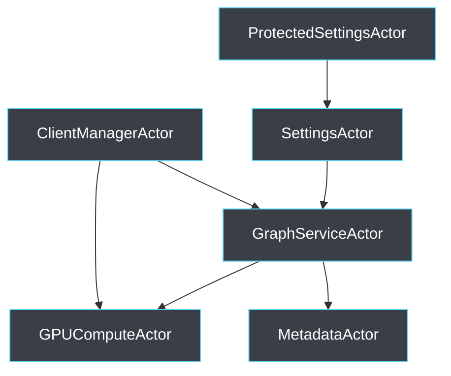
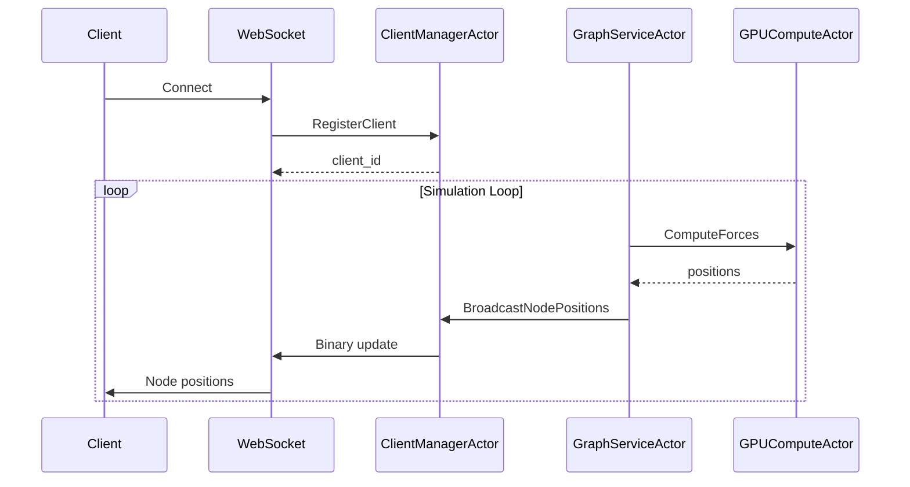
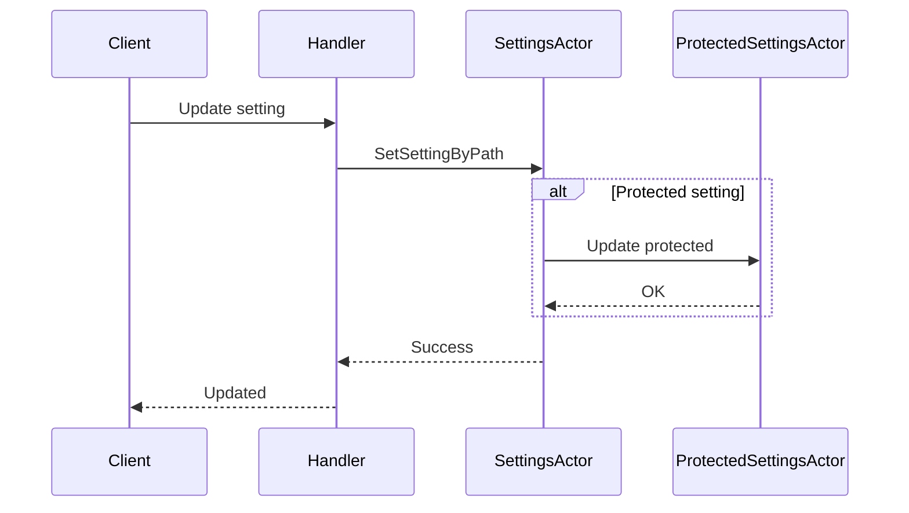

# Actor System Architecture

## Overview

LogseqSpringThing uses the Actix actor system to manage concurrent state and provide a message-passing architecture. This replaces traditional `Arc<RwLock<T>>` patterns with actors that encapsulate state and handle messages asynchronously.

## Architecture

The actor system consists of six primary actors that work together to manage the application state:



## Actor Descriptions

### GraphServiceActor

**Location**: `src/actors/graph_actor.rs`

The central actor managing the graph data structure, including nodes and edges.

**Responsibilities**:
- Maintains the graph data structure with nodes and edges
- Manages node positions and velocities
- Coordinates with GPU compute for physics simulation
- Handles graph modifications (add/remove nodes and edges)
- Broadcasts updates to connected clients

**Key Messages**:
- `GetGraphData` - Retrieve the complete graph
- `UpdateGraphData` - Update the entire graph structure
- `UpdateNodePosition` - Update a single node's position
- `SimulationStep` - Trigger a single physics simulation step
- `AddNode`/`RemoveNode` - Modify nodes
- `AddEdge`/`RemoveEdge` - Modify edges
- `BuildGraphFromMetadata` - Initialize graph from metadata

### ClientManagerActor

**Location**: `src/actors/client_manager_actor.rs`

Manages WebSocket client connections and broadcasts.

**Responsibilities**:
- Tracks connected WebSocket clients
- Broadcasts graph updates to all clients
- Manages client registration/unregistration
- Handles binary protocol encoding for efficient updates

**Key Messages**:
- `RegisterClient` - Register a new WebSocket client
- `UnregisterClient` - Remove a disconnected client
- `BroadcastNodePositions` - Send binary node updates to all clients
- `BroadcastMessage` - Send text messages to all clients
- `GetClientCount` - Get number of connected clients

### GPUComputeActor

**Location**: `src/actors/gpu_compute_actor.rs`

Manages GPU-accelerated physics computations with CPU fallback.

**Responsibilities**:
- Initializes CUDA context for GPU computation
- Computes force-directed graph layout physics
- Falls back to CPU computation if GPU unavailable
- Manages node position updates from physics simulation

**Key Messages**:
- `InitializeGPU` - Initialize with graph data
- `UpdateGPUGraphData` - Update graph structure
- `UpdateSimulationParams` - Modify physics parameters
- `ComputeForces` - Run one physics iteration
- `GetNodeData` - Retrieve computed positions
- `GetGPUStatus` - Check GPU/CPU status

### SettingsActor

**Location**: `src/actors/settings_actor.rs`

Manages application settings and configuration.

**Responsibilities**:
- Stores and retrieves application settings
- Handles settings updates from clients
- Provides path-based setting access
- Integrates with file-based settings persistence

**Key Messages**:
- `GetSettings` - Retrieve all settings
- `UpdateSettings` - Update complete settings
- `GetSettingByPath` - Get specific setting by path
- `SetSettingByPath` - Update specific setting by path

### MetadataActor

**Location**: `src/actors/metadata_actor.rs`

Manages graph metadata and layout information.

**Responsibilities**:
- Loads metadata from JSON files
- Provides metadata for graph construction
- Handles metadata refresh operations
- Stores and manages node and edge metadata (via `MetadataStore` which is a `HashMap`)

**Key Messages**:
- `GetMetadata` - Retrieve complete metadata
- `UpdateMetadata` - Update metadata store
- `RefreshMetadata` - Reload metadata from disk

### ProtectedSettingsActor

**Location**: `src/actors/protected_settings_actor.rs`

Manages protected settings like API keys.

**Responsibilities**:
- Stores sensitive configuration separately
- Provides controlled access to API keys
- Handles user-specific protected settings
- Integrates with authentication system

**Key Messages**:
- `GetApiKeys` - Retrieve API keys for a specific user
- `ValidateClientToken` - Validate a client's session token
- `StoreClientToken` - Store a new client session token
- `UpdateUserApiKeys` - Update a user's API keys
- `CleanupExpiredTokens` - Trigger cleanup of expired session tokens
- `MergeSettings` - Merge new settings into protected settings
- `SaveSettings` - Persist protected settings to file
- `GetUser` - Retrieve a specific user's protected data

## Message Flow Examples

### Client Connection and Graph Update



### Settings Update Flow



## Implementation Patterns

### Actor Initialization

Actors are typically initialized in the application state setup:

```rust
// In app_state.rs
let client_manager = ClientManagerActor::new().start();
let gpu_compute = GPUComputeActor::new(/* params */).start();
let graph_service = GraphServiceActor::new(
    client_manager.clone(),
    Some(gpu_compute.clone())
).start();
```

### Message Handling

Each actor implements handlers for its messages:

```rust
impl Handler<GetGraphData> for GraphServiceActor {
    type Result = Result<GraphData, String>;

    fn handle(&mut self, _: GetGraphData, _: &mut Self::Context) -> Self::Result {
        Ok(self.get_graph_data().clone())
    }
}
```

### Async Communication

Actors communicate asynchronously using addresses:

```rust
// Send message and await response
let graph_data = graph_actor.send(GetGraphData).await??;

// Send without waiting
graph_actor.do_send(StartSimulation);
```

## Best Practices

1. **Message Design**: Keep messages small and focused on single operations
2. **Error Handling**: All actor messages return `Result<T, String>` for consistent error handling
3. **State Encapsulation**: Actors own their state; no shared mutable state
4. **Async Operations**: Use `AsyncContext` for long-running operations
5. **Supervision**: Actors automatically restart on failure

## Performance Considerations

- The actor system eliminates lock contention from `Arc<RwLock<T>>`
- Messages are processed sequentially within each actor
- Use `do_send` for fire-and-forget operations
- Binary protocol reduces serialization overhead
- GPU computation offloads expensive physics calculations

## Testing

Actors can be tested in isolation:

```rust
#[actix_rt::test]
async fn test_graph_actor() {
    let client_manager = ClientManagerActor::new().start();
    let actor = GraphServiceActor::new(client_manager, None).start();
    
    let result = actor.send(GetGraphData).await.unwrap();
    assert!(result.is_ok());
}
```

## Related Documentation

- [WebSocket Binary Protocol](../api/binary-protocol.md)
- [GPU Compute](./gpu-compute.md)
- [Services Architecture](./services.md)