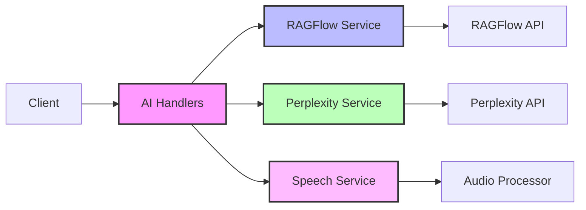
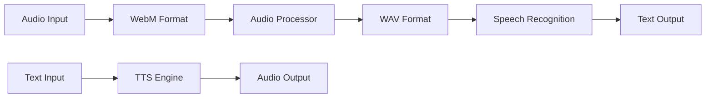

# AI Services Documentation

## Overview

LogseqSpringThing integrates multiple AI services to provide intelligent features including chat, content generation, and speech processing. The system supports RAGFlow for chat interactions, Perplexity for content queries, and speech-to-text/text-to-speech capabilities.

## Architecture



## RAGFlow Service

**Location**: `src/services/ragflow_service.rs`  
**Handler**: `src/handlers/ragflow_handler.rs`

RAGFlow provides chat capabilities with support for streaming responses and text-to-speech.

### Configuration

```yaml
ragflow:
  api_key: "your-api-key"
  base_url: "https://api.ragflow.com"
  timeout: 30
```

### Features

- **Chat Sessions**: Create and manage conversation sessions
- **Streaming Responses**: Real-time streaming of AI responses
- **Text-to-Speech**: Convert responses to audio
- **Rate Limiting**: Built-in rate limiting and retry logic

### API Endpoints

#### Create Chat Session
```http
POST /api/ragflow/sessions
Content-Type: application/json

{
  "name": "Session Name"
}
```

#### Send Message
```http
POST /api/ragflow/completion
Content-Type: application/json

{
  "conversation_id": "session-id",
  "message": "User message"
}
```

#### Stream Response
```http
POST /api/ragflow/stream_answer
Content-Type: application/json

{
  "question": "User question",
  "session_id": "session-id"
}
```

Returns: Server-Sent Events stream

### Error Handling

```rust
pub enum RAGFlowError {
    ReqwestError(reqwest::Error),
    StatusError(StatusCode, String),
    ParseError(String),
    IoError(std::io::Error),
}
```

## Perplexity Service

**Location**: `src/services/perplexity_service.rs`  
**Handler**: `src/handlers/perplexity_handler.rs`

Perplexity service handles intelligent content queries and generates markdown files.

### Configuration

```yaml
perplexity:
  api_key: "your-api-key"
  base_url: "https://api.perplexity.ai"
  timeout: 30
  model: "mixtral-8x7b-instruct"
  max_tokens: 2048
  temperature: 0.7
```

### Features

- **Content Generation**: Generate markdown content based on queries
- **Metadata Integration**: Automatically creates metadata for generated content
- **File Management**: Saves responses as markdown files with proper structure
- **Context-Aware**: Uses conversation history for context

### API Endpoints

#### Query and Save
```http
POST /api/perplexity/query_and_save
Content-Type: application/json

{
  "query": "Explain quantum computing",
  "filename": "quantum-computing",
  "metadata": {
    "tags": ["physics", "computing"],
    "category": "technology"
  }
}
```

#### Process Files
```http
POST /api/perplexity/process
Content-Type: application/json

{
  "files": ["file1.md", "file2.md"],
  "action": "summarize"
}
```

### Generated File Structure

```markdown
# [Title from Query]

[Generated content]

---
Metadata:
- Generated: [timestamp]
- Model: [model-name]
- Query: [original-query]
```

## Speech Service

**Location**: `src/services/speech_service.rs`  
**Handler**: `src/handlers/speech_socket_handler.rs`  
**Audio Processor**: `src/utils/audio_processor.rs`

Provides speech-to-text and text-to-speech capabilities via WebSocket.

### Features

- **Real-time STT**: WebSocket-based speech recognition
- **TTS Integration**: Convert text responses to speech
- **Audio Processing**: 
  - Sample rate conversion
  - Format conversion (WebM to WAV)
  - Chunked processing for streaming

### WebSocket Protocol

#### Connection
```javascript
const ws = new WebSocket('ws://localhost:8080/ws/speech');
```

#### Speech-to-Text
```javascript
// Send audio chunks
ws.send(audioBlob);

// Receive transcription
ws.onmessage = (event) => {
  const result = JSON.parse(event.data);
  if (result.type === 'transcription') {
    console.log(result.text);
  }
};
```

### Audio Processing Pipeline



### Configuration

```yaml
speech:
  sample_rate: 16000
  channels: 1
  chunk_size: 4096
  vad_enabled: true
  vad_threshold: 0.5
```

## Integration Patterns

### Service Initialization

```rust
// In app_state.rs
let ragflow_service = RAGFlowService::new(settings.clone()).await?;
let perplexity_service = PerplexityService::new(settings.clone()).await?;
let speech_service = SpeechService::new(settings.clone()).await?;
```

### Error Handling

All services follow a consistent error pattern:

```rust
match service.process(request).await {
    Ok(response) => Ok(HttpResponse::Ok().json(response)),
    Err(e) => {
        error!("Service error: {}", e);
        Ok(HttpResponse::InternalServerError().json(json!({
            "error": e.to_string()
        })))
    }
}
```

### Rate Limiting

Services implement exponential backoff for rate limiting:

```rust
let mut retry_count = 0;
loop {
    match client.send().await {
        Ok(resp) => return Ok(resp),
        Err(e) if retry_count < MAX_RETRIES => {
            let delay = Duration::from_millis(100 * 2_u64.pow(retry_count));
            tokio::time::sleep(delay).await;
            retry_count += 1;
        }
        Err(e) => return Err(e.into()),
    }
}
```

## Performance Considerations

1. **Connection Pooling**: All services use connection pooling via `reqwest::Client`
2. **Streaming**: Large responses use streaming to reduce memory usage
3. **Caching**: Consider implementing response caching for repeated queries
4. **Timeouts**: Configurable timeouts prevent hanging requests

## Security

1. **API Keys**: Stored in environment variables, never in code
2. **Input Validation**: All user input is validated before processing
3. **Rate Limiting**: Prevent abuse through request throttling
4. **CORS**: Properly configured for cross-origin requests

## Testing

### Unit Tests
```rust
#[cfg(test)]
mod tests {
    use super::*;

    #[tokio::test]
    async fn test_ragflow_session() {
        let settings = create_test_settings();
        let service = RAGFlowService::new(settings).await.unwrap();
        // Test implementation
    }
}
```

### Integration Tests
- Mock external API responses
- Test error scenarios
- Verify timeout behavior
- Test streaming responses

## Monitoring

### Logging
```rust
info!("RAGFlow request: session={}, message_length={}", session_id, message.len());
error!("Perplexity error: {}", e);
```

### Metrics to Track
- Response times
- Error rates
- Token usage
- Active sessions

## Related Documentation

- [Handlers](./handlers.md) - HTTP request handling
- [WebSocket](../api/websocket.md) - WebSocket protocol
- [Configuration](./config.md) - Service configuration