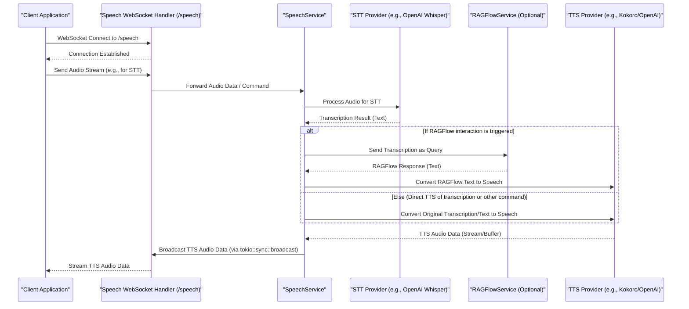

# App State Architecture

## Overview
The app state module manages the application's shared state and provides thread-safe access to core services. It acts as the central repository for all application-wide data and service instances, ensuring consistent access across different request handlers and background tasks.

## Core Structure

### AppState
The `AppState` struct now holds actor addresses (`Addr<...Actor>`) for managing shared state. Communication happens via asynchronous message passing instead of `Arc<RwLock<T>>`.

```rust
// In src/app_state.rs
pub struct AppState {
    pub graph_service_addr: Addr<GraphServiceActor>,
    pub gpu_compute_addr: Option<Addr<GPUComputeActor>>,
    pub settings_addr: Addr<SettingsActor>,
    pub protected_settings_addr: Addr<ProtectedSettingsActor>,
    pub metadata_addr: Addr<MetadataActor>,
    pub client_manager_addr: Addr<ClientManagerActor>,
    // ... other non-actor state like clients and services
}
```

### ClientManager
The `ClientManager` is now implemented as an **actor** (`ClientManagerActor`). Its address (`Addr<ClientManagerActor>`) is held in `AppState` and shared with other services that need to broadcast messages to clients, such as `GraphServiceActor`.

## Initialization

### Constructor
The `AppState::new` constructor is responsible for setting up all services and loading initial data.

```rust
impl AppState {
    pub async fn new(
        settings: Arc<RwLock<AppFullSettings>>,
        github_client: Arc<GitHubClient>,
        content_api: Arc<ContentAPI>,
        perplexity_service: Option<Arc<PerplexityService>>,
        ragflow_service: Option<Arc<RAGFlowService>>,
        speech_service: Option<Arc<SpeechService>>,
        gpu_compute: Option<Arc<RwLock<GPUCompute>>>,
        ragflow_session_id: String,
    ) -> Result<Self, Box<dyn std::error::Error + Send + Sync>>
}
```

### Service Setup
-   **Settings Loading**: `AppFullSettings` are loaded from `settings.yaml` and environment variables.
-   **GitHub Client**: Initialized for repository content access.
-   **Content API**: Initialized for local file system operations and content fetching.
-   **Metadata Store**: Loaded or created, responsible for managing file metadata and relationships.
-   **Graph Service**: Built from initial metadata, responsible for graph data and physics simulation. It uses the shared `APP_CLIENT_MANAGER`.
-   **GPU Compute**: Optional, initialized if CUDA is available for accelerated physics calculations.
-   **AI Services**: Perplexity, RAGFlow, and Speech services are optionally initialized based on configuration.
-   **Nostr Service**: Initialized for authentication and user management (can be set later).
-   **Feature Access**: Configured to manage user permissions and feature flags.

## State Management

### Thread Safety
`AppState` and its contained mutable data are wrapped in `Arc<RwLock<T>>` to ensure safe concurrent access across multiple threads and asynchronous tasks.

```rust
pub type SafeAppState = Arc<AppState>; // This type alias might not be explicitly defined but represents Arc<AppState>
pub type SafeSettings = Arc<RwLock<AppFullSettings>>;
pub type SafeProtectedSettings = Arc<RwLock<ProtectedSettings>>;
pub type SafeMetadataStore = Arc<RwLock<MetadataStore>>;
```

### Access Patterns
Services and handlers access state by sending messages to the actors via their addresses in `AppState`.

```rust
// Example access pattern using actor messages
// async fn example_get_settings(app_state: &AppState) -> AppFullSettings {
//     app_state.settings_addr.send(GetSettings).await.unwrap().unwrap()
// }
// async fn example_update_metadata(app_state: &AppState, new_metadata: MetadataStore) {
//     app_state.metadata_addr.do_send(UpdateMetadata { metadata: new_metadata });
// }
```

## Service Integration

### Graph Service ([`src/services/graph_service.rs`](../../src/services/graph_service.rs))
Manages the in-memory graph data (`GraphData`), runs the physics simulation (CPU or GPU via `GPUCompute`), calculates layout, and broadcasts updates to connected clients via the static `APP_CLIENT_MANAGER`. It's typically started as a long-running task.

### File Service ([`src/services/file_service.rs`](../../src/services/file_service.rs))
This service, often referred to as `FileService` in the codebase, handles reading/writing local files, fetching content (e.g., from GitHub via `GitHubService` or a direct `GitHubClient`), and managing the `MetadataStore`. It effectively *is* the `ContentAPI` for local data.

### AI Services
Provides interfaces for interacting with various AI models (Perplexity, RAGFlow, OpenAI TTS via `SpeechService`).

## Error Handling

### State Errors
Custom error types are defined for various initialization and runtime issues.
```rust
// Example (actual error types might be in specific service modules)
// pub enum AppStateError {
//     Initialization(String),
//     ServiceUnavailable(String),
// }
```

### Recovery
Mechanisms for graceful degradation or recovery from non-fatal errors are typically handled within individual services.

## Implementation Details

### Cleanup
The `Drop` trait is not explicitly implemented for `AppState` in the provided code, but `Arc` handles reference counting for automatic cleanup of shared resources when they are no longer in use. Individual services might implement `Drop` if they manage unmanaged resources.

### State Validation
Settings and other critical state components are validated during loading (e.g., `AppFullSettings::load`) or on modification to ensure data integrity.

## Graph System

The graph system manages the core data structures and algorithms for the knowledge graph, including parsing, building, and layout.

### Data Flow

```mermaid
flowchart TB
    subgraph Input
        MarkdownFiles[Markdown Files via Content API]
        UserUpdates[User Updates via API/WebSocket]
        GitHubContent[GitHub Content via GitHubClient & ContentAPI]
    end

    subgraph Processing
        ContentAPI[Content API (File Service)]
        MetadataStore[Metadata Store]
        GraphService[Graph Service]
        GPUCompute[GPU Compute]
    end

    subgraph Output
        GraphData[Graph Data (In-Memory in GraphService)]
        ClientUpdates[Client Updates (via ClientManager & WebSocket)]
        PersistedMetadata[Persisted Metadata (via MetadataStore)]
    end

    MarkdownFiles --> ContentAPI
    GitHubContent --> ContentAPI
    ContentAPI --> MetadataStore
    UserUpdates --> MetadataStore
    MetadataStore --> GraphService
    GraphService --> GPUCompute
    GPUCompute --> GraphService
    GraphService --> ClientUpdates
    MetadataStore --> PersistedMetadata
```

### Optimization Strategies

1.  **Caching**: In-memory caching of graph structure, computed layout positions, and frequently accessed metadata within `GraphService` and `MetadataStore`.
2.  **Batch Processing**: Grouped node updates and batched layout calculations for efficiency in `GraphService`.
3.  **Incremental Updates**: Partial graph updates and delta-based synchronization to minimize data transfer via WebSockets.
4.  **GPU Acceleration**: Offloading computationally intensive physics simulations to the GPU using CUDA, managed by `GPUCompute`.

## Service Layer

The service layer provides high-level operations and business logic, abstracting away lower-level details and external integrations.

### Core Services

1.  **Graph Service**: Manages graph construction, layout calculations, data validation, and broadcasting updates via `ClientManager`.
2.  **Content API (File Service)**: Handles content management, file system operations, and integration with external sources like GitHub.
3.  **Nostr Service**: Manages Nostr authentication, user sessions, and API key storage.
4.  **AI Services (Perplexity, RAGFlow, Speech)**: Provide interfaces for various AI capabilities. `SpeechService` handles TTS and STT, potentially interacting with other AI services.
5.  **GPU Compute**: Manages GPU resources and executes CUDA kernels for physics simulation.

### Service Communication Sequence Diagram - Speech Service

The client connects to the `/speech` WebSocket endpoint, handled by [`speech_socket_handler.rs`](../../src/handlers/speech_socket_handler.rs). The `SpeechService` processes audio, interacts with STT (e.g., OpenAI Whisper via an internal module or direct API call if not a separate "WhisperSttService" struct) and TTS providers (e.g., Kokoro, OpenAI), and can optionally query `RAGFlowService`. Audio responses are broadcast back to the client via the `speech_socket_handler` using a Tokio broadcast channel managed by `SpeechService`.



## Next Steps

For detailed information about specific components, refer to:
- [Configuration](config.md)
- [Request Handlers](handlers.md)
- [Data Models](models.md)
- [Services](services.md)
- [Type Definitions](types.md)
- [Utilities](utils.md)