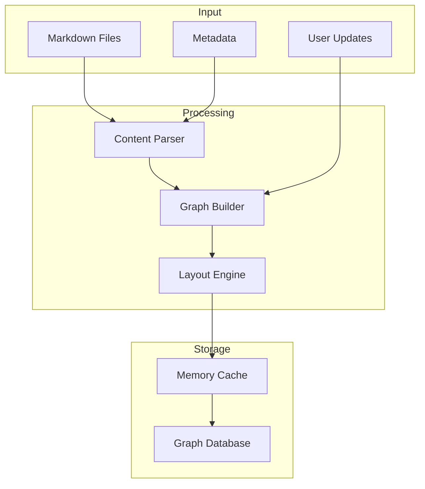
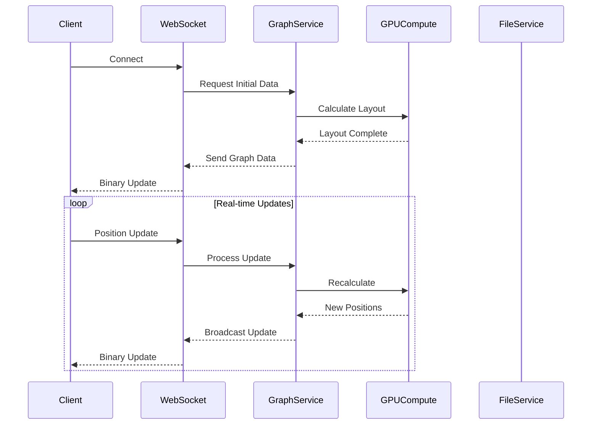

# App State Architecture

## Overview
The app state module manages the application's shared state and provides thread-safe access to core services.

## Core Structure

### AppState
```rust
pub struct AppState {
    pub settings: Arc<RwLock<Settings>>,
    pub metadata: Arc<RwLock<MetadataStore>>,
    pub graph_service: GraphService,
    pub github_client: Arc<GitHubClient>,
    pub content_api: Arc<ContentAPI>,
    pub gpu_compute: Option<Arc<RwLock<GPUCompute>>>,
}
```

## Initialization

### Constructor
```rust
impl AppState {
    pub async fn new(
        settings: Arc<RwLock<Settings>>,
        github_client: Arc<GitHubClient>,
        content_api: Arc<ContentAPI>,
        gpu_compute: Option<Arc<RwLock<GPUCompute>>>,
        metadata: Option<MetadataStore>,
        graph_data: Option<GraphData>,
        conversation_id: String,
    ) -> Result<Self, Error>
}
```

### Service Setup
- GitHub client initialization
- Graph service setup
- GPU compute configuration

## State Management

### Thread Safety
```rust
pub type SafeState = Arc<AppState>;
pub type SafeMetadata = Arc<RwLock<MetadataStore>>;
```

### Access Patterns
```rust
impl AppState {
    pub async fn get_metadata(&self) -> RwLockReadGuard<MetadataStore>
    pub async fn update_metadata(&self, updates: MetadataUpdates)
}
```

## Service Integration

### Graph Service
```rust
impl AppState {
    pub async fn update_graph(&self, data: GraphData)
    pub async fn get_graph_data(&self) -> GraphData
}
```

### GitHub Integration
```rust
impl AppState {
    pub async fn fetch_content(&self, path: &str) -> Result<String>
    pub async fn update_content(&self, path: &str, content: &str)
}
```

## Error Handling

### State Errors
```rust
pub enum StateError {
    Initialization(String),
    ServiceUnavailable(String),
    InvalidState(String),
}
```

### Recovery
```rust
impl AppState {
    pub async fn recover_from_error(&self, error: StateError)
    pub async fn validate_state(&self) -> Result<(), StateError>
}
```

## Implementation Details

### Cleanup
```rust
impl Drop for AppState {
    fn drop(&mut self) {
        // Cleanup resources
    }
}
```

### State Validation
```rust
impl AppState {
    pub fn validate(&self) -> Result<(), ValidationError>
}
   - Zero-copy when possible

## Graph System

The graph system manages the core data structures and algorithms for the knowledge graph.

### Data Flow



### Optimization Strategies

1. Caching
   - In-memory graph structure
   - Computed layout positions
   - Frequently accessed metadata

2. Batch Processing
   - Grouped node updates
   - Batched layout calculations
   - Bulk metadata updates

3. Incremental Updates
   - Partial graph updates
   - Delta-based synchronization
   - Progressive loading

## Service Layer

The service layer provides high-level operations and business logic.

### Core Services

1. Graph Service
   - Graph construction
   - Layout calculations
   - Data validation

2. File Service
   - Content management
   - File system operations
   - Version control integration

3. WebSocket Service
   - Real-time updates
   - Binary protocol handling
   - Connection management

### Service Communication



## Next Steps

For detailed information about specific components, refer to:
- [Configuration](config.md)
- [Request Handlers](handlers.md)
- [Data Models](models.md)
- [Services](services.md)
- [Type Definitions](types.md)
- [Utilities](utils.md)