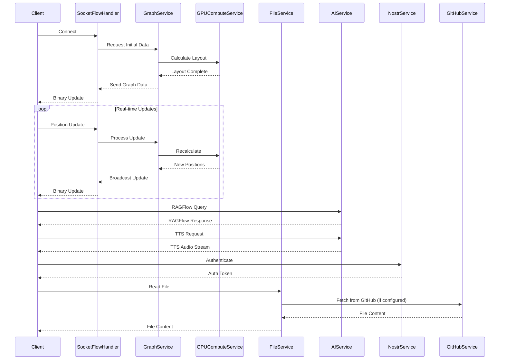

# App State Architecture

## Overview
The app state module manages the application's shared state and provides thread-safe access to core services. It acts as the central repository for all application-wide data and service instances, ensuring consistent access across different request handlers and background tasks.

## Core Structure

### AppState
The `AppState` struct holds references to all major services and shared data. It is designed for thread-safe access using `Arc<RwLock<T>>` for mutable shared state.

```rust
pub struct AppState {
    pub settings: Arc<RwLock<AppFullSettings>>,
    pub protected_settings: Arc<RwLock<ProtectedSettings>>,
    pub metadata_manager: Arc<RwLock<MetadataStore>>, // Renamed from metadata
    pub graph_service: GraphService,
    pub github_service: Arc<GitHubClient>, // Renamed from github_client
    pub file_service: Arc<ContentAPI>, // Renamed from content_api, now handles file content
    pub gpu_compute_service: Option<Arc<RwLock<GPUCompute>>>, // Renamed from gpu_compute
    pub perplexity_service: Option<Arc<PerplexityService>>,
    pub ragflow_service: Option<Arc<RAGFlowService>>,
    pub speech_service: Option<Arc<SpeechService>>,
    pub nostr_service: Option<web::Data<NostrService>>,
    pub feature_access: web::Data<FeatureAccess>,
    pub ragflow_session_id: String,
    pub active_connections: Arc<AtomicUsize>,
}
```

## Initialization

### Constructor
The `AppState::new` constructor is responsible for setting up all services and loading initial data.

```rust
impl AppState {
    pub async fn new(
        settings: Arc<RwLock<AppFullSettings>>,
        github_service: Arc<GitHubClient>,
        file_service: Arc<ContentAPI>,
        perplexity_service: Option<Arc<PerplexityService>>,
        ragflow_service: Option<Arc<RAGFlowService>>,
        speech_service: Option<Arc<SpeechService>>,
        gpu_compute_service: Option<Arc<RwLock<GPUCompute>>>,
        ragflow_session_id: String,
    ) -> Result<Self, Box<dyn std::error::Error + Send + Sync>>
}
```

### Service Setup
-   **Settings Loading**: `AppFullSettings` are loaded from `settings.yaml` and environment variables.
-   **GitHub Service**: Initialized for repository content access.
-   **File Service**: Initialized for local file system operations.
-   **Metadata Manager**: Loaded or created, responsible for managing file metadata and relationships.
-   **Graph Service**: Built from initial metadata, responsible for graph data and physics simulation.
-   **GPU Compute Service**: Optional, initialized if CUDA is available for accelerated physics calculations.
-   **AI Services**: Perplexity, RAGFlow, and Speech services are optionally initialized based on configuration.
-   **Nostr Service**: Initialized for authentication and user management.
-   **Feature Access**: Configured to manage user permissions and feature flags.

## State Management

### Thread Safety
`AppState` and its contained mutable data are wrapped in `Arc<RwLock<T>>` to ensure safe concurrent access across multiple threads and asynchronous tasks.

```rust
pub type SafeAppState = Arc<AppState>;
pub type SafeSettings = Arc<RwLock<AppFullSettings>>;
pub type SafeProtectedSettings = Arc<RwLock<ProtectedSettings>>;
pub type SafeMetadataStore = Arc<RwLock<MetadataStore>>;
```

### Access Patterns
Services and handlers access `AppState` fields using `read().await` for shared access and `write().await` for exclusive mutable access.

```rust
impl AppState {
    pub async fn get_metadata_store(&self) -> RwLockReadGuard<MetadataStore>
    pub async fn update_metadata_store(&self, updates: MetadataUpdates)
    pub async fn get_settings(&self) -> RwLockReadGuard<AppFullSettings>
    pub async fn update_settings(&self, updates: AppFullSettings)
}
```

## Service Integration

### Graph Service
Manages the in-memory graph data, physics simulation, and layout calculations.
```rust
impl AppState {
    pub async fn update_graph_data(&self, data: GraphData)
    pub async fn get_graph_data(&self) -> GraphData
    pub async fn calculate_graph_layout(&self, params: &SimulationParams)
}
```

### File Service
Handles reading and writing of files, primarily for markdown content and user settings.
```rust
impl AppState {
    pub async fn read_file(&self, path: &str) -> Result<String>
    pub async fn write_file(&self, path: &str, content: &str)
}
```

### AI Services
Provides interfaces for interacting with various AI models (Perplexity, RAGFlow, OpenAI TTS).
```rust
impl AppState {
    pub async fn chat_with_perplexity(&self, query: &str) -> Result<String>
    pub async fn chat_with_ragflow(&self, query: &str) -> Result<String>
    pub async fn text_to_speech(&self, text: &str) -> Result<Vec<u8>>
}
```

## Error Handling

### State Errors
Custom error types are defined for various initialization and runtime issues.
```rust
pub enum StateError {
    Initialization(String),
    ServiceUnavailable(String),
    InvalidState(String),
    // ... other specific errors
}
```

### Recovery
Mechanisms for graceful degradation or recovery from non-fatal errors.
```rust
impl AppState {
    pub async fn recover_from_error(&self, error: StateError)
    pub async fn validate_state(&self) -> Result<(), StateError>
}
```

## Implementation Details

### Cleanup
The `Drop` trait is implemented for `AppState` to ensure proper resource cleanup upon application shutdown.
```rust
impl Drop for AppState {
    fn drop(&mut self) {
        // Cleanup resources like GPU memory, file handles, etc.
    }
}
```

### State Validation
Settings and other critical state components are validated against predefined schemas or rules to ensure data integrity.
```rust
impl AppState {
    pub fn validate(&self) -> Result<(), ValidationError>
}
```

## Graph System

The graph system manages the core data structures and algorithms for the knowledge graph, including parsing, building, and layout.

### Data Flow

```mermaid
flowchart TB
    subgraph Input
        MarkdownFiles[Markdown Files]
        UserUpdates[User Updates]
        GitHubContent[GitHub Content]
    end

    subgraph Processing
        FileService[File Service]
        MetadataManager[Metadata Manager]
        GraphService[Graph Service]
        GPUComputeService[GPU Compute Service]
    end

    subgraph Output
        GraphData[Graph Data (In-Memory)]
        ClientUpdates[Client Updates (WebSocket)]
        PersistedMetadata[Persisted Metadata]
    end

    MarkdownFiles --> FileService
    GitHubContent --> FileService
    FileService --> MetadataManager
    UserUpdates --> MetadataManager
    MetadataManager --> GraphService
    GraphService --> GPUComputeService
    GPUComputeService --> GraphService
    GraphService --> GraphData
    GraphData --> ClientUpdates
    MetadataManager --> PersistedMetadata
```

### Optimization Strategies

1.  **Caching**: In-memory caching of graph structure, computed layout positions, and frequently accessed metadata.
2.  **Batch Processing**: Grouped node updates and batched layout calculations for efficiency.
3.  **Incremental Updates**: Partial graph updates and delta-based synchronization to minimize data transfer.
4.  **GPU Acceleration**: Offloading computationally intensive physics simulations to the GPU using CUDA.

## Service Layer

The service layer provides high-level operations and business logic, abstracting away lower-level details and external integrations.

### Core Services

1.  **Graph Service**: Manages graph construction, layout calculations, and data validation.
2.  **File Service**: Handles content management, file system operations, and integration with external sources like GitHub.
3.  **Nostr Service**: Manages Nostr authentication, user sessions, and API key storage.
4.  **AI Service**: Provides a unified interface for various AI capabilities (chat, TTS, RAG).
5.  **GPU Compute Service**: Manages GPU resources and executes CUDA kernels for physics simulation.

### Service Communication



## Next Steps

For detailed information about specific components, refer to:
- [Configuration](config.md)
- [Request Handlers](handlers.md)
- [Data Models](models.md)
- [Services](services.md)
- [Type Definitions](types.md)
- [Utilities](utils.md)