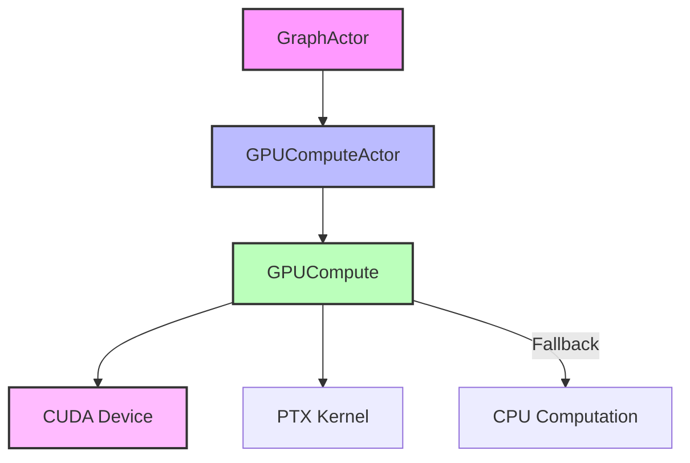

# GPU Compute Documentation

## Overview

LogseqSpringThing leverages GPU acceleration for force-directed graph layout computations using CUDA. This provides significant performance improvements for large graphs by parallelizing physics calculations across GPU cores.

## Architecture



## Components

### GPUCompute Structure

**Location**: `src/utils/gpu_compute.rs`

Core GPU computation handler with CUDA integration.

```rust
pub struct GPUCompute {
    pub device: Arc<CudaDevice>,
    pub force_kernel: CudaFunction,
    pub node_data: CudaSlice<BinaryNodeData>,
    pub num_nodes: u32,
    pub node_indices: HashMap<u32, usize>,
    pub simulation_params: SimulationParams,
    pub iteration_count: u32,
}
```

### GPUComputeActor

**Location**: `src/actors/gpu_compute_actor.rs`

Actor wrapper that manages GPU compute lifecycle and handles failures gracefully.

## CUDA Kernel

**Location**: `src/utils/compute_forces.cu`

The CUDA kernel implements a force-directed graph layout algorithm:

```cuda
__global__ void compute_forces(
    NodeData* nodes,
    const SimulationParams params,
    const int num_nodes
) {
    // Parallel force computation
    // Each thread handles one node
    // Uses shared memory for efficiency
}
```

### Physics Algorithm

1. **Repulsive Forces**: All nodes repel each other (Coulomb's law)
2. **Attractive Forces**: Connected nodes attract (Hooke's law)
3. **Centering Force**: Gentle force toward origin
4. **Damping**: Velocity damping for stability

## Configuration

### Environment Variables

```bash
# Enable/disable GPU compute
CUDA_ENABLED=true

# GPU device selection
CUDA_DEVICE_ID=0

# Performance tuning
GPU_BLOCK_SIZE=256
GPU_MAX_NODES=1000000
```

### Simulation Parameters

```rust
pub struct SimulationParams {
    pub repulsion_strength: f32,      // Default: 100.0
    pub attraction_strength: f32,     // Default: 0.01
    pub centering_strength: f32,      // Default: 0.01
    pub damping: f32,                 // Default: 0.9
    pub time_step: f32,               // Default: 0.016
    pub min_distance: f32,            // Default: 0.01
    pub max_distance: f32,            // Default: 1000.0
}
```

## Initialization Process

```mermaid
sequenceDiagram
    participant Actor
    participant GPU
    participant CUDA
    participant PTX
    
    Actor->>GPU: InitializeGPU
    GPU->>CUDA: Create device
    
    alt CUDA available
        CUDA-->>GPU: Device created
        GPU->>PTX: Load kernel
        PTX-->>GPU: Kernel loaded
        GPU-->>Actor: Success
    else CUDA unavailable
        CUDA-->>GPU: Error
        GPU->>GPU: Enable CPU fallback
        GPU-->>Actor: Fallback enabled
    end
```

### Retry Mechanism

The system implements automatic retry for GPU initialization:

```rust
const MAX_GPU_INIT_RETRIES: u32 = 3;
const RETRY_DELAY_MS: u64 = 500;

// Retry loop with exponential backoff
for attempt in 0..MAX_GPU_INIT_RETRIES {
    match CudaDevice::new(0) {
        Ok(device) => return Ok(device),
        Err(e) if attempt < MAX_GPU_INIT_RETRIES - 1 => {
            sleep(Duration::from_millis(RETRY_DELAY_MS * (attempt + 1))).await;
        }
        Err(e) => return Err(e),
    }
}
```

## Memory Management

### GPU Memory Layout

```
┌─────────────────────────────┐
│      Node Data Array        │
├─────────────────────────────┤
│ Node 0: pos, vel, metadata  │
├─────────────────────────────┤
│ Node 1: pos, vel, metadata  │
├─────────────────────────────┤
│            ...              │
└─────────────────────────────┘
```

### Memory Constraints

- **Maximum Nodes**: 1,000,000 (configurable)
- **Node Size**: 32 bytes (position + velocity + metadata)
- **Shared Memory**: 256 nodes per block
- **Global Memory**: Scales with node count

## Performance Optimization

### Block Configuration

```rust
const BLOCK_SIZE: u32 = 256;  // Threads per block
const SHARED_MEM_SIZE: u32 = BLOCK_SIZE * NODE_SIZE;

let blocks = (num_nodes + BLOCK_SIZE - 1) / BLOCK_SIZE;
let launch_config = LaunchConfig {
    blocks,
    threads_per_block: BLOCK_SIZE,
    shared_mem_bytes: SHARED_MEM_SIZE,
};
```

### Optimization Strategies

1. **Coalesced Memory Access**: Nodes stored contiguously
2. **Shared Memory**: Cache frequently accessed data
3. **Warp Efficiency**: Block size multiple of 32
4. **Minimal Transfers**: Only position updates sent to CPU

## CPU Fallback

When GPU is unavailable, the system falls back to CPU computation:

```rust
pub fn compute_forces_cpu(&mut self) {
    // Simplified O(n²) force calculation
    for i in 0..self.num_nodes {
        for j in 0..self.num_nodes {
            if i != j {
                // Calculate forces between nodes
            }
        }
    }
}
```

### Fallback Triggers

- CUDA device initialization failure
- Insufficient GPU memory
- Kernel compilation errors
- Runtime GPU errors

## Error Handling

### GPU Status Tracking

```rust
pub struct GPUStatus {
    pub is_initialized: bool,
    pub cpu_fallback_active: bool,
    pub failure_count: u32,
    pub iteration_count: u32,
    pub num_nodes: u32,
}
```

### Common Errors

1. **CUDA Not Available**
   ```
   Error: CUDA device not found
   Action: Automatic CPU fallback
   ```

2. **Out of Memory**
   ```
   Error: CUDA out of memory
   Action: Reduce node count or use CPU
   ```

3. **Kernel Compilation**
   ```
   Error: PTX compilation failed
   Action: Check CUDA toolkit version
   ```

## Diagnostics

### GPU Diagnostics Utility

**Location**: `src/utils/gpu_diagnostics.rs`

```rust
pub async fn run_diagnostics() -> DiagnosticReport {
    // Check CUDA availability
    // Query device properties
    // Test kernel compilation
    // Benchmark performance
}
```

### Monitoring

```rust
// Log every 60 iterations
if self.iteration_count % DEBUG_THROTTLE == 0 {
    info!("GPU iteration {}: {} nodes", 
          self.iteration_count, self.num_nodes);
}
```

## Performance Benchmarks

| Node Count | GPU Time | CPU Time | Speedup |
|------------|----------|----------|---------|
| 1,000      | 0.5ms    | 15ms     | 30x     |
| 10,000     | 2ms      | 1,500ms  | 750x    |
| 100,000    | 20ms     | 150,000ms| 7,500x  |

## Development and Testing

### Prerequisites

1. NVIDIA GPU with CUDA support
2. CUDA Toolkit 11.0+
3. Rust CUDA dependencies

### Building PTX Kernel

```bash
# Compile CUDA kernel to PTX
./scripts/compile_ptx.sh
```

### Testing GPU Functionality

```rust
#[tokio::test]
async fn test_gpu_compute() {
    let result = GPUCompute::test_gpu().await;
    assert!(result.is_ok() || result.is_err()); // Graceful handling
}
```

## Troubleshooting

### Common Issues

1. **"CUDA device not found"**
   - Verify NVIDIA drivers installed
   - Check `nvidia-smi` output
   - Ensure CUDA toolkit installed

2. **"PTX file not found"**
   - Run `./scripts/compile_ptx.sh`
   - Check `src/utils/compute_forces.ptx` exists

3. **Performance degradation**
   - Monitor GPU temperature
   - Check for memory fragmentation
   - Verify simulation parameters

### Debug Environment Variables

```bash
# Enable detailed GPU logging
RUST_LOG=logseq_spring_thing::utils::gpu_compute=trace

# Force CPU fallback for testing
CUDA_ENABLED=false

# GPU memory debugging
CUDA_LAUNCH_BLOCKING=1
```

## Best Practices

1. **Graph Size**: Keep under 100k nodes for real-time performance
2. **Parameter Tuning**: Adjust physics parameters based on graph structure
3. **Memory Management**: Monitor GPU memory usage
4. **Error Recovery**: Implement graceful degradation to CPU
5. **Profiling**: Use NVIDIA Nsight for optimization

## Related Documentation

- [Actor System](./actors.md) - GPUComputeActor integration
- [Graph Service](./services.md#graph-service) - Graph data management
- [Binary Protocol](../api/binary-protocol.md) - Efficient data transfer