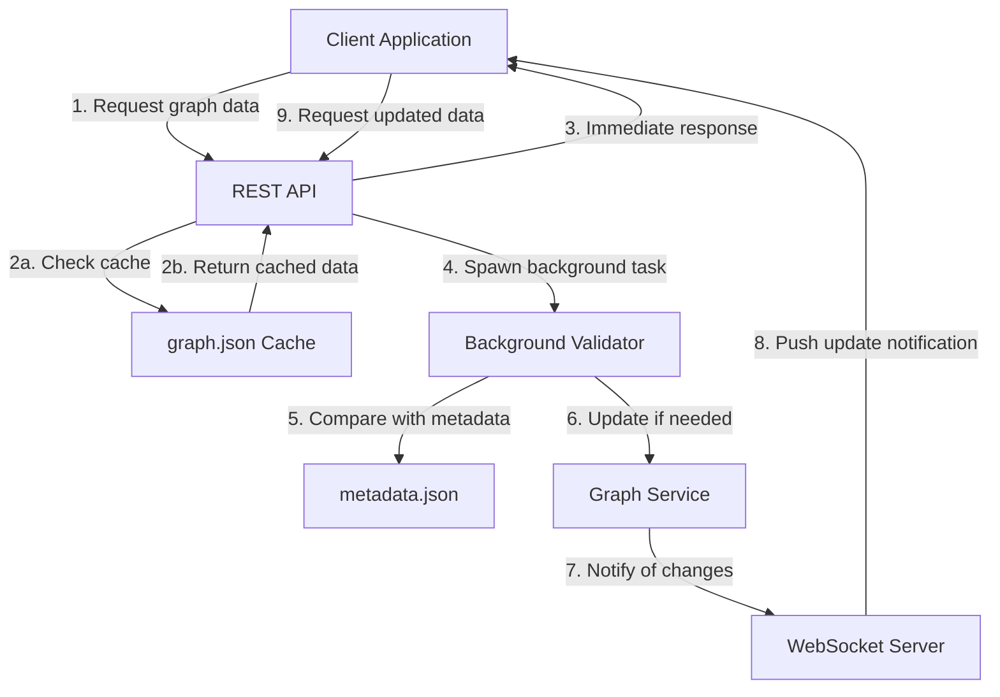

# Graph Data Flow and Caching

## Overview

This document describes the data flow architecture of the graph system, focusing on performance optimizations through caching, background validation, and real-time updates.

## Graph Data Loading Process

The graph data flow follows an optimized pattern that prioritizes user experience through fast initial loading:



## Caching Strategy

### Cache Files
- **graph.json**: The complete graph structure with nodes, edges, and metadata
- **metadata.json**: The source of truth for node and graph metadata
- **layout.json**: Cache for graph layout positions

### Cache Validation
Every graph cache validation compares SHA1 hashes between the cached graph and current metadata:
1. When matching: Use cache as-is
2. When mismatching: Only rebuild affected nodes/edges

## Background Validation Process

The background validation runs asynchronously after the initial response:

1. The server sends cached graph data immediately to the client
2. A background task validates the cache against current metadata:
   - Checks SHA1 hashes of node content
   - Verifies metadata timestamps
   - Ensures appropriate node connections
3. When validation detects needed changes:
   - Updates the in-memory graph structure 
   - Updates the cache file
   - Sets a flag for connected clients
4. WebSocket clients periodically check for updates
5. When updates are available, clients receive a notification via WebSocket
6. Clients request the updated graph data via REST API

## WebSocket Update Notifications

When the background validation detects changes, WebSocket clients are notified:

```json
{
  "type": "graphUpdateAvailable",
  "timestamp": 1647359761234,
  "nodesChanged": 12
}
```

The client can then fetch the updated graph data through the REST API endpoint.

## Performance Benefits

This architecture provides several important benefits:

1. **Perceived Performance**: Users see content immediately from cache
2. **Resource Efficiency**: Background validation doesn't block the UI thread
3. **Network Optimization**: 
   - Initial payload is from cache (fast)
   - Only changed data transmitted after validation
4. **Real-time Updates**: Changes detected during background validation are pushed to clients
5. **Resilience**: System continues functioning with cache data even if validation fails

## Implementation Details

### Graph Service
```rust
// GraphService::build_graph_from_metadata
// Validates cached graph against metadata
if cached_graph.metadata.len() == metadata.len() {
    // Check SHA1 hashes for changes
    let mut needs_rebuild = false;
    for (file_path, hash) in &metadata {
        if !cached_graph.metadata.contains_key(file_path) || 
           cached_graph.metadata.get(file_path) != Some(hash) {
            needs_rebuild = true;
            break;
        }
    }
    
    if !needs_rebuild {
        return Ok(cached_graph);
    }
}
```

### Graph Handler
```rust
// Handle cached graph with background validation
if graph_size > 0 {
    info!("Graph already contains {} nodes, using existing data for hot start", graph_size);
    
    // Spawn background validation task
    tokio::spawn(async move {
        info!("Starting background validation of cached graph");
        match GraphService::build_graph_from_metadata(&metadata_clone).await {
            Ok(validated_graph) => {
                // Update graph data if validation found changes...
            },
            Err(e) => error!("Background validation failed: {}", e)
        }
    });
}
```

### Socket Flow Handler
```rust
// Check for graph updates and notify clients
async fn check_for_graph_updates(&mut self, ctx: &mut ws::WebsocketContext<Self>) {
    let update_status = app_state.graph_update_status.read().await;
    
    if update_status.update_available {
        // Send update notification to client
        let message = serde_json::json!({
            "type": "graphUpdateAvailable",
            "timestamp": chrono::Utc::now().timestamp_millis(),
            "nodesChanged": update_status.nodes_changed 
        });
        
        ctx.text(serde_json::to_string(&message).unwrap_or_default());
    }
}
```

## Edge Cases and Error Handling

- If validation fails, the system continues with cache data
- If cache file is corrupted, system falls back to full rebuilding
- Cache staleness is detected through SHA1 hash comparisons
- Clients can manually request a full refresh if needed