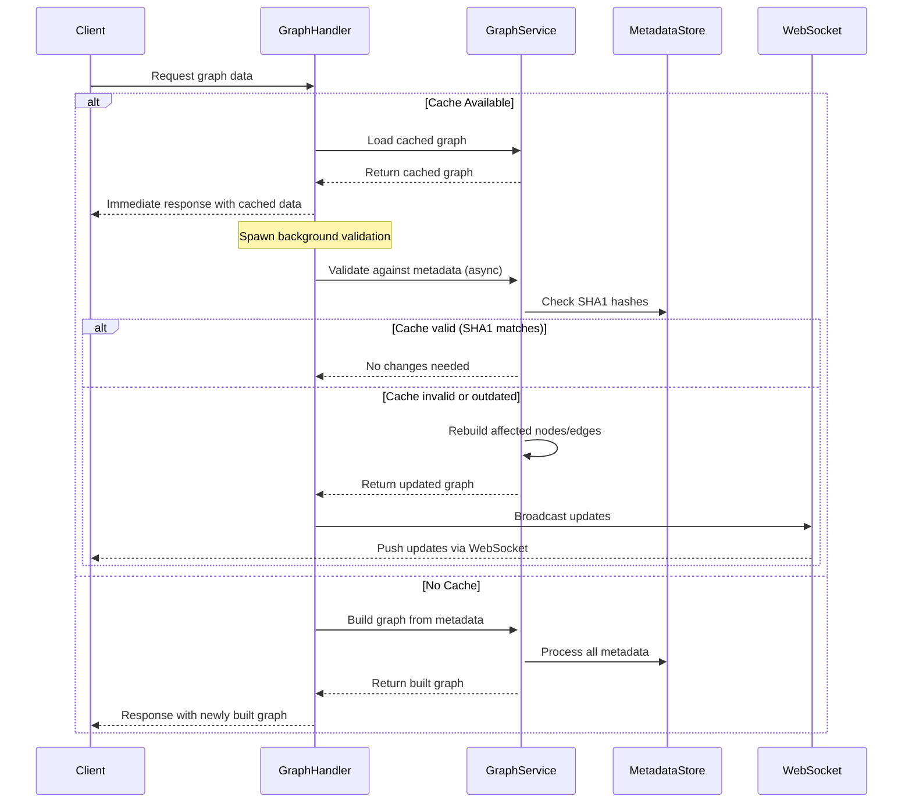

# Graph System Optimizations

## Overview
This document describes optimization strategies for the graph system, focusing on reducing load times and improving the user experience.

## Hot Start from Cache

### Problem
Initially, the application would load graph data synchronously, causing delays in the user interface. The client would have to wait for the entire graph to be built from metadata before rendering anything.

### Solution
The graph system now implements a "hot start" pattern that:

1. Loads the cached graph data (`graph.json`) immediately for fast initial rendering
2. Validates the cache against metadata in the background
3. Updates the graph if needed and notifies connected clients

### Implementation Flow



## Background Validation Process

The background validation process:

1. Compares the SHA1 hashes in the cached graph with those in the current metadata
2. Only rebuilds nodes and edges that have changed, preserving positions for unchanged nodes
3. Sends updates to connected clients via WebSocket when changes are detected

## Performance Benefits

This approach provides several benefits:

- **Perceived Performance**: The UI becomes responsive much faster as it starts with cached data
- **Progressive Updates**: Changes are streamed to the client as they're detected
- **Efficient Resource Use**: Validation runs in the background without blocking the main thread
- **Bandwidth Optimization**: Only changed nodes are transmitted after the initial load

## Implementation Details

The implementation uses Tokio's asynchronous tasks to perform the validation without blocking the HTTP response:

```rust
// Load cached graph for immediate response
let graph = state.graph_service.get_graph_data_mut().await;

// Return quickly for hot start
let response = GraphResponse { ... };
ctx.text(serde_json::to_string(&response).unwrap());

// Then validate in background
tokio::spawn(async move {
    if let Ok(validated_graph) = GraphService::build_graph_from_metadata(&metadata).await {
        // Check for differences and broadcast updates if needed
        // ...
    }
});
```

## WebSocket Notification

When the background validation process detects changes, it broadcasts those changes to all connected WebSocket clients:

```rust
// In socket_flow_handler.rs
ctx.text(serde_json::to_string(&serde_json::json!({
    "type": "graph_update",
    "timestamp": chrono::Utc::now().timestamp_millis(),
    "changes": changes_count
})).unwrap());
```

The client WebSocket handler listens for these updates and refreshes the data as needed:

```typescript
// In websocketService.ts
socket.addEventListener('message', (event) => {
    const data = JSON.parse(event.data);
    if (data.type === 'graph_update') {
        // Fetch updated graph data
        fetchGraphData();
    }
});
```

## Edge Cases and Error Handling

- If the validation process fails, the system continues with the cached data
- If the cache file is corrupted, the system falls back to full rebuilding
- Cache staleness is detected through SHA1 hash comparisons
- The client is able to request a full refresh if needed